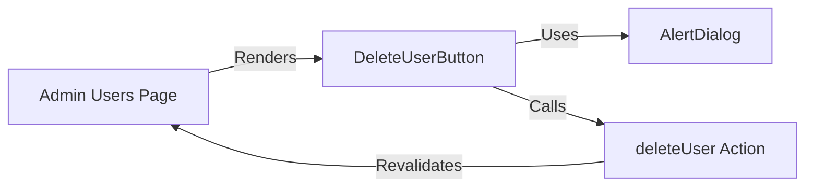

# Requirements

### Overview & Goals
The goal is to prevent accidental user deletions in the admin panel by introducing a confirmation modal. This will provide a safety net for admins when rejecting new registrations or removing existing users.

### Scope
- **In Scope**:
  - Addition of a reusable `AlertDialog` UI component based on `@base-ui/react`.
  - Creation of a `DeleteUserButton` client component for the admin panel.
  - Refactoring the Admin Users page to use the new confirmation flow.
- **Out of Scope**:
  - Changes to other admin actions (e.g., approval).
  - Changes to the underlying deletion logic in the database.

### User Stories
- **As an Admin**, I want to be prompted for confirmation before a user is deleted, so that I don't accidentally remove someone.
- **As an Admin**, I want the confirmation modal to be easy to use on my mobile device.

# Technical Design

### Current Implementation
The current implementation in `app/admin/users/page.tsx` uses standard HTML forms with server actions. When a button is clicked, the `deleteUser` action is immediately executed without any confirmation.

### Proposed Changes
1. **`components/ui/alert-dialog.tsx`**: A new UI component leveraging `@base-ui/react/alert-dialog` to provide an accessible and styled confirmation dialog.
2. **`app/admin/users/DeleteUserButton.tsx`**: A client-side component that:
   - Manages the dialog state.
   - Invokes the `deleteUser` server action within a `useTransition` hook to provide feedback during the deletion process.
3. **`app/admin/users/page.tsx`**: Replace the current forms:
   ```tsx
   {/* Old implementation */}
   <form action={deleteUser.bind(null, user.id)}>
     <Button type="submit" variant="destructive">Zamietnuť</Button>
   </form>

   {/* New implementation */}
   <DeleteUserButton
     userId={user.id}
     label="Zamietnuť"
     variant="destructive"
     title="Zamietnuť registráciu?"
     description="Tento používateľ bude odstránený zo systému."
   />
   ```

### Architecture Diagram


### File Structure
- `components/ui/alert-dialog.tsx` (New)
- `app/admin/users/DeleteUserButton.tsx` (New)
- `app/admin/users/page.tsx` (Modified)

# Delivery Steps

### ✓ Step 1: Implement AlertDialog UI component
Create `components/ui/alert-dialog.tsx` using `@base-ui/react/alert-dialog`.
The component will provide a styled modal for critical confirmations.
- Implement `AlertDialog`, `AlertDialogTrigger`, `AlertDialogContent`, `AlertDialogTitle`, `AlertDialogDescription`, `AlertDialogAction`, and `AlertDialogCancel`.
- Use Tailwind CSS v4 for styling, ensuring consistency with the project's theme and mobile-first design.
- Include transitions for opening and closing the modal.

### ✓ Step 2: Create DeleteUserButton client component
Create a new client component `app/admin/users/DeleteUserButton.tsx` to handle user deletion with confirmation.
- Define props for `userId`, `label`, `variant`, `title`, and `description`.
- Use `useTransition` to handle the server action state and show a loading indicator on the confirm button.
- Integrate the `AlertDialog` component to prompt the user before calling the `deleteUser` server action.

### ✓ Step 3: Integrate confirmation button into Admin Users page
Refactor the admin users page to use the new confirmation button.
- Replace the existing deletion forms in `app/admin/users/page.tsx` with the `DeleteUserButton` component.
- Configure appropriate labels and confirmation messages for both pending and approved user lists.
- Verify the layout remains consistent and mobile-friendly.