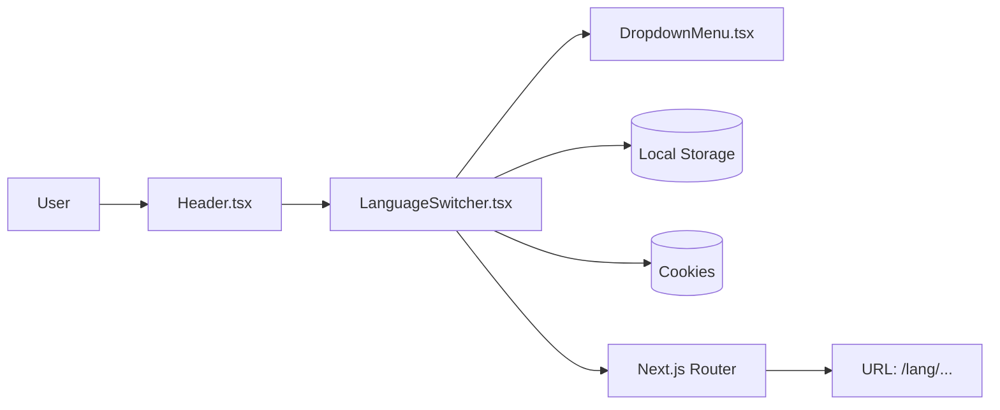

# Requirements

### Overview & Goals
The goal is to add a language switcher to the application header. This will allow users to easily switch between the four supported languages (Slovak, Czech, Hungarian, and Serbian). The selection will be persisted across sessions using both `localStorage` and cookies, ensuring that returning users see the site in their preferred language.

### Scope
- **In Scope**:
    - Adding a new `LanguageSwitcher` component to the header.
    - Implementing a reusable `DropdownMenu` component based on `Base UI`.
    - Integrating flag icons using the `country-flag-icons` package.
    - Persisting language selection in the browser.
    - Mobile-first responsive design for the header additions.
- **Out of Scope**:
    - Translating the language names themselves (they will be hardcoded in their respective languages).
    - Changing the existing i18n routing logic in `proxy.ts`.

### Functional Requirements
- **Language Icon**: A button with the `Languages` icon (A with a Chinese symbol) from Lucide.
- **Language Options**:
    - **Slovenčina** (SK)
    - **Čeština** (CZ)
    - **Magyar** (HU)
    - **Srpski** (SR)
- **Flags**: Each option should display the corresponding national flag.
- **Persistence**: 
    - Save the choice to `localStorage` key `next-locale`.
    - Save the choice to a cookie named `next-locale` so the server-side `proxy.ts` can detect it on the next visit to the root URL.
- **Navigation**: When a language is selected, the user is redirected to the same page but with the new locale prefix in the URL.

# Technical Design

### Current Implementation
The project uses a custom i18n implementation:
- **Routing**: Locales are handled via a dynamic segment `[lang]` in the `app` directory.
- **Middleware/Proxy**: `proxy.ts` handles redirection to the default or detected locale. It already supports reading the `next-locale` cookie.
- **UI**: Uses `@base-ui/react` for unstyled primitives and Tailwind CSS for styling.

### Proposed Changes

#### 1. UI Components
We will add a reusable `DropdownMenu` component in `components/ui/dropdown-menu.tsx`. This is necessary because the project currently lacks a dropdown component, and we should maintain consistency by using `@base-ui/react/menu`.

#### 2. Feature: LanguageSwitcher
A new Client Component `components/layout/LanguageSwitcher.tsx` will be created.
- **Icons**: `Languages` from `lucide-react`.
- **Flags**: `SK`, `CZ`, `HU`, `RS` from `country-flag-icons/react/3x2`.
- **Logic**:
    - Use `usePathname` to get the current path.
    - Use `useRouter` to navigate after selection.
    - Update `localStorage` and `document.cookie`.

#### 3. Integration
Update `components/layout/Header.tsx` to include the `LanguageSwitcher` next to the `ModeToggle`. Since `Header` is a Server Component, it will pass the current `lang` to the switcher.

### File Structure
- `components/ui/dropdown-menu.tsx` (New)
- `components/layout/LanguageSwitcher.tsx` (New)
- `components/layout/Header.tsx` (Modified)

### Data Models / Contracts
The `languages` configuration will be:
```typescript
const languages = [
  { code: 'sk', name: 'Slovenčina', country: 'SK' },
  { code: 'cs', name: 'Čeština', country: 'CZ' },
  { code: 'hu', name: 'Magyar', country: 'HU' },
  { code: 'sr', name: 'Srpski', country: 'RS' },
];
```

### Architecture Diagram


# Testing

### Validation Approach
Verification will be done manually by checking the UI and browser storage.

### Key Scenarios
1. **Initial State**: The language switcher should show the `Languages` icon.
2. **Language Switch**: 
    - Clicking an option (e.g., Hungarian) should change the URL to `/hu/...`.
    - The page should reload/navigate with the new language content.
    - The `next-locale` cookie and `localStorage` should be updated.
3. **Persistence**:
    - Switch language to "Čeština".
    - Refresh the page -> URL should remain `/cs/...`.
    - Go to the root URL `/` -> `proxy.ts` should redirect to `/cs/` based on the cookie.
4. **Mobile View**: Verify that the header layout remains clean and the dropdown is usable on mobile.

# Delivery Steps

### ✓ Step 1: Add dependencies and create DropdownMenu component
A new reusable DropdownMenu component is available in `components/ui` and the required flag package is installed.

- Install `country-flag-icons` dependency.
- Create `components/ui/dropdown-menu.tsx` using `@base-ui/react/menu` primitives.
- Style the dropdown components (Trigger, Content, Item) with Tailwind CSS to match the project's design system (Neutral base color, animations).

### ✓ Step 2: Implement LanguageSwitcher component
The LanguageSwitcher component is implemented with all required logic and styling.

- Create `components/layout/LanguageSwitcher.tsx` as a Client Component.
- Import flags (SK, CZ, HU, RS) from `country-flag-icons/react/3x2`.
- Implement language names as hardcoded strings in their respective languages.
- Add switching logic:
  - Update `localStorage` with the selected locale.
  - Set `next-locale` cookie for server-side persistence (via `proxy.ts`).
  - Redirect the user by replacing the locale segment in the current URL.

### ✓ Step 3: Integrate LanguageSwitcher into Header
The language switcher is visible in the header and works as expected.

- Import and add `LanguageSwitcher` to `components/layout/Header.tsx` next to `ModeToggle`.
- Pass the current `lang` prop to `LanguageSwitcher` for initial state.
- Verify that the layout remains responsive and fits well on mobile screens.