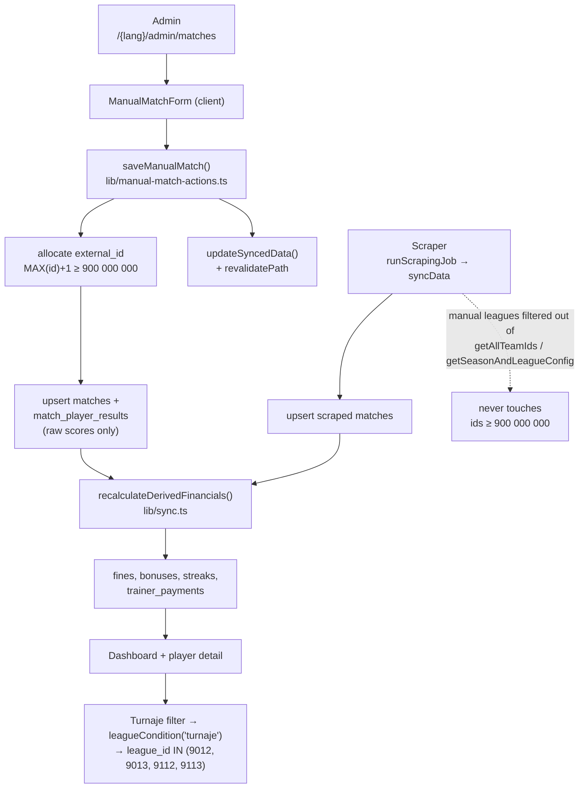

# Requirements

### Overview & Goals

Two competitions the team plays are **not** available in the kolky.sk results API we scrape:

- **Svetový pohár** — a week-long tournament. Qualification is one round where the team total of 6 players decides; the top 4 advance to a final four (semi-final + final/3rd-place), which are ordinary head-to-head matches.
- **Liga majstrov** — teams qualify from the Svetový pohár. Format is identical to a league match: one home and one away leg on points, winner advances; same again in round 2; the winner goes to a final four with the same structure as above.

Together these are at most **7 matches per year**, so the decision is to enter them **by hand** instead of building a scraper. They must count towards fines, bonuses and trainer payments exactly like scraped matches.

Outcome: an admin-only page for creating, editing and deleting these matches; the two competitions get permanent per-season league ids in `lib/season-config.ts`; the matches appear in the player detail table and behind a new grouped **"Turnaje"** filter button.

### Scope

**In Scope**

- Two new league keys (`svetovypohar`, `ligamajstrov`) with permanent, per-season league ids in `lib/season-config.ts` for seasons **12 (2025/2026)** and **13 (2026/2027)**.
- New admin page `/{lang}/admin/matches`: create form + list of manually added matches with edit and delete.
- New server actions in `lib/manual-match-actions.ts` writing to the existing `matches` and `match_player_results` tables (no new tables, no schema change).
- Money rules extended so tournament matches are fined and trainer-charged.
- New grouped filter tab **"Turnaje"** covering both competitions.
- Player detail "Súťaž" column distinguishing the two new competitions.
- Dropdown entry under the sync item (desktop `UserDropdown` **and** mobile `MobileNav`).
- Translations in `sk`, `cs`, `hu`, `sr`.

**Out of Scope**

- Any scraping of these competitions.
- Changing how special faults (fault into playing full, missed 2nd-to-last throw) are marked — they stay in the existing separate flow (`lib/special-misses.ts`) and are **not** on the new form.
- Changing worst-in-team / under-600 behaviour for partial appearances (see Key Decisions #5).
- Tournament standings, brackets, or advancement logic. A tournament match is just a match row.

### User Stories

- **As an admin**, I open a new page from the dropdown under "Synchronizovať dáta" and enter a tournament match: season, competition, date, opponent name, home/away, opponent total, and per-player full / clean / faults.
- **As an admin**, I see all manually added matches in a list and can correct a typo or delete a match I entered wrongly.
- **As a player**, the tournament match shows in my match table on my detail page, with "Svetový pohár" or "Liga majstrov" in the Súťaž column, and its fine is in my balance.
- **As any user**, I click the **Turnaje** filter button and see stats aggregated across both tournament competitions.

### Functional Requirements

**Competitions & ids** — reserved `9xxx` block, permanent, never issued by kolky.sk (real ids are 3-digit: 354, 364, 366, 368):

| Competition | Formula | Season 12 | Season 13 |
|---|---|---|---|
| Svetový pohár | `9000 + seasonId` | `9012` | `9013` |
| Liga majstrov | `9100 + seasonId` | `9112` | `9113` |

**Match ids** — `matches.external_id` is the PK and normally comes from kolky.sk. Manual matches are allocated from a reserved high range, `MANUAL_MATCH_ID_BASE = 900_000_000`, as `MAX(external_id) + 1` within that range. The admin never sees or types an id. `external_id >= MANUAL_MATCH_ID_BASE` is the definition of "manual" — no new column needed.

**Lineup** — starts at 6 rows, but rows can be added or removed: a slot may be **split between two players** (60/60, 33/87, …). Each player appears at most once (composite PK is `(match_id, user_id)`), so a substitution is simply two rows with their own partial scores.

**Money rules for tournament matches**

| Rule | Applies? |
|---|---|
| Score < 600 → 1€ | yes (unchanged logic) |
| Worst in team → 1€ | yes (unchanged logic) |
| Faults, sequential `n(n+1)/2` | yes (unchanged logic) |
| Special faults 5€ | yes, but marked later via the existing flow |
| 5th+ consecutive faultless game → 10€ | yes — the streak window already spans all matches ordered by date, so tournament matches slot in automatically |
| Score > 700 → 40€ bonus | yes (unchanged logic) |
| **Team under 3750 → 10€ per player** | **yes, always** — unlike Interliga this is *not* restricted to home matches |
| Trainer: >3800 / >3900, zero faults, elite player | yes, identical to league matches |

# Technical Design

### Current Implementation

- **No leagues/seasons/competitions tables.** `SEASONS_CONFIG` in `lib/season-config.ts` is the only registry; `matches.season_id` / `matches.league_id` are unconstrained integers.
- **All money math is one SQL function**, `recalculateDerivedFinancials()` in `lib/sync.ts:94`. It recomputes every derived field for *every* row from raw scores, so anything inserted into `matches` + `match_player_results` is picked up automatically. Called by `syncData()` and `updatePlayerSpecialMisses()`.
- The only league-aware fine is the 3750 rule, `lib/sync.ts:107-113`, hardcoded to `m.league_id IN (354, 368) OR m.league_name ILIKE '%interliga%'` **and** `m.is_home`.
- Read-side league filtering is `leagueCondition(leagueKey)` in `lib/db-utils.ts:145-153`, also hardcoded, and **an unknown key silently behaves as "all"**.
- Filter tabs are a hardcoded array in `components/dashboard/SeasonLeagueFilter.tsx:61-65` with a fixed `labels` prop shape, used by `app/[lang]/page.tsx` and `app/[lang]/player/[id]/page.tsx`.
- Player detail Súťaž cell (`app/[lang]/player/[id]/page.tsx:176-180`) is a binary: `leagueName === 'Interliga' ? leagueInterliga : leagueCup` — **anything else is labelled "Slovenský pohár"**.
- The only admin page is `/{lang}/admin/users`; `/admin/**` is gated by `proxy.ts`, and every mutating action re-checks `getSession()?.user.role === 'admin'`.
- No form library, no zod, no `input`/`label`/`checkbox` UI primitive, no date input anywhere yet. Forms are `<form action>` + `useActionState`, or `useTransition` + direct action call returning a discriminated union of error *codes* that the client maps through the dictionary.
- `components/SyncButton.tsx` is **dead code** (zero imports). The live dropdown is `components/layout/UserDropdown.tsx`; the mobile equivalent is `components/layout/MobileNav.tsx:103-127`.

### Proposed Changes

#### 1. Season & league config (`lib/season-config.ts`)

Widen the key union, mark manual leagues, and expose derived id lists so the hardcoded league ids elsewhere can be replaced.

```ts
export type LeagueKey = 'interliga' | 'pohar' | 'svetovypohar' | 'ligamajstrov';

export interface LeagueConfig {
  leagueId: number;
  // The cup re-registers the squad under a new id for the final rounds.
  teamIds: number[];
  key: LeagueKey;
  name: string;
  /** Entered by hand in /admin/matches; the scraper never produces these. */
  manual?: boolean;
}
```

Add to **both** seasons (`teamIds: []` — these leagues have no kolky.sk team):

```ts
// season 13
{ leagueId: 9013, teamIds: [], key: 'svetovypohar', name: 'Svetový pohár', manual: true },
{ leagueId: 9113, teamIds: [], key: 'ligamajstrov', name: 'Liga majstrov', manual: true },
// season 12
{ leagueId: 9012, teamIds: [], key: 'svetovypohar', name: 'Svetový pohár', manual: true },
{ leagueId: 9112, teamIds: [], key: 'ligamajstrov', name: 'Liga majstrov', manual: true },
```

New exports:

```ts
export const MANUAL_MATCH_ID_BASE = 900_000_000;
export const MANUAL_LEAGUE_KEYS = ['svetovypohar', 'ligamajstrov'] as const;
/** The grouped filter tab covering every manual competition. */
export const TOURNAMENT_FILTER_KEY = 'turnaje';

export function isManualMatchId(externalId: number): boolean;
export function getLeagueIdsForKey(key: LeagueKey): number[];      // across all seasons
export function getLeagueByLeagueId(leagueId: number): LeagueConfig | undefined;
export function getManualLeagues(seasonId: number): LeagueConfig[];

export const INTERLIGA_LEAGUE_IDS: number[];   // getLeagueIdsForKey('interliga') → [368, 354]
export const POHAR_LEAGUE_IDS: number[];       // [364] (+ the stale 366 kept explicitly)
export const TOURNAMENT_LEAGUE_IDS: number[];  // [9013, 9113, 9012, 9112]
```

**Guard the scraper:** `getAllTeamIds()`, `getTeamIdsForSeason()` and the `allLeagues` list inside `getSeasonAndLeagueConfig()` must all `.filter((l) => !l.manual)`. `teamIds: []` already makes this a no-op, but the filter makes it impossible for a future edit to feed a fake league id into the sync path.

#### 2. Manual match write layer (`lib/manual-match-actions.ts`, new — `'use server'`)

Follows the `lib/admin-actions.ts` contract exactly: session check first, typed error codes, `revalidatePath` with the route-group path, `updateSyncedData()` because money changed.

```ts
export type ManualMatchError =
  | 'unauthorized' | 'invalidLeague' | 'invalidDate' | 'noPlayers'
  | 'duplicatePlayer' | 'invalidScore' | 'notFound' | 'notManual' | 'unknown';

export type ManualMatchResult =
  | { success: true; matchId: number }
  | { success: false; error: ManualMatchError };

export interface ManualMatchPlayerInput {
  userId: string; full: number; clean: number; faults: number;
}

export interface ManualMatchInput {
  /** Present → edit an existing manual match. */
  externalId?: number;
  seasonId: number;
  leagueId: number;
  date: string;                       // 'YYYY-MM-DD' from the DatePicker
  opponent: string;
  isHome: boolean;
  opponentTotalScore: number | null;
  players: ManualMatchPlayerInput[];
}

export async function saveManualMatch(input: ManualMatchInput): Promise<ManualMatchResult>;
export async function deleteManualMatch(externalId: number): Promise<ManualMatchResult>;
```

`saveManualMatch` steps:

1. `getSession()`; non-admin → `unauthorized`.
2. Validate: `getManualLeagues(input.seasonId)` must contain `input.leagueId` (else `invalidLeague`); date parses; `players.length >= 1` (else `noPlayers`); userIds unique (else `duplicatePlayer`); `full`, `clean`, `faults` are non-negative integers (else `invalidScore`).
3. **Allocate id** when creating:
   ```sql
   SELECT COALESCE(MAX(external_id), ${MANUAL_MATCH_ID_BASE}) + 1 AS id
   FROM matches WHERE external_id >= ${MANUAL_MATCH_ID_BASE}
   ```
   When editing: reject unless `isManualMatchId(externalId)` (`notManual`) and the row exists (`notFound`). A scraped match can never be touched through this action.
4. Derive `teamTotalScore` = sum of `full + clean` across submitted players; `leagueName` = the config's `name`; per player `total = full + clean`, `avg = round(total / 4, 1)` (same formula the scraper uses).
5. Upsert `matches` with plain `EXCLUDED.x` (**not** the `COALESCE(EXCLUDED.x, matches.x)` pattern the sync uses — an edit clearing a field must actually clear it).
6. Delete `match_player_results` rows for this match whose `user_id` is not in the submitted set, then bulk-upsert the submitted rows (`full`, `clean`, `total`, `avg`, `faults`, `team_id`). `team_id` = `getTeamIdsForSeason(seasonId)[0] ?? null` so existing joins behave. Derived money columns are left alone — step 7 owns them.
7. `await recalculateDerivedFinancials()` (imported from `lib/sync.ts`).
8. `updateSyncedData()`; `revalidatePath('/[lang]/admin/matches', 'page')`.

`deleteManualMatch`: admin check → `isManualMatchId` guard → `db.batch([ delete trainer_payments where match_id, delete match_player_results where match_id, delete matches where external_id ])` (FKs have no cascade, order matters) → `recalculateDerivedFinancials()` → `updateSyncedData()` → `revalidatePath`.

#### 3. Manual match read layer (`lib/manual-matches.ts`, new — plain server module)

Mirrors `lib/special-misses.ts` (not a `'use server'` module; the page imports it directly).

- `listManualMatches()` — `matches` where `external_id >= MANUAL_MATCH_ID_BASE`, with player count, ordered `date DESC`.
- `getManualMatch(externalId)` — match row + its player rows, for prefilling the edit form.
- `listSelectablePlayers()` — `SELECT id, name FROM users WHERE role = 'player' AND is_approved ORDER BY name`.

#### 4. Money calculation (`lib/sync.ts`)

Only the `team_under_3750` expression changes. Replace `lib/sync.ts:107-113` with a version that is home-restricted for Interliga but unconditional for tournaments, and takes its ids from config instead of literals:

```sql
COALESCE(
  m.team_total_score < ${TEAM_SCORE_LIMIT}
  AND mpr.total > 0
  AND (
    (m.is_home AND (m.league_id IN (${interligaIds}) OR m.league_name ILIKE '%interliga%'))
    OR m.league_id IN (${tournamentIds})
  ),
  false
) AS team_under_3750,
```

where `interligaIds` / `tournamentIds` are built with `sql.join(ids.map((id) => sql`${id}`), sql`, `)` from `INTERLIGA_LEAGUE_IDS` / `TOURNAMENT_LEAGUE_IDS`.

The trainer-payment queries and the streak/worst/under-600/bonus expressions need **no change** — they already run across all matches, so tournaments are included the moment their rows exist.

#### 5. Read-side league filtering (`lib/db-utils.ts`)

`leagueCondition()` gains a `turnaje` branch and stops hardcoding ids:

```ts
function leagueCondition(leagueKey?: string) {
  if (leagueKey === 'interliga') {
    return sql`AND (m.league_id IN (${ids(INTERLIGA_LEAGUE_IDS)}) OR m.league_name ILIKE '%interliga%')`;
  }
  if (leagueKey === 'pohar') {
    return sql`AND (m.league_id IN (${ids(POHAR_LEAGUE_IDS)}) OR m.league_name ILIKE '%pohár%' OR m.league_name ILIKE '%pohar%' OR m.league_name ILIKE '%finále%' OR m.league_name ILIKE '%finale%')`;
  }
  if (leagueKey === TOURNAMENT_FILTER_KEY) {
    return sql`AND m.league_id IN (${ids(TOURNAMENT_LEAGUE_IDS)})`;
  }
  return sql``;
}
```

The `turnaje` branch matches on id only — no `ILIKE` fallback, because these rows are always stamped by us. Keep `366` in `POHAR_LEAGUE_IDS` explicitly (stale id, still in data).

Also:
- `PlayerMatchResult` gains `leagueId: number | null`, and `getPlayerMatchResultsByExternalId` selects `m.league_id` — the detail page needs it to label the Súťaž column reliably.
- `getMatchesByTeamId(teamId, seasonId, leagueIds?: number[])` — widen from a single `leagueId` to a list. Keep the existing `league_id IS NULL OR …` behaviour for the single scraped-league case (unplayed fixtures have no league id), but for `turnaje` match on the ids only, so unassigned fixtures don't leak into the tournament tab.

#### 6. Home aggregation (`lib/home-helpers.ts`)

- `fetchHomeDataInternal`: `getLeagueConfig(seasonId, leagueKey)` returns a single league and yields `undefined` for the grouped `turnaje` key. Resolve league ids via a small branch — `turnaje` → tournament ids for that season, otherwise the single configured league — and pass the array to `getMatchesByTeamId`. `effectiveTeamId` falls back to the season's Interliga team id.
- `countBelowLimit` (the "Pod limit (3750)" bank stat): mirror the SQL change — Interliga home matches **plus** every tournament match regardless of `isHome`. Use `TOURNAMENT_LEAGUE_IDS` / `INTERLIGA_LEAGUE_IDS` instead of the local `INTERLIGA_LEAGUE_IDS` literal at `lib/home-helpers.ts:51`.
- Line 170, `leagueKey === 'pohar' ? [] : getTrainersWithStats(...)` — leave as is, so trainers **do** show under `turnaje` (trainer payments apply to tournaments).

#### 7. Filter button (`components/dashboard/SeasonLeagueFilter.tsx`)

Add `turnaje: string` to the `labels` prop and a fourth tab:

```ts
const leagueTabs = [
  { key: 'all', label: labels.allLeagues },
  { key: 'interliga', label: labels.interliga },
  { key: 'pohar', label: labels.pohar },
  { key: TOURNAMENT_FILTER_KEY, label: labels.turnaje },
];
```

Both call sites (`app/[lang]/page.tsx:209-214`, `app/[lang]/player/[id]/page.tsx:110-115`) pass `turnaje: dict.home.filterTurnaje`. The row already scrolls horizontally on mobile (`overflow-x-auto`), so four tabs need no layout change.

#### 8. Player detail Súťaž column (`app/[lang]/player/[id]/page.tsx`)

Replace the `=== 'Interliga'` binary with a lookup on `result.leagueId` → `getLeagueByLeagueId(...)?.key` → dictionary label, falling back to `result.leagueName ?? '-'`:

```ts
const LEAGUE_LABELS: Record<LeagueKey, string> = {
  interliga: dict.playerDetail.leagueInterliga,
  pohar: dict.playerDetail.leagueCup,
  svetovypohar: dict.playerDetail.leagueWorldCup,
  ligamajstrov: dict.playerDetail.leagueChampions,
};
```

Nothing else on the page changes — manual matches already flow through `getCachedPlayerMatchResults`, and the "Match" column already renders `matchHome` / `matchAway` from `opponent` + `isHome`.

#### 9. Admin page (`app/[lang]/admin/matches/`)

Route is protected automatically by `proxy.ts` (`/admin/**` → admin only). No `admin/layout.tsx` needed. Client sub-components are co-located, matching `admin/users/`.

- **`page.tsx`** (server) — reads `?edit=<externalId>`; fetches `listManualMatches()`, `listSelectablePlayers()`, and `getManualMatch(editId)` when editing; renders `<ManualMatchForm>` above a list of existing manual matches (date, competition, opponent, team total, player count, Edit link, `<DeleteMatchButton>`).
- **`ManualMatchForm.tsx`** (client) — `useTransition` + `saveManualMatch`, inline error mapped from `ManualMatchError` through the dictionary. Mobile-first: single column, fields stack, player rows are cards on small screens and a grid from `sm:` up.
  - Season `Select` → Competition `Select` (manual leagues of the selected season; resets when the season changes)
  - Date — `DatePicker` (`components/ui/date-picker.tsx`): a trigger with the formatted date and a calendar icon on the right, opening the shadcn `Calendar` (vendored from the `base-nova` registry, adds `react-day-picker` + `date-fns`) in a popover below the field, with month/year dropdowns and per-locale month names
  - Opponent — free-text `<input>` (no options; for a Svetový pohár qualification the admin types e.g. "Kvalifikácia")
  - Home/away — two-button segmented toggle reusing the filter-tab styling (no `checkbox` primitive exists)
  - Opponent total score — optional `<input type="number">`
  - Player rows — starts at **6**, `+ Pridať hráča` adds a row, `×` removes one. Per row: player `Select`, `full`, `clean`, `faults` number inputs, and a read-only **total** (`full + clean`). Read-only team total under the list.
- **`DeleteMatchButton.tsx`** (client) — `AlertDialog` confirmation, copied from `admin/users/DeleteUserButton.tsx`.
- **`components/ui/input.tsx`** (new primitive) — the form has ~25 inputs; repeating the 400-character Tailwind string from `SignUpForm` that many times is worse than adding the standard shadcn `Input`. Plain `<input>` + `cn()`, no base-ui dependency.

#### 10. Navigation (`components/layout/`)

Add a `ClipboardList` item **directly under** the sync item, admin-only, in both places — `UserDropdown.tsx` (desktop, inside the `isAdmin` block before `DropdownMenuSeparator`) and `MobileNav.tsx` (mobile, in the `user.role === 'admin'` block after the sync button). Both `translations` prop interfaces gain `manualMatches: string`, and `Header.tsx` must add it to **both** objects it builds (the shared `translations` and the inline `UserDropdown` one). `components/SyncButton.tsx` is dead code — do not touch it.

#### 11. Translations (`locales/{sk,cs,hu,sr}.json`)

`sk.json` is the type source (`lib/i18n/types.ts`) — add there first, then the other three. Informal tone, camelCase keys, `{var}` + `interpolate`.

- `common.manualMatches` — "Manuálne zápasy"
- `home.filterTurnaje` — "Turnaje"
- `playerDetail.leagueWorldCup` — "Svetový pohár"; `playerDetail.leagueChampions` — "Liga majstrov"
- new `admin.matches` block: page title, form labels (season, competition, date, opponent, home, away, opponent total, players, full, clean, total, faults, add player, remove, teamTotal), buttons (save, saving, edit, delete, deleteConfirm…), list headers, empty state, and an `errors` map covering every `ManualMatchError`.

### Architecture Diagram



### Key Decisions

1. **Reserved id range over a `is_manual` column.** `matches.external_id >= 900_000_000` already answers "is this manual?", needs no `db:push`, and cannot collide with kolky.sk ids (3–6 digits). The alternative — negative ids — reads well in the DB but risks tripping `bigint` assumptions in existing `COALESCE(MAX(...))`-style queries and sorting.
2. **Permanent league ids in `SEASONS_CONFIG`, formula `9000 + seasonId` / `9100 + seasonId`.** Per-season as requested, trivially derivable when a new season is added, and clearly outside the scraped id space.
3. **Reuse `recalculateDerivedFinancials()` instead of computing fines in the action.** It is already the documented single source of truth and recomputes everything from raw scores, so manual matches get streaks, worst-in-team and trainer payments for free — including streaks that *span* scraped and manual matches, which is exactly what the rules require.
4. **3750 rule unconditional for tournaments.** Per the decision taken: Interliga stays home-only, tournaments apply home *and* away. `countBelowLimit` in the bank card is updated to match, so the UI and the SQL never disagree.
5. **Substitutes keep current fine behaviour.** A player who threw 33 bowls has a small total and will usually be flagged worst-in-team and under-600. This is already how scraped matches with substitutions behave; making tournaments an exception would split the rules. Explicitly decided to leave as is.
6. **Grouped `turnaje` filter key, not two separate tabs.** Requested behaviour; it also keeps the tab row to four items, which still fits mobile.
7. **Súťaž column keyed on `league_id`, not `league_name`.** The current string comparison mislabels anything that isn't literally `'Interliga'` as the cup. Matching on the id via `getLeagueByLeagueId` is exact and survives renames.
8. **Edit uses plain `EXCLUDED.x`, not the sync's `COALESCE` pattern.** The sync deliberately never lets a NULL erase a value; a manual edit must be able to.

### Edge Cases / Risks

- **Scraper contamination** — if a manual league ever leaked into `getAllTeamIds()` or `getSeasonAndLeagueConfig()`, the sync could stamp real matches with a tournament id. Mitigated by `teamIds: []` *and* an explicit `!l.manual` filter in all three helpers.
- **Deleting a match with paid fines** — deletion removes `match_player_results` and `trainer_payments` rows including `is_paid = true` ones, so money already collected disappears from the totals. The confirmation dialog must say so plainly.
- **`recalculateDerivedFinancials` never spares paid player fines** (only trainer payments are protected). Editing scores on an old manual match will silently change an already-paid fine — same as the existing special-misses flow, so no new behaviour, but worth knowing.
- **Streak recomputation is global.** Inserting a tournament match dated mid-season shifts faultless streaks for every later match of those players, which can add or remove 10€ success gatherings retroactively. This is correct per the rules, but the admin should enter matches with the right date.
- **`avg = total / 4`** assumes a full 120-bowl appearance and is meaningless for a substitute. It mirrors the scraper's formula and is not used for any money or dashboard figure (`avgScore` is derived from `total`), so it is left alone.
- **Id allocation race** — `MAX(id) + 1` is not transactional. With a single admin entering ≤ 7 matches a year this is acceptable; a collision would surface as a PK violation and a clean `unknown` error, not corrupt data.
- **Neon has no transaction helper** — `db.batch([...])` is the idiom. A partial failure mid-save leaves the match written but player rows stale; the fix is re-submitting the form, which is idempotent.
- **`unstable_cache` is week-long.** Forgetting `updateSyncedData()` in either action means the dashboard shows stale numbers for up to 7 days.

# Delivery Steps

### ✓ Step 1: Extend the season/league config

_Files: `lib/season-config.ts`_

Add `LeagueKey`, the `manual` flag, the four tournament league entries (seasons 12 and 13), `MANUAL_MATCH_ID_BASE`, `TOURNAMENT_FILTER_KEY`, `MANUAL_LEAGUE_KEYS`, and the helpers `isManualMatchId`, `getLeagueIdsForKey`, `getLeagueByLeagueId`, `getManualLeagues`, plus the derived `INTERLIGA_LEAGUE_IDS` / `POHAR_LEAGUE_IDS` / `TOURNAMENT_LEAGUE_IDS`. Filter `!l.manual` in `getAllTeamIds`, `getTeamIdsForSeason` and `getSeasonAndLeagueConfig`.

_Verify:_ `pnpm type-check`; existing callers still compile unchanged.

### ✓ Step 2: Teach the money calculation about tournaments

_Files: `lib/sync.ts`, `lib/home-helpers.ts`_

Rewrite the `team_under_3750` expression (`lib/sync.ts:107-113`) per Proposed Changes #4 and update `isInterliga` / `countBelowLimit` (`lib/home-helpers.ts:51-67`) to use the config-derived id lists and include tournament matches regardless of `is_home`.

_Verify:_ run `pnpm tsx scripts/run-sync.ts` (or trigger the sync button) against existing data — no `is_team_under_3750` flag or `calculated_fine` should change, since no tournament rows exist yet.

### ✓ Step 3: Add the manual match read/write layer

_Files: `lib/manual-matches.ts` (new), `lib/manual-match-actions.ts` (new)_

Implement `listManualMatches`, `getManualMatch`, `listSelectablePlayers`, then `saveManualMatch` and `deleteManualMatch` exactly as specified in Proposed Changes #2 — admin check, validation, id allocation, upserts, `recalculateDerivedFinancials()`, `updateSyncedData()`, `revalidatePath`.

_Verify:_ temporary `pnpm tsx` script that saves a fake tournament match, prints the resulting `match_player_results` rows, then deletes it; confirm fines appear and vanish.

### ✓ Step 4: Build the admin page

_Files: `components/ui/input.tsx` (new), `app/[lang]/admin/matches/page.tsx` (new), `app/[lang]/admin/matches/ManualMatchForm.tsx` (new), `app/[lang]/admin/matches/DeleteMatchButton.tsx` (new)_

Add the `Input` primitive, then the server page (list + `?edit=` prefill) and the two client components per Proposed Changes #9. Mobile-first: single column, player rows as stacked cards below `sm`.

_Verify:_ create, edit and delete a match in the browser at `/sk/admin/matches`; check the list refreshes and a non-admin is redirected.

### ✓ Step 5: Wire the navigation entry

_Files: `components/layout/UserDropdown.tsx`, `components/layout/MobileNav.tsx`, `components/layout/Header.tsx`_

Add the admin-only "Manuálne zápasy" item directly under the sync item in both menus; extend both `translations` interfaces and both objects built in `Header.tsx`.

_Verify:_ the item shows for admins only, on desktop and mobile, and navigates correctly.

### ✓ Step 6: Surface tournaments in the read paths

_Files: `lib/db-utils.ts`, `lib/home-helpers.ts`, `components/dashboard/SeasonLeagueFilter.tsx`, `app/[lang]/page.tsx`, `app/[lang]/player/[id]/page.tsx`_

Add the `turnaje` branch to `leagueCondition`; add `leagueId` to `PlayerMatchResult` and its query; widen `getMatchesByTeamId` to a league-id list and resolve it for `turnaje` in `fetchHomeDataInternal`; add the fourth filter tab and its label at both call sites; replace the Súťaž binary with the `LEAGUE_LABELS` lookup.

_Verify:_ with a test tournament match saved, the Turnaje tab shows it on the dashboard and the player detail row reads "Svetový pohár".

### ✓ Step 7: Translations

_Files: `locales/sk.json`, `locales/cs.json`, `locales/hu.json`, `locales/sr.json`_

Add `common.manualMatches`, `home.filterTurnaje`, `playerDetail.leagueWorldCup`, `playerDetail.leagueChampions` and the full `admin.matches` block (including the `errors` map) — `sk` first, then `cs`, `hu`, `sr`, informal tone throughout.

_Verify:_ `pnpm type-check` (missing keys in non-sk locales fail against `Dictionary`); switch the UI through all four languages.

### ✓ Step 8: Quality checks (mandatory)

_Files: none_

Run `nvm use 22 && pnpm lint && pnpm type-check`. Zero Airbnb violations, zero TypeScript errors, no `any` anywhere in the new code.

# Testing

### Validation Approach

1. `pnpm lint` — zero errors/warnings (Airbnb).
2. `pnpm type-check` — zero errors, no `any`. This also validates that all four locale files carry every new key.
3. Manual flows in the browser (Node 22 required for the Next 16 dev server).

### Key Scenarios

- **Create — Svetový pohár qualification.** `/sk/admin/matches` → season 2026/2027, Svetový pohár, a date, opponent "Kvalifikácia", away, 6 players with realistic scores. Save. The match appears in the list; player detail pages show it with "Svetový pohár" in Súťaž.
- **Create — Liga majstrov home leg with a substitution.** 7 player rows, two of them splitting a slot (e.g. 250 / 380). Confirm the team total is the sum of all 7 rows and both split players get their own row.
- **3750 rule, away.** Enter a tournament match with a team total of 3600 marked **away**. Every player with `total > 0` must get the 10€ `is_team_under_3750` fine — visible in the fine tooltip on the player detail page.
- **3750 rule, Interliga unchanged.** Confirm an existing away Interliga match under 3750 still charges nothing.
- **Trainer payments.** Enter a tournament match with a team total of 3950 and zero faults across 6 players — the trainer must owe 15€ (score bonus) + 10€ (zero faults); check the dashboard trainer card under the Turnaje filter.
- **Faultless streak across competitions.** Add a tournament match with 0 faults for a player who already has 4 consecutive faultless league matches — the 5th (the tournament one) must charge the 10€ success gathering.
- **Edit.** Reopen a saved match, change one player's `full`, save; the total, team total and that player's fine all update.
- **Delete.** Delete a manual match; it disappears from the list, from the player's match table, and their balance drops accordingly.
- **Scraper isolation.** Run the sync (`/sk` → dropdown → Synchronizovať dáta) with manual matches present; confirm no manual match is modified or deleted and no scraped match receives a `9xxx` league id.
- **Filter.** Click **Turnaje** on both dashboard and player detail — only tournament matches are aggregated; **Interliga** and **Slovenský pohár** exclude them; **Všetky** includes them.
- **Access control.** Sign in as a non-admin and open `/sk/admin/matches` — redirected to `/sk`.
- **Localization.** Switch through sk / cs / hu / sr on the admin page, the filter row and the player detail table.
