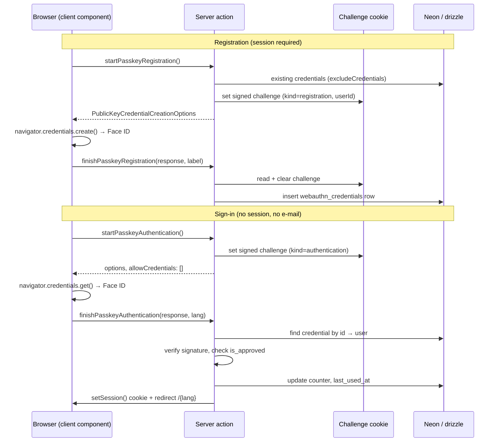

# Context

Sign-in today is email + password only (`lib/auth-actions.ts:61`), verified with bcrypt and turned into a
30-day HS256 JWT cookie (`lib/auth.ts`, `lib/session.ts`). On a phone that means typing an e-mail and a
password into a PWA the user opens several times a week. Password reset is commented out
(`lib/auth-actions.ts:118-186`), so a forgotten password is currently an admin problem.

Goal: let an approved user register a passkey on their device and afterwards sign in with Face ID /
Android fingerprint in one tap, with no e-mail typed. The password stays as the fallback and the recovery
path — a passkey is added, never a replacement.

**Note on plan file location**: `AGENTS.md` requires plans in `.junie/plans/`. Plan mode only permits
writing this file, so Step 0 of execution is to copy this plan to `.junie/plans/add-passkey-login.md`.

## Effort estimate

~12–15 hours of focused work (1.5–2 days). 9 new files, 7 touched. No money code, no `lib/sync.ts`,
no proxy change. Two new dependencies. The risky part is not the code — it is device testing across
iOS Safari standalone, Android Chrome, and desktop.

# Requirements

### Overview & Goals

- Approved users register a platform passkey (Face ID / Touch ID / Android biometrics) from a new
  settings page and manage (rename / delete) the ones they have.
- The sign-in page offers a "Sign in with passkey" button that needs no e-mail — a discoverable
  (resident) credential. The password form stays untouched below it.
- Session creation reuses `setSession()` verbatim; the proxy, the JWT shape, and every existing guard
  stay as they are.

### Scope

**In scope**
- `webauthn_credentials` table + drizzle schema entry.
- Registration and authentication ceremonies via `@simplewebauthn/server` / `@simplewebauthn/browser`.
- Challenge storage in a short-lived signed cookie (no table, reuses `jose`).
- New `/[lang]/settings` page with a passkey list; entry point in `UserDropdown`.
- Passkey button on the sign-in page, hidden when the browser has no WebAuthn.
- `auth.passkey*` + `settings` keys in all four locale files.
- Unit tests for every pure helper and both new client components.

**Out of scope**
- Removing or replacing the password. `password_hash` stays required for sign-up.
- Reviving password reset (still commented out; unchanged by this work).
- Conditional-UI autofill on the e-mail field.
- Passkeys for the admin bootstrap scripts.
- Cross-device / QR hybrid flows as a designed feature (they work for free through the platform, but
  nothing is built for them).

### User Stories

1. As a signed-in player on my iPhone, I open Settings, tap "Add passkey", confirm with Face ID, and see
   the device listed as "iPhone".
2. As that player, next time I open the PWA signed out, I tap "Sign in with passkey", confirm with
   Face ID, and land on the dashboard — no e-mail, no password.
3. As a player who lost a phone, I open Settings on another device and delete that passkey.
4. As an unapproved user, a passkey sign-in tells me my account is awaiting approval and does not sign
   me in.
5. As a user on a browser without WebAuthn, I see the normal password form and no broken button.

# Technical Design

### Current Implementation

- `lib/auth.ts` — `hashPassword` / `verifyPassword` (bcrypt), `encrypt` / `decrypt` (jose HS256),
  `UserPayload = { id, role, name }`.
- `lib/session.ts` — `setSession` / `getSession` / `clearSession`, cookie `session`, httpOnly, lax, 30 days.
- `lib/auth-actions.ts` — `signIn` looks the user up by e-mail, bcrypt-compares, checks `isApproved`,
  calls `setSession`, then `redirect(`/${lang}`)`. Returns **error codes**, never messages.
- `proxy.ts` — `publicRoutes = ['/sign-in', '/sign-up', '/opengraph-image', '/offline']`. Server actions
  posted from a public page are not routed through the public-route list, so **no proxy change is needed**.
- `lib/db/schema.ts` — drizzle, no migration files. `pnpm db:push` applies the schema to Neon.
  `push_subscriptions` (schema.ts:125) is the existing per-device-credential shape to copy.
- Env: `NEXT_PUBLIC_APP_URL` already present in `.env.local`.

### Proposed Changes

#### 1. Dependencies (`package.json`)

```
pnpm add @simplewebauthn/server @simplewebauthn/browser
```

v13.x of both. `@simplewebauthn/server` runs in the Node runtime, which is where server actions execute;
nothing it does touches the edge proxy.

#### 2. Schema (`lib/db/schema.ts`)

```ts
export const webauthnCredentials = pgTable('webauthn_credentials', {
  id: serial('id').primaryKey(),
  userId: uuid('user_id').notNull().references(() => users.id, { onDelete: 'cascade' }),
  // base64url, the authenticator's identity — not the row id, same rule as push endpoints.
  credentialId: text('credential_id').notNull(),
  publicKey: text('public_key').notNull(),
  counter: bigint('counter', { mode: 'number' }).notNull().default(0),
  transports: text('transports'),
  deviceType: text('device_type'),
  backedUp: boolean('backed_up').default(false),
  label: text('label').notNull(),
  createdAt: timestamp('created_at', { withTimezone: true }).defaultNow(),
  lastUsedAt: timestamp('last_used_at', { withTimezone: true }),
}, (table) => [
  uniqueIndex('idx_webauthn_credentials_credential_id').on(table.credentialId),
  index('idx_webauthn_credentials_user').on(table.userId),
]);
```

Applied with `pnpm db:push` — the repo has no migration files.

#### 3. Relying-party config (`lib/webauthn-config.ts`, new, db-free)

Must not reach `lib/db.ts` — the sign-in button is a client component. Follows the
`lib/session-config.ts` / `lib/withdrawal-categories.ts` pattern.

```ts
export const RP_NAME = 'Interliga Podbrezová';
export const CHALLENGE_COOKIE_NAME = 'webauthn-challenge';
export const CHALLENGE_MAX_AGE_SECONDS = 5 * 60;

/** rpID is the bare host: no scheme, no port. A passkey is bound to it, so it must be stable. */
export function rpIdFromUrl(appUrl: string): string { /* new URL(appUrl).hostname */ }
export function originFromUrl(appUrl: string): string { /* new URL(appUrl).origin */ }
```

#### 4. Challenge cookie (`lib/webauthn-challenge.ts`, new)

No table. The challenge is a 5-minute HS256 token signed with the existing `JWT_SECRET`, written to an
httpOnly cookie with the same attributes `setSession` uses. It carries a `kind` (`'registration'` |
`'authentication'`) and, for registration, the `userId`, so a registration challenge can never be
replayed into an authentication.

`setChallenge(kind, challenge, userId?)`, `readChallenge(kind)`, `clearChallenge()`.

#### 5. Credential queries (`lib/webauthn.ts`, new, server-only)

`listCredentialsForUser(userId)`, `findCredentialById(credentialId)`, `insertCredential(...)`,
`touchCredential(credentialId, counter)`, `deleteCredential(id, userId)`, `renameCredential(id, userId, label)`.
Drizzle query builder, matching `lib/push-subscriptions.ts`.

#### 6. Server actions (`lib/webauthn-actions.ts`, new, `'use server'`)

All return `{ success, error }` with codes, per the Auth & Admin invariant.

```ts
export type PasskeyActionError =
  | 'unauthorized' | 'notApproved' | 'noChallenge' | 'verificationFailed'
  | 'unknownCredential' | 'alreadyRegistered' | 'invalidLabel' | 'dbError';
```

- `startPasskeyRegistration()` — requires a session. `generateRegistrationOptions` with
  `userID: session.user.id`, `excludeCredentials` from the user's existing rows,
  `authenticatorSelection: { residentKey: 'required', userVerification: 'preferred' }`
  (`residentKey: 'required'` is what makes the e-mail-less sign-in possible),
  `attestationType: 'none'`. Writes the challenge cookie, returns the options.
- `finishPasskeyRegistration(response, label)` — `verifyRegistrationResponse`, insert the row, clear the
  challenge cookie.
- `startPasskeyAuthentication()` — **no session required**. `generateAuthenticationOptions` with
  `allowCredentials: []` so the platform offers whatever discoverable credential it holds. Writes the
  challenge cookie.
- `finishPasskeyAuthentication(response, lang)` — look up the credential by id, verify against its stored
  public key, reject when the user is not `isApproved`, update `counter` + `lastUsedAt`, then
  `setSession({ id, role, name })` and `redirect(`/${lang}`)` — identical to `signIn`'s tail.
- `deletePasskey(id)` / `renamePasskey(id, label)` — session-scoped by `userId`, so one user can never
  touch another's row.

#### 7. Label validation (`lib/validation/passkey.ts` + test, new)

A `'use server'` file may only export async functions, so the label rule (1–40 chars, trimmed, not empty)
lives here and is unit tested code by code, like `lib/validation/withdrawal.ts`.

#### 8. Sign-in button (`components/auth/PasskeySignInButton.tsx`, new client component)

Renders only when `typeof window !== 'undefined' && window.PublicKeyCredential` (checked in an effect so
SSR and hydration agree). On click: `startPasskeyAuthentication()` → `startAuthentication()` from
`@simplewebauthn/browser` → `finishPasskeyAuthentication()`. A user cancel (`NotAllowedError`) is silent,
not an error message. Placed above the password form in `components/auth/SignInForm.tsx`, with a
"or" divider.

#### 9. Settings page (`app/[lang]/settings/page.tsx` + `components/settings/PasskeyManager.tsx`, new)

Server page reads the session and `listCredentialsForUser`, passes rows + `dict.settings` into the client
manager. Manager shows label, created date, last used, a delete button per row, and an "Add passkey"
button that runs the registration ceremony and prompts for a label (defaulting to a guess from the user
agent). Mobile-first: a stacked card list, not a table.

#### 10. Entry point (`components/layout/UserDropdown.tsx`)

One new `DropdownMenuItem` linking to `/${lang}/settings`, with a `KeyRound` lucide icon, next to the
existing rules/withdrawals items. `translations` gains a `settings` string.

#### 11. i18n (`locales/{sk,cs,hu,sr}.json`)

New `auth.passkeySignIn`, `auth.passkeyOr`, new `auth.errors` entries for every `PasskeyActionError`, and
a new `settings` namespace (title, passkey section, add/rename/delete, empty state, unsupported-browser
note). `Dictionary` is `typeof sk`, so `sk.json` leads; `locales/locales.test.ts` enforces parity.

### Architecture Diagram



### Key Decisions

- **Discoverable credentials (`residentKey: 'required'`) over an e-mail-first flow.** It is the whole
  point on mobile: one tap, no typing. Cost is that `allowCredentials` is empty, so the ceremony cannot
  be narrowed server-side — acceptable for a team-sized user base.
- **`@simplewebauthn` over hand-rolled WebCrypto.** The alternative means owning CBOR parsing, COSE key
  decoding, and signature verification on the login path. Two well-maintained deps are cheaper and safer.
- **Challenge in a signed cookie, not a table.** The challenge is single-use and lives 5 minutes; `jose`
  and `JWT_SECRET` are already there. A table would need its own cleanup job, like the orphaned
  `password_reset_tokens`.
- **Server actions, not API routes.** `signIn` is already an action posted from a public page, so the
  proxy's `publicApiPrefixes` list stays untouched and `proxy.test.ts` needs no new case.
- **Password stays mandatory.** Password reset is dead code today; making a passkey the sole credential
  would turn a lost phone into an unrecoverable account.
- **Own settings page rather than a dropdown item.** A passkey list needs rename and delete, which a menu
  item cannot host. It also gives the push toggle a future home.

### Edge Cases / Risks

- **rpID is domain-bound.** A passkey registered on the production domain does not work on a Vercel
  preview URL or on `localhost`, and vice versa. Testing must happen on the real domain (or a stable
  tunnel).
  Resolved during implementation: `.env.local` sets `NEXT_PUBLIC_APP_URL` to the *deployed* URL, so a
  local dev run would have offered an rpID that does not match its own origin and every ceremony would
  have failed with a `SecurityError`. `resolveRelyingParty(appUrl, host)` (`lib/webauthn-config.ts`)
  therefore reads the request `Host` **only** when it is `localhost` or `127.0.0.1`, and pins every
  other host to `NEXT_PUBLIC_APP_URL` — a caller-controlled `Host` header must never be able to move
  the relying party.
- **HTTPS required** except on `localhost`.
- **iOS PWA standalone** supports WebAuthn from iOS 16; the ceremony must be started by a real user
  gesture — a click handler, never an effect.
- **Signature counter is 0 on most platform authenticators.** Do not treat a non-increasing counter as a
  clone; `@simplewebauthn` already tolerates 0.
- **User cancel** (`NotAllowedError`) and timeout must not render a scary error.
- **Unapproved user with a passkey**: verify, then refuse with `notApproved` and no session — mirrors
  `signIn`'s ordering.
- **Scraped placeholder users** have no e-mail and never sign in, so they can never hold a credential;
  nothing to guard beyond the session requirement on registration.
- **Enumeration**: a failed passkey sign-in returns one generic code, never "no such credential".
- **`credential_id` collision** across users is impossible in practice but the unique index makes a
  re-registration fail loudly as `alreadyRegistered` rather than silently duplicating.
- **Deleting the last passkey** is allowed — the password is still there.
- **No money code is touched**, so the Money Calculation Rules and the `rules` locale namespace are
  unaffected.

# Delivery Steps

### ✓ Step 1: Add dependencies and the relying-party config
`package.json`, new `lib/webauthn-config.ts`. Verify `NEXT_PUBLIC_APP_URL` resolves to the right host in
dev and production.

### ✓ Step 2: Add the `webauthn_credentials` table
`lib/db/schema.ts`, then `pnpm db:push`. Confirm the table and both indexes exist in Neon.

### ✓ Step 3: Challenge cookie helper
New `lib/webauthn-challenge.ts` built on the existing `jose` helpers in `lib/auth.ts`.

### ✓ Step 4: Credential queries
New `lib/webauthn.ts` (server-only), drizzle query builder, mirroring `lib/push-subscriptions.ts`.

### ✓ Step 5: Label validation
New `lib/validation/passkey.ts`.

### ✓ Step 6: Server actions
New `lib/webauthn-actions.ts` with the five actions and the `PasskeyActionError` union.

### ✓ Step 7: Sign-in button
New `components/auth/PasskeySignInButton.tsx`; wire it into `components/auth/SignInForm.tsx` above the
password form.

### ✓ Step 8: Settings page and passkey manager
New `app/[lang]/settings/page.tsx`, new `components/settings/PasskeyManager.tsx`, plus the link in
`components/layout/UserDropdown.tsx`.

### ✓ Step 9: Translations
`locales/{sk,cs,hu,sr}.json` — `auth.passkey*`, every new `auth.errors` code, and the `settings`
namespace. `sk.json` first, then mirror.

### ✓ Step 10: Tests
See the Testing section for the file list.

### Step 11: Manual device verification
Register and sign in on a real iPhone (Face ID, installed PWA and Safari tab), a real Android device
(fingerprint, Chrome), and a desktop browser. Also verify the unsupported-browser path.

### Step 12: `pnpm check`
Lint (Airbnb), `tsc --noEmit`, and the full vitest suite must pass with no `any`.

# Testing

### Validation Approach

Automated (all new files, following the Testing Rules' placement — next to the source, `node` project
for `lib/**`, `dom` for `components/**`):

- `lib/webauthn-config.test.ts` — `rpIdFromUrl` / `originFromUrl` for `https://example.com`,
  `https://example.com:3000`, `http://localhost:3000`; the port is stripped from the rpID and kept in the
  origin.
- `lib/webauthn-challenge.test.ts` — round-trip; expiry with `vi.setSystemTime`; a tampered token returns
  null; a `registration` token is rejected when read as `authentication`.
- `lib/validation/passkey.test.ts` — label empty / whitespace-only / 40 chars / 41 chars, each mapped to
  its error code.
- `components/auth/PasskeySignInButton.test.tsx` — hidden with no `window.PublicKeyCredential`; shown
  with it; a `NotAllowedError` renders no error text; a returned error code renders
  `dict.errors[code]`.
- `components/settings/PasskeyManager.test.tsx` — renders label, formatted dates, and the empty state;
  the delete button calls the action with the row id. Query by role and visible text.
- `locales/locales.test.ts` — passes unchanged, proving all four locales carry the new keys.

No money code is touched, so `lib/money-rules.test.ts` and the `rules` namespace stay as they are.

Manual, on real devices (Step 11), because no unit test can drive an authenticator:

1. iPhone, installed PWA: Settings → Add passkey → Face ID → the device appears in the list.
2. Sign out, tap "Sign in with passkey" → Face ID → lands on the dashboard, no e-mail typed.
3. Android Chrome: the same two flows with the fingerprint sensor.
4. Cancel the Face ID sheet: no error message, the password form still works.
5. Delete the passkey in Settings, then confirm passkey sign-in fails with the generic code and the
   password still signs in.
6. An unapproved account with a passkey: sign-in refuses with `notApproved` and sets no session.

### Final check

`pnpm check` (lint + type check + tests) must pass, per the Quality Check Rules.
