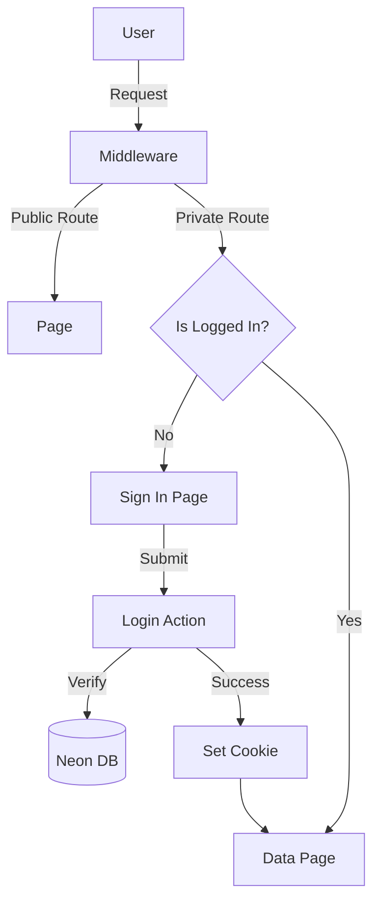

# Requirements

### Overview & Goals
Implement a secure, custom, database-backed authentication system to allow players and admins to manage their accounts. This will replace any previous complex implementations with a straightforward JWT-based approach that integrates directly with the existing `users` table in the Neon database.

### Scope
- **User Credentials**: Add email and password support to the existing user management.
- **Route Protection**: Ensure all data is private and only accessible after login.
- **Self-Service**: Allow users to sign up and recover their passwords independently.
- **Admin Control**: Allow admins to manually link users to their external result IDs via the database and approve/decline new user registrations.
- **Safety Net**: Ensure new registrations are inactive by default until an admin approves them.

### User Stories
- **As a User**, I want to create an account so I can access the application's data.
- **As a User**, I want to log in securely to my account.
- **As a User**, I want to reset my password via email if I forget it.
- **As an Admin**, I want to ensure only authenticated users can see the team's financial data.

# Technical Design

### Current Implementation
The project uses a Next.js App Router with a Neon PostgreSQL database. There is an existing `users` table that tracks player roles and external IDs, but it lacks authentication fields.

### Key Decisions
- **Auth Strategy**: **JWT (JSON Web Token)**. We will use `jose` for lightweight, edge-compatible JWT handling.
- **Session Storage**: **HttpOnly Cookies**. This prevents XSS-based token theft.
- **Password Security**: **bcryptjs**. Industry-standard hashing to ensure password safety.
- **Email Delivery**: **Resend**. Used for sending password reset tokens and potentially registration notifications.
- **Route Protection**: **Next.js Proxy**. A centralized way to enforce "private by default" access.
- **Approval Workflow**: Users must be approved by an admin before they can log in.

### Proposed Changes

#### 1. Database Schema
Extend the `users` table and add a token table:
```sql
ALTER TABLE users ADD COLUMN IF NOT EXISTS email TEXT UNIQUE;
ALTER TABLE users ADD COLUMN IF NOT EXISTS password_hash TEXT;
ALTER TABLE users ADD COLUMN IF NOT EXISTS is_approved BOOLEAN DEFAULT FALSE;

CREATE TABLE IF NOT EXISTS password_reset_tokens (
  id SERIAL PRIMARY KEY,
  user_id UUID REFERENCES users(id) ON DELETE CASCADE,
  token TEXT UNIQUE NOT NULL,
  expires_at TIMESTAMP WITH TIME ZONE NOT NULL,
  created_at TIMESTAMP WITH TIME ZONE DEFAULT CURRENT_TIMESTAMP
);
```

#### 2. Admin Creation Script (`scripts/create-admin.ts`)
A standalone script to bootstrap the system with an initial admin user.
- Reads `ADMIN_EMAIL` and `ADMIN_PASSWORD` from `.env.local`.
- Upserts the admin user with `role = 'admin'` and `is_approved = true`.

#### 3. Proxy (`proxy.ts`)
- Check for the existence and validity of the session cookie.
- Define a whitelist of public routes: `/sign-in`, `/sign-up`, `/forgot-password`, `/reset-password`.
- Redirect unauthenticated requests to `/sign-in`.

#### 4. Auth Utilities
- `lib/auth.ts`: Functions for `hashPassword`, `verifyPassword`, `createToken`, and `verifyToken`.
- `lib/session.ts`: Functions `setSession`, `getSession`, and `clearSession`.

#### 5. UI Components
- **Auth Layout**: A clean, mobile-first container for auth forms.
- **Form Components**: Reusable input fields with validation.
- **Admin Dashboard**: A page (`app/admin/users/page.tsx`) for registration approval.

### Architecture Diagram


# Testing

### Validation Approach
Verification will be performed through manual testing of the auth flows and automated lint/type checks.

### Key Scenarios
- **Access Control**: Verify that navigating to `/` without a cookie redirects to `/sign-in`.
- **Registration**: Register a new user and verify they are saved in the `users` table with `is_approved = false`.
- **Approval Flow**: 
    - Attempt to log in with an unapproved user (should fail with a specific message).
    - Approve the user via the admin dashboard or database.
    - Successfully log in after approval.
- **Admin Privileges**: 
    - Log in as a 'player' and verify the Sync button is hidden.
    - Log in as an 'admin' and verify the Sync button is visible and functional.
- **Login**: Verify that valid credentials grant access and invalid ones show an error.
- **Password Reset**: 
    - Request a reset, receive the "email" (check Resend logs/API).
    - Use the token within 15 mins to successfully reset.
    - Verify that an expired token (>15 mins) or a used token is rejected.
- **Session Persistence**: Close the browser and reopen to verify the user remains logged in (based on cookie duration).
- **Logout**: Verify that clicking logout clears the session and redirects to sign-in.

# Delivery Steps

### ✓ Step 1: Dependencies and Database Schema Setup
Set up the project with necessary authentication libraries and update the database schema.
- Install `jose`, `bcryptjs`, and `resend` dependencies.
- Update `ensureSchema` in `lib/db-utils.ts` to:
    - Add `email` (UNIQUE) and `password_hash` columns to the `users` table.
    - Create `password_reset_tokens` table with `token`, `user_id`, and `expires_at`.
- Ensure migrations are applied by running the schema update.

### ✓ Step 2: Auth Utilities and Session Management
Implement core authentication logic and session management.
- Create `lib/auth.ts` for password hashing/verification and JWT creation/validation.
- Create `lib/session.ts` to handle HttpOnly cookie management (get, set, delete).
- Create `lib/email.ts` to configure Resend for sending password reset emails.

### ✓ Step 3: Global Route Protection Proxy
Implement global route protection to ensure the application is private by default.
- Create `proxy.ts` to intercept requests.
- Allow public access only to `/sign-in`, `/sign-up`, `/forgot-password`, `/reset-password`, and API routes like `/api/cron/scrape`.
- Redirect unauthenticated users to `/sign-in`.

### ✓ Step 4: Sign In and Sign Up Pages
Develop the user interface and logic for authentication.
- Create `app/(auth)/sign-in/page.tsx` and `app/(auth)/sign-up/page.tsx` with mobile-first designs.
- Implement Server Actions for `signIn`, `signUp`, and `signOut`.
- Ensure the `signUp` action saves new users to the database with the 'player' role by default.

### * Step 5: Password Reset Workflow
Implement the secure password recovery workflow.
- Create `app/(auth)/forgot-password/page.tsx` to request a reset link.
- Create `app/(auth)/reset-password/page.tsx` to handle the password update using a valid token.
- Implement logic to generate 15-minute tokens and send them via Resend.
- Add validation to ensure tokens are used only once and before they expire.

###   Step 6: Header Integration and Final Quality Checks
Integrate authentication into the application's layout and perform final checks.
- Update `components/layout/Header.tsx` to show the logged-in user's name and a Logout button.
- Restrict sensitive actions (like the Sync button) based on the user's role if necessary.
- Run linting and type checks to ensure no `any` types and adherence to Airbnb style.