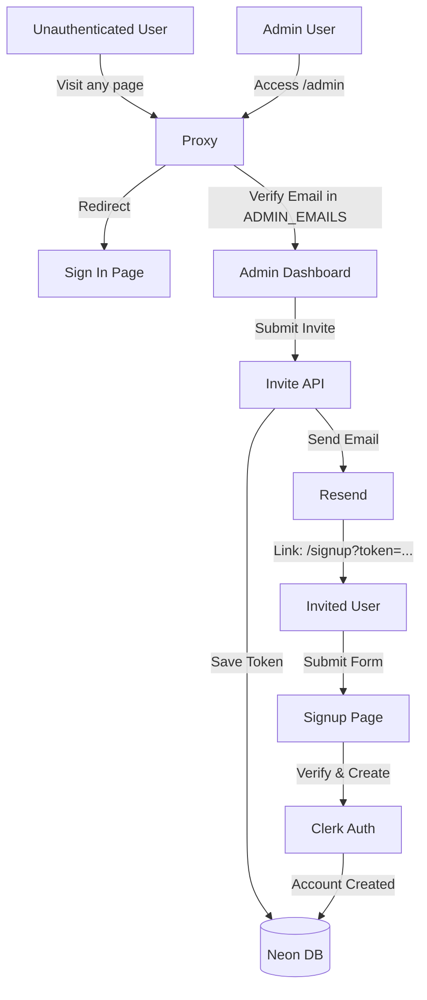

# Plan: Restricted User Authentication with Neon Auth & Invitations

This plan implements a secure authentication flow where public sign-up is disabled, and users are added only via admin invitations (with a 15-minute expiry) or manual creation.

## Requirements

### Overview & Goals
Restrict access to the entire application so that only authorized users can view the data. Since the project uses Neon DB, we will leverage **Neon Auth (powered by Clerk)**. Public registration will be disabled to ensure only specific users can access the system.

### Scope
- **In Scope**:
    - Global route protection via Proxy.
    - Admin dashboard for user management.
    - **Email Invitation System**: 15-minute validity for invitation links sent via Resend.
    - **Manual User Creation**: Admin can create users directly with a temporary password.
    - Custom Sign-up flow for invited users.
    - Integration with Neon Auth (Clerk).
- **Out Scope**:
    - Advanced RBAC (Roles) beyond "Admin" vs "User" based on email list.
    - Customizing Clerk's internal auth logic (standard UI where possible, custom for invitation signup).

### User Stories
- **As an Admin**, I want to invite a user by email so they receive a secure link to set up their account.
- **As an Admin**, I want to manually create an account for a user so I can hand over their login credentials directly.
- **As a User**, I want to click an invitation link and quickly set my username and password to gain access.
- **As an Admin**, I want invitation links to expire after 15 minutes for security.

### Functional Requirements
- Unauthenticated users are redirected to the login page.
- Only users whose emails are in the `ADMIN_EMAILS` environment variable can access the Admin Dashboard.
- Invitation links contain a unique, one-time token stored in the database.
- Manual user creation uses the Clerk Backend API.

## Technical Design

### Current Implementation
The application is a Next.js App Router project with Neon DB. Currently, all data is public. Environment variables for Neon Auth are present but the library is not yet integrated.

### Key Decisions
- **Auth Provider**: **Clerk** (via Neon Auth). It provides robust session management and a Backend SDK for user manipulation.
- **Email Service**: **Resend**. Used for sending invitation emails.
- **Invitation Logic**: Custom token-based system in Neon DB to strictly enforce the **15-minute expiry**.
- **Admin Verification**: Proxy and Admin routes will verify the authenticated user's email against a comma-separated list in the `ADMIN_EMAILS` environment variable.

### Proposed Changes

#### 1. Database Schema
Add an `invitations` table to store tokens and their expiry.
```sql
CREATE TABLE invitations (
  id SERIAL PRIMARY KEY,
  email TEXT NOT NULL,
  token TEXT NOT NULL UNIQUE,
  expires_at TIMESTAMP WITH TIME ZONE NOT NULL,
  created_at TIMESTAMP WITH TIME ZONE DEFAULT CURRENT_TIMESTAMP
);
```

#### 2. Proxy (`proxy.ts`)
- Use Clerk Middleware within Proxy to protect all routes.
- Allow public access to: `/sign-in`, `/signup` (invitation link), and the Cron API.
- Check for `ADMIN_EMAILS` match for any route under `/admin`.

#### 3. Admin Dashboard (`app/admin`)
- **Invite Form**: Takes an email, generates a token, saves to DB, and sends an email via Resend.
- **Manual Creation Form**: Takes email, username, and password; creates user via `clerkClient.users.createUser`.

#### 4. Invitation Flow (`app/signup`)
- Page that accepts a `token` query parameter.
- Server action to validate the token against the DB and check `expires_at`.
- Form to collect username and password.
- Finalization action that creates the user in Clerk and deletes the invitation token.

### File Structure
```
app/
├── admin/
│   └── page.tsx           (Admin UI)
├── signup/
│   └── page.tsx           (Invitation signup UI)
├── api/
│   ├── admin/
│   │   ├── invite/route.ts   (Invitation logic)
│   │   └── create/route.ts   (Manual creation)
│   └── signup/route.ts       (Finalize signup)
lib/
├── db-utils.ts            (Updated with invitations table)
├── email.ts               (Resend configuration)
└── admin.ts               (Admin check helper)
proxy.ts                   (Route protection)
```

### Architecture Diagram


## Testing

### Key Scenarios
- **Global Protection**: Verify that accessing `/` without login redirects to `/sign-in`.
- **Admin Access**: Verify that a non-admin user (logged in but email not in `ADMIN_EMAILS`) cannot access `/admin`.
- **Invitation Validity**:
    - Successful signup with a valid token.
    - Failure when token is expired (> 15 mins).
    - Failure when token is used a second time.
- **Manual Creation**: Verify that a user created by the admin can log in immediately.
- **Public Sign-up**: Verify that the standard Clerk sign-up is disabled (managed in Clerk Dashboard).

## Execution Steps

### ✓ Step 1: Setup dependencies and environment variables
- Install `@clerk/nextjs` and `resend`.
- Verify `.env.local` for required Clerk and Resend keys.
- Update `package.json`.

### ✓ Step 2: Database Schema implementation
- Create `invitations` table in Neon DB.
- Update `lib/db-utils.ts` with invitation logic.

### ✓ Step 3: Clerk and Resend configuration
- Wrap application with `ClerkProvider`.
- Initialize Resend in `lib/email.ts`.
- Implement admin check helper in `lib/admin.ts`.

### ✓ Step 4: Proxy implementation
- Protect all routes by default.
- Allow public access to `/sign-in`, `/signup`, and `/api/cron/scrape`.
- Implement admin route protection.

### ✓ Step 5: Admin Dashboard
- Create `app/admin/page.tsx` with Invite and Manual Creation forms.
- Implement API routes for invitation and manual creation.

### ✓ Step 6: Invitation Signup Flow
- Create `app/signup/page.tsx` for token-based signup.
- Implement API route/server action to finalize signup.

### * Step 7: Header integration and final verification
- Add `UserButton` to `Header.tsx`.
- Perform quality checks (lint, type-check).