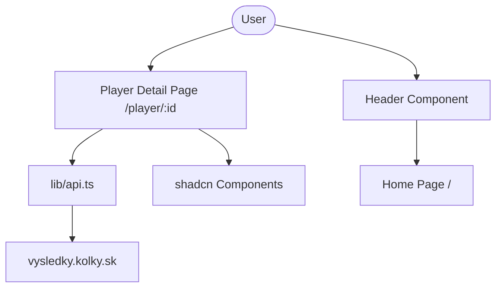

# Requirements

### Overview & Goals
The goal is to implement a detailed profile page for each player in the Interliga Podbrezová system. This page will display the player's personal information, summary of payments, and a detailed list of their match results.

### Scope
- **In Scope**:
  - Player detail page at `/player/[id]`.
  - Responsive header with navigation back to the home page.
  - Player profile section (Image, Name, Payments).
  - Detailed matches table with bowling statistics.
  - shadcn/ui integration for consistent design.
- **Out of Scope**:
  - Actual payment calculation logic (placeholders will be used).
  - Database integration (will continue using existing scraping API for now).

# Technical Design

### Current Implementation
- Data is fetched from `https://api.vysledky.kolky.sk` via `lib/api.ts`.
- The home page currently displays raw JSON for demonstration.
- The project uses Next.js 16 (App Router) and Tailwind CSS 4.

### Key Decisions
- **shadcn/ui**: Use the official CLI to initialize and add components for a professional look and feel.
- **Mobile-First**: Design the layout to be primary for mobile users, using vertical stacking that expands to more complex layouts on larger screens.
- **API Extension**: Extend the existing `getPlayerResults` call to include specific statistical fields (`full`, `clean`, `total`, `faults`) to avoid extra API calls.

### Proposed Changes
- **Files to Add**:
  - `components/layout/Header.tsx`: Shared header component.
  - `app/player/[id]/page.tsx`: Player detail page.
  - shadcn components in `components/ui/`.
- **Files to Modify**:
  - `app/layout.tsx`: To include the global header.
  - `lib/api.ts`: To enhance data fetching capabilities and define better types.

### Architecture Diagram

# Testing

### Validation Approach
- **Manual Verification**:
  - Verify that clicking the logo in the header redirects to `/`.
  - Ensure the player image and name are displayed correctly on the detail page.
  - Check that the matches table correctly lists all statistics.
- **Responsiveness**:
  - Test on mobile viewport (375px - 414px) to ensure no horizontal scrolling and proper stacking.
  - Test on desktop viewport (1024px+) to ensure proper alignment and spacing.
- **Quality Checks**:
  - Run `pnpm check` to ensure no linting or type errors.
  - Verify no `any` types are used in the new implementation.

# Delivery Steps

### ✓ Step 1: Initialize shadcn/ui and install components
Set up shadcn/ui in the project and add the necessary UI components.
- Run `npx shadcn@latest init`.
- Install `Table`, `Card`, `Avatar`, `Separator`, and `Button` components.
- Ensure Tailwind 4 compatibility and correct component paths.

### ✓ Step 2: Implement Global Header
Create a shared header component and integrate it into the root layout.
- Create `components/layout/Header.tsx` with a centered logo/text linking to `/`.
- Update `app/layout.tsx` to include the `Header` at the top of the page.
- Apply mobile-first responsive styles to the header.

### ✓ Step 3: Set up Player Detail Route and API Data Fetching
Create the player detail route and enhance the API client to fetch the required player data.
- Create the directory structure for `app/player/[id]/page.tsx`.
- Update `lib/api.ts` to include `full`, `clean`, `total`, and `faults` fields in `getPlayerResults`.
- Implement a `getPlayerDetail` function in `lib/api.ts` if needed to retrieve the player's name.

### ✓ Step 4: Build Player Detail UI and Matches Table
Implement the player profile section and the matches table.
- Build the player info card with the image (`/players/3009.JPG`), name, and payment placeholders.
- Render the matches table with Full, Clean, Total, and Faults columns using shadcn's `Table`.
- Ensure the layout is optimized for mobile devices first, then scaled for desktop.