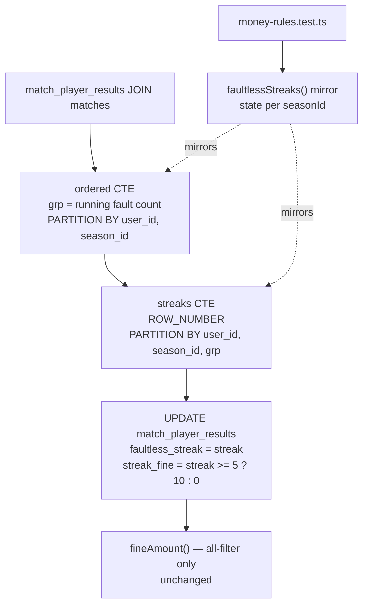

# Requirements

### Overview & Goals

The success gathering (10€ from the 5th consecutive faultless game on) is currently counted
across the player's whole history. Season 13 (2026/2027) has just opened, and a player who
finished season 12 on a run of clean games is already being charged in his second match of
the new season — the reported case: Petr Hendrych, 3 clean games carried over from season 12,
so match 2 of season 13 reads as streak 5 and lands a 10€ `streak_fine`.

Goal: the faultless streak restarts at every season boundary. It keeps crossing leagues
inside one season (Interliga, tournaments, cup), it just never crosses a season.

### Scope

**In Scope**
- The streak window in `recalculateDerivedFinancials()` (`lib/sync.ts`).
- The pure mirror `faultlessStreaks()` (`lib/money-rules.ts`) and its tests.
- Schema column comments that state the old rule (`lib/db/schema.ts`).
- The `rules` namespace and the player-detail streak strings in `locales/{sk,cs,hu,sr}.json`.
- The written rule: `AGENTS.md` (Money Calculation Rules, Codebase Invariants, Testing Rules)
  and both copies of `manage-match-results-and-payments/SKILL.md`.
- A one-off recalculation after deploy so stored rows are rewritten.

**Out of Scope**
- Any other money rule, threshold or league scope.
- `fineAmount()`'s "all filter only" gate for `streak_fine` — still correct: a streak still
  crosses leagues inside a season, so it still cannot be attributed to one league.
- The push `streakWarning` nudge (`lib/push-digest.ts`) — it reads the stored
  `faultless_streak` column and follows the new rule for free.
- Adding an `is_paid` guard to the player `UPDATE` (confirmed: keep the current behaviour,
  the recalculation rewrites every row).

### Functional Requirements

1. A player's faultless streak is counted only within one `matches.season_id`.
2. The first recorded game of a season, if faultless, is streak 1 — never a continuation.
3. A fault in the previous season does not offset the new season's count.
4. `streak_fine` is still 10€ from streak 5 on, still in its own column.
5. Rows whose match has `season_id IS NULL` form one bucket of their own.

# Technical Design

### Current Implementation

`lib/sync.ts:120-176`. Two windows, both partitioned by `mpr.user_id` only:

```sql
SUM(CASE WHEN COALESCE(mpr.faults, 0) <> 0 THEN 1 ELSE 0 END) OVER (
  PARTITION BY mpr.user_id
  ORDER BY COALESCE(m.date, '1970-01-01'), mpr.match_id
  ROWS UNBOUNDED PRECEDING
) AS grp
```

```sql
CASE WHEN COALESCE(faults, 0) = 0 THEN
  ROW_NUMBER() OVER (
    PARTITION BY user_id, grp ORDER BY COALESCE(date, '1970-01-01'), match_id
  ) - CASE WHEN grp = 0 THEN 0 ELSE 1 END
ELSE 0 END AS streak
```

`grp` is a running fault count, so one run of clean games shares a group; its row number is
the streak length, minus 1 for every group but the first (whose first row is a real game, not
a fault). Mirrored by `faultlessStreaks()` at `lib/money-rules.ts:127-141`.

`matches.season_id` (`lib/db/schema.ts:42`) already exists and is nullable; it is set from
`getSeasonAndLeagueConfig()` on scrape and straight from the form for manual matches.

### Proposed Changes

#### 1. Streak SQL (`lib/sync.ts`)

Add `m.season_id` to the `ordered` projection and to both `PARTITION BY` clauses. Replace the
hardcoded `5` / `10` in the `streak_fine` expression with the bound constants, the way
`TEAM_UNDER_LIMIT_FINE` is already bound on the line above.

```sql
ordered AS (
  SELECT mpr.match_id, mpr.user_id, mpr.total, mpr.faults, m.date, m.season_id,
         ...
         SUM(CASE WHEN COALESCE(mpr.faults, 0) <> 0 THEN 1 ELSE 0 END) OVER (
           PARTITION BY mpr.user_id, m.season_id
           ORDER BY COALESCE(m.date, '1970-01-01'), mpr.match_id
           ROWS UNBOUNDED PRECEDING
         ) AS grp
  ...
),
streaks AS (
  SELECT *,
    CASE WHEN COALESCE(faults, 0) = 0 THEN
      ROW_NUMBER() OVER (
        PARTITION BY user_id, season_id, grp
        ORDER BY COALESCE(date, '1970-01-01'), match_id
      ) - CASE WHEN grp = 0 THEN 0 ELSE 1 END
    ELSE 0 END AS streak
  FROM ordered
)
```

```sql
streak_fine = CASE WHEN s.streak >= ${STREAK_LENGTH} THEN ${STREAK_FINE} ELSE 0 END
```

Import `STREAK_FINE, STREAK_LENGTH` from `./money-rules` (`lib/sync.ts` already imports
`TEAM_UNDER_LIMIT_FINE` from there — extend that import, do not add a second one).

Rewrite the comment at `lib/sync.ts:121-122`: the last sentence becomes "Streaks restart each
season, so both windows partition by `season_id`."

`PARTITION BY` treats every `NULL season_id` as one value, satisfying requirement 5 without a
`COALESCE`.

#### 2. Pure mirror (`lib/money-rules.ts`)

`faultlessStreaks()` takes a `seasonId` per row and keeps one `(group, rowNumber)` state per
season, keyed rather than adjacency-based, so it mirrors `PARTITION BY` exactly even if the
input interleaves seasons.

```ts
export function faultlessStreaks(
  rows: { faults: number | null; seasonId: number | null }[],
): number[] {
  const perSeason = new Map<number | null, { group: number; rowNumber: number }>();

  return rows.map((row) => {
    const season = row.seasonId ?? null;
    const state = perSeason.get(season) ?? { group: 0, rowNumber: 0 };
    perSeason.set(season, state);

    if ((row.faults ?? 0) !== 0) {
      state.group += 1;
      state.rowNumber = 1;
      return 0;
    }
    state.rowNumber += 1;
    return state.group === 0 ? state.rowNumber : state.rowNumber - 1;
  });
}
```

Update the doc comment above it (`lib/money-rules.ts:121-126`): "ordered by date within one
season" and name the new `PARTITION BY user_id, season_id` pair it mirrors.

No other production caller exists — `derivePlayers()` receives a pre-computed `streakByUser`
map and is untouched.

#### 3. Schema comments (`lib/db/schema.ts:64-69`)

`// Counted across all seasons; 5+ triggers the success gathering.` becomes "Counted within
one season; 5+ triggers the success gathering." The `streak_fine` comment keeps its point
about leagues but drops "and seasons".

#### 4. Locales (`locales/{sk,cs,hu,sr}.json`)

Four keys per file, same line numbers in all four:

- `rules.player.fines[5].note` (L294) — "the streak counts across all competitions" becomes
  "across all competitions **within one season**; it restarts each new season".
- `rules.notes.items[0]` (L351) — keep the "kept separately / not in per-league sums"
  explanation, reword the "counted across all" clause to "across all competitions of the
  season".
- `playerDetail.fineReasons.streak` (L200) and `playerDetail.streakFinesHint` (L203) — same
  wording fix.

`locales/locales.test.ts` guards that the four files keep identical keys and placeholders, so
no key may be added to one file alone.

#### 5. Written rules

- `AGENTS.md` **Money Calculation Rules → Success Gathering** bullet: add that the count is
  per season and restarts at each season boundary.
- `AGENTS.md` **Codebase Invariants → Derived Money Fields**: replace
  "Faultless streaks are counted across **all** seasons, so the streak query is never filtered
  by season or league." with "Faultless streaks are counted **per season** (`matches.season_id`)
  but across leagues, so both streak windows partition by `user_id, season_id` and never by
  league." Also drop "and seasons" from the `streak_fine` bullet's "earned across competitions
  and seasons".
- `AGENTS.md` **Testing Rules → Required cases**: extend the faultless-streak bullet with the
  season-boundary case.
- `.claude/skills/manage-match-results-and-payments/SKILL.md:72` and the matching line in
  `.junie/skills/manage-match-results-and-payments/SKILL.md`: "the 5-game faultless streak"
  becomes "the 5-game faultless streak (counted per season)". Touch only that line — the two
  copies have drifted apart elsewhere and syncing them is out of scope.

### Architecture Diagram



### Key Decisions

- **Season boundary = `matches.season_id`**, not a date derived through
  `getSeasonIdForDate()`. The column is the source every other season-scoped query already
  uses, and it honours the season a manual match was filed under.
- **Keyed state, not adjacency, in the mirror.** `PARTITION BY` groups equal values wherever
  they sit in the ordering; a mirror that reset on "season changed since the previous row"
  would diverge the moment rows interleave.
- **No `is_paid` guard added** to the player `UPDATE` (confirmed). The SQL already rewrites
  paid rows; adding a guard would freeze every derived field on them and is a wider change
  than this fix.
- **Bind `STREAK_LENGTH` / `STREAK_FINE` into the SQL** instead of the literals `5` / `10`,
  so the constant and the mirror can never drift.

### Edge Cases / Risks

- **`season_id IS NULL`**: all such rows share one partition. No production rows are expected
  to be affected; the verification read confirms it.
- **Retroactive rewrite**: recalculation clears carried-over `streak_fine` on season-13 rows,
  including any already marked paid. Season 12 is the first season with data, so its rows do
  not change. Confirm the delta with the verification read before and after.
- **Streak within a season still crosses leagues**, so `fineAmount()`'s all-filter gate and
  the player-detail badge stay exactly as they are — do not "simplify" them into the league
  filter.
- **`push-digest.ts`**: `STREAK_WARNING_AT` fires on the transition into streak 4. After the
  recalculation a player whose streak dropped can legitimately re-enter 4 later and be nudged
  again. Intended.

# Delivery Steps

### Step 1: Partition the streak windows by season

`lib/sync.ts` — add `m.season_id` to the `ordered` projection, add it to both `PARTITION BY`
clauses, bind `STREAK_LENGTH` / `STREAK_FINE` into the `streak_fine` expression, extend the
existing `money-rules` import, rewrite the comment above the query.

### Step 2: Update the pure mirror

`lib/money-rules.ts` — `faultlessStreaks()` gains the `seasonId` field on its row type and
per-season state, doc comment updated to name the new partition.

### Step 3: Tests for the season boundary

`lib/money-rules.test.ts`, `describe('success gathering (faultless streak)')`:

- Add `seasonId` to every existing case (single season, results unchanged: `[1]`,
  `[1,2,3,4,5,6]`, `[1,2,0,1,2]`, `[0,1,2,3,4,5]`, `[1,2]`).
- **Regression for the reported bug**: 3 clean games in season 12 followed by 2 clean games in
  season 13 → `[1,2,3,1,2]`, and `streakFineFor` on every value is `0`.
- **Boundary 4 / 5 / 6 inside one season** still charges from the 5th: 6 clean season-13 rows
  → fines `[0,0,0,0,10,10]`.
- **Four clean in season 12 then one clean in season 13** → the season-13 row is streak 1, not
  5, and pays 0.
- **A fault in the previous season does not offset the new one**: `[{s12, faults: 3}, {s13,
  faults: 0}]` → `[0, 1]`.
- **`season_id: null` rows form their own bucket**, separate from numbered seasons.

### Step 4: Schema comments and written rules

`lib/db/schema.ts`, `AGENTS.md` (three places), both `SKILL.md` copies — as in Proposed
Changes 3 and 5.

### Step 5: Locale strings

`locales/{sk,cs,hu,sr}.json` — the four keys in Proposed Changes 4, all four languages.

### Step 6: Verify the mirror against real rows

Read-only, from the scratchpad, never committed to `scripts/` (AGENTS.md Testing Rules): read
season-12 and season-13 `match_player_results` joined to `matches`, run `faultlessStreaks()`
over them ordered by `(date, match_id)` per player, and compare with the stored
`faultless_streak` / `streak_fine` after the recalculation. Check Petr Hendrych's season-13
rows explicitly: match 2 of the season must read streak 2 and `streak_fine` 0. Note how many
rows have `season_id IS NULL`.

### Step 7: Recalculate stored rows

Trigger `recalculateDerivedFinancials()` once against the real database — the admin Sync
button, which also calls `updateSyncedData()` so the cached player/home reads are invalidated.
Cached reads live a week and are not refreshed by expiry, so skipping the invalidation leaves
the old amounts on screen.

### Step 8: Lint, type check, tests

`nvm use` (project pins Node 24; the shell default is 18), then `pnpm check`.

# Testing

### Validation Approach

- **`lib/money-rules.test.ts`** carries the whole money contract for this change — the test
  files and boundary cases are listed in Delivery Step 3. The season-boundary regression test
  is written first and must fail against the current mirror before Step 2 lands.
- **`lib/db-utils.test.ts`** must keep passing untouched: the `fineAmount()` all-filter gate
  is unchanged by this fix, and a change there would mean the league scope was broken.
- **`components/MatchFineTooltip.test.tsx`** must keep passing untouched: the per-match total
  is still `calculated_fine + streak_fine`.
- **`locales/locales.test.ts`** guards that the four locale files keep matching keys and
  placeholders after the wording change.
- **Manual flow**: open the player detail page for Petr Hendrych, season 13, league filter
  "all". His second match of the season must show no success-gathering badge, and the
  season-13 streak-fine total must drop by the carried-over 10€.
- **Final gate**: `pnpm check` (lint + type check + full test suite) with Node 24.
