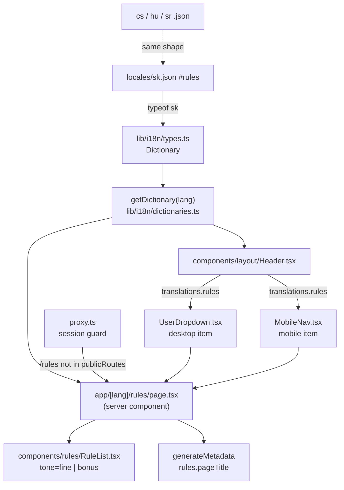

# Context

Players, the trainer, and admins currently have no place in the app that explains how the money is calculated. The rules only exist in `AGENTS.md` (prose, developer-facing) and in scattered tooltip fragments (`components/MatchFineTooltip.tsx`, `playerDetail.fineReasons.*`), which name a reason but never state the amount or the condition.

The goal is a single read-only reference page — `/[lang]/rules` — that lists every fine and every bonus, split into a **Player** block and a **Trainer** block, with fines and bonuses visually distinguished inside each block. It is reachable from the user-name dropdown (desktop) and the mobile menu, for every signed-in role.

Rules content is taken from the actual implementation in `lib/sync.ts:105-224` (`recalculateDerivedFinancials`), not from the `AGENTS.md` prose — the prose is stale on one point (see Key Decisions).

> **Note on plan location:** `AGENTS.md` requires plans at `.junie/plans/<slug>.md`. Plan mode only allows writing this file, so the first execution action is to copy this plan to `.junie/plans/fine-rules-page.md` before touching code.

# Requirements

### Overview & Goals

- A static, localized, mobile-first page listing all fines and bonuses.
- "Markdown-like" reading experience: heading hierarchy, rule lists with separators, monospace amount pills, a code-style block for the fault formula, muted note text. Rendered as React + Tailwind — **no** markdown parser, **no** `@tailwindcss/typography` (neither is installed).
- Content lives in `locales/*.json` as structured arrays so all four locales stay translatable and type-safe.

### Scope

**In Scope**
- New route `app/[lang]/rules/page.tsx` (server component) + per-page `generateMetadata`.
- New presentational component `components/rules/RuleList.tsx`.
- New `rules` namespace and `common.rules` key in `locales/{sk,cs,hu,sr}.json`.
- Nav link in `components/layout/UserDropdown.tsx` + `components/layout/MobileNav.tsx`, threaded through `components/layout/Header.tsx`.

**Out of Scope**
- Any change to the calculation logic in `lib/sync.ts` or `lib/db-utils.ts`.
- Making the page public — it stays behind the existing `proxy.ts` session guard (no change to `publicRoutes`).
- Admin responsibilities as a rules block (they are not money rules); the two admin-driven inputs are mentioned as footnotes instead.
- Rewriting the stale `AGENTS.md` "Money Calculation Rules" section (flagged below, not part of this change).

### User Stories

- As a player, I open the name dropdown, tap **Pravidlá pokút**, and see exactly what costs me 1 € vs 10 €, and what earns me 40 €.
- As a trainer, I see in one block everything I have to pay out and under which condition.
- As any user, I read it in my own language (sk / cs / hu / sr).
- As a mobile user, the whole page reads in a single column without horizontal scroll.

# Technical Design

### Current Implementation

- **Routing:** no root `app/layout.tsx`; `app/[lang]/layout.tsx:40-69` is the root layout (renders `<html>`, `ThemeProvider`, `Header`, `<main>`). A new `app/[lang]/rules/page.tsx` inherits it automatically.
- **Auth:** entirely proxy-level. `proxy.ts:31` `publicRoutes = ['/sign-in', '/sign-up']`; anything else needs a session (`proxy.ts:73-80`). So the new route is signed-in-only with zero code.
- **i18n:** `locales/sk.json` is the type source (`lib/i18n/types.ts:1-3` → `Dictionary = typeof sk`). Server components call `getDictionary(lang)` (`lib/i18n/dictionaries.ts:12`, `server-only`). Client components never import the dictionary — they receive a `translations` / `labels` prop bag (`components/layout/Header.tsx:16-27`).
- **Nav:** `UserDropdown.tsx:66-107` renders an admin-only block then Logout; `MobileNav.tsx:103-135` is its twin. Hrefs are raw template literals `` `/${lang}/...` `` — there is no locale-href helper.
- **Page styling convention:** module-level class constants, e.g. `app/[lang]/admin/matches/page.tsx:17-22` (`SECTION = 'rounded-2xl bg-surface p-4 sm:p-6 shadow-lift-lg'`, `SECTION_TITLE`, `MATCH_CARD = '... bg-surface-2 ...'`), wrapper `<div className="p-4 sm:p-8 space-y-6 sm:space-y-8 max-w-5xl mx-auto">`, `<h1 className="text-2xl sm:text-3xl font-bold">` + `<p className="text-muted-foreground">`.
- **UI primitives:** `components/ui/` on `@base-ui/react`. No `Badge`, no `Accordion` — `app/[lang]/admin/users/page.tsx:21` fakes a badge with a `BADGE` class constant. Follow that.

### Proposed Changes

#### 1. Translations (`locales/sk.json`, then `cs.json`, `hu.json`, `sr.json`)

Add `common.rules` (the nav label) and a new top-level `rules` namespace. Every list item must carry **exactly** the same three keys (`title`, `amount`, `note`) — a non-uniform object breaks `typeof sk` into a union and `item.note` stops type-checking. Use `""` for an absent note, never omit the key. For the same reason no list may be empty (`[]` infers `never[]`).

Slovak (source of truth, informal tone per `.claude/skills/translations/SKILL.md`):

```json
"common": {
  "rules": "Pravidlá pokút"
},
"rules": {
  "pageTitle": "Pravidlá pokút | Interliga Podbrezová",
  "pageDescription": "Prehľad pokút a bonusov pre hráčov a trénera.",
  "title": "Pravidlá pokút",
  "subtitle": "Ako sa počítajú pokuty a bonusy. Sumy sú za jeden zápas.",
  "finesLabel": "Pokuty",
  "bonusesLabel": "Bonusy",
  "player": {
    "title": "Hráč",
    "description": "Platí do tímovej banky, dostáva bonus za výkon.",
    "fines": [
      { "title": "Celkom pod 600", "amount": "1 €", "note": "Za každý zápas, v ktorom nahráš menej ako 600." },
      { "title": "Najhorší v tíme", "amount": "1 €", "note": "Najnižší celkový nához spomedzi hráčov, ktorí v zápase hrali." },
      { "title": "Chyby", "amount": "1 € + 2 € + 3 € …", "note": "Sčítava sa poradové číslo každej chyby." },
      { "title": "Špeciálne chyby", "amount": "5 €", "note": "Za každú chybu do plných a za každý vynechaný predposledný hod." },
      { "title": "Tím pod 3750", "amount": "10 €", "note": "Pre každého hráča, ktorý v zápase hral. Platí pre domáce zápasy Interligy a pre turnaje doma aj vonku. Presne 3750 je v pohode, trestá sa až menej." },
      { "title": "Úspešná zbierka", "amount": "10 €", "note": "Za 5. a každý ďalší zápas v rade bez chyby. Séria sa počíta naprieč všetkými súťažami." }
    ],
    "faultsFormulaLabel": "Ako rastú pokuty za chyby",
    "faultsFormula": [
      "1 chyba = 1 €",
      "2 chyby = 1 + 2 = 3 €",
      "3 chyby = 1 + 2 + 3 = 6 €",
      "n chýb = n × (n + 1) / 2"
    ],
    "bonuses": [
      { "title": "Celkom nad 700", "amount": "40 €", "note": "30 € z tímovej banky + 10 € od trénera." }
    ]
  },
  "trainer": {
    "title": "Tréner",
    "description": "Tréner neplatí žiadne pokuty. Tieto sumy vypláca tímu a hráčom.",
    "bonuses": [
      { "title": "Tím nad 3800", "amount": "10 €", "note": "" },
      { "title": "Tím nad 3900", "amount": "15 €", "note": "Nahrádza 10 € za 3800, nesčítava sa." },
      { "title": "Tím bez chyby", "amount": "10 €", "note": "Celý tím odohrá zápas bez jedinej chyby a hralo aspoň 6 hráčov." },
      { "title": "Hráč nad 700", "amount": "10 €", "note": "Za každého hráča, ktorý v zápase nahrá viac ako 700." }
    ]
  },
  "notes": {
    "title": "Poznámky",
    "items": [
      "Pokuta za úspešnú zbierku je vedená zvlášť. V sumách za jednotlivé súťaže ju nenájdeš, lebo sa počíta naprieč všetkými.",
      "Špeciálne chyby označuje admin ručne, po zápase.",
      "Zaplatené pokuty a bonusy sa spätným prepočtom už nemenia."
    ]
  }
}
```

Then mirror the identical key shape into `cs.json`, `hu.json`, `sr.json` with translated values. Key parity across the four files is currently perfect and must stay so.

#### 2. Rule list component (`components/rules/RuleList.tsx`)

Plain (non-`'use client'`) presentational component — no state, no hooks, so it stays a server component and needs no `translations` prop bag beyond its data.

```tsx
export interface RuleItem { title: string; amount: string; note: string }

interface RuleListProps {
  label: string;
  tone: 'fine' | 'bonus';
  items: readonly RuleItem[];
}
```

- Group header: a small uppercase label with a tone dot — `fine` uses `text-red-600 dark:text-red-400`, `bonus` uses `text-emerald-600 dark:text-emerald-400`, matching the existing money colours in `components/MatchFineTooltip.tsx:94-96`.
- Each item: two-line block — row 1 `title` (`font-medium`) pushed left, `amount` pill pushed right (`inline-flex items-center rounded-full bg-surface-2 px-2 py-0.5 text-xs font-bold tabular-nums`, mirroring `COUNT_PILL` in `admin/matches/page.tsx:19`); row 2 `note` in `text-sm text-muted-foreground`, rendered only when non-empty.
- Items separated by `divide-y divide-border` on the wrapping `<ul>` — the markdown "rule" feel.
- `key={item.title}` (titles are unique per list; no index keys, airbnb forbids them).

#### 3. Rules page (`app/[lang]/rules/page.tsx`)

Server component, same skeleton as `app/[lang]/admin/matches/page.tsx:29-61`:

```tsx
export async function generateMetadata({ params }: { params: Promise<{ lang: string }> }): Promise<Metadata> {
  const { lang } = await params;
  const dict = await getDictionary(lang as Locale);
  return { title: dict.rules.pageTitle, description: dict.rules.pageDescription };
}

export default async function RulesPage({ params }: { params: Promise<{ lang: string }> }) {
  const { lang: langParam } = await params;
  const dict = await getDictionary(langParam as Locale);
  const t = dict.rules;
  ...
}
```

Module-level style constants at the top (`SECTION`, `SECTION_TITLE`, `HASH`, `CODE_BLOCK`, `NOTE_ITEM`) following the admin-page convention. Structure, mobile-first single column:

1. Wrapper `<div className="p-4 sm:p-8 space-y-6 sm:space-y-8 max-w-3xl mx-auto w-full">`
2. `<h1>` `t.title` + `<p className="text-muted-foreground">` `t.subtitle`
3. **Player block** — `SECTION` card: `##`-style muted monospace prefix + `t.player.title`, `t.player.description`, then `<RuleList tone="fine" label={t.finesLabel} items={t.player.fines} />`, then the fault-formula code block (`t.player.faultsFormulaLabel` + `t.player.faultsFormula` lines in `font-mono text-xs rounded-lg bg-surface-2 p-3`), then `<RuleList tone="bonus" label={t.bonusesLabel} items={t.player.bonuses} />`.
4. **Trainer block** — same shell, `t.trainer.description` + a single `<RuleList tone="bonus" label={t.bonusesLabel} items={t.trainer.bonuses} />`.
5. **Notes block** — `t.notes.title` + `t.notes.items` as a muted `list-disc` list.

The `##` prefix (`<span className="font-mono text-muted-foreground mr-2">##</span>`) is what gives the page its markdown character without a parser.

#### 4. Navigation (`components/layout/Header.tsx`, `UserDropdown.tsx`, `MobileNav.tsx`)

- `Header.tsx`: add `rules: dict.common.rules` to the shared `translations` object (`:16-27`, feeds `MobileNav`) **and** to the inline `translations` literal passed to `UserDropdown` (`:54-63`).
- `UserDropdown.tsx`: add `rules: string` to the `translations` interface (`:28-37`); import `BookOpen` from `lucide-react`; insert **above** the admin block (`:67`) a `DropdownMenuItem` wrapping `<Link href={`/${lang}/rules`}>` with a `size-4 text-muted-foreground` icon, followed by `<DropdownMenuSeparator />`. The admin block keeps its own trailing separator, so admins see: Rules │ sep │ Users / Sync / Matches │ sep │ Logout; everyone else: Rules │ sep │ Logout.
- `MobileNav.tsx`: add `rules: string` to its `translations` interface (`:26-36`); render the same link inside the `user &&` block but **outside** the `user.role === 'admin'` gate (i.e. before the admin `<div>` at `:103`), reusing the existing link classes `flex items-center gap-2.5 p-2.5 text-sm rounded-lg border hover:bg-accent transition-colors font-medium`.

### Architecture Diagram



### Key Decisions

1. **Content source is `lib/sync.ts`, not the `AGENTS.md` prose.** The prose says the 3750 penalty applies to "Interliga home matches only". The code (`lib/sync.ts:119-133`) also penalises **tournaments home and away**, matching the Codebase Invariants section. The page states the code's behaviour. The stale prose paragraph should be fixed separately.
2. **Structured JSON over markdown files.** No markdown/MDX dependency exists and adding one would also require `@tailwindcss/typography`; four `.md` files per locale would also sit outside `Dictionary` and lose type-checking. Arrays in `sk.json` stay type-safe for free.
3. **Uniform item keys, no empty arrays.** Forced by `Dictionary = typeof sk`: a missing key produces a union type and an empty array produces `never[]`. Hence `"note": ""` and no `fines` key on `trainer`.
4. **Trainer block has bonuses only.** Everything the trainer owes is a payout; there is no trainer fine anywhere in `recalculateDerivedFinancials`. The block says so in its description rather than showing an empty "Fines" list.
5. **Dropdown placement over a header icon button.** The mobile header already holds brand + burger; the desktop right cluster already holds three controls. The dropdown costs no layout budget and matches how every other non-primary destination is reached.
6. **Signed-in only.** `publicRoutes` untouched — the rules concern team members, and opening a route publicly is a security-relevant change not implied by the request.

### Edge Cases / Risks

- **Locale key drift** — the four JSON files must be edited in lockstep; `pnpm type-check` catches a missing key in `sk` consumers but *not* a key missing from `cs`/`hu`/`sr` (they are `import()`ed as `Dictionary` and would fail at runtime with `undefined`). Verify by diffing key paths across the four files.
- **`faultsFormula` / `notes.items` are `string[]`** — keys must be the string itself; duplicated strings in one list would produce duplicate React keys. Keep every line unique.
- **Non-breaking long notes on 360px** — notes wrap; the amount pill must be `shrink-0` so a long title never squashes it.
- **Dropdown separator doubling** — inserting the rules item plus its separator above the admin block must not leave two adjacent separators for non-admins; the admin block's separator is inside the `isAdmin` branch, so it is safe as described.
- **Rule text vs. reality drift** — the page is hand-written prose about `lib/sync.ts` logic. Any future change to the calculation must update `locales/*.json` too; noted, not automated.

# Delivery Steps

### Step 1: Copy this plan to the repo
Write this plan to `.junie/plans/fine-rules-page.md` as required by `AGENTS.md`. Touches: `.junie/plans/fine-rules-page.md`.

### Step 2: Add the Slovak source strings
Add `common.rules` and the full `rules` namespace to `locales/sk.json` exactly as specified above. Touches: `locales/sk.json`.

### Step 3: Mirror the strings into the other three locales
Translate values into `locales/cs.json`, `locales/hu.json`, `locales/sr.json`, keeping key paths byte-identical to `sk.json`. Informal tone in all four. Verify parity by listing leaf key paths per file and diffing. Touches: `locales/{cs,hu,sr}.json`.

### Step 4: Build the rule list component
Create `components/rules/RuleList.tsx` with the `RuleItem` / `RuleListProps` contract and tone-based colouring. Touches: `components/rules/RuleList.tsx`.

### Step 5: Build the rules page
Create `app/[lang]/rules/page.tsx` with `generateMetadata`, the style constants, and the Player / Trainer / Notes blocks. Touches: `app/[lang]/rules/page.tsx`.

### Step 6: Wire the navigation
Thread `rules` through `Header.tsx` into `UserDropdown.tsx` and `MobileNav.tsx`, adding the `BookOpen` link in both. Touches: `components/layout/Header.tsx`, `components/layout/UserDropdown.tsx`, `components/layout/MobileNav.tsx`.

### Step 7: Quality check (mandatory)
Run `nvm use 22 && pnpm check` (`pnpm lint && pnpm type-check`). Zero airbnb violations, zero TS errors, no `any`.

# Testing

### Validation Approach

- **Static:** `pnpm lint` and `pnpm type-check` both clean (Step 7). Type-check specifically proves the `rules` namespace shape resolves — `t.player.fines[0].note` must not error.
- **Locale parity:** dump leaf key paths of all four `locales/*.json` and confirm the four lists are identical.
- **Manual, signed in as a player** (`nvm use 22 && pnpm dev`):
  - Open the name dropdown → **Pravidlá pokút** is the first item, above the separator; no admin items visible; clicking lands on `/sk/rules`.
  - Page shows: Player block with a red-toned Fines list (6 rows), the fault formula code block, a green-toned Bonuses list (1 row); Trainer block with a green-toned Bonuses list (4 rows) and the "no trainer fines" description; Notes block (3 bullets).
  - Browser tab title reads the localized `rules.pageTitle`.
- **Manual, signed in as an admin:** dropdown shows Rules │ separator │ Manage users / Sync / Manual matches │ separator │ Logout — exactly one separator between groups.
- **Mobile (375px viewport / real device):** burger menu shows the Rules link for every role; page body has no horizontal scroll; amount pills stay on the same line as their title.
- **Locales:** switch via the language switcher on `/sk/rules` — URL becomes `/cs/rules`, `/hu/rules`, `/sr/rules` and all content is translated with no `undefined` text.
- **Auth:** open `/sk/rules` in a logged-out private window → redirected to `/sk/sign-in`.
- **Themes:** toggle light/dark — tone colours and `bg-surface` / `bg-surface-2` cards both legible.
