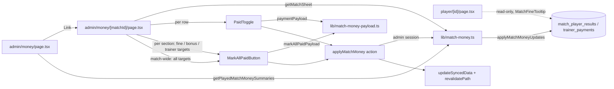

# Requirements

### Feasibility verdict

**Yes — this is straightforward.** Everything below the UI already exists:

- The flags live on `match_player_results.is_paid`, `match_player_results.is_bonus_paid` and `trainer_payments.is_paid` (`lib/db/schema.ts`).
- `applyMatchMoneyUpdates(matchId, updates)` in `lib/match-money.ts` already performs a guarded read-modify-write of exactly these flags (bonus guard: cannot mark a 0 € bonus paid; row-ownership checks; no recalculation when only flags change). Today its only caller is the CLI `scripts/match-money.ts`.
- Its doc comment explicitly anticipates an in-app caller: *"an in-app caller calls `updateSyncedData()`"*.
- The server-action + error-code + `revalidatePath` + `updateSyncedData()` pattern is established in `lib/admin-actions.ts` and `lib/bank-withdrawal-actions.ts`; the inline admin button pattern in `app/[lang]/admin/users/ApproveUserButton.tsx`; the confirm-dialog pattern in `app/[lang]/withdrawals/DeleteWithdrawalButton.tsx`.
- Admin routes are already gated by `proxy.ts` (`/admin/*` → admin only) and every action re-checks `getSession()`.

No schema change, no money-rule change, no change to `recalculateDerivedFinancials()`.

### Follow-up (round 2)

Steps 1–5 shipped. The user then asked for two changes, covered by **Steps 6–7** below:

1. **Remove the inline toggle from the player detail table** — all settling happens on the admin money pages.
2. **Add a match-wide button on the sheet** — *"Označiť všetko ako zaplatené"* settles player fines, player bonuses **and** trainer payments of the match in **one** `applyMatchMoney` call. The three per-section bulk buttons stay (user choice); the global button lives in the header card under the totals strip (user choice).

### Follow-up (round 3) — card redesign, no logic changes

Steps 1–7 shipped. The user then asked for a **visual** pass over the money-sheet cards, covered by **Steps 8–10** below:

1. **Button reads the action, not the state.** Today the toggle shows *Nezaplatené* on an unpaid row and paying means tapping a button that says "unpaid". After: an unpaid row shows a status pill *Nezaplatené* and a primary button **Zaplatiť**; a paid row shows the pill *Zaplatené* and a quiet **Vrátiť** button that reverses it. (sk Zaplatiť / Vrátiť, cs Zaplatit / Vrátit, hu Kifizetés / Visszavonás, sr Plati / Vrati.)
2. **Card layout "avatar + amount rows"** (user choice): header with `PlayerAvatar` (photo or initials), name and dashboard-style *Celkom* / *Chyby* stat tiles; below, one row per amount (*Pokuta*, *Bonus*) with the € sum, the status pill and the action button at the right edge.
3. **Extras** (all chosen): a **bonus-only card** in the *Bonusy* section instead of repeating the full player card; **player photos** via `PlayerAvatar` (players by `external_player_id`, trainers by `users.id`); **unpaid rows first** inside every section.

No change to payloads, the server action, `applyMatchMoneyUpdates()`, or any money module — the sheet keeps issuing exactly the same calls.

### Overview & Goals

Let an admin settle match money from the phone instead of the CLI: flip **player fines**, **player bonuses** and **trainer payments** between paid/unpaid per match on a per-match admin "money sheet" with per-row toggles, per-section *mark all paid* buttons and one match-wide *mark everything paid* button. The player detail page stays read-only.

### Scope

**In Scope**
- New server action `applyMatchMoney()` wrapping `applyMatchMoneyUpdates()` (admin-only, error codes, cache invalidation).
- ~~Player detail page (`/[lang]/player/[id]`): admin-only paid/unpaid toggle next to each match fine (fine > 0).~~ **Reverted in Step 6** — the page goes back to its pre-feature state (no session read, no `userId` column).
- New admin section: `/[lang]/admin/money` (played matches with unpaid totals, season/league filter) and `/[lang]/admin/money/[matchId]` (sheet: every player's fine + bonus, every trainer payment, per-row toggles, per-section *mark all paid*, **match-wide *mark everything paid*** — Step 7).
- Menu entries in `UserDropdown` and `MobileNav` (admin block).
- Locale keys in all four files (`sk`, `cs`, `hu`, `sr`).
- Unit tests for the new pure helper, the action, and the money-displaying client components.
- Doc sync: `.junie/skills/manage-match-results-and-payments/SKILL.md` no longer claims the CLI is the only write path; AGENTS.md invariant note gains the in-app caller.

**Out of Scope**
- Entering special misses (full / 2nd-to-last) from the app — stays CLI-only (would require the misses-first ordering gotcha to be handled in UI).
- Push notifications when a flag flips (the CLI's `--notify` is opt-in; can be a follow-up).
- Any change to `lib/sync.ts`, `lib/money-rules.ts`, thresholds, or the `rules` locale namespace — no calculation changes.
- Any admin control on the player detail page (round 2 decision: everything is managed from `/admin/money`).
- A match-wide *mark everything unpaid* — undo stays per row / per section.
- Global button on the list page cards (settling requires opening the sheet, where the amounts are visible).
- Playwright / end-to-end tests.

### User Stories

- As an admin on payday, I open *Pokuty a platby* → the last home match → tap *Označiť všetko ako zaplatené* in the header, confirm a dialog that lists the three unpaid amounts, and every fine, bonus and trainer payment of that match is settled in **one** write; all three total chips turn green.
- As an admin who collected only the fines so far, I tap *Označiť všetky ako zaplatené* under player fines only; bonuses and trainer payments stay open.
- As an admin on a player's page, I only *see* which match fines are paid (green) — there is no control there; I settle from the admin sheet.
- As an admin, I mis-tapped: I tap the same toggle again and the row is unpaid again, no CLI needed.
- As an admin, I try to mark a bonus paid for a player who earned none: the button is not rendered (0 €), and if it somehow reaches the server I see a localized error, not a crash.
- As a player or trainer, nothing changes for me: the toggles are never rendered and the action returns `unauthorized`.

### Functional Requirements

- Toggle is reversible: paid ↔ unpaid with one tap, no confirm dialog; the bulk action is behind an `AlertDialog` confirm that stays open on failure.
- Toggle is rendered only when there is money to settle: fine toggle when `calculatedFine + streakFine > 0`; bonus toggle when `bonusReceived > 0`; trainer toggle per `trainer_payments` row.
- Bulk button is disabled when the section has nothing unpaid; it sends **one** `applyMatchMoney` call with all unpaid rows.
- Match-wide button (header card, under the totals strip, full-width on mobile) is disabled when `fines_unpaid + bonuses_unpaid + trainer_unpaid === 0`; its confirm dialog shows the three unpaid amounts; on confirm it sends **one** `applyMatchMoney` call whose payload merges fine + bonus flags per player and appends every unpaid trainer row.
- **(Round 3)** Every amount row shows a status pill (*Zaplatené* green / *Nezaplatené* red) **and** an action button whose visible text is the verb: *Zaplatiť* (primary) when unpaid, *Vrátiť* (ghost, `Undo2` icon) when paid. The button's accessible name is that verb.
- **(Round 3)** Player card header: avatar (photo when mapped in `lib/player-images.ts`, initials otherwise), name, *Celkom* and *Chyby* stat tiles. Trainer card header: avatar + trainer name + localized condition. The *Bonusy* section renders a bonus-only card (avatar, name, *Celkom*, bonus row) — no fine row, no *Chyby* tile.
- **(Round 3)** Within each section rows with something still open come first (`!is_paid && owed > 0` / `!is_bonus_paid` / `!isPaid`), then by name (`localeCompare(lang)`).
- Player detail page renders exactly as before the feature: `MatchFineTooltip` alone in the fine cell, no session lookup.
- After a successful write the page shows fresh numbers without a manual reload (server action revalidates the page; `updateSyncedData()` drops the week-long caches so dashboard/player totals agree).
- Mobile-first: the sheet is a list of cards (player name, total, faults, fine with reasons, bonus, two toggles), not a wide table; trainer payments are a second card list; totals pill at the top.
- All strings localized; competition names via `leagueLabelForId`; trainer `condition_type` labelled via a new `admin.money.conditions.*` map.

### Non-Functional Requirements

- No `any`; Airbnb lint clean; `pnpm check` green.
- No `'use client'` file imports anything whose graph reaches `lib/db.ts` — payload types move to a db-free module.
- One toggle = one `applyMatchMoneyUpdates` call = zero recalculations (flags only).

# Technical Design

### Current Implementation

| Piece | Where | Notes |
|---|---|---|
| Flags | `lib/db/schema.ts` `matchPlayerResults.isPaid / isBonusPaid`, `trainerPayments.isPaid` | already exist |
| Write path | `lib/match-money.ts` `applyMatchMoneyUpdates(matchId, { players?, trainerPayments? })` | guards, diff, recalculates only if miss counts changed; **does not** invalidate |
| Sheet read | `lib/match-money.ts` `getMatchSheet(matchId)` → `MatchSheet { match, players, trainer_payments, totals }` | reuse as-is for the sheet page |
| Played matches | `lib/special-misses.ts` `getPlayedMatches()` | no unpaid totals; CLI does N `getMatchSheet` calls |
| Player page | `app/[lang]/player/[id]/page.tsx` | server component, no session read, `PlayerMatchResult` has no `userId` |
| Fine cell | `components/MatchFineTooltip.tsx` | shows `calculatedFine + streakFine`, paid colour |
| Action pattern | `lib/admin-actions.ts`, `lib/bank-withdrawal-actions.ts` | `getSession()` admin check → try/catch → `updateSyncedData()` + `revalidatePath()` → `{ success, error }` |
| Button patterns | `ApproveUserButton.tsx` (inline, error under button), `DeleteWithdrawalButton.tsx` (AlertDialog, stays open on error) | |
| Admin nav | `components/layout/UserDropdown.tsx`, `MobileNav.tsx`, translations built in `components/layout/Header.tsx` from `dict.common` | |
| Errors → text | `Record<ErrorCode, string>` from `dict.admin.*.errors` | |

### Key Decisions

1. **One generic server action** `applyMatchMoney(matchId, updates)` (user choice). It is a thin, admin-gated adapter over `applyMatchMoneyUpdates()`; the single toggle, the bulk button and both pages use it. Rationale: the guarded diff logic already lives in `lib/match-money.ts`; duplicating it per flag would fork the money path.
2. **Two routes** `/admin/money` and `/admin/money/[matchId]` (user choice). Back button returns to the list; the sheet page stays short on a phone.
3. **Bulk *mark all paid* per section** behind an AlertDialog (user choice); builds one payload from the unpaid rows and issues one call.
4. **Payload types move to a db-free module** `lib/match-money-payload.ts`. `lib/match-money.ts` imports `db`, so a `'use client'` toggle may not import even a type from it (Client/Server Boundary invariant). `lib/match-money.ts` re-exports the types so the CLI keeps compiling.
5. **`MatchMoneyError` gains a `code`** so the action can map guard failures (`noBonus`, `notFound`) to localized messages instead of leaking English strings. Default `'unknown'` keeps existing `throw new MatchMoneyError(msg)` sites valid.
6. **Player page gets `userId` per result row** (`u.id::text AS user_id` added to `getPlayerMatchResultsByExternalId`) rather than resolving the external id inside the action — the row is keyed `(match_id, user_id)` and the action stays a pure pass-through.
7. **No optimistic state.** Like `ApproveUserButton`, the toggle shows a spinner and relies on the server action's `revalidatePath` to re-render the page with the stored value; that keeps the displayed flag equal to the database.
8. **List page aggregates in SQL** (`getPlayedMatchMoneySummaries`) instead of the CLI's N×`getMatchSheet`; filtered by `?season=`/`?league=` via the existing `SeasonLeagueFilter` + `leagueCondition()`.
9. **(Round 2) Player page reverted, not just hidden.** Decision 6 is withdrawn: `PaidToggle`, `getSession()` and the `userId` column are removed from `app/[lang]/player/[id]/page.tsx` / `lib/db-utils.ts` rather than gated off, so the public page carries no dead admin plumbing and `PlayerMatchResult` matches `HEAD` again. `revalidatePath('/[lang]/player/[id]')` stays in the action because that page still *displays* the paid colour.
10. **(Round 2) Match-wide button reuses `MarkAllPaidButton` + `markAllPaidPayload`.** `markAllPaidPayload()` already merges `fine` + `bonus` targets of the same user into one `PlayerMoneyUpdate` and appends trainer rows (covered by `MarkAllPaidButton.test.tsx` "sends one merged payload"), so the global button is the same component fed `[...fineTargets, ...bonusTargets, ...trainerTargets]`. No new action, no new payload helper — one write, zero recalculation. The component only gains `variant` / `className` props so the global instance can be primary and full-width on mobile.
11. **(Round 2) Per-section buttons stay** (user choice) so a partial payday (fines collected, bonuses not yet handed out) is still one tap per section.
12. **(Round 3) Status pill lives inside `PaidToggle`, next to the button.** The component already receives `labels.paid / unpaid / markPaid / markUnpaid` and `isPaid`; rendering `[pill][button]` there keeps both cards and all existing tests on the same props — only the *values* of `markPaid` / `markUnpaid` change in the locale files (verb instead of "Označiť ako …"). No key rename, so nothing else that reads `admin.money` moves.
13. **(Round 3) External player ids are looked up in the page, not added to the money modules.** `lib/special-misses.ts` and `lib/match-money.ts` are on the mandatory-test list and have no meaningful unit test for a new select column; the sheet page instead runs one `db.select({ id, externalPlayerId }).from(users).where(inArray(users.id, …))` (the pattern `app/[lang]/admin/users/page.tsx` already uses) and merges the result into the card props. `MatchSheet`, `MatchPlayerResult`, the CLI and `getMatchSheet` stay byte-identical.
14. **(Round 3) Bonus-only card is a `rows` prop on `PlayerMoneyCard`, not a new component.** `rows?: ReadonlyArray<'fine' | 'bonus'>` (default both) drives which amount rows and stat tiles render; the *Bonusy* section passes `['bonus']`. One card, one test file, one set of labels.
15. **(Round 3) Unpaid-first ordering is a pure comparator in the page.** `openFirst(isOpen)(a, b)` sorts by `Number(isOpen(b)) - Number(isOpen(a))`, then `user_name.localeCompare(lang)`; the `*Targets` arrays are unaffected (order inside a payload is irrelevant).

### Proposed Changes

#### 1. Db-free payload module (`lib/match-money-payload.ts`, new)

```ts
export interface PlayerMoneyUpdate { userId: string; fullFaults?: number; secondToLastFaults?: number; isPaid?: boolean; isBonusPaid?: boolean; }
export interface TrainerPaymentUpdate { id: number; isPaid: boolean; }
export interface MatchMoneyUpdates { players?: PlayerMoneyUpdate[]; trainerPayments?: TrainerPaymentUpdate[]; }

export type PaymentTarget =
  | { kind: 'fine'; userId: string }
  | { kind: 'bonus'; userId: string }
  | { kind: 'trainer'; paymentId: number };

/** One toggle → one-entry payload. */
export function paymentPayload(target: PaymentTarget, isPaid: boolean): MatchMoneyUpdates;

/** Bulk button → every unpaid row of one section in a single payload. */
export function markAllPaidPayload(targets: PaymentTarget[]): MatchMoneyUpdates;
```

`lib/match-money.ts` deletes its three local interfaces and does `export type { PlayerMoneyUpdate, TrainerPaymentUpdate, MatchMoneyUpdates } from './match-money-payload';` (keeps `scripts/match-money.ts` untouched).

#### 2. Error codes on `MatchMoneyError` (`lib/match-money.ts`)

```ts
export type MatchMoneyErrorCode = 'notFound' | 'noBonus' | 'invalid' | 'unknown';
export class MatchMoneyError extends Error {
  constructor(message: string, readonly code: MatchMoneyErrorCode = 'unknown') { super(message); }
}
```

Existing throws get their code: no match → `'notFound'`; user has no result row / trainer payment not in match → `'notFound'`; bonus guard → `'noBonus'`; non-negative-integer assert → `'invalid'`.

Add the list query in the same file:

```ts
export interface PlayedMatchMoneySummary {
  externalId: number; date: string | null; opponent: string | null; isHome: boolean | null;
  leagueId: number | null; leagueName: string | null;
  teamTotalScore: number | null; opponentTotalScore: number | null;
  finesUnpaid: number; bonusesUnpaid: number; trainerUnpaid: number;
}
export async function getPlayedMatchMoneySummaries(seasonId: number, leagueKey: string): Promise<PlayedMatchMoneySummary[]>
```

SQL (neon `sql` from `./db`, `leagueCondition` from `./db-utils`):

```sql
SELECT m.external_id, m.date, m.opponent, m.is_home, m.league_id, m.league_name,
       m.team_total_score, m.opponent_total_score,
       COALESCE((SELECT SUM(mpr.calculated_fine + COALESCE(mpr.streak_fine,0)) FROM match_player_results mpr
                 WHERE mpr.match_id = m.external_id AND NOT mpr.is_paid), 0) AS fines_unpaid,
       COALESCE((SELECT SUM(mpr.bonus_received) FROM match_player_results mpr
                 WHERE mpr.match_id = m.external_id AND NOT mpr.is_bonus_paid), 0) AS bonuses_unpaid,
       COALESCE((SELECT SUM(tp.amount) FROM trainer_payments tp
                 WHERE tp.match_id = m.external_id AND NOT tp.is_paid), 0) AS trainer_unpaid
FROM matches m
WHERE m.season_id = ${seasonId} AND m.team_total_score IS NOT NULL ${leagueCondition(leagueKey)}
ORDER BY m.date DESC
```

(Per-match sums are safe to include `streak_fine`: inside one match row the whole `calculated_fine + streak_fine` is owed and settled by the single `is_paid`.)

#### 3. Server action (`lib/match-money-actions.ts`, new, `'use server'`)

```ts
export type MatchMoneyActionError = 'unauthorized' | 'notFound' | 'noBonus' | 'invalid' | 'unknown';
export type MatchMoneyActionResult = { success: true } | { success: false; error: MatchMoneyActionError };

export async function applyMatchMoney(matchId: number, updates: MatchMoneyUpdates): Promise<MatchMoneyActionResult> {
  const session = await getSession();
  if (session?.user.role !== 'admin') return { success: false, error: 'unauthorized' };
  try {
    await applyMatchMoneyUpdates(matchId, updates);
    updateSyncedData();                                   // player-balance, player-match-results, home-data
    revalidatePath('/[lang]/admin/money', 'page');
    revalidatePath('/[lang]/admin/money/[matchId]', 'page');
    revalidatePath('/[lang]/player/[id]', 'page');
    return { success: true };
  } catch (error) {
    if (error instanceof MatchMoneyError) return { success: false, error: error.code };
    console.error('Failed to apply match money:', error);
    return { success: false, error: 'unknown' };
  }
}
```

`personalPushes` returned by `applyMatchMoneyUpdates` are ignored: flag flips never change miss counts, so the array is always empty here.

#### 4. Client toggles (`components/money/`, new)

- `PaidToggle.tsx` (`'use client'`): props `{ matchId, target: PaymentTarget, isPaid, labels: { paid, unpaid, markPaid, markUnpaid }, errors: Record<MatchMoneyActionError,string>, size?: 'sm' | 'xs' }`. Renders a `Button` (`variant={isPaid ? 'outline' : 'default'}`) with `Check`/`Undo2` icon and `aria-label` = markPaid/markUnpaid; on click `startTransition(() => applyMatchMoney(matchId, paymentPayload(target, !isPaid)))`; spinner while pending; error text under the button like `ApproveUserButton`.
- `MarkAllPaidButton.tsx` (`'use client'`): props `{ matchId, targets: PaymentTarget[], label, title, description, translations: { cancel, confirm, errors } }`; disabled when `targets.length === 0`; AlertDialog copied from `DeleteWithdrawalButton` (stays open on error), confirm calls `applyMatchMoney(matchId, markAllPaidPayload(targets))`.
- `PlayerMoneyCard.tsx` (server-safe, no hooks): one card per `MatchPlayerResult` — name, `total`, `faults`, fine `calculated_fine + streak_fine` € with `MatchFineTooltip`-style colour, bonus `bonus_received` €, and the two `PaidToggle`s (rendered only when the amount > 0).
- `TrainerPaymentCard.tsx`: trainer name, localized condition label (`admin.money.conditions[conditionType]`, `TrainerConditionType` from db-free `lib/money-rules.ts`), amount, `PaidToggle` with `{ kind: 'trainer', paymentId }`.

#### 5. Admin list page (`app/[lang]/admin/money/page.tsx`, new)

Server component, layout copied from `app/[lang]/admin/matches/page.tsx` (SECTION / MATCH_CARD / COUNT_PILL classes). Reads `?season=`/`?league=` like the player page, renders `SeasonLeagueFilter`, then `getPlayedMatchMoneySummaries(seasonId, leagueKey)`. Each card: date · league label, home/away label via `dict.playerDetail.matchHome/Away`, score, three amount chips (fines / bonuses / trainer unpaid, red when > 0, muted when 0), whole card is a `Link` to `/${lang}/admin/money/${externalId}`. Empty state string when no played matches.

#### 6. Admin sheet page (`app/[lang]/admin/money/[matchId]/page.tsx`, new)

Server component: parse `matchId`, `getMatchSheet(matchId)` (catch `MatchMoneyError` → `notFound()`). Header: match label, date, score, back link to the list. Totals strip from `sheet.totals` (`fines_unpaid / fines`, `bonuses_unpaid / bonuses`, `trainer_unpaid / trainer`). Section *Pokuty hráčov*: `MarkAllPaidButton` (targets = players with `!is_paid && owed > 0`, kind `'fine'`) + `PlayerMoneyCard` list sorted by name. Section *Bonusy*: `MarkAllPaidButton` (kind `'bonus'`, players with `bonus_received > 0 && !is_bonus_paid`). Section *Platby trénerov*: `MarkAllPaidButton` (kind `'trainer'`) + `TrainerPaymentCard` list; empty-state text when the match has no trainer rows.

#### 7. Player detail page (`app/[lang]/player/[id]/page.tsx`, `lib/db-utils.ts`) — **superseded by #10**

- ~~`lib/db-utils.ts`: add `u.id::text AS user_id` to the SELECT in `getPlayerMatchResultsByExternalId` and `userId: string` to `PlayerMatchResult`.~~
- ~~Page: add `getSession()` to the `Promise.all`, render `PaidToggle` next to `MatchFineTooltip` when `isAdmin && calculatedFine + streakFine > 0`.~~

Shipped in Step 5, removed again in Step 6 (see #10).

#### 8. Navigation & locales

- `locales/{sk,cs,hu,sr}.json`: `common.matchMoney` (menu label, sk *"Pokuty a platby"*); new `admin.money` namespace: `title`, `description`, `listTitle`, `empty`, `finesUnpaid`, `bonusesUnpaid`, `trainerUnpaid`, `playersTitle`, `bonusesTitle`, `trainerTitle`, `noTrainerPayments`, `paid`, `unpaid`, `markPaid`, `markUnpaid`, `markAllPaid`, `markAllPaidTitle`, `markAllPaidDescription`, `confirm`, `backToList`, `total`, `faults`, `fine`, `bonus`, `conditions.{score_bonus,zero_faults,elite_player,clean_sweep}`, `errors.{unauthorized,notFound,noBonus,invalid,unknown}`. Same keys and placeholders in all four files (`locales.test.ts` enforces).
- `components/layout/Header.tsx`: add `matchMoney: dict.common.matchMoney` to both translation objects; `UserDropdown.tsx` and `MobileNav.tsx`: add the prop and an admin `Link` to `/${lang}/admin/money` with the `Coins` lucide icon next to *manualMatches*.

#### 9. Docs

- `.junie/skills/manage-match-results-and-payments/SKILL.md`: replace *"There is no admin UI for these fields; this driver is the only write path"* with a note that paid flags can also be flipped in-app under *Pokuty a platby*, misses remain CLI-only.
- `AGENTS.md` / `CLAUDE.md` Derived Money Fields invariant: name `lib/match-money-actions.ts` as the in-app caller that owns `updateSyncedData()`.

#### 10. (Round 2) Revert the player-page toggle (`app/[lang]/player/[id]/page.tsx`, `lib/db-utils.ts`)

Restore both files to their `HEAD` shape for these hunks (`git diff HEAD -- "app/[lang]/player/[id]/page.tsx" lib/db-utils.ts` shows exactly what to undo):

- `app/[lang]/player/[id]/page.tsx`: drop the `PaidToggle` and `getSession` imports; drop `session` from the `Promise.all` and the `isAdmin` const; drop `toggleLabels`; drop `showFineToggle`; in the fine `TableCell` render `<MatchFineTooltip … />` directly again (no wrapping `div.flex`). Result: the page reads no session and imports nothing from `components/money/`.
- `lib/db-utils.ts`: remove `userId: string` from `PlayerMatchResult`, `u.id::text AS user_id` from the SELECT in `getPlayerMatchResultsByExternalId`, and `userId: String(r.user_id)` from the mapper. Nothing else reads `PlayerMatchResult.userId` (grep confirms only the player page did).
- `lib/match-money-actions.ts`: **keep** `revalidatePath('/[lang]/player/[id]', 'page')` — the page still shows the paid colour via `MatchFineTooltip`; the action test's three-path assertion stays unchanged.
- `components/money/PaidToggle.tsx` keeps its `size?: 'sm' | 'xs'` prop (harmless; `PlayerMoneyCard` uses it).

#### 11. (Round 2) Match-wide button on the sheet (`app/[lang]/admin/money/[matchId]/page.tsx`, `components/money/MarkAllPaidButton.tsx`)

`components/money/MarkAllPaidButton.tsx` — two optional props, defaults keep the three section buttons pixel-identical:

```ts
export interface MarkAllPaidButtonProps {
  matchId: number;
  targets: PaymentTarget[];
  label: string;
  title: string;
  description: string;
  variant?: 'default' | 'outline';   // default 'outline' (sections); 'default' for the global one
  className?: string;                 // e.g. 'w-full sm:w-auto' for the global one
  translations: { cancel: string; confirm: string; errors: Record<MatchMoneyActionError, string> };
}
// trigger: <Button variant={variant} size="sm" className={className} disabled={targets.length === 0}>
```

`app/[lang]/admin/money/[matchId]/page.tsx` — after the existing `fineTargets` / `bonusTargets` / `trainerTargets`:

```tsx
const allTargets: PaymentTarget[] = [...fineTargets, ...bonusTargets, ...trainerTargets];

// inside the header <div className={SECTION}>, directly after the totals grid:
<div className="mt-4">
  <MarkAllPaidButton
    matchId={matchId}
    targets={allTargets}
    variant="default"
    className="w-full sm:w-auto"
    label={t.markMatchPaid}
    title={t.markMatchPaidTitle}
    description={interpolate(t.markMatchPaidDescription, {
      fines: totals.fines_unpaid,
      bonuses: totals.bonuses_unpaid,
      trainer: totals.trainer_unpaid,
    })}
    translations={bulkTranslations}
  />
</div>
```

`markAllPaidPayload(allTargets)` yields e.g. `{ players: [{ userId:'u1', isPaid:true, isBonusPaid:true }, { userId:'u2', isPaid:true }], trainerPayments: [{ id:8, isPaid:true }, { id:9, isPaid:true }] }` — one `applyMatchMoneyUpdates` call, flags only, so no recalculation and no risk to paid amounts. `allTargets.length === 0` ⇔ every total chip is already green, and the button is disabled in exactly that case.

#### 12. (Round 2) Locale keys & docs

- `locales/{sk,cs,hu,sr}.json` → `admin.money` gains three keys with identical placeholders `{fines}`, `{bonuses}`, `{trainer}` in the description:

| key | sk | cs | hu | sr |
|---|---|---|---|---|
| `markMatchPaid` | Označiť všetko ako zaplatené | Označit vše jako zaplacené | Az egész meccs megjelölése kifizetettként | Označi ceo meč kao plaćen |
| `markMatchPaidTitle` | Označiť celý zápas ako zaplatený? | Označit celý zápas jako zaplacený? | Az egész meccset kifizetettként jelölöd? | Označiti ceo meč kao plaćen? |
| `markMatchPaidDescription` | Pokuty hráčov {fines} €, bonusy {bonuses} € a platby trénerov {trainer} € sa označia ako zaplatené v jednej dávke. Jednotlivé položky vieš kedykoľvek vrátiť späť. | Pokuty hráčů {fines} €, bonusy {bonuses} € a platby trenérů {trainer} € se označí jako zaplacené v jedné dávce. Jednotlivé položky můžeš kdykoliv vrátit zpět. | A játékosbüntetések ({fines} €), a bónuszok ({bonuses} €) és az edzői befizetések ({trainer} €) egy lépésben kifizetettként lesznek megjelölve. Az egyes tételeket bármikor visszavonhatod. | Kazne igrača {fines} €, bonusi {bonuses} € i uplate trenera {trainer} € biće označeni kao plaćeni odjednom. Pojedinačne stavke možeš uvek vratiti. |

  `locales/locales.test.ts` enforces key and placeholder parity, so all four move together.
- `AGENTS.md` Derived Money Fields invariant: change *"behind the `/admin/money` sheet and the player-page fine toggle"* to *"behind the `/admin/money` sheet"*. `CLAUDE.md` is `@AGENTS.md`.
- `.junie/skills/manage-match-results-and-payments/SKILL.md` **and** `.claude/skills/manage-match-results-and-payments/SKILL.md` (diverging copies, both mention the toggle): drop *"plus a fine toggle on each player's page"*, mention the per-section and match-wide *mark all paid* buttons on the sheet.

#### 13. (Round 3) `PaidToggle` → status pill + verb button (`components/money/PaidToggle.tsx`)

Props unchanged (`matchId`, `target`, `isPaid`, `labels`, `errors`, `size`). Render:

```tsx
const PILL = 'inline-flex shrink-0 items-center rounded-full px-2 py-0.5 text-[11px] font-semibold';
const PILL_TONE = {
  paid: 'bg-emerald-500/15 text-emerald-700 dark:text-emerald-400',
  unpaid: 'bg-red-500/15 text-red-700 dark:text-red-400',
} as const;

<div className="flex flex-col items-end gap-1">
  <div className="flex items-center gap-2">
    <span className={`${PILL} ${isPaid ? PILL_TONE.paid : PILL_TONE.unpaid}`}>
      {isPaid ? labels.paid : labels.unpaid}
    </span>
    <Button
      type="button"
      size={size}
      variant={isPaid ? 'ghost' : 'default'}
      onClick={handleToggle}
      disabled={isPending}
    >
      {isPending && <Loader2 className="animate-spin" />}
      {!isPending && (isPaid ? <Undo2 /> : <Check />)}
      {isPaid ? labels.markUnpaid : labels.markPaid}
    </Button>
  </div>
  {error && <p className="rounded-lg bg-destructive/15 px-2 py-1 text-xs text-destructive">{errors[error]}</p>}
</div>
```

- `aria-label` / `title` are dropped: the verb is now the visible text and therefore the accessible name (`getByRole('button', { name: 'Zaplatiť' })`).
- `handleToggle`, `useTransition`, `paymentPayload(target, !isPaid)` and the error mapping are untouched.

#### 14. (Round 3) Locale values (`locales/{sk,cs,hu,sr}.json` → `admin.money`)

Only two **values** change per file; keys, placeholders and everything else stay:

| key | sk | cs | hu | sr |
|---|---|---|---|---|
| `markPaid` | Zaplatiť | Zaplatit | Kifizetés | Plati |
| `markUnpaid` | Vrátiť | Vrátit | Visszavonás | Vrati |

`paid` / `unpaid` (pill text) keep *Zaplatené* / *Nezaplatené* etc.

#### 15. (Round 3) Card redesign (`components/money/PlayerMoneyCard.tsx`, `components/money/TrainerPaymentCard.tsx`)

`PlayerMoneyCard`:

```ts
export type PlayerMoneyRow = 'fine' | 'bonus';
export interface PlayerMoneyCardPlayer {
  user_id: string; user_name: string;
  external_player_id?: number | null;   // ← new, optional: a raw MatchPlayerResult still type-checks and falls back to initials
  total: number; faults: number; calculated_fine: number; streak_fine: number;
  bonus_received: number; is_paid: boolean; is_bonus_paid: boolean;
}
export interface PlayerMoneyCardProps {
  matchId: number; player: PlayerMoneyCardPlayer; labels: PlayerMoneyCardLabels;
  errors: Record<MatchMoneyActionError, string>;
  rows?: ReadonlyArray<PlayerMoneyRow>;   // default ['fine', 'bonus']; Bonusy section passes ['bonus']
}
```

Layout (mobile-first, classes borrowed from `app/[lang]/page.tsx` `STAT_TILE / STAT_LABEL / STAT_VALUE` and `admin/users/page.tsx` `USER_CARD`):

```tsx
const CARD = 'flex flex-col gap-3 rounded-xl bg-surface-2 p-4';
const HEADER = 'flex items-center gap-3 min-w-0';
const AVATAR = 'size-12 shrink-0 rounded-xl after:rounded-xl';
const STAT_TILE = 'rounded-lg bg-surface px-2 py-1 text-center min-w-14';
const STAT_LABEL = 'block text-[10px] leading-tight uppercase font-semibold tracking-wide text-muted-foreground';
const STAT_VALUE = 'text-sm leading-tight font-semibold tabular-nums';
const AMOUNT_ROW = 'flex items-center justify-between gap-3 border-t border-foreground/10 pt-3';
const AMOUNT_LABEL = 'text-xs text-muted-foreground';
const AMOUNT = 'text-base font-semibold tabular-nums';

<div className={CARD}>
  <div className={HEADER}>
    <PlayerAvatar name={player.user_name} externalPlayerId={player.external_player_id} className={AVATAR} fallbackClassName="text-sm" />
    <span className="min-w-0 flex-1 truncate font-bold leading-tight">{player.user_name}</span>
    <div className="flex shrink-0 gap-1.5">
      <div className={STAT_TILE}><span className={STAT_LABEL}>{labels.total}</span><span className={STAT_VALUE}>{player.total}</span></div>
      {showFine && <div className={STAT_TILE}><span className={STAT_LABEL}>{labels.faults}</span><span className={STAT_VALUE}>{player.faults}</span></div>}
    </div>
  </div>
  {showFine && <AmountRow label={labels.fine} amount={fine} isPaid={player.is_paid} toggle={fine > 0 && <PaidToggle … target={{ kind: 'fine', userId }} />} />}
  {showBonus && <AmountRow label={labels.bonus} amount={player.bonus_received} isPaid={player.is_bonus_paid} toggle={player.bonus_received > 0 && <PaidToggle … target={{ kind: 'bonus', userId }} />} />}
</div>
```

`AmountRow` (local, not exported): left column `AMOUNT_LABEL` over `AMOUNT` coloured by the existing `amountClass(amount, isPaid)`; right column the toggle or nothing. The `0 €` case keeps the muted colour and renders no pill/button (exactly today's behaviour, so the "renders no toggles at all" test stays valid).

`TrainerPaymentCard`: `TrainerPaymentCardPayment` gains `userId: string` (already present on `TrainerPayment`, so the page passes the row through unchanged). Header: `PlayerAvatar name={payment.userName} userId={payment.userId}` + name + condition subtitle; right side: amount + `PaidToggle`. Same `CARD` / `AVATAR` classes as the player card.

`PlayerAvatar` is a server-safe component (`next/image` + `components/ui/avatar`), already rendered from server pages; both cards stay without `'use client'`, only `PaidToggle` is a client island.

#### 16. (Round 3) Sheet page wiring (`app/[lang]/admin/money/[matchId]/page.tsx`)

```ts
import { inArray } from 'drizzle-orm';
import { db } from '@/lib/db';
import { users } from '@/lib/db/schema';

async function externalIdsFor(userIds: string[]): Promise<Map<string, number | null>> {
  if (userIds.length === 0) return new Map();
  const rows = await db.select({ id: users.id, externalPlayerId: users.externalPlayerId })
    .from(users).where(inArray(users.id, userIds));
  return new Map(rows.map((r) => [r.id, r.externalPlayerId ?? null]));
}

const openFirst = <T,>(isOpen: (row: T) => boolean, name: (row: T) => string) => (a: T, b: T) => (
  Number(isOpen(b)) - Number(isOpen(a)) || name(a).localeCompare(name(b), lang)
);
```

- After `loadSheet`: `const externalIds = await externalIdsFor(sheet.players.map((p) => p.user_id));` and `const cardPlayers = sheet.players.map((p) => ({ ...p, external_player_id: externalIds.get(p.user_id) ?? null }));`.
- *Pokuty hráčov*: `cardPlayers.sort(openFirst((p) => !p.is_paid && owed(p) > 0, (p) => p.user_name))`, `<PlayerMoneyCard rows={['fine', 'bonus']} …>` (explicit, same as default).
- *Bonusy*: `bonusPlayers.sort(openFirst((p) => !p.is_bonus_paid, …))`, `<PlayerMoneyCard rows={['bonus']} …>`.
- *Platby trénerov*: `sheet.trainer_payments.sort(openFirst((p) => !p.isPaid, (p) => p.userName))`; `TrainerPaymentCard` receives the row as-is (it now carries `userId`).
- `fineTargets / bonusTargets / trainerTargets / allTargets`, both `MarkAllPaidButton` usages, totals strip and header are **unchanged**.

### File Structure

```
lib/match-money-payload.ts            new  (db-free types + paymentPayload/markAllPaidPayload)
lib/match-money-payload.test.ts       new
lib/match-money.ts                    mod  (error codes, type re-export, getPlayedMatchMoneySummaries)
lib/match-money-actions.ts            new  ('use server' applyMatchMoney)
lib/match-money-actions.test.ts       new
lib/db-utils.ts                       mod  (userId on PlayerMatchResult)
components/money/PaidToggle.tsx       new  + PaidToggle.test.tsx
components/money/MarkAllPaidButton.tsx new + MarkAllPaidButton.test.tsx
components/money/PlayerMoneyCard.tsx  new  + PlayerMoneyCard.test.tsx
components/money/TrainerPaymentCard.tsx new
app/[lang]/admin/money/page.tsx       new
app/[lang]/admin/money/[matchId]/page.tsx new
app/[lang]/player/[id]/page.tsx       mod in Step 5 → reverted to HEAD in Step 6
lib/db-utils.ts                       mod in Step 5 → reverted to HEAD in Step 6
components/layout/Header.tsx, UserDropdown.tsx, MobileNav.tsx  mod
locales/sk.json, cs.json, hu.json, sr.json                     mod (+ markMatchPaid* keys in Step 7)
.junie/skills/manage-match-results-and-payments/SKILL.md, .claude/skills/…/SKILL.md, AGENTS.md  mod (Step 5, re-touched in Step 6)
.junie/plans/mark-match-fines-paid.md  new (this plan, written by the implementing stage)

Round 2 only:
components/money/MarkAllPaidButton.tsx      mod  (variant / className props)
components/money/MarkAllPaidButton.test.tsx mod  (variant prop case)
app/[lang]/admin/money/[matchId]/page.tsx   mod  (allTargets + header button)

Round 3 only (no lib/ money module touched):
components/money/PaidToggle.tsx             mod  (status pill + verb button, ghost when paid)
components/money/PaidToggle.test.tsx        mod  (verb labels, pill assertions)
components/money/PlayerMoneyCard.tsx        mod  (PlayerAvatar header, stat tiles, AmountRow, rows prop, external_player_id)
components/money/PlayerMoneyCard.test.tsx   mod  (rows=['bonus'] case, initials fallback, new field)
components/money/TrainerPaymentCard.tsx     mod  (PlayerAvatar header, userId)
components/money/TrainerPaymentCard.test.tsx new  (amount, condition label, toggle)
app/[lang]/admin/money/[matchId]/page.tsx   mod  (external-id lookup, unpaid-first sort, rows per section)
locales/sk.json, cs.json, hu.json, sr.json  mod  (values of admin.money.markPaid / markUnpaid)
```

### Architecture Diagram



### Edge Cases / Risks

- **Bonus guard**: `applyMatchMoneyUpdates` throws when `isBonusPaid: true` and `bonus_received === 0`; UI never renders that toggle, and the action maps the throw to `noBonus`.
- **Stale sheet**: two admins toggle the same row; the second write wins, page re-renders with stored value — acceptable, no optimistic state to reconcile.
- **Recalc on paid rows**: unchanged behaviour; this feature never changes miss counts, so no recalculation runs and no paid amount can move.
- **Cache**: `updateSyncedData()` is mandatory — the player page reads `getCachedPlayerMatchResults`/`getCachedPlayerBalance` (week-long tags). `revalidatePath` alone would leave the dashboard bank/unpaid totals stale.
- **Client boundary**: `PaidToggle` must import types only from `lib/match-money-payload.ts` and the action from `lib/match-money-actions.ts`; importing `lib/match-money.ts` would pull `lib/db.ts` into the bundle and crash with the `DATABASE_URL` error.
- **Manual matches**: they have player rows and (possibly) trainer rows like any other — sheet works unchanged; `team_match_points` is NULL there but is not displayed.
- **Popups z-index**: the AlertDialog is portalled; the existing component already carries the z-index, nothing new needed.
- **Locale test**: adding keys to `sk.json` without the other three fails `locales.test.ts` — all four move together.
- **(Round 2) Global button vs. bonus guard**: `bonusTargets` is built only from players with `bonus_received > 0`, so the merged payload never carries `isBonusPaid: true` for a 0 € bonus — the `noBonus` guard cannot fire from the match-wide button.
- **(Round 2) Partial success is impossible**: `applyMatchMoneyUpdates` writes all rows inside one call; if it throws, the dialog stays open with the reason and nothing was flipped.
- **(Round 2) Stale totals in the dialog**: the description shows `totals.*_unpaid` from render time; a concurrent admin could change them, but the write is idempotent (`isPaid: true` on already-paid rows is a no-op diff), so the worst case is a slightly outdated number in the confirm text.
- **(Round 2) Revert completeness**: the player page must not keep an unused `getSession` import or `isAdmin` const — Airbnb `no-unused-vars` would fail `pnpm lint`. Use the `HEAD` diff as the checklist.
- **(Round 3) `next/image` in jsdom**: `PlayerAvatar` renders `Image` only when a photo is mapped; the card tests use ids with no mapping (`external_player_id: null`, an unknown `userId`), so only the initials fallback renders. If a test ever needs a mapped id, `vi.mock('next/image', () => ({ default: (props) =>  }))` in that file — do not add a global mock.
- **(Round 3) Accessible name change**: dropping `aria-label` means the button's name is the verb; every `getByRole('button', { name: labels.markPaid })` keeps working because the test labels move to the verbs too. `PlayerMoneyCard.test.tsx` counts buttons by `labels.markPaid` — unchanged semantics.
- **(Round 3) Sorting must not reorder while pending**: the sort runs on the server per render; after a toggle the page re-renders with fresh data and the paid row drops below the open ones — expected, matches the "unpaid first" choice. No client-side reordering, so no layout jump mid-transition.
- **(Round 3) `inArray` with an empty list** throws in drizzle — `externalIdsFor` short-circuits on `[]` (a played match always has rows, but a manual match being edited might not yet).
- **(Round 3) Tile width on narrow phones**: long names + two stat tiles share one row; the name has `min-w-0 flex-1 truncate`, tiles are `shrink-0 min-w-14`, so the name truncates rather than the tiles wrapping. Check at 360 px.

# Testing

### Validation Approach

- `nvm use && pnpm check` (lint + type check + vitest, both projects) must be green — final step of the plan.
- Unit tests sit next to the source, no `__tests__`, no snapshots, `fireEvent` for base-ui dialogs.
- Server actions are tested for **codes**, client components for the mapped **strings**.
- No database is reached in tests (`test.env` dummy `DATABASE_URL`); `lib/match-money.ts` is mocked at module level in the action test, exactly as `lib/admin-actions.test.ts` mocks `./sync` and `./db`.

### Test Changes

**`lib/match-money-payload.test.ts`** (node project)
- `paymentPayload({kind:'fine',userId}, true)` → `{ players: [{ userId, isPaid: true }] }` and **no** `isBonusPaid` key (omitted fields must be preserved by the read-modify-write).
- `paymentPayload({kind:'bonus',…}, false)` → `{ players: [{ userId, isBonusPaid: false }] }`.
- `paymentPayload({kind:'trainer',paymentId:8}, true)` → `{ trainerPayments: [{ id: 8, isPaid: true }] }`.
- `markAllPaidPayload` merges fine + bonus targets of the same user into one `PlayerMoneyUpdate`, keeps trainer ids separate, returns `{}` for an empty list.

**`lib/match-money-actions.test.ts`** (node project; mocks `./session`, `./cache`, `next/cache`, `./match-money`)
- non-admin → `{ success:false, error:'unauthorized' }`, `applyMatchMoneyUpdates` not called, `updateSyncedData` not called.
- admin, success → `{ success:true }`, `applyMatchMoneyUpdates` called with `(matchId, updates)` verbatim, `updateSyncedData` called once, `revalidatePath` called for the three paths.
- `applyMatchMoneyUpdates` throws `new MatchMoneyError('…','noBonus')` → `error:'noBonus'`; `'notFound'` → `notFound`; a plain `Error` → `unknown`; no cache invalidation on failure.

**`components/money/PaidToggle.test.tsx`** (dom project; mocks `@/lib/match-money-actions`)
- unpaid fine renders button named `markPaid`; click calls `applyMatchMoney(44568, { players:[{ userId:'u1', isPaid:true }] })`.
- paid fine renders `markUnpaid`; click sends `isPaid:false` (reversibility).
- trainer target sends `{ trainerPayments:[{ id:8, isPaid:true }] }`.
- each error code renders `errors[code]`; a retry clears the stale error (mirrors `ApproveUserButton.test.tsx`).

**`components/money/MarkAllPaidButton.test.tsx`** (dom)
- disabled when `targets` is empty.
- opens the dialog (read off `[data-base-ui-portal]`), confirm calls the action once with the merged payload, dialog closes on success.
- on `unknown` error the dialog stays open and shows the localized string.

**`components/money/PlayerMoneyCard.test.tsx`** (dom)
- renders the fine as `calculated_fine + streak_fine` (e.g. 3 + 10 → `13 €`), bonus `40 €`, and shows the fine toggle only when the sum > 0, the bonus toggle only when `bonus_received > 0`.

**Round 2 — `components/money/MarkAllPaidButton.test.tsx`** (dom, extend)
- existing "sends one merged payload" already proves the cross-section merge (`u1` fine+bonus → one entry with both flags, `u2` fine, trainer `8`) — this is the exact payload the match-wide button sends; no duplicate test.
- add: `variant="default"` + `className="w-full sm:w-auto"` render a trigger without the outline styling and with the class applied (assert on `className` of the button role); default props unchanged for the section instances.

**Round 2 — `lib/match-money-payload.test.ts`** (node, extend)
- add one table case with all three kinds for two players and two trainers (mirrors a real `allTargets`) asserting a single `players` array of length 2 and `trainerPayments` of length 2, and `{}` for an empty list (already there).

**Round 3 — `components/money/PaidToggle.test.tsx`** (dom, update + extend)
- `labels` fixture becomes `{ paid: 'Zaplatené', unpaid: 'Nezaplatené', markPaid: 'Zaplatiť', markUnpaid: 'Vrátiť' }`.
- unpaid: pill text `Nezaplatené` visible, `getByRole('button', { name: 'Zaplatiť' })` present, click → `{ players:[{ userId:'u1', isPaid:true }] }` (existing assertion, new name).
- paid: pill text `Zaplatené`, button `Vrátiť`, click → `isPaid:false`.
- new: the paid button does **not** carry `bg-primary` while the unpaid one does (same technique as the `MarkAllPaidButton` variant test).
- error-code table and "clears a stale error" unchanged apart from the verb.

**Round 3 — `components/money/PlayerMoneyCard.test.tsx`** (dom, update + extend)
- `basePlayer` gains `external_player_id: null` (optional field, set explicitly so the fixture mirrors the page); `labels` use the verbs.
- existing amount / toggle-count cases stay (`13 €`, `40 €`, `712`, `2`, two `Zaplatiť` buttons, …).
- new: renders initials `JN` for *Ján Novák* (no photo mapped) — `getByText('JN')`.
- new: `rows={['bonus']}` renders `40 €` and one `Zaplatiť` button, but neither `13 €` nor the `Chyby` tile (`queryByText(labels.faults)` is null).
- new: an unpaid fine shows the pill `Nezaplatené` and a paid bonus shows `Zaplatené` in the same card (`is_bonus_paid: true`).

**Round 3 — `components/money/TrainerPaymentCard.test.tsx`** (dom, new; mocks `@/lib/match-money-actions`)
- renders trainer name, the localized condition (`conditions.score_bonus` → *Výkon tímu*), `15 €`, pill `Nezaplatené` and button `Zaplatiť`; click → `applyMatchMoney(44568, { trainerPayments:[{ id: 8, isPaid: true }] })`.
- paid row renders pill `Zaplatené` and button `Vrátiť`.
- unknown `conditionType` falls back to the raw string.

**Existing suites**
- `locales/locales.test.ts` guards the new keys/placeholders across all four files — no change needed, must pass (round 2: `{fines}`, `{bonuses}`, `{trainer}` must appear in all four `markMatchPaidDescription`; round 3 changes values only).
- `lib/db-utils.test.ts`: no change (fragments untouched); after the round-2 revert `PlayerMatchResult` is back to its `HEAD` shape.
- `lib/match-money-actions.test.ts`: unchanged — the three `revalidatePath` targets stay.

### Key Scenarios (manual, in the browser after `pnpm dev`)

1. Sign in as admin → menu shows *Pokuty a platby* on desktop dropdown and mobile panel.
2. `/sk/admin/money` lists played matches of the default season newest first with unpaid chips; switching season/league via the filter updates the list; a fixture without a score is absent.
3. Open a match → cards for every player; tap a fine toggle → spinner → card shows *Zaplatené*; tap again → *Nezaplatené*.
4. *Označiť všetky ako zaplatené* under fines → confirm → every fine card paid, the fines chip shows `0 € / N €`; bonus and trainer chips unchanged.
5. On a match with open fines, bonuses and trainer rows: header *Označiť všetko ako zaplatené* → dialog lists the three amounts → confirm → **all three** chips green, every card *Zaplatené*, button disabled; the network tab shows a single server-action request.
6. Player page of one of those players (as admin) → the same match shows the fine in green via the tooltip colour, and **no button** is rendered in the fine cell; header *Nezaplatené* total decreased.
7. Sign in as a player → player page identical to admin view; `/sk/admin/money` redirects to `/sk` (proxy).
8. Run `npx tsx scripts/match-money.ts sheet --match-id <id>` — CLI still works, shows the flags the UI set.
9. **(Round 3)** Open a match with mixed state: every open row sits above the settled ones in each section; an unpaid fine shows red pill *Nezaplatené* + primary *Zaplatiť*; tap → row re-renders with green *Zaplatené* + ghost *Vrátiť* and moves below the open rows; tap *Vrátiť* → back.
10. **(Round 3)** Players with a photo in `lib/player-images.ts` show it in the card header, others show initials; trainer *Ponjavić* shows his photo via `userId`. The *Bonusy* section cards have no *Pokuta* row and no *Chyby* tile. Check at 360 px width that names truncate and tiles do not wrap.

### Edge Cases

- Match with no trainer rows → *Platby trénerov* shows the empty-state text and the bulk button is disabled; the match-wide button still works for fines + bonuses.
- Match where everything is already paid → all three chips green and both the section buttons and the match-wide button disabled.
- Player with `bonus_received = 0` → no bonus toggle rendered, and the match-wide payload carries no `isBonusPaid` for them.
- Toggling with an expired session → localized `unauthorized` message under the button, nothing written.
- Unknown `matchId` in the URL → `notFound()` page, not a stack trace.

# Delivery Steps

### ✓ Step 1: Write the plan file and lay the db-free payload + error-code groundwork
`.junie/plans/mark-match-fines-paid.md` exists, and the payload types live in a module a client component may import.

- Write this plan (Requirements / Technical Design / Delivery Steps / Testing) to `.junie/plans/mark-match-fines-paid.md` per the plan rules.
- Create `lib/match-money-payload.ts` with `PlayerMoneyUpdate`, `TrainerPaymentUpdate`, `MatchMoneyUpdates`, `PaymentTarget`, `paymentPayload()`, `markAllPaidPayload()`; no import may reach `lib/db.ts`.
- In `lib/match-money.ts` remove the three local interfaces, re-export them from the new module, add `MatchMoneyErrorCode` and the `code` field on `MatchMoneyError`, and tag every existing throw (`notFound`, `noBonus`, `invalid`).
- Add `PlayedMatchMoneySummary` and `getPlayedMatchMoneySummaries(seasonId, leagueKey)` to `lib/match-money.ts` (single aggregate SQL, `leagueCondition` from `lib/db-utils.ts`).
- Add `lib/match-money-payload.test.ts` covering single-flag payloads, omitted-field preservation and the bulk merge.

### ✓ Step 2: Implement the applyMatchMoney server action
An admin-only server action flips paid flags through `applyMatchMoneyUpdates()` and invalidates every cache that shows the money.

- Create `lib/match-money-actions.ts` (`'use server'`) with `MatchMoneyActionError`, `MatchMoneyActionResult` and `applyMatchMoney(matchId, updates)`.
- Admin check via `getSession()`; map `MatchMoneyError.code` to the result, any other error to `unknown`, never throw.
- On success call `updateSyncedData()` and `revalidatePath` for `/[lang]/admin/money`, `/[lang]/admin/money/[matchId]`, `/[lang]/player/[id]`.
- Add `lib/match-money-actions.test.ts` (mock `./session`, `./cache`, `next/cache`, `./match-money`) for unauthorized, success + invalidation, and each error-code mapping.

### ✓ Step 3: Build the PaidToggle, MarkAllPaidButton and money cards
Reusable client components exist that render one toggle per flag and one confirm-guarded bulk button per section, with exact amounts.

- `components/money/PaidToggle.tsx`: `'use client'`, `useTransition`, calls `applyMatchMoney(matchId, paymentPayload(target, !isPaid))`, spinner, localized error under the button (pattern: `ApproveUserButton.tsx`).
- `components/money/MarkAllPaidButton.tsx`: AlertDialog that stays open on failure (pattern: `DeleteWithdrawalButton.tsx`), disabled for empty `targets`, one call with `markAllPaidPayload(targets)`.
- `components/money/PlayerMoneyCard.tsx` (fine = `calculated_fine + streak_fine`, bonus, faults, total, conditional toggles) and `components/money/TrainerPaymentCard.tsx` (condition label from `admin.money.conditions`, `TrainerConditionType` from `lib/money-rules.ts`).
- Tests: `PaidToggle.test.tsx`, `MarkAllPaidButton.test.tsx`, `PlayerMoneyCard.test.tsx` as listed in the Testing tab; mobile-first card layout using the `bg-surface-2` card classes from `admin/matches/page.tsx`.

### ✓ Step 4: Add the admin money list and per-match sheet pages with navigation
`/[lang]/admin/money` lists played matches with unpaid totals and `/[lang]/admin/money/[matchId]` lets the admin settle every player fine, bonus and trainer payment of that match.

- `app/[lang]/admin/money/page.tsx`: season/league from `searchParams`, `SeasonLeagueFilter`, `getPlayedMatchMoneySummaries`, card per match linking to the sheet, empty state.
- `app/[lang]/admin/money/[matchId]/page.tsx`: `getMatchSheet` (MatchMoneyError → `notFound()`), header + totals strip, three sections each with `MarkAllPaidButton` and card lists, back link.
- Locales: add `common.matchMoney` and the full `admin.money` namespace to `sk`, `cs`, `hu`, `sr` with identical keys/placeholders (translations skill conventions).
- Nav: `Header.tsx` passes `matchMoney`; `UserDropdown.tsx` and `MobileNav.tsx` get the admin `Link` to `/${lang}/admin/money` (`Coins` icon) next to *manualMatches*.

### ✓ Step 5: Add the inline fine toggle to the player detail page and sync the docs
An admin viewing any player sees a paid/unpaid toggle beside every non-zero match fine, and the docs no longer call the CLI the only write path.

- `lib/db-utils.ts`: add `u.id::text AS user_id` to `getPlayerMatchResultsByExternalId` and `userId: string` to `PlayerMatchResult`.
- `app/[lang]/player/[id]/page.tsx`: read `getSession()` in the `Promise.all`, render `PaidToggle` (`kind: 'fine'`, `size="xs"`) next to `MatchFineTooltip` when `isAdmin` and `calculatedFine + streakFine > 0`, labels/errors from `dict.admin.money`.
- Update `.junie/skills/manage-match-results-and-payments/SKILL.md` (in-app flag flipping exists; misses stay CLI-only) and the Derived Money Fields invariant in `AGENTS.md`/`CLAUDE.md` to name `lib/match-money-actions.ts` as the in-app caller.
- Run `nvm use && pnpm check` (lint, type check, full vitest suite) and fix anything it reports; then click through the Key Scenarios from the Testing tab.

### ✓ Step 6: Remove the inline fine toggle from the player detail page and re-sync the docs
The player detail page and `lib/db-utils.ts` are back to their `HEAD` shape for the toggle hunks, and no doc mentions a player-page toggle.

- `app/[lang]/player/[id]/page.tsx`: remove the `PaidToggle` / `getSession` imports, the `session` entry in `Promise.all`, `isAdmin`, `toggleLabels`, `showFineToggle`, and the wrapping `div.flex` — the fine cell renders `MatchFineTooltip` alone as before (Technical Design #10).
- `lib/db-utils.ts`: remove `userId` from `PlayerMatchResult`, `u.id::text AS user_id` from `getPlayerMatchResultsByExternalId`, and the `userId: String(r.user_id)` mapping.
- Keep `revalidatePath('/[lang]/player/[id]', 'page')` in `lib/match-money-actions.ts` and its test assertion.
- `AGENTS.md` Derived Money Fields invariant: drop "and the player-page fine toggle"; `.junie/skills/manage-match-results-and-payments/SKILL.md` and `.claude/skills/manage-match-results-and-payments/SKILL.md`: drop "plus a fine toggle on each player's page", mention the per-section and match-wide *mark all paid* buttons on the sheet.
- Verify: `pnpm exec eslint "app/[lang]/player/[id]" lib/db-utils.ts && pnpm exec tsc --noEmit -p tsconfig.json` clean (no unused imports left behind); `pnpm vitest run --project node lib/db-utils lib/match-money-actions` green.

### ✓ Step 7: Add the match-wide "mark everything paid" button to the admin sheet
The sheet header offers one primary button that settles every unpaid fine, bonus and trainer payment of the match in a single `applyMatchMoney` call, with a confirm dialog that lists the three amounts.

- `components/money/MarkAllPaidButton.tsx`: add optional `variant?: 'default' | 'outline'` (default `'outline'`) and `className?: string`, forwarded to the trigger `Button`; section instances stay unchanged.
- `app/[lang]/admin/money/[matchId]/page.tsx`: build `allTargets = [...fineTargets, ...bonusTargets, ...trainerTargets]`; render `MarkAllPaidButton` with `variant="default"`, `className="w-full sm:w-auto"`, `label={t.markMatchPaid}`, `title={t.markMatchPaidTitle}`, `description={interpolate(t.markMatchPaidDescription, { fines: totals.fines_unpaid, bonuses: totals.bonuses_unpaid, trainer: totals.trainer_unpaid })}` inside the header card directly under the totals grid (Technical Design #11).
- `locales/{sk,cs,hu,sr}.json`: add `admin.money.markMatchPaid`, `markMatchPaidTitle`, `markMatchPaidDescription` with the `{fines}` / `{bonuses}` / `{trainer}` placeholders from Technical Design #12.
- Tests: extend `components/money/MarkAllPaidButton.test.tsx` with the `variant` / `className` case; extend `lib/match-money-payload.test.ts` with the three-kind, two-player, two-trainer `allTargets` case.
- Mark Steps 6–7 `✓` in this file, then run `nvm use && pnpm check` (lint, type check, full vitest suite) and fix anything it reports; click through Key Scenarios 4–7 in the browser.

### Round 3 moved

The card redesign (former Steps 8–10: verb buttons + status pill, avatar/amount-row cards, bonus-only section, photos, unpaid-first sort) now lives in its own plan: `.junie/plans/money-sheet-card-redesign.md`. Technical Design #13–#16, Key Decisions 12–15 and the Round 3 testing notes above are kept here for context only; the executable steps are in that file. This plan is complete.