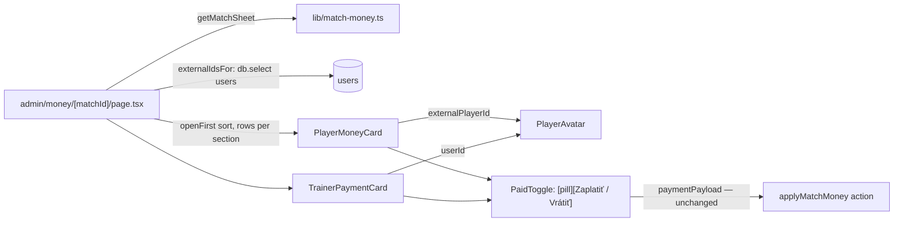

# Requirements

### Origin

Split out of `.junie/plans/mark-match-fines-paid.md` (its former Steps 8–10, "round 3"). That plan shipped the `/admin/money` section — list page, per-match sheet, `PaidToggle`, `MarkAllPaidButton`, `PlayerMoneyCard`, `TrainerPaymentCard`, the `applyMatchMoney` server action — and is complete. This plan is a **visual-only** pass over the sheet cards. It is **not started**.

No change to payloads, the server action, `applyMatchMoneyUpdates()`, or any money module — the sheet keeps issuing exactly the same calls.

### Overview & Goals

1. **Button reads the action, not the state.** Today the toggle shows *Nezaplatené* on an unpaid row and paying means tapping a button that says "unpaid". After: an unpaid row shows a status pill *Nezaplatené* and a primary button **Zaplatiť**; a paid row shows the pill *Zaplatené* and a quiet **Vrátiť** button that reverses it. (sk Zaplatiť / Vrátiť, cs Zaplatit / Vrátit, hu Kifizetés / Visszavonás, sr Plati / Vrati.)
2. **Card layout "avatar + amount rows"** (user choice): header with `PlayerAvatar` (photo or initials), name and dashboard-style *Celkom* / *Chyby* stat tiles; below, one row per amount (*Pokuta*, *Bonus*) with the € sum, the status pill and the action button at the right edge.
3. **Extras** (all chosen): a **bonus-only card** in the *Bonusy* section instead of repeating the full player card; **player photos** via `PlayerAvatar` (players by `external_player_id`, trainers by `users.id`); **unpaid rows first** inside every section.

### Scope

**In Scope**
- `components/money/PaidToggle.tsx` — status pill + verb button.
- `components/money/PlayerMoneyCard.tsx`, `components/money/TrainerPaymentCard.tsx` — new layout, `rows` prop, avatars.
- `app/[lang]/admin/money/[matchId]/page.tsx` — external-id lookup for photos, bonus-only section, unpaid-first sort.
- `locales/{sk,cs,hu,sr}.json` — **values** of `admin.money.markPaid` / `markUnpaid` only.
- Tests for the three components (`PaidToggle.test.tsx`, `PlayerMoneyCard.test.tsx`, new `TrainerPaymentCard.test.tsx`).

**Out of Scope**
- Any change to `lib/match-money.ts`, `lib/match-money-payload.ts`, `lib/match-money-actions.ts`, `lib/special-misses.ts`, `lib/sync.ts`, `lib/money-rules.ts`.
- New locale keys (only two values change).
- List page `/[lang]/admin/money` styling.
- Playwright / end-to-end tests.

### Functional Requirements

- Every amount row shows a status pill (*Zaplatené* green / *Nezaplatené* red) **and** an action button whose visible text is the verb: *Zaplatiť* (primary) when unpaid, *Vrátiť* (ghost, `Undo2` icon) when paid. The button's accessible name is that verb.
- Player card header: avatar (photo when mapped in `lib/player-images.ts`, initials otherwise), name, *Celkom* and *Chyby* stat tiles. Trainer card header: avatar + trainer name + localized condition. The *Bonusy* section renders a bonus-only card (avatar, name, *Celkom*, bonus row) — no fine row, no *Chyby* tile.
- Within each section rows with something still open come first (`!is_paid && owed > 0` / `!is_bonus_paid` / `!isPaid`), then by name (`localeCompare(lang)`).
- A `0 €` amount keeps the muted colour and renders no pill / button (today's behaviour).
- Mobile-first: cards stack; long names truncate rather than tiles wrapping (check at 360 px).

### Non-Functional Requirements

- No `any`; Airbnb lint clean; `pnpm check` green.
- Both cards stay server-safe (no `'use client'`); only `PaidToggle` is a client island.
- One toggle = one `applyMatchMoneyUpdates` call = zero recalculations (unchanged).

# Technical Design

### Current Implementation

| Piece | Where | Notes |
|---|---|---|
| Toggle | `components/money/PaidToggle.tsx` | `'use client'`; props `matchId`, `target`, `isPaid`, `labels { paid, unpaid, markPaid, markUnpaid }`, `errors`, `size`; button text is the *state*, `aria-label` is the action |
| Player card | `components/money/PlayerMoneyCard.tsx` | `PlayerMoneyCardPlayer` without `external_player_id`; renders name, total, faults, fine row, bonus row; `amountClass(amount, isPaid)` helper |
| Trainer card | `components/money/TrainerPaymentCard.tsx` | `TrainerPaymentCardPayment` without `userId`; condition label from `admin.money.conditions` |
| Sheet page | `app/[lang]/admin/money/[matchId]/page.tsx` | `getMatchSheet`, `fineTargets / bonusTargets / trainerTargets / allTargets`, three sections sorted by name, *Bonusy* reuses the full player card |
| Avatar | `components/PlayerAvatar.tsx` | server-safe; `externalPlayerId` → `IMAGES_BY_EXTERNAL_ID`, `userId` → `IMAGES_BY_USER_ID` (`lib/player-images.ts`) |
| Stat tiles | `app/[lang]/page.tsx` `STAT_TILE / STAT_LABEL / STAT_VALUE` | class strings to borrow |
| User → external id | `app/[lang]/admin/users/page.tsx` | pattern: `db.select({ … }).from(users).where(inArray(users.id, …))` |
| Locales | `locales/*.json` `admin.money.markPaid / markUnpaid` | currently "Označiť ako zaplatené" / "Označiť ako nezaplatené" |

### Key Decisions

1. **Status pill lives inside `PaidToggle`, next to the button.** The component already receives `labels.paid / unpaid / markPaid / markUnpaid` and `isPaid`; rendering `[pill][button]` there keeps both cards and all existing tests on the same props — only the *values* of `markPaid` / `markUnpaid` change in the locale files (verb instead of "Označiť ako …"). No key rename, so nothing else that reads `admin.money` moves.
2. **External player ids are looked up in the page, not added to the money modules.** `lib/special-misses.ts` and `lib/match-money.ts` are on the mandatory-test list and have no meaningful unit test for a new select column; the sheet page instead runs one `db.select({ id, externalPlayerId }).from(users).where(inArray(users.id, …))` (the pattern `app/[lang]/admin/users/page.tsx` already uses) and merges the result into the card props. `MatchSheet`, `MatchPlayerResult`, the CLI and `getMatchSheet` stay byte-identical.
3. **Bonus-only card is a `rows` prop on `PlayerMoneyCard`, not a new component.** `rows?: ReadonlyArray<'fine' | 'bonus'>` (default both) drives which amount rows and stat tiles render; the *Bonusy* section passes `['bonus']`. One card, one test file, one set of labels.
4. **Unpaid-first ordering is a pure comparator in the page.** `openFirst(isOpen, name)(a, b)` sorts by `Number(isOpen(b)) - Number(isOpen(a))`, then `name(a).localeCompare(name(b), lang)`; the `*Targets` arrays are unaffected (order inside a payload is irrelevant).
5. **Paid-state button is "Vrátiť", `ghost` variant with `Undo2`** (user choice over "Zrušiť platbu" / icon-only) so the settled row visually recedes.

### Proposed Changes

#### 1. `PaidToggle` → status pill + verb button (`components/money/PaidToggle.tsx`)

Props unchanged (`matchId`, `target`, `isPaid`, `labels`, `errors`, `size`). Render:

```tsx
const PILL = 'inline-flex shrink-0 items-center rounded-full px-2 py-0.5 text-[11px] font-semibold';
const PILL_TONE = {
  paid: 'bg-emerald-500/15 text-emerald-700 dark:text-emerald-400',
  unpaid: 'bg-red-500/15 text-red-700 dark:text-red-400',
} as const;

<div className="flex flex-col items-end gap-1">
  <div className="flex items-center gap-2">
    <span className={`${PILL} ${isPaid ? PILL_TONE.paid : PILL_TONE.unpaid}`}>
      {isPaid ? labels.paid : labels.unpaid}
    </span>
    <Button
      type="button"
      size={size}
      variant={isPaid ? 'ghost' : 'default'}
      onClick={handleToggle}
      disabled={isPending}
    >
      {isPending && <Loader2 className="animate-spin" />}
      {!isPending && (isPaid ? <Undo2 /> : <Check />)}
      {isPaid ? labels.markUnpaid : labels.markPaid}
    </Button>
  </div>
  {error && <p className="rounded-lg bg-destructive/15 px-2 py-1 text-xs text-destructive">{errors[error]}</p>}
</div>
```

- `aria-label` / `title` are dropped: the verb is now the visible text and therefore the accessible name (`getByRole('button', { name: 'Zaplatiť' })`).
- `handleToggle`, `useTransition`, `paymentPayload(target, !isPaid)` and the error mapping are untouched.

#### 2. Locale values (`locales/{sk,cs,hu,sr}.json` → `admin.money`)

Only two **values** change per file; keys, placeholders and everything else stay:

| key | sk | cs | hu | sr |
|---|---|---|---|---|
| `markPaid` | Zaplatiť | Zaplatit | Kifizetés | Plati |
| `markUnpaid` | Vrátiť | Vrátit | Visszavonás | Vrati |

`paid` / `unpaid` (pill text) keep *Zaplatené* / *Nezaplatené* etc.

#### 3. Card redesign (`components/money/PlayerMoneyCard.tsx`, `components/money/TrainerPaymentCard.tsx`)

`PlayerMoneyCard`:

```ts
export type PlayerMoneyRow = 'fine' | 'bonus';
export interface PlayerMoneyCardPlayer {
  user_id: string; user_name: string;
  external_player_id?: number | null;   // ← new, optional: a raw MatchPlayerResult still type-checks and falls back to initials
  total: number; faults: number; calculated_fine: number; streak_fine: number;
  bonus_received: number; is_paid: boolean; is_bonus_paid: boolean;
}
export interface PlayerMoneyCardProps {
  matchId: number; player: PlayerMoneyCardPlayer; labels: PlayerMoneyCardLabels;
  errors: Record<MatchMoneyActionError, string>;
  rows?: ReadonlyArray<PlayerMoneyRow>;   // default ['fine', 'bonus']; Bonusy section passes ['bonus']
}
```

Layout (mobile-first, classes borrowed from `app/[lang]/page.tsx` `STAT_TILE / STAT_LABEL / STAT_VALUE` and `admin/users/page.tsx` `USER_CARD`):

```tsx
const CARD = 'flex flex-col gap-3 rounded-xl bg-surface-2 p-4';
const HEADER = 'flex items-center gap-3 min-w-0';
const AVATAR = 'size-12 shrink-0 rounded-xl after:rounded-xl';
const STAT_TILE = 'rounded-lg bg-surface px-2 py-1 text-center min-w-14';
const STAT_LABEL = 'block text-[10px] leading-tight uppercase font-semibold tracking-wide text-muted-foreground';
const STAT_VALUE = 'text-sm leading-tight font-semibold tabular-nums';
const AMOUNT_ROW = 'flex items-center justify-between gap-3 border-t border-foreground/10 pt-3';
const AMOUNT_LABEL = 'text-xs text-muted-foreground';
const AMOUNT = 'text-base font-semibold tabular-nums';

<div className={CARD}>
  <div className={HEADER}>
    <PlayerAvatar name={player.user_name} externalPlayerId={player.external_player_id} className={AVATAR} fallbackClassName="text-sm" />
    <span className="min-w-0 flex-1 truncate font-bold leading-tight">{player.user_name}</span>
    <div className="flex shrink-0 gap-1.5">
      <div className={STAT_TILE}><span className={STAT_LABEL}>{labels.total}</span><span className={STAT_VALUE}>{player.total}</span></div>
      {showFine && <div className={STAT_TILE}><span className={STAT_LABEL}>{labels.faults}</span><span className={STAT_VALUE}>{player.faults}</span></div>}
    </div>
  </div>
  {showFine && <AmountRow label={labels.fine} amount={fine} isPaid={player.is_paid} toggle={fine > 0 && <PaidToggle … target={{ kind: 'fine', userId }} />} />}
  {showBonus && <AmountRow label={labels.bonus} amount={player.bonus_received} isPaid={player.is_bonus_paid} toggle={player.bonus_received > 0 && <PaidToggle … target={{ kind: 'bonus', userId }} />} />}
</div>
```

`AmountRow` (local, not exported): left column `AMOUNT_LABEL` over `AMOUNT` coloured by the existing `amountClass(amount, isPaid)`; right column the toggle or nothing. The `0 €` case keeps the muted colour and renders no pill/button (exactly today's behaviour, so the "renders no toggles at all" test stays valid).

`TrainerPaymentCard`: `TrainerPaymentCardPayment` gains `userId: string` (already present on `TrainerPayment`, so the page passes the row through unchanged). Header: `PlayerAvatar name={payment.userName} userId={payment.userId}` + name + condition subtitle; right side: amount + `PaidToggle`. Same `CARD` / `AVATAR` classes as the player card.

`PlayerAvatar` is a server-safe component (`next/image` + `components/ui/avatar`), already rendered from server pages; both cards stay without `'use client'`, only `PaidToggle` is a client island.

#### 4. Sheet page wiring (`app/[lang]/admin/money/[matchId]/page.tsx`)

```ts
import { inArray } from 'drizzle-orm';
import { db } from '@/lib/db';
import { users } from '@/lib/db/schema';

async function externalIdsFor(userIds: string[]): Promise<Map<string, number | null>> {
  if (userIds.length === 0) return new Map();
  const rows = await db.select({ id: users.id, externalPlayerId: users.externalPlayerId })
    .from(users).where(inArray(users.id, userIds));
  return new Map(rows.map((r) => [r.id, r.externalPlayerId ?? null]));
}

const openFirst = <T,>(isOpen: (row: T) => boolean, name: (row: T) => string) => (a: T, b: T) => (
  Number(isOpen(b)) - Number(isOpen(a)) || name(a).localeCompare(name(b), lang)
);
```

- After `loadSheet`: `const externalIds = await externalIdsFor(sheet.players.map((p) => p.user_id));` and `const cardPlayers = sheet.players.map((p) => ({ ...p, external_player_id: externalIds.get(p.user_id) ?? null }));`.
- *Pokuty hráčov*: `cardPlayers.sort(openFirst((p) => !p.is_paid && owed(p) > 0, (p) => p.user_name))`, `<PlayerMoneyCard rows={['fine', 'bonus']} …>` (explicit, same as default).
- *Bonusy*: `bonusPlayers.sort(openFirst((p) => !p.is_bonus_paid, …))`, `<PlayerMoneyCard rows={['bonus']} …>`.
- *Platby trénerov*: `sheet.trainer_payments.sort(openFirst((p) => !p.isPaid, (p) => p.userName))`; `TrainerPaymentCard` receives the row as-is (it now carries `userId`).
- `fineTargets / bonusTargets / trainerTargets / allTargets`, both `MarkAllPaidButton` usages, totals strip and header are **unchanged**.

### File Structure

```
components/money/PaidToggle.tsx             mod  (status pill + verb button, ghost when paid)
components/money/PaidToggle.test.tsx        mod  (verb labels, pill assertions)
components/money/PlayerMoneyCard.tsx        mod  (PlayerAvatar header, stat tiles, AmountRow, rows prop, external_player_id)
components/money/PlayerMoneyCard.test.tsx   mod  (rows=['bonus'] case, initials fallback, new field)
components/money/TrainerPaymentCard.tsx     mod  (PlayerAvatar header, userId)
components/money/TrainerPaymentCard.test.tsx new  (amount, condition label, toggle)
app/[lang]/admin/money/[matchId]/page.tsx   mod  (external-id lookup, unpaid-first sort, rows per section)
locales/sk.json, cs.json, hu.json, sr.json  mod  (values of admin.money.markPaid / markUnpaid)
```

No `lib/` money module is touched.

### Architecture Diagram



### Edge Cases / Risks

- **`next/image` in jsdom**: `PlayerAvatar` renders `Image` only when a photo is mapped; the card tests use ids with no mapping (`external_player_id: null`, an unknown `userId`), so only the initials fallback renders. If a test ever needs a mapped id, `vi.mock('next/image', () => ({ default: (props) =>  }))` in that file — do not add a global mock.
- **Accessible name change**: dropping `aria-label` means the button's name is the verb; every `getByRole('button', { name: labels.markPaid })` keeps working because the test labels move to the verbs too. `PlayerMoneyCard.test.tsx` counts buttons by `labels.markPaid` — unchanged semantics.
- **Sorting must not reorder while pending**: the sort runs on the server per render; after a toggle the page re-renders with fresh data and the paid row drops below the open ones — expected, matches the "unpaid first" choice. No client-side reordering, so no layout jump mid-transition.
- **`inArray` with an empty list** throws in drizzle — `externalIdsFor` short-circuits on `[]` (a played match always has rows, but a manual match being edited might not yet).
- **Tile width on narrow phones**: long names + two stat tiles share one row; the name has `min-w-0 flex-1 truncate`, tiles are `shrink-0 min-w-14`, so the name truncates rather than the tiles wrapping. Check at 360 px.
- **Client boundary**: `PaidToggle` keeps importing only `lib/match-money-payload.ts` and `lib/match-money-actions.ts`; the new `db.select` lives in the server page only.
- **Locale test**: `locales/locales.test.ts` checks keys and placeholders, not values — changing the two values cannot break it, and no new key is added.

# Delivery Steps

###   Step 1: Make the toggle read the action — status pill plus "Zaplatiť" / "Vrátiť" button
Every amount row shows a coloured status pill and a button whose text is the verb that will happen on tap.

- `components/money/PaidToggle.tsx`: render `[pill][button]` per Technical Design #1 — pill text `labels.paid` / `labels.unpaid` with emerald / red tones; button text `labels.markPaid` (variant `default`, `Check`) when unpaid, `labels.markUnpaid` (variant `ghost`, `Undo2`) when paid; drop `aria-label` / `title`; keep `useTransition`, `paymentPayload(target, !isPaid)` and the error block untouched.
- `locales/sk.json`, `cs.json`, `hu.json`, `sr.json`: change only the values of `admin.money.markPaid` / `markUnpaid` to the verbs in Technical Design #2 (Zaplatiť/Vrátiť, Zaplatit/Vrátit, Kifizetés/Visszavonás, Plati/Vrati).
- `components/money/PaidToggle.test.tsx`: switch the label fixture to the verbs, add the pill assertions and the `bg-primary` present/absent check (Testing → Step 1).
- Verify: `pnpm vitest run --project dom components/money/PaidToggle components/money/PlayerMoneyCard components/money/MarkAllPaidButton` and `pnpm vitest run --project node locales` green (existing card tests must still pass with only the fixture labels changed).

###   Step 2: Redesign the player and trainer cards with avatar, stat tiles and amount rows
`PlayerMoneyCard` and `TrainerPaymentCard` render the "avatar + amount rows" layout, support a bonus-only mode, and are covered by tests.

- `components/money/PlayerMoneyCard.tsx`: add optional `external_player_id?: number | null` to `PlayerMoneyCardPlayer` and `rows?: ReadonlyArray<'fine' | 'bonus'>` (default both); header = `PlayerAvatar` (`externalPlayerId`, `size-12 rounded-xl`) + truncating name + *Celkom* tile (+ *Chyby* tile only when `rows` includes `'fine'`); body = local `AmountRow` per selected row (label, coloured amount via existing `amountClass`, `PaidToggle` only when the amount is > 0) — Technical Design #3.
- `components/money/TrainerPaymentCard.tsx`: add `userId: string` to `TrainerPaymentCardPayment`; header = `PlayerAvatar` (`userId`) + name + condition subtitle; right side amount + `PaidToggle`; same `CARD` / `AVATAR` classes.
- `components/money/PlayerMoneyCard.test.tsx`: add `external_player_id: null` to the fixture, the initials case, the `rows={['bonus']}` case and the mixed pill case.
- `components/money/TrainerPaymentCard.test.tsx` (new): amount, condition label / raw fallback, pill + verb for paid and unpaid, click payload.
- Verify: `pnpm exec eslint components/money && pnpm exec tsc --noEmit -p tsconfig.json` clean (both new props are optional, so the not-yet-updated page still compiles) and `pnpm vitest run --project dom components/money` green.

###   Step 3: Wire the sheet page — photos, bonus-only section, unpaid first — and run the final check
`/[lang]/admin/money/[matchId]` shows the redesigned cards with real photos where mapped, bonus-only cards under *Bonusy*, open rows on top in every section, and `pnpm check` is green.

- `app/[lang]/admin/money/[matchId]/page.tsx`: add `externalIdsFor(userIds)` (one `db.select` over `users` with `inArray`, empty-list guard) and `openFirst(isOpen, name)` per Technical Design #4; build `cardPlayers` with `external_player_id`; sort fines by `!is_paid && owed > 0`, bonuses by `!is_bonus_paid`, trainer rows by `!isPaid`, each then by name; pass `rows={['fine','bonus']}` in *Pokuty hráčov* and `rows={['bonus']}` in *Bonusy*; pass trainer rows through unchanged (they already carry `userId`).
- Leave `fineTargets / bonusTargets / trainerTargets / allTargets`, both `MarkAllPaidButton` instances, the totals strip and the header untouched.
- Run `nvm use && pnpm check` (lint, type check, full vitest suite) and fix anything it reports; click through the Key Scenarios below in the browser at phone width.

# Testing

### Validation Approach

- `nvm use && pnpm check` (lint + type check + vitest, both projects) must be green — final step of the plan.
- Unit tests sit next to the source, no `__tests__`, no snapshots; query by role and visible text.
- No database is reached in tests; `@/lib/match-money-actions` is mocked at module level in the component tests, exactly as the existing `components/money/*.test.tsx` files do.
- No money module changes, so no money-rule tests move; `locales/locales.test.ts` must keep passing unchanged (values only).

### Test Changes

**Step 1 — `components/money/PaidToggle.test.tsx`** (dom, update + extend)
- `labels` fixture becomes `{ paid: 'Zaplatené', unpaid: 'Nezaplatené', markPaid: 'Zaplatiť', markUnpaid: 'Vrátiť' }`.
- unpaid: pill text `Nezaplatené` visible, `getByRole('button', { name: 'Zaplatiť' })` present, click → `{ players:[{ userId:'u1', isPaid:true }] }` (existing assertion, new name).
- paid: pill text `Zaplatené`, button `Vrátiť`, click → `isPaid:false`.
- new: the paid button does **not** carry `bg-primary` while the unpaid one does (same technique as the `MarkAllPaidButton` variant test).
- error-code table and "clears a stale error" unchanged apart from the verb.

**Step 2 — `components/money/PlayerMoneyCard.test.tsx`** (dom, update + extend)
- `basePlayer` gains `external_player_id: null` (optional field, set explicitly so the fixture mirrors the page); `labels` use the verbs.
- existing amount / toggle-count cases stay (`13 €`, `40 €`, `712`, `2`, two `Zaplatiť` buttons, …).
- new: renders initials `JN` for *Ján Novák* (no photo mapped) — `getByText('JN')`.
- new: `rows={['bonus']}` renders `40 €` and one `Zaplatiť` button, but neither `13 €` nor the `Chyby` tile (`queryByText(labels.faults)` is null).
- new: an unpaid fine shows the pill `Nezaplatené` and a paid bonus shows `Zaplatené` in the same card (`is_bonus_paid: true`).

**Step 2 — `components/money/TrainerPaymentCard.test.tsx`** (dom, new; mocks `@/lib/match-money-actions`)
- renders trainer name, the localized condition (`conditions.score_bonus` → *Výkon tímu*), `15 €`, pill `Nezaplatené` and button `Zaplatiť`; click → `applyMatchMoney(44568, { trainerPayments:[{ id: 8, isPaid: true }] })`.
- paid row renders pill `Zaplatené` and button `Vrátiť`.
- unknown `conditionType` falls back to the raw string.

**Existing suites**
- `locales/locales.test.ts`: values only change — must pass unchanged.
- `components/money/MarkAllPaidButton.test.tsx`, `lib/match-money-payload.test.ts`, `lib/match-money-actions.test.ts`: untouched, must pass.

### Key Scenarios (manual, in the browser after `pnpm dev`, phone width)

1. Open a match with mixed state: every open row sits above the settled ones in each section; an unpaid fine shows red pill *Nezaplatené* + primary *Zaplatiť*; tap → row re-renders with green *Zaplatené* + ghost *Vrátiť* and moves below the open rows; tap *Vrátiť* → back.
2. Players with a photo in `lib/player-images.ts` show it in the card header, others show initials; trainer *Ponjavić* shows his photo via `userId`. The *Bonusy* section cards have no *Pokuta* row and no *Chyby* tile. Check at 360 px width that names truncate and tiles do not wrap.
3. Header *Označiť všetko ako zaplatené* still settles all three sections in one request (no regression from the card changes).
4. `npx tsx scripts/match-money.ts sheet --match-id <id>` — CLI unchanged, shows the same flags.

### Edge Cases

- Player with `bonus_received = 0` in *Pokuty hráčov* → bonus row shows muted `0 €`, no pill, no button.
- Match with no trainer rows → *Platby trénerov* empty state unchanged.
- Match with a player whose `users.external_player_id` is NULL → initials avatar, no crash.
