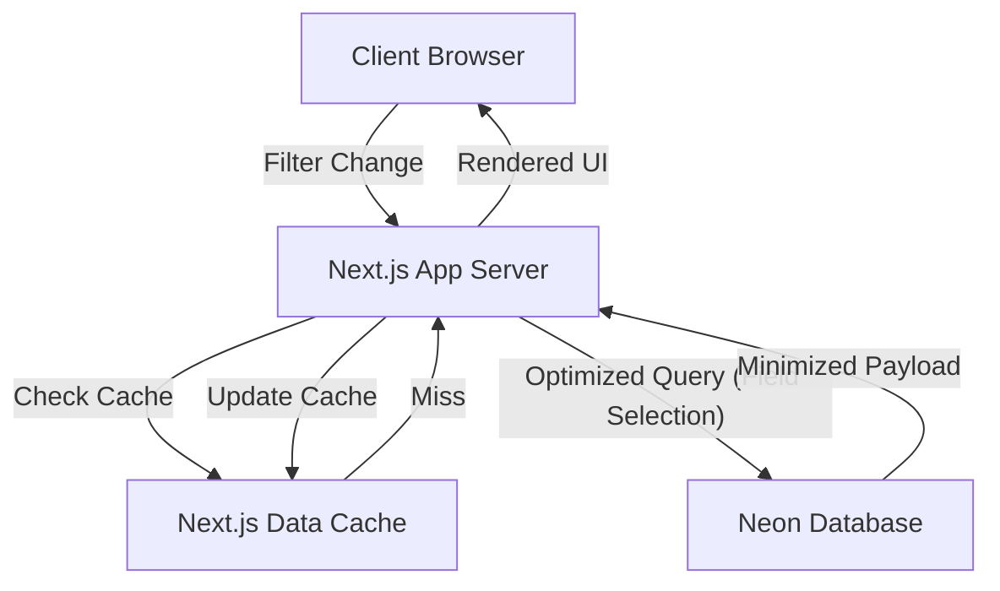

# Requirements

### Overview & Goals
The project recently experienced a spike in network transfer, leading to Neon database quota exhaustion. This coincided with the addition of filtering features and frequent switching between filters. The goal is to optimize data fetching to reduce network load by fetching only necessary data and improving caching.

### Scope
- **In Scope**:
    - Optimizing JSONB queries to fetch only required fields.
    - Replacing large JSONB blob fetches with structured table queries where possible.
    - Implementing and improving caching for all filter-dependent data fetches.
    - Reducing the amount of data transferred for dashboard and player detail views.
- **Out of Scope**:
    - Changing the database provider.
    - Redesigning the UI/UX.

### Functional Requirements
- Filtering must remain fast and responsive.
- Data displayed must be accurate and up-to-date (with reasonable caching).
- Network transfer between Neon and the application must be significantly reduced.

# Technical Design

### Current Implementation
- **Data Storage**: Uses Neon (PostgreSQL) with some data stored in a `scraped_data` table as `JSONB` blobs.
- **Data Fetching**: The application often fetches entire `JSONB` blobs (e.g., `player_detail`, `match_list`) even when only a few fields (like `firstName`, `lastName`) are needed.
- **Filtering**: Driven by Server Components and `searchParams`. Each filter change triggers a server re-render and DB queries.
- **Caching**: Partial use of `unstable_cache`, but some keys are incomplete and many queries (especially on player detail pages) are not cached at all.

### Key Decisions
- **JSONB Field Extraction**: Use PostgreSQL `->>` operator in `SELECT` statements to extract specific fields from JSONB. This avoids transferring large unused parts of the JSON object.
- **Structured Table Usage**: Shift from reading `match_list` JSONB to querying the structured `matches` table, which is already populated during sync.
- **Enhanced Caching**: Apply `unstable_cache` to all major data-fetching functions, ensuring parameters like `seasonId` and `leagueKey` are part of the cache key.

### Proposed Changes

#### 1. Database Utilities (`lib/db-utils.ts`)
- Add `fields` support to `getScrapedData` and `getScrapedDataBatch`.
- Optimize `getPlayerBalances` to include name extraction from JSONB via a join, removing the need for a secondary batch fetch of player details.

#### 2. Home Helpers (`lib/home-helpers.ts`)
- Rewrite `fetchHomeDataInternal` to query the `matches` table for upcoming and past results.
- Remove redundant `getScrapedDataBatch('player_detail', ...)` call.
- Improve `unstable_cache` configuration for `fetchHomeData`.

#### 3. Player Detail Page (`app/[lang]/player/[id]/page.tsx`)
- Optimize the player info fetch to only get names.
- Cache balance and match result queries.

### Architecture Diagram

### Risks
- **Cache Staleness**: Over-caching might lead to users seeing old data. *Mitigation*: Use appropriate `revalidate` times (e.g., 60s) and cache tags for manual invalidation after sync.
- **Query Complexity**: Extracting many fields from JSONB can slightly increase DB CPU. *Mitigation*: The reduction in network transfer and I/O will far outweigh the CPU cost for our scale.

# Delivery Steps

### ✓ Step 1: Optimize JSONB queries with field selection
Refactor `getScrapedData` and `getScrapedDataBatch` in `lib/db-utils.ts` to support selecting specific fields from JSONB.
- Add an optional `fields` parameter to these functions.
- Use PostgreSQL JSONB operators (`->>`) to extract only requested fields.
- This reduces the amount of data transferred from Neon to the application.

### ✓ Step 2: Reduce redundant data fetching in Home dashboard
Modify `fetchHomeDataInternal` in `lib/home-helpers.ts` to avoid fetching large JSONB blobs.
- Replace `getScrapedData('match_list', ...)` with queries to the `matches` table.
- Replace `getScrapedData('team_results', ...)` with queries to the `matches` table.
- Update `getPlayerBalances` to join with `scraped_data` and extract only `firstName`/`lastName` instead of fetching full `player_detail` in a separate batch.

### ✓ Step 3: Optimize Player Detail page and implement caching
Update `PlayerDetailPage` to use optimized data fetching.
- Use a targeted query to fetch player name and basic info instead of the full `player_detail` JSONB.
- Wrap `getPlayerBalanceByExternalId` and `getPlayerMatchResultsByExternalId` with `unstable_cache` to prevent redundant DB hits when switching filters.
- Ensure cache keys include `seasonId` and `leagueKey`.

### ✓ Step 4: Enhance global caching strategy
Improve cache strategy in `lib/home-helpers.ts`.
- Explicitly include `seasonId` and `leagueKey` in the `unstable_cache` key for `fetchHomeData`.
- Add granular cache tags for revalidation.
- Set appropriate `revalidate` times based on data change frequency.