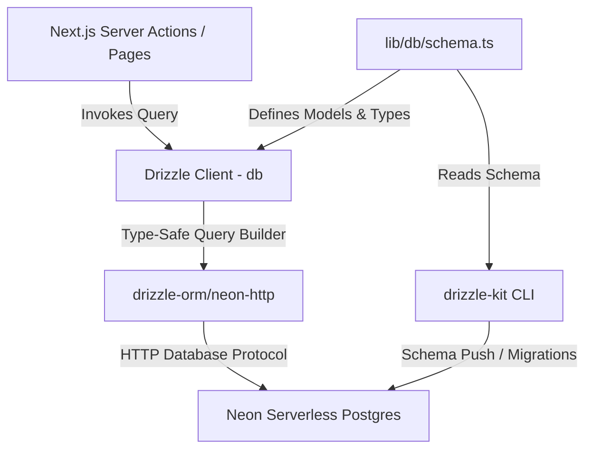

# Comparison & Recommendation

### Overview & Comparison Summary

The project currently uses raw SQL queries via `@neondatabase/serverless` (`neon()` driver) with runtime imperative `ensureSchema()` calls in `lib/db-utils.ts`. 

To establish type safety, declarative schema management, and improved developer experience, we evaluated **Prisma ORM** vs **Drizzle ORM** for this project.

 Feature / Criteria | Prisma ORM | Drizzle ORM | Winner for Interliga |
 :--- | :--- | :--- | :--- |
 **Neon Serverless Compatibility** | Requires `@prisma/adapter-neon` + `@neondatabase/serverless` + query engine | Native `drizzle-orm/neon-http` driver support using existing `@neondatabase/serverless` connection | **Drizzle ORM** |
 **Cold Starts & Serverless Performance** | Rust/WASM Query Engine adds bundle overhead and cold start latency in Next.js/Vercel | Zero runtime overhead, lightweight JS, native execution, instant cold start | **Drizzle ORM** |
 **Type Safety & DX** | Custom `.prisma` DSL requiring `prisma generate` step into `node_modules` | Standard TypeScript schema (`schema.ts`); types inferred directly via `InferSelectModel` / TS compiler | **Drizzle ORM** |
 **Query Flexibility & Complex SQL** | High-level abstraction; custom SQL expressions require `$queryRaw` | Supports both relational query API (`db.query`) and type-safe SQL expressions (`sql\`...\``, `.onConflictDoUpdate()`) | **Drizzle ORM** |
 **Migration Tooling** | `prisma migrate` / `prisma db pull` | `drizzle-kit generate` / `drizzle-kit push` / `drizzle-kit pull` | **Tie** |
 **Refactoring Complexity** | Moderate (translating raw SQL queries into Prisma AST) | Low-to-Moderate (direct 1:1 mapping from existing queries to Drizzle TS schema) | **Drizzle ORM** |

### Recommendation & Decision
**Drizzle ORM is selected as the optimal ORM for this project.**

#### Rationale:
1. **Zero-Overhead Integration with Existing Stack:** Interliga already uses `@neondatabase/serverless`. Drizzle wraps this driver directly with zero extra connection pooling adapters or binary engines.
2. **Optimal Next.js App Router Performance:** Serverless API routes and Server Actions in Next.js require low bundle size and minimal cold starts.
3. **Pure TypeScript Schema:** Schema definitions live in code (`lib/db/schema.ts`), avoiding codegen mismatches and providing seamless autocompletion.
4. **Seamless Expression Handling:** Fine and gathering logic (e.g. `(faults * (faults + 1)) / 2`) can be expressed naturally with Drizzle's `sql` template helper without falling back to raw untyped strings.

# Requirements

### Overview & Goals
Migrate the database layer from raw `@neondatabase/serverless` template strings to **Drizzle ORM** across all server actions, helper modules, admin utilities, and sync logic. Eliminate runtime schema execution (`ensureSchema()`) in favor of declarative Drizzle Kit schema migrations, and execute the initial data scraping sync to populate the newly connected database.

### Scope
#### In Scope
- Install and configure `drizzle-orm` and `drizzle-kit`.
- Create `lib/db/schema.ts` defining all existing PostgreSQL tables and relations (`users`, `matches`, `match_player_results`, `trainer_payments`, `faultless_streaks`, `scraped_data`, `scraped_snapshots`, `sync_history`, `system_status`, `password_reset_tokens`).
- Update `lib/db.ts` to export Drizzle client instance `db`.
- Refactor all DB calls in `lib/db-utils.ts`, `lib/auth-actions.ts`, `lib/admin-actions.ts`, `lib/special-misses.ts`, `lib/trainer-payments.ts`, `lib/sync.ts`, `app/[lang]/admin/users/page.tsx`, and CLI scripts (`scripts/create-admin.ts`, `scripts/ensure-schema.ts`, `scripts/update-special-misses.ts`, `scripts/update-trainer-payments.ts`, `scripts/run-sync.ts`).
- Remove imperative runtime schema creation (`ensureSchema()`) and replace with `drizzle-kit` migration scripts.
- Execute `pnpm drizzle-kit push` to apply schema to the connected Neon database.
- Execute initial data sync (`pnpm tsx scripts/run-sync.ts`) to populate the newly connected database with scraped matches, player results, and snapshots.
- Run `pnpm check` to ensure zero TypeScript or ESLint errors.

#### Out of Scope
- Modifying underlying PostgreSQL table structures or field types in Neon database.
- Modifying UI components outside of database interaction changes.

### User Stories
- **As a Developer**, I want end-to-end TypeScript safety on all database queries so that schema mismatches and query bugs are caught at compile time during `pnpm check`.
- **As a Developer**, I want a declarative schema definition in `lib/db/schema.ts` and automated migrations via `drizzle-kit` so that schema evolution is controlled and versioned.
- **As an Admin / User**, I want all application features (login, registration, match sync, fine calculation, trainer payments) to perform seamlessly with zero latency degradation.
- **As an Admin**, I want initial match data scraped and seeded into the newly connected database so that the application has up-to-date league data.

### Functional Requirements
- **FR-1:** All database queries across server actions and sync handlers must execute through `drizzle-orm`.
- **FR-2:** Fine and bonus calculations in `lib/special-misses.ts` and `lib/trainer-payments.ts` must maintain exact mathematical equivalence to existing business rules.
- **FR-3:** Scraped data upserts in `lib/sync.ts` must use Drizzle's `.onConflictDoUpdate()` clause to preserve current idempotent synchronization behavior.
- **FR-4:** Execute database schema push and run initial data synchronization (`pnpm tsx scripts/run-sync.ts`) after migration to populate initial scraped match data in the connected database.

### Non-Functional Requirements
- **NFR-1 (Performance):** Zero cold-start penalty compared to raw SQL client.
- **NFR-2 (Type Safety):** 100% strict TypeScript coverage with zero use of `any`.
- **NFR-3 (Quality):** Full compliance with Airbnb ESLint rules via `pnpm check`.

# Technical Design

### Current Implementation
- `lib/db.ts`: Initializes Neon HTTP client `sql = neon(databaseUrl)`.
- `lib/db-utils.ts`: Contains `ensureSchema()` executing ~15 imperative raw SQL `CREATE TABLE IF NOT EXISTS` and `ALTER TABLE` statements at runtime before operations.
- Data access files (`lib/auth-actions.ts`, `lib/admin-actions.ts`, `lib/special-misses.ts`, `lib/trainer-payments.ts`, `lib/sync.ts`, `app/[lang]/admin/users/page.tsx`) execute `sql\`SELECT ...\`` with manual mapping functions.

### Key Decisions
1. **ORM Framework:** `drizzle-orm` with `drizzle-orm/neon-http`.
2. **Schema Location:** `lib/db/schema.ts` exporting table schemas (`pgTable`) and TypeScript types (`InferSelectModel`, `InferInsertModel`).
3. **Migration Strategy:** Use `drizzle-kit` CLI for schema generation and push (`pnpm drizzle-kit push` / `pnpm drizzle-kit generate`).

### Drizzle Schema Architecture (`lib/db/schema.ts`)
```ts
import {
  pgTable, uuid, text, boolean, timestamp, bigint, integer, numeric, jsonb, serial, primaryKey, uniqueIndex, check,
} from 'drizzle-orm/pg-core';
import { sql } from 'drizzle-orm';

export const users = pgTable('users', {
  id: uuid('id').default(sql`gen_random_uuid()`).primaryKey(),
  name: text('name').notNull(),
  email: text('email').unique(),
  passwordHash: text('password_hash'),
  isApproved: boolean('is_approved').default(false),
  externalPlayerId: bigint('external_player_id', { mode: 'number' }).unique(),
  role: text('role').notNull(),
  createdAt: timestamp('created_at', { withTimezone: true }).defaultNow(),
});

export const matches = pgTable('matches', {
  externalId: bigint('external_id', { mode: 'number' }).primaryKey(),
  date: timestamp('date', { withTimezone: true }),
  opponent: text('opponent'),
  isHome: boolean('is_home'),
  location: text('location'),
  teamTotalScore: integer('team_total_score'),
  opponentTotalScore: integer('opponent_total_score'),
  seasonId: integer('season_id'),
  leagueName: text('league_name'),
  round: integer('round'),
  leagueId: integer('league_id'),
  updatedAt: timestamp('updated_at', { withTimezone: true }).defaultNow(),
});

export const matchPlayerResults = pgTable('match_player_results', {
  matchId: bigint('match_id', { mode: 'number' }).references(() => matches.externalId),
  userId: uuid('user_id').references(() => users.id),
  full: integer('full'),
  clean: integer('clean'),
  total: integer('total'),
  avg: numeric('avg'),
  faults: integer('faults'),
  specialFaultsCount: integer('special_faults_count').default(0),
  fullFaultsCount: integer('full_faults_count').default(0),
  secondToLastFaultsCount: integer('second_to_last_faults_count').default(0),
  isWorstPlayer: boolean('is_worst_player').default(false),
  isUnder600: boolean('is_under_600').default(false),
  calculatedFine: numeric('calculated_fine').default('0'),
  bonusReceived: numeric('bonus_received').default('0'),
  isPaid: boolean('is_paid').default(false),
  isBonusPaid: boolean('is_bonus_paid').default(false),
  teamId: integer('team_id'),
}, (table) => [
  primaryKey({ columns: [table.matchId, table.userId] }),
]);

export const trainerPayments = pgTable('trainer_payments', {
  id: serial('id').primaryKey(),
  matchId: bigint('match_id', { mode: 'number' }).references(() => matches.externalId),
  userId: uuid('user_id').references(() => users.id),
  conditionType: text('condition_type').notNull(),
  amount: numeric('amount').notNull(),
  isPaid: boolean('is_paid').default(false),
  createdAt: timestamp('created_at', { withTimezone: true }).defaultNow(),
});

export const faultlessStreaks = pgTable('faultless_streaks', {
  userId: uuid('user_id').references(() => users.id).primaryKey(),
  currentStreak: integer('current_streak').default(0),
  lastUpdatedMatchId: bigint('last_updated_match_id', { mode: 'number' }).references(() => matches.externalId),
  updatedAt: timestamp('updated_at', { withTimezone: true }).defaultNow(),
});

export const scrapedData = pgTable('scraped_data', {
  id: serial('id').primaryKey(),
  type: text('type').notNull(),
  externalId: bigint('external_id', { mode: 'number' }),
  data: jsonb('data').notNull(),
  updatedAt: timestamp('updated_at', { withTimezone: true }).defaultNow(),
});

export const scrapedSnapshots = pgTable('scraped_snapshots', {
  id: serial('id').primaryKey(),
  type: text('type').notNull(),
  externalId: bigint('external_id', { mode: 'number' }).notNull(),
  data: jsonb('data').notNull(),
  scrapedAt: timestamp('scraped_at', { withTimezone: true }).defaultNow(),
});

export const systemStatus = pgTable('system_status', {
  name: text('name').primaryKey(),
  value: text('value'),
  updatedAt: timestamp('updated_at', { withTimezone: true }).defaultNow(),
});

export const passwordResetTokens = pgTable('password_reset_tokens', {
  id: serial('id').primaryKey(),
  userId: uuid('user_id').references(() => users.id, { onDelete: 'cascade' }),
  token: text('token').notNull().unique(),
  expiresAt: timestamp('expires_at', { withTimezone: true }).notNull(),
  createdAt: timestamp('created_at', { withTimezone: true }).defaultNow(),
});
```

### Proposed Client Initialization (`lib/db.ts`)
```ts
import { drizzle } from 'drizzle-orm/neon-http';
import { neon } from '@neondatabase/serverless';
import * as schema from './db/schema';

const databaseUrl = process.env.DATABASE_URL;

if (!databaseUrl) {
  throw new Error('DATABASE_URL is not defined in environment variables');
}

export const sql = neon(databaseUrl);
export const db = drizzle(sql, { schema });
export default sql;
```

### Module Refactoring Plan
1. **`lib/db-utils.ts`**: Remove raw SQL schema creation; replace query functions (`purgeScrapedSnapshots`, cached lookups) with `db.delete(scrapedSnapshots)`. Deprecate/remove runtime `ensureSchema()`.
2. **`lib/auth-actions.ts`**:
   - `signUp`: `db.insert(users).values(...)`
   - `signIn`: `db.select().from(users).where(eq(users.email, email))`
3. **`lib/admin-actions.ts`**:
   - `approveUser`: `db.update(users).set({ isApproved: true }).where(eq(users.id, userId))`
   - `deleteUser`: `db.delete(users).where(eq(users.id, userId))`
4. **`lib/special-misses.ts`**:
   - `getPlayedMatches`: `db.select().from(matches).orderBy(desc(matches.date))`
   - `getMatchPlayers`: Relational query `db.select().from(matchPlayerResults).innerJoin(users, eq(matchPlayerResults.userId, users.id))`
   - `updatePlayerSpecialMisses`: Drizzle update using SQL expression builder for money calculations.
5. **`lib/trainer-payments.ts`**: Refactor using `db.select().from(trainerPayments).innerJoin(users, ...)`.
6. **`lib/sync.ts`**: Refactor match upserts, snapshot inserts, and player result syncing using `.onConflictDoUpdate()`.
7. **`app/[lang]/admin/users/page.tsx`**: Replace `sql\`SELECT ...\`` with `db.select().from(users).orderBy(desc(users.createdAt))`.
8. **Helper CLI Scripts (`scripts/`)**:
   - Refactor `scripts/create-admin.ts`, `scripts/update-special-misses.ts`, `scripts/update-trainer-payments.ts`, and `scripts/run-sync.ts` to remove `ensureSchema()` calls and use Drizzle client.

### Database Migration & Initial Data Sync Execution
1. **Schema Migration Push**: Run `pnpm drizzle-kit push` to apply `lib/db/schema.ts` directly to the connected Neon database (`DATABASE_URL`).
2. **Initial Data Scraper Execution**: Run `pnpm tsx scripts/run-sync.ts` to execute `syncData()` from `lib/sync.ts`, fetching live match results, inserting scraped snapshots, and recalculating faultless streaks into the database.

### Architecture Diagram


# Testing & Validation

### Validation Approach
Verification will combine compile-time strict type checking, static analysis via ESLint, initial data sync execution, and manual flow execution for key features.

### Key Scenarios to Verify
1. **Database Schema Push & Initial Data Scraping:**
   - Execute `pnpm drizzle-kit push` to apply schema to database.
   - Run `pnpm tsx scripts/run-sync.ts` to execute initial data synchronization.
   - Verify that database tables (`matches`, `match_player_results`, `scraped_data`, `scraped_snapshots`, `sync_history`, `system_status`) are populated with scraped match records.
2. **Authentication Flows:**
   - Sign up new player (creates unapproved user record).
   - Sign in with credentials (verifies password hash and approval status).
3. **Admin User Management:**
   - List pending and approved users in `/admin/users`.
   - Approve pending user (`approveUser`).
   - Reject / delete user (`deleteUser`).
4. **Scraper & Match Synchronization:**
   - Execute sync routine for a match (`syncMatch`).
   - Verify `matches` and `match_player_results` upsert properly with Drizzle `.onConflictDoUpdate()`.
   - Verify `scraped_snapshots` and `scraped_data` records are inserted/updated.
5. **Special Misses & Fine Calculations:**
   - Load player match results for special misses (`getMatchPlayers`).
   - Update full faults / 2nd-to-last faults and verify calculated fines using exact formula:
     `fine = (faults * (faults + 1) / 2) + (isWorstPlayer ? 1 : 0) + (isUnder600 ? 1 : 0) + (specialFaults * 5)`.
6. **Trainer Payments:**
   - Retrieve trainer payment obligations (`getMatchTrainerPayments`).
   - Update payment status (`updateTrainerPaymentStatus`).

### Code Quality Checklist
- Run `pnpm check` (`pnpm lint && pnpm type-check`).
- Confirm zero TypeScript compilation errors (`tsc --noEmit`).
- Confirm zero Airbnb ESLint rule violations.
- Confirm zero instances of the `any` TypeScript type across all modified files.

# Delivery Steps

### ✓ Step 1: Install Drizzle ORM dependencies and create core schema and client configuration
Drizzle ORM client and database schema are fully configured and exported.

- Install `drizzle-orm` as a dependency and `drizzle-kit` as a devDependency in `package.json`.
- Create `lib/db/schema.ts` defining all database tables (`users`, `matches`, `match_player_results`, `trainer_payments`, `faultless_streaks`, `scraped_data`, `scraped_snapshots`, `sync_history`, `system_status`, `password_reset_tokens`) using Drizzle Pg table builders with accurate types, defaults, and foreign key relations.
- Update `lib/db.ts` to export both the `drizzle` client instance (`db`) and the underlying Neon driver (`sql`).
- Add `drizzle.config.ts` configured with `schema: './lib/db/schema.ts'`, PostgreSQL dialect, and `process.env.DATABASE_URL`.

### ✓ Step 2: Refactor database utilities and helper CLI scripts
Runtime raw SQL schema creation is replaced with Drizzle schema management and refactored helper functions.

- Deprecate raw `CREATE TABLE IF NOT EXISTS` and `ALTER TABLE` statements in `lib/db-utils.ts` in favor of Drizzle schema definitions.
- Refactor `purgeScrapedSnapshots()` and data querying utilities in `lib/db-utils.ts` to use `db.delete()` and Drizzle query builders.
- Update helper CLI scripts (`scripts/update-special-misses.ts`, `scripts/update-trainer-payments.ts`, `scripts/ensure-schema.ts`, `scripts/run-sync.ts`) to remove deprecated `ensureSchema()` calls and use Drizzle client.
- Add npm script commands for Drizzle Kit (`pnpm drizzle-kit generate` / `pnpm drizzle-kit push`) to manage database schema updates.

### ✓ Step 3: Migrate Authentication, Admin Actions, and User Management to Drizzle ORM
User management and authentication actions operate on type-safe Drizzle models.

- Refactor `signUp`, `signIn`, and `resetPassword` functions in `lib/auth-actions.ts` to use `db.select()`, `db.insert()`, and `db.update()`.
- Refactor `approveUser` and `deleteUser` in `lib/admin-actions.ts` to use `db.update()` and `db.delete()`.
- Refactor `app/[lang]/admin/users/page.tsx` to query users via `db.select()` with proper type inference.
- Refactor `scripts/create-admin.ts` to use Drizzle `insert().onConflictDoUpdate()`.

### ✓ Step 4: Migrate Special Misses, Trainer Payments, and Sync logic to Drizzle ORM
Match result calculations, trainer payments, and scraping sync routines utilize Drizzle query builders and SQL expressions.

- Refactor `lib/special-misses.ts` (`getPlayedMatches`, `getMatchPlayers`, `updatePlayerSpecialMisses`, `updatePlayerPaymentStatus`) to use Drizzle relational queries and type-safe `sql` expressions for money calculations (fines and bonuses).
- Refactor `lib/trainer-payments.ts` (`getMatchTrainerPayments`, `updateTrainerPaymentStatus`, `updateTrainerPaymentStatusByKeys`) using Drizzle `innerJoin` and type-safe updates.
- Refactor `lib/sync.ts` match upserts, snapshot inserts, and player result syncing using Drizzle `.onConflictDoUpdate()`.

### ✓ Step 5: Apply Drizzle Kit schema migrations and execute initial data scraper sync
Database schema is pushed to Neon database and initial scraped match data is populated.

- Run `pnpm drizzle-kit push` to push the Drizzle schema to the connected database URL.
- Execute `pnpm tsx scripts/run-sync.ts` to trigger `syncData()` and seed the new database with initial scraped matches, snapshots, and player results.

### ✓ Step 6: Validate type safety and run quality checks
The entire project passes TypeScript checking and ESLint without any errors or `any` types.

- Run `pnpm check` (`pnpm lint && pnpm type-check`) to verify strict typing across all refactored modules.
- Verify database tables contain initial scraped records and ensure zero `any` type assertions or linting errors.