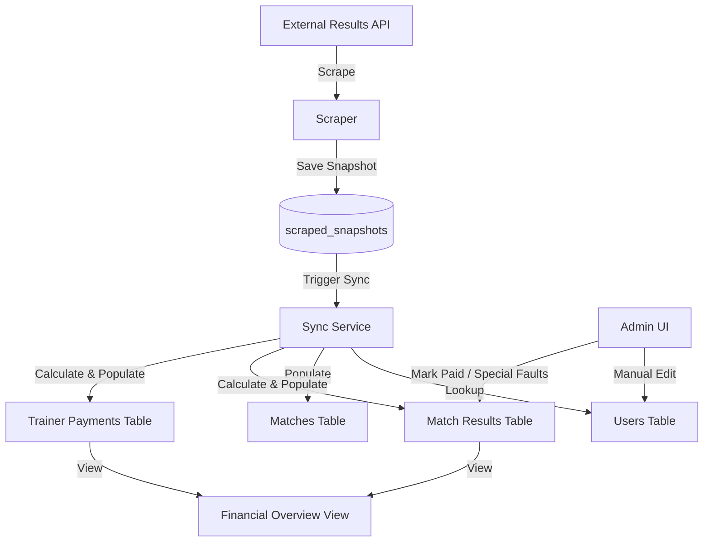

# Requirements

### Overview & Goals
Transition the project from a flat JSON-based storage to a relational database model. This will allow for historical tracking of scraped data, manual admin adjustments (e.g., special faults, payment status), and complex financial calculations for players and trainers.

### Scope
- **Scraping**: Move from upserting JSON to appending time-stamped snapshots.
- **Relational Model**: Extract players, matches, and statistics into dedicated tables.
- **Financials**: Implement specific fine/bonus logic for players and a 'trainer' user.
- **Reporting**: Create a database view for tracking money collection.

### User Stories
- **As an Admin**, I want to link a system user to an external result ID so their stats are automatically tracked.
- **As an Admin**, I want to manually mark a player's faults as 'special' so the system applies the correct surcharge.
- **As an Admin**, I want to see a total overview of who has paid and how much is missing.
- **As a Player**, I want to see my match statistics (full, clean, total, avg, faults) in my detail view.
- **As a Developer**, I want to keep all raw scraped data so I can re-parse it if logic changes in the future.

# Technical Design

### Current Implementation
- `scraped_data` table stores only the latest JSON for a given type/id.
- `lib/scraper.ts` fetches data and calls `upsertScrapedData`.

### Proposed Database Schema

#### 1. Core Tables
- **`scraped_snapshots`**: Stores raw API responses.
    - `id`, `type`, `external_id`, `data` (JSONB), `scraped_at`.
- **`users`**: Unified entity for players and trainers.
    - `id` (UUID), `name`, `external_player_id` (BigInt, unique), `role` ('player', 'trainer', 'admin').
- **`matches`**:
    - `external_id` (PK), `date`, `opponent`, `is_home`, `location`, `team_total_score`, `opponent_total_score`.

#### 2. Transactional Tables
- **`match_player_results`**:
    - `match_id`, `user_id`, `full`, `clean`, `total`, `avg`, `faults`.
    - `special_faults_count` (Int, manual): Admin-entered count of faults costing $5\text{€}$ extra.
    - `is_worst_player` (Boolean): Flag for the lowest score in the match (+ $1\text{€}$).
    - `is_under_600` (Boolean): Flag for total score $< 600$ (+ $1\text{€}$).
    - `calculated_fine` (Numeric): Auto-calculated based on sequential logic + special surcharge + performance fines.
    - `bonus_received` (Numeric): $30\text{€}$ if total $> 700$.
    - `is_paid` (Boolean).
- **`trainer_payments`**:
    - `match_id`, `user_id`, `condition_type` ('score_bonus', 'zero_faults'), `amount`, `is_paid`.

### Key Decisions
- **Snapshot-then-Parse**: We will separate scraping from parsing. The scraper only saves the snapshot. A sync service parses snapshots into relation tables. This allows for easy data correction and historical re-runs.
- **Unified User Table**: Both players and trainers are `users`. Role-based logic will determine if they pay fault fines or trainer bonuses.
- **Sequential Fault Logic**: Fines grow as $1\text{€}, 2\text{€}, 3\text{€}...$ for each subsequent fault in a match.
- **Flat Surcharge for Special Faults**: Special faults (missed 2nd to last throw) add a flat $5\text{€}$ on top of the sequential calculation.
- **Performance Fines**: 
    - Players with a total score $< 600$ pay an additional $1\text{€}$.
    - The worst player in each match pays an additional $1\text{€}$.
- **Trainer Score Bonus**: Trainer pays $10\text{€}$ for team score $> 3800$ or $15\text{€}$ for $> 3900$ (exclusive, higher applies).

### Money Collection View (`view_user_balances`)
A PostgreSQL view will be created to aggregate:
- Sum of `calculated_fine` from `match_player_results`.
- Sum of `trainer_payments`.
- Subtraction of `bonus_received`.
- Filterable by `is_paid` status.

### Architecture Diagram

# Testing

### Validation Approach
Verification will be done by running the scraper and then checking the relational tables for consistency with the JSON data.

### Key Scenarios
- **Mapping**: Create a user, link an `external_player_id`, run sync, verify `match_player_results` are created for that user.
- **Sequential Fine**: Verify a player with 4 faults has a calculated fine of $1+2+3+4 = 10\text{€}$.
- **Special Surcharge**: Add 1 special fault to the same player and verify fine becomes $10 + 5 = 15\text{€}$.
- **Trainer Bonus**: Verify trainer record is created with $15\text{€}$ if team total is $3920$.
- **Zero Faults**: Verify trainer record is created with $10\text{€}$ if all players in a match have 0 faults.
- **Performance Fines**: Verify a player with score $590$ who is also the worst player in the match gets $+2\text{€}$ in fines.
- **Player Bonus**: Verify player receives $30\text{€}$ credit if their total score is $705$.

# Delivery Steps

### ✓ Step 1: Database Schema Migration
Create the new relational database schema in Neon DB.
- Define `users` table with `role` and `external_player_id`.
- Create `scraped_snapshots` table for historical JSON storage.
- Define `matches`, `match_player_results`, and `trainer_payments` tables.
- Add necessary indexes and foreign keys.
- Implement the initial schema migration in `lib/db-utils.ts`.

### ✓ Step 2: Snapshot-based Scraper Update
Modify the existing scraper to store data in the historical snapshots table.
- Update `lib/db-utils.ts` to support saving multiple snapshots for the same entity with timestamps.
- Refactor `runScrapingJob` in `lib/scraper.ts` to use the new snapshot storage.
- Ensure the existing `scraped_data` table is either migrated or kept as a 'latest' cache.

### ✓ Step 3: Data Sync Service Implementation
Develop the logic to transform raw JSON snapshots into relational records.
- Create `lib/sync.ts` to handle the parsing of `match_detail` and `player_results`.
- Implement logic to map external player IDs to system users.
- Calculate team totals and identifying the trainer from the `users` table.
- Populate `matches` and `match_player_results` from the scraped data.

### ✓ Step 4: Financial Logic and Calculations
Implement the specific fine and bonus rules requested.
- Implement sequential fault calculation ($1+2+3...$).
- Add the $+5\text{€}$ flat surcharge for special faults in `match_player_results`.
- Implement performance fines ($+1\text{€}$ for score $< 600$, $+1\text{€}$ for worst player).
- Implement trainer payment conditions (score $>3800/3900$ and zero team faults).
- Add the $+30\text{€}$ bonus for players with total score $>700$.
- Ensure `full`, `clean`, `total`, `avg`, and `faults` are correctly parsed and stored for each player.

### ✓ Step 5: Money Collection View and Finalization
Create a PostgreSQL view to track overall finances.
- Implement `view_user_balances` that aggregates fines, bonuses, and trainer payments.
- Include columns for 'Total Due', 'Total Paid', and 'Balance' per user.
- Export the view definition in `lib/db-utils.ts` for schema initialization.