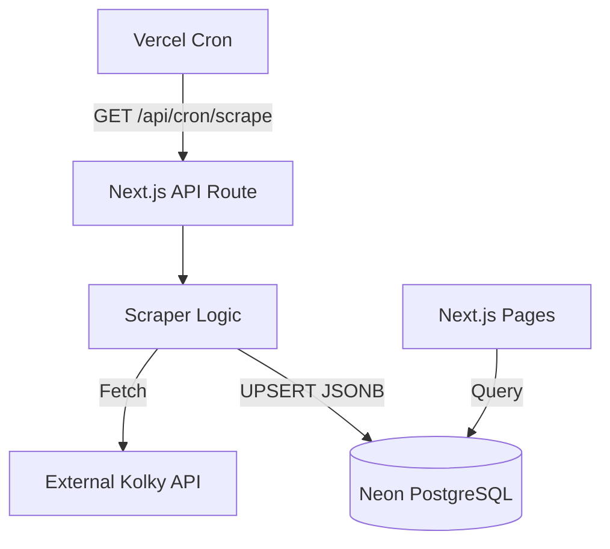

# Requirements

### Overview & Goals
The goal is to move from real-time external API fetching to a persistent database-backed storage in Neon DB. This will improve performance, reduce reliance on the external API availability, and allow for historical data persistence and better filtering.

### Scope
- **In Scope**:
    - Creation of `scraped_data` table in Neon DB.
    - Implementation of a granular scraping job that populates the DB.
    - Setup of a daily Vercel Cron job at midnight.
    - Refactoring of frontend components to use the database as the primary data source.
- **Out of Scope**:
    - Changing the external API endpoints.
    - Implementing a full-blown ORM (keeping it simple with raw SQL and JSONB).

### User Stories
- As a Developer, I want the data to be persisted in a database so that I can query it efficiently and not hit the external API on every page load.
- As a User, I want the dashboard to load quickly using the latest cached data from the database.
- As a System, I want to automatically refresh the data once a day at midnight.

# Technical Design

### Current Implementation
The application currently uses `lib/api.ts` to fetch data directly from `https://api.vysledky.kolky.sk` during server-side rendering of pages. This is done on every request, which is inefficient and depends on the external API's uptime.

### Key Decisions
- **Database**: Use the existing Neon DB connection.
- **Storage Strategy**: **Granular**. Each entity (Team Result, Match Detail, Player Detail, Player Result) will be saved as a separate row in a `scraped_data` table.
- **Schema**: A flexible `JSONB` column approach to accommodate varying data structures while allowing SQL-level filtering.
- **Cron Job**: **Vercel Cron**. A dedicated API route `/api/cron/scrape` will be called by Vercel's scheduler.

### Proposed Changes

#### Database Table (`scraped_data`)
```sql
CREATE TABLE IF NOT EXISTS scraped_data (
  id SERIAL PRIMARY KEY,
  type TEXT NOT NULL,          -- 'team_results', 'match_detail', 'player_detail', 'player_results'
  external_id BIGINT,          -- The ID from the external API
  data JSONB NOT NULL,         -- The actual JSON payload
  updated_at TIMESTAMP WITH TIME ZONE DEFAULT CURRENT_TIMESTAMP,
  UNIQUE(type, external_id)    -- Ensures we only have one row per item type
);
CREATE INDEX idx_scraped_data_type_id ON scraped_data(type, external_id);
```

#### Scraping Logic (`lib/scraper.ts`)
A new module that orchestrates the fetching and saving:
1. `getTeamResults(4844)` -> Save to DB.
2. For each match in results -> `getMatchDetail(matchId)` -> Save to DB.
3. For each player in lineup -> `getPlayerDetail(playerId)` and `getPlayerResults(playerId)` -> Save to DB.

#### API Route (`app/api/cron/scrape/route.ts`)
A Route Handler that calls the scraper.
```typescript
export async function GET(request: Request) {
  // Authorization check...
  await runScrapingJob();
  return Response.json({ success: true });
}
```

#### Vercel Configuration (`vercel.json`)
```json
{
  "crons": [
    {
      "path": "/api/cron/scrape",
      "schedule": "0 0 * * *"
    }
  ]
}
```

### Architecture Diagram


### Risks
- **Rate Limiting**: The external API might rate-limit us if we fetch too many matches/players at once. Mitigation: Add small delays or process in chunks if necessary.
- **Data Stale-ness**: Data will be up to 24 hours old. Mitigation: User explicitly asked for once-a-day refresh at midnight.
- **Missing Data**: If a new player is added, they won't show up until the next crawl.

# Delivery Steps

### ✓ Step 1: Implement Database Schema and Scraping Logic
Initialize the database schema in Neon and implement the scraping logic.
- Create a SQL setup script or a utility function to ensure the `scraped_data` table exists with the necessary `JSONB` column and unique constraints.
- Implement `lib/scraper.ts` to fetch data from the external API (team results, match details, player details/results) and persist it to the `scraped_data` table using `UPSERT` operations.
- Ensure the scraper handles the granular storage strategy (one row per item).

### ✓ Step 2: Set up Cron Job and API Route
Expose the scraper via a Next.js API route and schedule it with Vercel Cron.
- Create `app/api/cron/scrape/route.ts` to trigger the scraping job.
- Configure `vercel.json` to run the cron job daily at midnight (00:00).
- Implement basic security for the cron endpoint (e.g., checking for an environment secret).

### ✓ Step 3: Integrate Database into Frontend Components
Update the application to source data from the database instead of making direct external API calls on every request.
- Add database retrieval functions to `lib/api.ts` (or a new data access file) that query the `scraped_data` table.
- Update `app/page.tsx` to fetch team and match data from the database.
- Update `app/player/[id]/page.tsx` to fetch player details and results from the database.
- Add a fallback or error handling for cases where data might not be in the database yet.