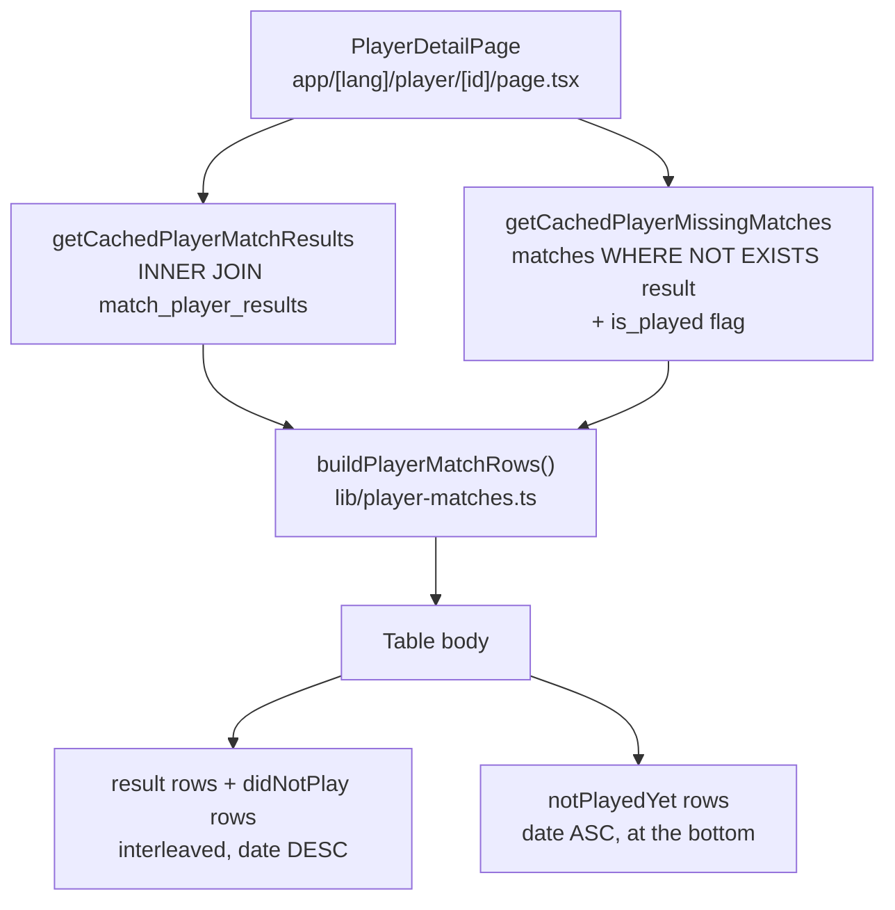

# Context

The player detail page (`app/[lang]/player/[id]/page.tsx`) lists only matches the player actually played. Its query, `getPlayerMatchResultsByExternalId()` (`lib/db-utils.ts:446`), is an **inner join driven from `match_player_results`**, so a match with no lineup row for that player — whether it is still ahead of us or was played without them — can never appear.

`matches` already holds the whole season calendar: `lib/sync.ts:573` collects `match_list` snapshots *"upcoming matches included"*, writing fixtures with `team_total_score` NULL and no lineup. The codebase's established "not played yet" marker is exactly `team_total_score IS NULL` (`getUpcomingFixtures()` `lib/db-utils.ts:636`, `readScoredMatchIds()` `lib/sync.ts:463`, `lib/payday.ts:11`).

Goal: the table shows the **full season calendar** for every player — all 22 Interliga rounds — with three kinds of row:

| row | condition | stats | badge |
| --- | --- | --- | --- |
| result | the player has a `match_player_results` row | real numbers + fine tooltip | — |
| did not play | match is scored, no result row for this player | `-` | **Nehral** / "Did not play" |
| not played yet | `team_total_score IS NULL` | `-` | **Neodohraté** / "Not played yet" |

Decisions taken with the user:
- **Marking**: muted row plus a badge in the Fine column, wording differing by kind.
- **Order**: everything already behind us — results and "did not play" alike — interleaved by date, newest first. Unplayed fixtures appended in `date ASC` at the bottom.

### Note on plan location
`AGENTS.md` requires plans under `.junie/plans/`. Plan mode only allows writing this one file, so **Step 0 of delivery is to copy this file to `.junie/plans/player-detail-full-calendar.md`.**

# Technical Design

### Current Implementation

- `app/[lang]/player/[id]/page.tsx:39-43` — three parallel cached fetches: `getCachedPlayerName`, `getCachedPlayerBalance`, `getCachedPlayerMatchResults`.
- `lib/db-utils.ts:446-515` `getPlayerMatchResultsByExternalId(externalPlayerId, seasonId, leagueKey)` — inner join, `WHERE u.external_player_id = … AND m.season_id = … ${leagueCondition(leagueKey)} ORDER BY m.date DESC`. Every numeric field is coerced with `Number(x || 0)`, so nulls collapse to `0` — unusable for a row with no result.
- `lib/db-utils.ts:198-210` `leagueCondition(leagueKey)` — id list plus name `ILIKE` fallback for `interliga`/`pohar`, id-only for `turnaje`, empty for `all`.
- `lib/db-utils.ts:517-523` `getCachedPlayerMatchResults` — `unstable_cache`, tag `player-match-results` (already in `SYNCED_DATA_TAGS`, `lib/cache.ts:6-11`).
- Table body `app/[lang]/player/[id]/page.tsx:178-256`, 8 columns, empty state at `:249-255` (`dict.playerDetail.noResults`).
- `components/ui/` has **no** `badge.tsx` — the badge is a plain styled `<span>`, not a new UI primitive.

Gotcha found during exploration: an unplayed scraped fixture can carry `league_id IS NULL` when `getSeasonAndLeagueConfig()` fails to resolve it (`lib/sync.ts:645-648`); `lib/home-helpers.ts:181-183` already compensates with *"Fixtures with no league id are unplayed scraped ones, never tournaments."* The new query must do the same, or the `interliga` tab silently loses fixtures.

### Proposed Changes

#### 1. Pure row-building helpers (`lib/player-matches.ts`, new)

db-free (never reaches `lib/db.ts`), so it lives in the `node` vitest project and is importable from anywhere. Generic over the result row, so it does not import `PlayerMatchResult` from `lib/db-utils.ts`.

```ts
export interface DatedMatch {
  matchId: number;
  date: string | null;
}

/** A season match the player has no result row for — either already played, or still ahead. */
export interface MissingMatch extends DatedMatch {
  opponent: string | null;
  isHome: boolean | null;
  leagueName: string | null;
  leagueId: number | null;
  isPlayed: boolean;
}

export type PlayerMatchRow<TResult extends DatedMatch> =
  | { kind: 'result'; match: TResult }
  | { kind: 'didNotPlay'; match: MissingMatch }
  | { kind: 'notPlayedYet'; match: MissingMatch };

const time = (date: string | null) => (date ? Date.parse(date) : NaN);

/** Undated rows sort last in either direction, so a half-scraped row never jumps the list. */
function byDate(direction: 'asc' | 'desc') {
  return (a: DatedMatch, b: DatedMatch) => {
    const aTime = time(a.date);
    const bTime = time(b.date);
    if (Number.isNaN(aTime)) return Number.isNaN(bTime) ? 0 : 1;
    if (Number.isNaN(bTime)) return -1;
    return direction === 'asc' ? aTime - bTime : bTime - aTime;
  };
}

/**
 * Everything behind us newest first — the player's own results and the matches they sat out
 * interleaved — then the fixtures still ahead, oldest first.
 */
export function buildPlayerMatchRows<TResult extends DatedMatch>(
  results: TResult[],
  missing: MissingMatch[],
): PlayerMatchRow<TResult>[] {
  const resultIds = new Set(results.map((r) => r.matchId));
  const unseen = missing.filter((m) => !resultIds.has(m.matchId));

  const past: PlayerMatchRow<TResult>[] = [
    ...results.map((match) => ({ kind: 'result' as const, match })),
    ...unseen.filter((m) => m.isPlayed).map((match) => ({ kind: 'didNotPlay' as const, match })),
  ].sort((a, b) => byDate('desc')(a.match, b.match));

  const upcoming: PlayerMatchRow<TResult>[] = unseen
    .filter((m) => !m.isPlayed)
    .sort(byDate('asc'))
    .map((match) => ({ kind: 'notPlayedYet' as const, match }));

  return [...past, ...upcoming];
}
```

The `resultIds` dedupe is belt-and-braces: the SQL already excludes them with `NOT EXISTS`, but the two queries are separately cached and could in principle be read a moment apart.

#### 2. Unassigned-league option on `leagueCondition` (`lib/db-utils.ts:198`)

```ts
export function leagueCondition(
  leagueKey?: string,
  { includeUnassigned = false }: { includeUnassigned?: boolean } = {},
) {
  const unassigned = includeUnassigned ? sql`m.league_id IS NULL OR ` : sql``;
  if (leagueKey === 'interliga') {
    return sql`AND (${unassigned}m.league_id IN (${idList(INTERLIGA_LEAGUE_IDS)}) OR m.league_name ILIKE '%interliga%')`;
  }
  if (leagueKey === 'pohar') {
    return sql`AND (${unassigned}m.league_id IN (${idList(POHAR_LEAGUE_IDS)}) OR m.league_name ILIKE '%pohár%' OR m.league_name ILIKE '%pohar%' OR m.league_name ILIKE '%finále%' OR m.league_name ILIKE '%finale%')`;
  }
  // Manual competitions are always stamped by us, so an unstamped row is never one of them.
  if (leagueKey === TOURNAMENT_FILTER_KEY) {
    return sql`AND m.league_id IN (${idList(TOURNAMENT_LEAGUE_IDS)})`;
  }
  return sql``;
}
```

Default is `false`, so every existing caller (`getPlayerMatchResultsByExternalId`, `getTrainersWithStats`, `getUnpaidDebtors`, …) is untouched. The `turnaje` branch deliberately ignores the flag — mirrors `includeUnassigned: !isTournamentFilter` in `lib/home-helpers.ts:182`.

#### 3. Missing-match query (`lib/db-utils.ts`, next to `getPlayerMatchResultsByExternalId`)

```ts
/** Season matches this player has no result row for; `team_total_score` says which kind. */
export async function getPlayerMissingMatches(
  externalPlayerId: number,
  seasonId?: number,
  leagueKey?: string,
): Promise<MissingMatch[]> {
  const targetSeasonId = seasonId ?? DEFAULT_SEASON_ID;

  const rows = await sql`
    SELECT
      m.external_id,
      m.date,
      m.opponent,
      m.is_home,
      m.league_name,
      m.league_id,
      (m.team_total_score IS NOT NULL) AS is_played
    FROM matches m
    WHERE m.season_id = ${targetSeasonId}
      AND NOT EXISTS (
        SELECT 1
        FROM match_player_results mpr
        JOIN users u ON mpr.user_id = u.id
        WHERE mpr.match_id = m.external_id
          AND u.external_player_id = ${externalPlayerId}
      )
      ${leagueCondition(leagueKey, { includeUnassigned: true })}
    ORDER BY m.date ASC
  `;

  return rows.map((r) => ({
    matchId: Number(r.external_id),
    date: r.date ? new Date(String(r.date)).toISOString() : null,
    opponent: r.opponent ? String(r.opponent) : null,
    isHome: r.is_home === null ? null : Boolean(r.is_home),
    leagueName: r.league_name ? String(r.league_name) : null,
    leagueId: r.league_id === null ? null : Number(r.league_id),
    isPlayed: Boolean(r.is_played),
  }));
}

export const getCachedPlayerMissingMatches = unstable_cache(
  async (playerId: number, seasonId: number, leagueKey: string) => (
    getPlayerMissingMatches(playerId, seasonId, leagueKey)
  ),
  ['player-missing-matches'],
  { revalidate: SYNCED_DATA_REVALIDATE_SECONDS, tags: ['player-match-results'] },
);
```

Nulls are preserved, unlike `PlayerMatchResult`'s `Number(x || 0)`. Reusing the existing `player-match-results` tag means both invalidators in `lib/cache.ts` already cover it — no change there.

#### 4. Page wiring (`app/[lang]/player/[id]/page.tsx`)

- Add `getCachedPlayerMissingMatches(playerId, selectedSeasonId, selectedLeagueKey)` as a fourth entry in the `Promise.all` at `:39-43`.
- `const rows = buildPlayerMatchRows(matchFines ?? [], missing);`
- Replace the `matchFines.map(...)` body with a `rows.map(...)` that switches on `row.kind`; the existing per-row logic (streak-5 red zero, total colouring, `MatchFineTooltip`) moves unchanged into the `'result'` branch.
- Factor the opponent-label expression (`page.tsx:197-202`) into a local `matchLabel(opponent, isHome)` used by all three branches.
- Empty state stays a `colSpan={8}` `noResults` row, now shown only when `rows.length === 0`.

```tsx
const badgeClass = 'inline-flex items-center rounded-full border px-2 py-0.5 text-[11px] whitespace-nowrap';

// non-result branch
<TableRow key={row.match.matchId} className="text-muted-foreground">
  <TableCell className="whitespace-nowrap">
    {row.match.date ? formatDateOnly(row.match.date, lang) : '-'}
  </TableCell>
  <TableCell className="whitespace-nowrap text-sm">
    {leagueLabelForId(row.match.leagueId, row.match.leagueName, dict)}
  </TableCell>
  <TableCell>{matchLabel(row.match.opponent, row.match.isHome)}</TableCell>
  <TableCell className="text-right">-</TableCell>
  <TableCell className="text-right">-</TableCell>
  <TableCell className="text-right">-</TableCell>
  <TableCell className="text-right">-</TableCell>
  <TableCell className="text-right">
    <span className={badgeClass}>
      {row.kind === 'didNotPlay'
        ? dict.playerDetail.didNotPlay
        : dict.playerDetail.notPlayedYet}
    </span>
  </TableCell>
</TableRow>
```

Mobile-first: the badge is `text-[11px]` and `whitespace-nowrap` inside the card's existing `overflow-x-auto` (`page.tsx:164`), so it adds no horizontal overflow beyond the table that already scrolls.

Header counters (`totalFaults`, balances) keep reducing over `matchFines` only — a match the player sat out contributes nothing.

#### 5. i18n (`locales/{sk,cs,hu,sr}.json`)

Two new keys in the `playerDetail` namespace — `Dictionary` is `typeof sk` (`lib/i18n/types.ts`), so no type file to touch. `locales/locales.test.ts` enforces that all four carry them.

| locale | `playerDetail.didNotPlay` | `playerDetail.notPlayedYet` |
| --- | --- | --- |
| sk | `Nehral` | `Neodohraté` |
| cs | `Nehrál` | `Neodehráno` |
| hu | `Nem játszott` | `Még nem játszott` |
| sr | `Nije igrao` | `Neodigrano` |

Wording to be confirmed against the `translations` skill conventions during implementation.

### Architecture Diagram



### Key Decisions

1. **Second query, not a `UNION ALL` / `LEFT JOIN` rewrite of the existing one.** The existing query is the money query — its result feeds `MatchFineTooltip` and the `Number(x || 0)` coercion. Widening it to emit null-bearing rows would put a "no result" shape through code that assumes a played match. A separate, additive query leaves every money path untouched.
2. **`NOT EXISTS` in SQL rather than filtering in JS.** The page must not fetch the whole calendar and diff it client-side; the database already knows which matches the player is absent from, and the predicate keeps the payload to the rows actually rendered.
3. **`team_total_score IS NOT NULL` distinguishes the two badges.** This is the marker already used by `getUpcomingFixtures()`, `readScoredMatchIds()` and `payday.ts` — not a date comparison, so a match played but not yet scraped correctly reads as "not played yet" until its scores land.
4. **Interleave "did not play" with results, keep fixtures at the bottom.** A missed round belongs in its chronological place in the season; a fixture with no result yet is a forward-looking block the user asked to sit last.
5. **Reuse the `player-match-results` cache tag** rather than adding a new one to `SYNCED_DATA_TAGS`. Both sets of rows go stale on exactly the same event (a sync), so a separate tag buys nothing and adds a way to forget one.
6. **Badge as a styled `<span>`, not a new `components/ui/badge.tsx`.** Two usages of one class string do not justify vendoring a new primitive.
7. **No money-rule impact.** Nothing in `lib/sync.ts`, `lib/money-rules.ts`, `fineAmount()`, or any threshold changes, so the Money Calculation Rules and the `rules` locale namespace stay as they are.

### Edge Cases / Risks

- **Match with `season_id` NULL** — excluded by `m.season_id = $season`, same as today's behaviour for the home page. Accepted; sync resolves the season from the `match_list` team id and this is rare.
- **Match with `league_id` NULL** — handled by `includeUnassigned: true`; without it the `interliga` tab would drop exactly the fixtures this feature is about.
- **A scraped placeholder player with no external id** — the page is keyed by `external_player_id`, so `NOT EXISTS` behaves the same as the existing query; nothing new breaks.
- **Past season (12)** — every match is scored, so the extra rows are all "did not play"; a player who played every round sees the table exactly as today.
- **`turnaje` filter** — manual tournament matches always carry a computed total (`lib/manual-match-actions.ts:92-121`), so a tournament row can only ever appear as "did not play", never as "not played yet".
- **`pohar` tab under season 13** — no cup league configured; the query returns nothing.
- **Undated match** — sorted last in its block by `buildPlayerMatchRows`, renders `-` in the date cell.
- **A trainer or non-playing squad member's page** — every season match renders as "did not play". Acceptable and arguably correct, but worth a look during manual validation.
- **Stale cache** — a newly scraped match appears only after `updateSyncedData()` / `revalidateSyncedData()`, same as every other synced read.

# Delivery Steps

### ✓ Step 0: Copy this plan into the repo
Copy to `.junie/plans/player-detail-full-calendar.md` as AGENTS.md requires; mark steps `✓` there while executing.

### ✓ Step 1: Add the pure row-building helpers
New `lib/player-matches.ts` with `DatedMatch`, `MissingMatch`, `PlayerMatchRow`, and `buildPlayerMatchRows()` as above. Touches: `lib/player-matches.ts`.

### ✓ Step 2: Teach `leagueCondition` about unstamped matches
Add the `includeUnassigned` option (default `false`). Verify no existing call site changes behaviour. Touches: `lib/db-utils.ts`.

### ✓ Step 3: Add the missing-match query and its cached wrapper
`getPlayerMissingMatches()` + `getCachedPlayerMissingMatches`, importing `MissingMatch` from `lib/player-matches.ts`. Touches: `lib/db-utils.ts`.

### ✓ Step 4: Render the three row kinds
Fourth fetch in `Promise.all`, `buildPlayerMatchRows()` call, extracted `matchLabel()` helper, the `row.kind` switch in the table body, and the `rows.length === 0` empty state. Touches: `app/[lang]/player/[id]/page.tsx`.

### ✓ Step 5: Add the locale keys
`playerDetail.didNotPlay` and `playerDetail.notPlayedYet` in all four of `locales/{sk,cs,hu,sr}.json`. Touches: those four files.

### ✓ Step 6: Write the tests
- `lib/player-matches.test.ts` (new, `node` project) — `buildPlayerMatchRows`:
  - a result and a scored missing match interleave by date, newest first;
  - unplayed fixtures always follow the past block, oldest first, even when their dates are older than a result's;
  - a `null` date sorts last within its own block;
  - a missing match whose id is also in `results` is dropped, not duplicated;
  - `([], [])` returns `[]`; the input arrays are not mutated;
  - `kind` is `'didNotPlay'` for `isPlayed: true` and `'notPlayedYet'` for `isPlayed: false`.
  - Fixed ISO date strings only — no dependence on the day the suite runs.
- `lib/db-utils.test.ts` — extend the existing `describe('leagueCondition')` block using the file's `render()` fragment reader: `includeUnassigned` adds `m.league_id IS NULL` for `interliga` and `pohar`; the default omits it (guarding every current money caller); `turnaje` never gains it; `all` still renders the empty string.

Touches: `lib/player-matches.test.ts`, `lib/db-utils.test.ts`.

### ✓ Step 7: Quality check
`nvm use && pnpm check` — lint (Airbnb), type check, and the full vitest suite must pass clean, no `any`.

# Testing

### Validation Approach

**Money rules**: untouched. No threshold, formula, or league-scope rule from the Money Calculation Rules changes, and `recalculateDerivedFinancials()` / `lib/money-rules.ts` are not edited, so no money-mirror test changes are required. `lib/db-utils.ts` *is* edited, but only `leagueCondition`, which the Testing Rules cover explicitly — hence the fragment assertions in Step 6.

**Unit tests** (Step 6), run by `pnpm test:run`:
- `lib/player-matches.test.ts` — ordering, classification, and dedupe.
- `lib/db-utils.test.ts` — `leagueCondition` fragment text, including the default-off case that proves existing money queries are unchanged.
- `locales/locales.test.ts` — passes unchanged once both new keys are in all four files; it fails first if one is missed.

**Manual flows** (`nvm use && pnpm dev`, season 13 is current):
1. `/sk/player/<externalId>` with no query string — the table lists the whole season: results and "Nehral" rows interleaved newest-first, then the remaining rounds as "Neodohraté". Count the rows against the 22-round Interliga calendar.
2. Pick a player known to have missed a played round — that round shows `-` across the stat cells with the **Nehral** badge, and the header's fault total and balances are unchanged from before the change.
3. Switch the league tab to **Interliga** — the unplayed fixture rows survive (this is the `league_id IS NULL` case; if they vanish, `includeUnassigned` is not wired through).
4. Switch to **Turnaje** and to **Slovenský pohár** — no "Neodohraté" rows appear.
5. Switch the season to **2025/2026** — only "Nehral" rows are added; a player who played everything sees the table exactly as before.
6. Open a trainer's or a non-playing member's page and confirm the all-"Nehral" table still renders sensibly.
7. Narrow the viewport to ~375px — the table scrolls horizontally as before, neither badge wraps, nothing overflows the page body.
8. Confirm money is unaffected: header totals, per-row fine amounts, and the success-gathering badge read the same as before the change.
