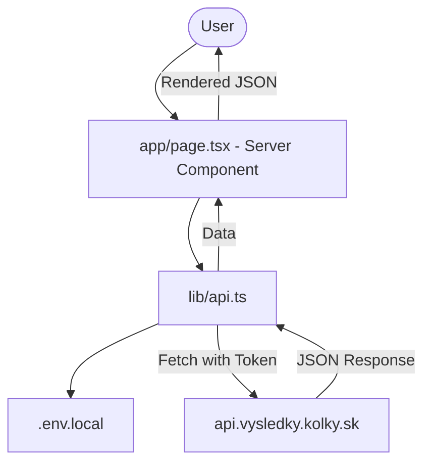

# Requirements

### Overview & Goals
The goal is to establish the foundation for the interactive dashboard by implementing a web scraper that fetches data from the official ninepins league results page. This includes fetching team results, match details to identify players, and individual player statistics.

### Scope
- **In Scope**:
    - Implementation of fetch utilities for team, match, and player endpoints.
    - Secure storage of the API access token.
    - Orchestration logic to identify the latest match and its participating players for team 4844.
    - Rendering the raw JSON data for the team, match, and all identified players on the home page.
- **Out of Scope**:
    - Building the full dashboard UI.
    - Persistent data storage (database).
    - Scraping other teams or leagues (focus is on team 4844 for now).

# Technical Design

### Current Implementation
The project is a fresh Next.js 16 application with an App Router structure. It currently has a placeholder home page.

### Proposed Changes

#### API Integration
We will use the `fetch` API on the server side to call the league's API endpoints.

**Common Headers**:
- `accept: */*`
- `content-type: application/json`
- `origin: https://vysledky.kolky.sk`
- `referer: https://vysledky.kolky.sk/`
- `x-app-accesstoken`: (Stored in `.env.local`)

**Endpoints**:
1. **Team Results**: `https://api.vysledky.kolky.sk/team/results` (POST)
   - Payload: `{"id": 4844}`
2. **Match Detail**: `https://api.vysledky.kolky.sk/match/detail` (POST)
   - Payload: `{"id": <matchId>, "fields": ["league","details","teams","teams.club","results","results.lanes","referee","substitutions","sprint","hall","hall.parent","cards","cards.player"]}`
3. **Player Results**: `https://api.vysledky.kolky.sk/player/results` (POST)
   - Payload: `{"id": <playerId>, "seasonId": 12, "fields": ["results.match","results.tournament","results.tournamentRound","results.tournamentRound.hall","results.match.hall","results.match.hall.parent","results.opponent"]}`

#### Logic Flow
1. Fetch team results for team `4844`.
2. Extract the `matchId` from the first entry in the results list.
3. Fetch match details for that `matchId`.
4. Determine if team `4844` is `homeTeam` or `awayTeam` in that match.
5. Extract all `player.id`s from the corresponding `lineUp` (home or away).
6. Fetch player results for each extracted `player.id`.
7. Render all collected JSON data.

#### Data Models
The data will be handled as raw JSON for this stage.

#### File Structure
- `lib/api.ts`: API client logic.
- `.env.local`: Environment variables (ignored by git).
- `app/page.tsx`: Main page (Server Component).

### Architecture Diagram

### Mobile-First Design
The JSON will be rendered in a container that wraps content properly on small screens, using Tailwind's `overflow-x-auto` to handle long JSON lines if necessary.

# Testing

### Validation Approach
I will verify the implementation by checking the home page for the rendered JSON data.

### Key Scenarios
- **Successful Fetch**: The page displays the JSON data from the API.
- **Token Missing**: Ensure the app handles cases where the token is not set.
- **API Error**: Gracefully handle if the external API is down or returns an error.

# Delivery Steps

### ✓ Step 1: Set up API client and environment variables
Set up the environment and the API client for fetching team, match, and player results.

- Create `.env.local` and add the `X_APP_ACCESSTOKEN` provided in the cURL.
- Create `lib/api.ts` to house the following functions:
    - `getTeamResults(teamId: number)`
    - `getMatchDetail(matchId: number)`
    - `getPlayerResults(playerId: number, seasonId: number)`
- Implement these functions using `fetch` with the specific headers and payloads discovered.
- Ensure the functions handle errors gracefully and return the JSON data.

### ✓ Step 2: Orchestrate data fetching and render JSON on the home page
Integrate the API calls into the main page, orchestrate the flow to get player data, and render the results.

- Update `app/page.tsx` to be an `async` Server Component.
- Implement the logic:
    - Call `getTeamResults(4844)`.
    - Extract the latest `matchId`.
    - Call `getMatchDetail(matchId)`.
    - Extract player IDs for team `4844` from the match detail.
    - Call `getPlayerResults` for each player.
- Render the resulting JSON data for the team, match, and all players in formatted `<pre>` blocks.
- Apply basic styling to ensure it's readable on mobile devices first, following the project's design rules.