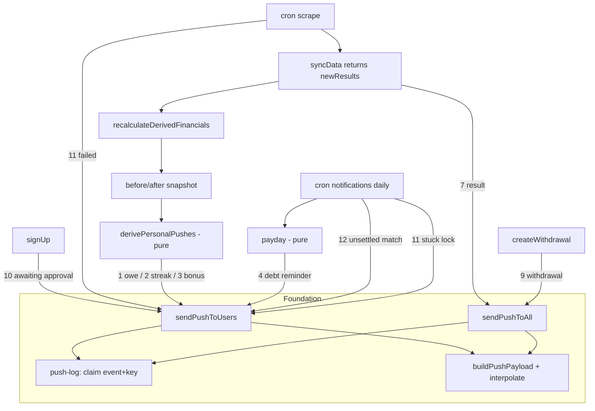

# Requirements

### Overview & Goals

`.junie/plans/push-notifications.md` shipped the push pipeline and two broadcasts
(`dataSynced`, `moneyUpdated`). Both are vague: they say "something changed", never what.
This plan replaces them with notifications that name the thing, and adds an admin safety net
for the flows that fail silently today.

Nine notifications, grouped into four waves behind one shared foundation.

### Scope

**In scope**

| # | Notification | Audience | Trigger |
|---|---|---|---|
| 10 | New registration awaiting approval | admins | `signUp()` |
| 11 | Scrape failed / lock stuck | admins | cron catch branch + daily check |
| 9 | Bank withdrawal recorded | everyone | `createWithdrawal()` |
| 7 | New match result | everyone | scrape, when a match first gets a score |
| 3 | Bonus earned (700+, 40€) | that player | after recalculation |
| 1 | You owe X€ | that player | after recalculation |
| 2 | Streak warning at 4 faultless games | that player | after recalculation |
| 4 | Debt reminder, 2 days before the next home match | debtors | daily cron |
| 12 | Played match still has unpaid fines | admins | daily cron |

**Out of scope**
- Per-category notification preferences — one global toggle, as decided.
- Quiet hours, digest batching, e-mail fallback.
- Any change to a money threshold or formula. This plan only *reads* derived money.

### Decisions taken (confirmed with user)

| Question | Answer |
|---|---|
| What is "payday" for #4 | The **next home match date**, derived from fixtures already in `matches` |
| User control | **One global on/off** — the existing toggle, no new preference schema |
| #12 detection | **Nag while fines are unpaid**, no `misses_reviewed_at` column |
| #7 on a multi-match scrape | **Collapse into one push**: detailed when exactly one result is new, "N new results" otherwise |

### Notification budget

Worst case for one player in a match week: result (7) + owe or bonus (1/3) + streak (2)
+ debt reminder (4) = **4 pushes**. With a single global toggle that is the ceiling and a
player who wants fewer must mute all of them. If that turns out to be too many, the fix is
per-category toggles, which this plan deliberately leaves out.

iOS still receives nothing unless the PWA is installed to the home screen (16.4+).

# Technical Design

### Current implementation

- `lib/push.ts` — `sendPushToAll(event)` only. Reads every row of `push_subscriptions`,
  groups by `lang`, one payload per locale, batches of 25, deletes on 404/410, never throws.
- `lib/push-payload.ts` — `PUSH_EVENTS = ['dataSynced', 'moneyUpdated']`, `buildPushPayload`
  takes no parameters, so no amount or name can appear in a notification today.
- `push_subscriptions` — `userId` FK (cascade), `endpoint` unique, `lang`. Targeting by user
  is possible; nothing uses it yet.
- `lib/sync.ts` — `recalculateDerivedFinancials()` is pure SQL and the single writer of
  `calculated_fine`, `streak_fine`, `bonus_received`, `faultless_streak`. `syncData()` returns
  `void` and reports nothing about what changed.
- `lib/db-utils.ts` — `getUnpaidDebtors()` returns `{ name, amount }`, **no `user_id`**, so it
  cannot address a push. `getPlayerBalances()` does return `user_id`.
- `vercel.json` — one cron, `/api/cron/scrape`, Sundays 20:00 UTC, and it is date-gated off
  until 2026-09-13 (`app/api/cron/scrape/route.ts`).
- `lib/auth-actions.ts:24` `signUp()` inserts `role: 'player', isApproved: false` and tells
  nobody.
- `system_status` is a two-column key/value table used only for the scrape lock.

### Proposed changes

#### 0. Foundation (`lib/push-payload.ts`, `lib/push.ts`, `lib/db/schema.ts`, `vercel.json`)

**0a. Parameterised payloads.** `buildPushPayload(event, lang, push, params?)` runs the title
and body through the existing `interpolate()` (`lib/i18n/config.ts`). Locale strings gain
placeholders (`{amount}`, `{opponent}`, `{count}`, `{name}`); `locales/locales.test.ts`
already fails when a placeholder goes missing in one of the four files. Counted nouns go
through `pluralize` (`lib/i18n/plural.ts`) — Hungarian keeps the singular after a numeral.

**0b. Targeted sending.** `sendPushToUsers(recipients, event)` beside `sendPushToAll`, where
`recipients` is `Array<{ userId: string; params?: Record<string, string | number> }>`. Same
batching, same 404/410 cleanup, same never-throws contract. `sendPushToAll` keeps its
signature and both funnel into one private `deliver()`. A helper `getAdminUserIds()` covers
the admin-only events.

**0c. Dedupe log.** New table, so a reminder fires once and a failing cron does not notify
every run:

```ts
export const pushLog = pgTable('push_log', {
  id: serial('id').primaryKey(),
  event: text('event').notNull(),
  // What the event is about: a match id, a payday date, a user id. Unique with `event`.
  dedupeKey: text('dedupe_key').notNull(),
  sentAt: timestamp('sent_at', { withTimezone: true }).defaultNow(),
}, (table) => [
  uniqueIndex('idx_push_log_event_key').on(table.event, table.dedupeKey),
]);
```

`lib/push-log.ts`: `claim(event, key): Promise<boolean>` — inserts with
`onConflictDoNothing()` and returns whether the insert won. One atomic call, so two
overlapping cron runs cannot both send. Pruning rows older than a season is a later concern.

**0d. Daily cron.** `/api/cron/notifications`, `0 8 * * *` in `vercel.json`, same
`CRON_SECRET` bearer check as the scrape route. Runs the #4, #11-stuck-lock and #12 checks.
Add `/api/cron/` is already in `publicApiPrefixes`, so no proxy change.

#### 1. Wave 1 — admin safety net (#10, #11)

- **#10** — `lib/auth-actions.ts` `signUp()`, after the insert succeeds:
  `sendPushToUsers(await getAdminUserIds(), 'userAwaitingApproval', { name })`. Never blocks
  the sign-up: the sender already swallows its own failures.
- **#11a** — `app/api/cron/scrape/route.ts` catch branch and `triggerSync()` catch branch:
  push `scrapeFailed` to admins, deduped on the UTC date so a retry storm sends once.
- **#11b** — daily cron: `system_status` row `scraping_job` still locked and `updated_at`
  older than 2 hours → `scrapeStuck` to admins, deduped on the lock's `updated_at` value.

Admins are 1–2 people, so this wave proves targeted sending on a tiny audience before it
points at the whole squad.

#### 2. Wave 2 — broadcasts (#9, #7)

- **#9** — `lib/bank-withdrawal-actions.ts` `createWithdrawal()`, after `updateSyncedData()`:
  `sendPushToAll('bankWithdrawal', { amount, category, balance })`. The category label comes
  from `lib/withdrawal-categories.ts`, so it is already client/server safe; the localized
  label must go through the locale files, never the raw value.
- **#7** — `syncData()` currently returns `void`. Change it to return
  `{ newResults: Array<{ externalId, opponent, isHome, teamTotalScore, opponentTotalScore }> }`,
  computed by selecting the ids that had `team_total_score IS NULL` before the upsert and have
  a score after it. `runScrapingJob()` passes that up; the cron route and `triggerSync()` then
  send **one** push: `matchResult` with opponent and score when exactly one is new,
  `matchResults` with `{count}` otherwise. This **replaces** the `dataSynced` broadcast — when
  a scrape finds no new result, nobody is notified at all, which is the common case for the
  weekly cron. Deduped on the match id via `push-log`, so a re-scrape is silent.

The result formatting (which side won, how to phrase a draw) is a pure function in
`lib/push-digest.ts` with its own test — no SQL, no dictionary lookups beyond the key.

#### 3. Wave 3 — personal money (#3, #1, #2)

All three read the same before/after snapshot around `recalculateDerivedFinancials()`, so
they are one change, not three.

- `lib/sync.ts` gains a private `readPlayerMoneySnapshot()` returning, per user:
  `{ userId, unpaidFines, bonusUnpaid, faultlessStreak }`. It is called once before the
  recalculation and once after.
- The diff itself is a **pure, db-free function** in `lib/push-digest.ts`:
  `derivePersonalPushes(before, after)` → `Array<{ userId, event, params }>`, covering
  `bonusEarned` (bonus went up), `fineAdded` (unpaid fines went up, with the delta and the new
  total) and `streakWarning` (`faultlessStreak` became exactly 4). Tested table-driven at the
  boundaries — 3/4/5 for the streak, no push when a number is unchanged, no push for a user
  whose row was already paid.
- One user gets at most one money push per recalculation: `bonusEarned` wins over `fineAdded`
  wins over `streakWarning`. Priority lives in the pure function and is tested.
- The caller is whoever already owns invalidation — the cron route, `triggerSync()`,
  `applyMatchMoneyUpdates()`'s callers. `recalculateDerivedFinancials()` itself stays a pure
  writer and sends nothing, so `scripts/` keeps working outside Next.

Per the Testing Rules, `lib/sync.ts` may not change without tests; the snapshot reader is SQL
and untestable, so all judgement lives in `lib/push-digest.ts` and is covered there.

#### 4. Wave 4 — scheduled reminders (#4, #12)

- **Payday** — `lib/payday.ts`, pure and db-free: `nextHomeMatchDate(fixtures, now)` picks the
  earliest future `matches` row with `is_home = true`, and `isReminderDay(payday, now)` is true
  exactly 2 days before, in Europe/Bratislava. Reuses the Bratislava helpers in `lib/dates.ts`
  and takes an injected `now`, so no test depends on the day it runs; both DST switch days are
  covered, as the existing date tests are.
- **#4** — daily cron: if today is the reminder day, `getUnpaidDebtorsByUser()` (new, returns
  `user_id` alongside name and amount — the existing `getUnpaidDebtors()` keeps its shape for
  the dashboard) and `sendPushToUsers(debtors, 'debtReminder', { amount, date })`. Deduped on
  the payday date, so it cannot fire twice.
- **#12** — same cron: any match played more than 3 days ago with unpaid fines →
  `unsettledMatch` to admins, deduped on `(matchId, week)` so it nags weekly, not daily.

`getUnpaidDebtorsByUser()` is a money aggregation in `lib/db-utils.ts`, so per the Testing
Rules it needs `lib/db-utils.test.ts` coverage of the fragments it builds.

### Architecture diagram



### Key decisions

1. **Admin wave first.** It uses only the parameterised payload and targeted sender, its
   audience is 1–2 people, and it closes holes where a failure is currently invisible. It is
   the cheapest way to prove targeting before aiming it at the whole squad.
2. **#7 replaces `dataSynced` rather than joining it.** "New data uploaded" plus "new result"
   is two pushes for one event. When a scrape finds nothing new, silence is correct.
3. **All personal money notifications are one change.** They read the same snapshot; splitting
   them would mean diffing the same rows three times.
4. **The diff is a pure function.** `recalculateDerivedFinancials()` is SQL and untestable, so
   every judgement about what deserves a push lives in `lib/push-digest.ts`, mirroring how
   `lib/money-rules.ts` mirrors the money SQL.
5. **Dedupe in the database, not in memory.** Serverless functions share no state; a unique
   `(event, dedupe_key)` insert is the only thing two concurrent cron runs cannot both win.
6. **`getUnpaidDebtors()` is extended by a sibling, not changed.** The dashboard groups by
   display name and must keep doing so; the push needs `user_id`.

### Edge cases / risks

- **Notification storm on a backfill.** A first scrape of a new season could mark dozens of
  matches as "new results". The collapse rule caps #7 at one push; the personal money pushes
  are capped at one per user per recalculation. Worth a manual dry run before the season opens.
- **`recalculateDerivedFinancials()` runs from `scripts/`**, outside Next. The snapshot diff
  must be driven by the caller, never by the recalculation itself, or the CLI breaks the same
  way `updateSyncedData()` does.
- **Paid rows.** A push must never say "you owe" about a row someone already settled; the
  snapshot reads unpaid amounts only.
- **The scrape cron is off until 2026-09-13**, so #7 and #11a can only be exercised through
  the Sync button or a hand-made request until then.
- **No fixtures, no payday.** `nextHomeMatchDate` returns null out of season and #4 sends
  nothing. That is correct, and must be a test case rather than a crash.
- **Placeholder drift.** Amounts and opponent names are interpolated into four locale files;
  `locales.test.ts` catches a missing placeholder, not a wrong one, so each new string needs a
  rendered-output assertion.

# Delivery Steps

### ✓ Step 1: Foundation — parameterised payloads
`lib/push-payload.ts` gains `params`; `lib/push-payload.test.ts` covers interpolation in all
four locales, including a plural noun through `pluralize`.

### ✓ Step 2: Foundation — targeted sending
`sendPushToUsers()` and `getAdminUserIds()` in `lib/push.ts`; `sendPushToAll` refactored onto
the shared `deliver()`.

### ✓ Step 3: Foundation — dedupe log
`pushLog` in `lib/db/schema.ts`, `lib/push-log.ts` with `claim()`, `pnpm db:push`.

### ✓ Step 4: Foundation — daily cron
`app/api/cron/notifications/route.ts` (empty checks for now) and the `vercel.json` entry.

### ✓ Step 5: Wave 1 — #10 and #11
`lib/auth-actions.ts`, `app/api/cron/scrape/route.ts`, `lib/actions.ts`, the daily cron's
stuck-lock check, plus the four locale files.

### ✓ Step 6: Wave 2 — #9
`lib/bank-withdrawal-actions.ts` and the locale strings.

### ✓ Step 7: Wave 2 — #7
`syncData()` returns `newResults`; `runScrapingJob()` passes it up; the cron route and
`triggerSync()` send the collapsed push. Result phrasing is a tested pure function in
`lib/push-digest.ts`. Retires the `dataSynced` event.

### ✓ Step 8: Wave 3 — money snapshot and the pure diff
`readPlayerMoneySnapshot()` in `lib/sync.ts`, `derivePersonalPushes()` in
`lib/push-digest.ts`, wired into every caller that already owns invalidation. Covers #1, #2
and #3 at once.

### ✓ Step 9: Wave 3 — tests for the diff
`lib/push-digest.test.ts`, table-driven: streak 3/4/5, bonus up/unchanged, fines up/unchanged,
already-paid rows silent, priority when a user qualifies for two events at once.

### ✓ Step 10: Wave 4 — payday
`lib/payday.ts` and `lib/payday.test.ts` — injected `now`, both DST switch days, no-fixtures
case.

### ✓ Step 11: Wave 4 — #4 and #12
`getUnpaidDebtorsByUser()` in `lib/db-utils.ts` with its `lib/db-utils.test.ts` coverage, both
checks in the daily cron, locale strings.

### ✓ Step 12: Quality check
`nvm use && pnpm check` — lint, type check and the full suite, plus `pnpm build`.

# Testing

### Validation approach

**Automated**
- `lib/push-payload.test.ts` — interpolation across `sk/cs/hu/sr`; a counted noun renders
  1 / 2 / 5 correctly in the three Slavic locales and stays singular in Hungarian.
- `lib/push-digest.test.ts` — the whole of Wave 3's judgement: streak `3 / 4 / 5`, bonus and
  fine deltas at zero and above, paid rows excluded, one push per user with a fixed priority.
  Also `#7`'s result phrasing: home win, away win, draw, and the collapse to `{count}`.
- `lib/payday.test.ts` — reminder day exactly 2 days before the next home fixture in
  Europe/Bratislava, on both DST switch days, and null when there is no upcoming home match.
- `lib/db-utils.test.ts` — the fragments behind `getUnpaidDebtorsByUser()`, following the
  existing exception that lets this file read built SQL fragments.
- `locales/locales.test.ts` — key and placeholder parity for every new string, in all four files.
- No money threshold changes, so `lib/money-rules.test.ts` and the Money Calculation Rules
  section of AGENTS.md stay as they are.

**Manual, on a preview deployment**
1. Sign up a throwaway account → the admin device gets #10; approve it and confirm no second push.
2. Press Sync with no new results → **no** push at all. Add a manual match with a score, press
   Sync → one #7 with the opponent and score.
3. Same sync → the affected player's device gets exactly one money push, and a player whose
   numbers did not move gets none.
4. Record a withdrawal → #9 shows the amount and the new balance.
5. Break `X_APP_ACCESSTOKEN`, press Sync → admins get #11a once, not once per failed request.
6. Call `/api/cron/notifications` by hand with the bearer secret two days before a home
   fixture → debtors get #4, and a second call the same day sends nothing.
7. Leave a played match with unpaid fines → the next daily run nags the admin, and the run
   after that does not.
