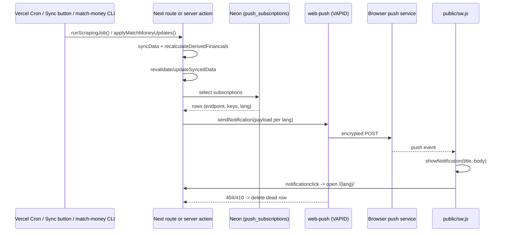

# Context

The PWA work (PR #18, `1241c71`) made the app installable, added a hand-written service worker
(`public/sw.js`), an offline fallback and a rolling session — but deliberately left push
notifications out of scope. `.junie/plans/pwa-installable-app.md:37-39` states the service worker was
written so `push` / `notificationclick` handlers can be appended later. This plan is that follow-up.

Goal: users get a push notification whenever fresh data lands, in two situations.

1. The scraper finishes — the weekly Vercel cron (`/api/cron/scrape`) or the admin Sync button
   (`triggerSync()`).
2. Manual money updates (special misses, fines/bonuses marked paid, trainer payments) are done —
   sent explicitly by the admin, not automatically per write.

## Answer to "do I need Firebase?"

**No.** Use the **W3C Web Push protocol with VAPID keys** and the `web-push` npm package.

- Firebase Cloud Messaging on the web is a wrapper *over the same protocol*; it would add the Firebase
  SDK, a second service worker (`firebase-messaging-sw.js`) and a service-account credential for zero
  functional gain here. Plain Web Push has no vendor, no account, no cost, no dashboard.
- Setup is one command: `npx web-push generate-vapid-keys` produces a public/private key pair that
  goes into env vars. Nothing else to register anywhere.
- Delivery is handled by the browser vendors' own push services (FCM endpoint for Chrome, Mozilla
  autopush, Apple's APNs bridge) — reached by URL from the subscription object; no keys needed for any
  of them.
- Support: Chrome/Edge/Firefox/Opera on desktop and Android, Safari 16.4+ on macOS, and **iOS/iPadOS
  16.4+ only when the app is installed to the home screen** — exactly the installable PWA that already
  exists. The permission UI must therefore degrade gracefully on an un-installed iOS Safari.

# Requirements

### Scope

**In scope**
- `push_subscriptions` table + `pnpm db:push`.
- VAPID env vars, `web-push` dependency.
- `push` / `notificationclick` / `pushsubscriptionchange` handlers in `public/sw.js`.
- Opt-in toggle in the user dropdown (desktop) and mobile nav, following the existing
  `InstallPrompt` / `usePwaInstall` pattern.
- Per-subscription locale: the `lang` slug is stored at subscribe time; each subscriber gets the push
  in their own language and a deep link to `/{lang}/`.
- Send on: cron scrape finish, admin Sync button finish, explicit admin "Notify users" action
  (plus a `--notify` flag on `scripts/match-money.ts apply`).
- Dead-subscription cleanup on 404/410.
- Tests: pure payload builder, the subscribe hook, the toggle component, locale key parity.

**Out of scope**
- Per-user notification categories / quiet hours.
- Notifications for anything other than the two events above.
- A settings page (the toggle lives in the existing dropdown).
- E-mail notifications.

### Decisions taken (confirmed with user)
| Question | Answer |
|---|---|
| Audience | Everyone who subscribed — no `is_approved` / role filter |
| Localisation | Per-subscription locale, from `locales/{sk,cs,hu,sr}.json` |
| Opt-in UI | Toggle in the user dropdown / mobile nav |
| Manual money updates | Explicit admin "Notify users" action, not one push per write |

# Technical Design

### Current implementation

- `public/sw.js` — hand-written, 82 lines, cache `ilp-static-v1`; `install` / `activate` / `fetch` /
  `message` listeners. No push handlers. Lint-ignored (`eslint.config.mjs:21`), served `no-store`
  (`next.config.ts:9-21`).
- `components/pwa/ServiceWorkerRegistrar.tsx:11` registers `/sw.js`, production only.
- `lib/hooks/usePwaInstall.ts` — the pattern for a browser-capability hook (support detection,
  `localStorage` dismissal, event listeners); tested in `lib/hooks/usePwaInstall.test.ts`.
- `app/api/cron/scrape/route.ts:42-45` — `runScrapingJob('cron')` then `revalidateSyncedData()`.
  **Note: the route is date-gated off until `2026-09-13` (`:28-38`), so pushes from the cron will not
  fire before then — test through the Sync button.**
- `lib/actions.ts:11-27` — `triggerSync()`; `runScrapingJob('manual')` then `updateSyncedData()`.
  **It has no server-side role check**, unlike every other mutating action. Adding push to it turns
  that into a spam vector, so the gate is part of this work.
- `lib/scraper.ts:26-29` — returns early (undefined) when the advisory lock is already held.
- `lib/match-money.ts:243-271` — `applyMatchMoneyUpdates()`; recalculates, never invalidates, "the
  caller owns invalidation". Its only caller is `scripts/match-money.ts:101`, which then calls
  `requestSyncedDataRevalidation()`. There is **no admin UI for special misses** — that flow is CLI +
  the `manage-match-results-and-payments` skill.
- `lib/i18n/dictionaries.ts` — `getDictionary(locale)`, `server-only`, dynamic-imports the JSON.
- Schema: drizzle, `lib/db/schema.ts`; **no migration files** — the workflow is `pnpm db:push`.
- `users` has **no locale column**; locale lives in the `next-locale` cookie and the `/[lang]/` prefix.

### Proposed changes

#### 1. Dependency and env (`package.json`, `.env.local`, Vercel project settings)

```bash
pnpm add web-push
pnpm add -D @types/web-push
npx web-push generate-vapid-keys
```

Three new vars, added to `.env.local` **and** to the Vercel project (all environments):

| Var | Value | Exposure |
|---|---|---|
| `NEXT_PUBLIC_VAPID_PUBLIC_KEY` | generated public key | client + server (public by design) |
| `VAPID_PRIVATE_KEY` | generated private key | server only — never `NEXT_PUBLIC_` |
| `VAPID_SUBJECT` | `mailto:phendrych97@gmail.com` | server only |

`web-push` must run on the Node runtime (it uses `crypto`), which is the default for route handlers
and server actions here — do not add `export const runtime = 'edge'` to anything that sends.

#### 2. Schema (`lib/db/schema.ts`)

```ts
export const pushSubscriptions = pgTable('push_subscriptions', {
  id: uuid('id').default(sql`gen_random_uuid()`).primaryKey(),
  userId: uuid('user_id').notNull().references(() => users.id),
  endpoint: text('endpoint').notNull(),
  p256dh: text('p256dh').notNull(),
  auth: text('auth').notNull(),
  lang: text('lang').notNull().default('sk'),
  createdAt: timestamp('created_at', { withTimezone: true }).defaultNow(),
  lastSuccessAt: timestamp('last_success_at', { withTimezone: true }),
}, (table) => [
  uniqueIndex('idx_push_subscriptions_endpoint').on(table.endpoint),
  index('idx_push_subscriptions_user').on(table.userId),
]);
```

`endpoint` is unique so re-subscribing on the same device updates instead of duplicating (upsert on
conflict). The FK has no cascade, matching the existing convention, so `deleteUser()` must delete push
rows first — see change 8. Apply with `pnpm db:push` (no migration files in this repo).

#### 3. Service worker (`public/sw.js`) — append below the existing `message` listener

```js
self.addEventListener('push', (event) => {
  let payload = {};
  try {
    payload = event.data ? event.data.json() : {};
  } catch {
    payload = {};
  }
  const title = payload.title || 'Interliga Podbrezová';
  event.waitUntil(self.registration.showNotification(title, {
    body: payload.body || '',
    icon: '/icons/icon-192.png',
    badge: '/icons/icon-192.png',
    // Same tag collapses repeats of one event instead of stacking them.
    tag: payload.tag || 'ilp-data',
    data: { url: payload.url || '/' },
  }));
});

self.addEventListener('notificationclick', (event) => {
  event.notification.close();
  const target = (event.notification.data && event.notification.data.url) || '/';
  event.waitUntil((async () => {
    const all = await self.clients.matchAll({ type: 'window', includeUncontrolled: true });
    const existing = all.find((c) => 'focus' in c);
    if (existing) {
      await existing.focus();
      if ('navigate' in existing) await existing.navigate(target);
      return;
    }
    await self.clients.openWindow(target);
  })());
});

// Browsers rotate endpoints; without this the subscription silently dies.
self.addEventListener('pushsubscriptionchange', (event) => {
  event.waitUntil((async () => {
    const sub = event.newSubscription || await self.registration.pushManager.subscribe(
      event.oldSubscription.options,
    );
    await fetch('/api/push/resubscribe', {
      method: 'POST',
      headers: { 'Content-Type': 'application/json' },
      body: JSON.stringify({
        oldEndpoint: event.oldSubscription && event.oldSubscription.endpoint,
        subscription: sub.toJSON(),
      }),
    });
  })());
});
```

`CACHE` stays `ilp-static-v1` — `PRECACHE` is unchanged. The `/sw.js` `no-store` header already makes
browsers pick the new file up.

#### 4. Payload builder (`lib/push-payload.ts`, pure, db-free)

Db-free so it is unit-testable and importable from both sides (the Client/Server Boundary rule).

```ts
export type PushEvent = 'dataSynced' | 'moneyUpdated';

export interface PushPayload { title: string; body: string; url: string; tag: string }

export function buildPushPayload(
  event: PushEvent,
  lang: Locale,
  dict: Dictionary['push'],
): PushPayload {
  return {
    title: dict[event].title,
    body: dict[event].body,
    url: `/${lang}/`,
    tag: `ilp-${event}`,
  };
}
```

#### 5. Sender (`lib/push.ts`, `import 'server-only'`)

- Module-scope `webpush.setVapidDetails(VAPID_SUBJECT, NEXT_PUBLIC_VAPID_PUBLIC_KEY, VAPID_PRIVATE_KEY)`
  guarded by a `isPushConfigured()` check — **must not throw at import time** the way `lib/db.ts` does,
  because the cron route and `triggerSync()` import it and missing keys must degrade to "no push", not
  a broken sync.
- `sendPushToAll(event: PushEvent): Promise<{ sent: number; removed: number }>`
  1. `select` all rows from `push_subscriptions`;
  2. group by `lang`, `await getDictionary(lang)` once per distinct locale;
  3. `buildPushPayload(event, lang, dict.push)` → `JSON.stringify`;
  4. `Promise.allSettled` over `webpush.sendNotification()` in batches of 25 to stay inside the Vercel
     function timeout;
  5. on `statusCode` 404 or 410, delete that row (gone for good); log and keep everything else;
  6. never throw — a failed push must not fail a sync. Wrap the whole body in try/catch and log.

#### 6. Subscribe/unsubscribe server actions (`lib/push-actions.ts`, `'use server'`)

Follows the `{ success, error }` + error-code convention of `lib/admin-actions.ts` — no throwing.

- `savePushSubscription(subscription: PushSubscriptionJSON, lang: Locale)` — requires a session,
  upserts on `endpoint` conflict (updating `userId` and `lang`).
- `removePushSubscription(endpoint: string)` — requires a session, deletes by endpoint.
- `notifyDataUpdated()` — **admin only** (`getSession()` + `role === 'admin'`); calls
  `sendPushToAll('moneyUpdated')`. This is the explicit "Notify users" action.

Error codes `PUSH_UNAUTHORIZED`, `PUSH_SAVE_FAILED`, `PUSH_SEND_FAILED` mapped to localized strings on
the client.

#### 7. Resubscribe route (`app/api/push/resubscribe/route.ts`)

`POST`, session-gated. Deletes `oldEndpoint` if present and upserts the new subscription, reusing the
same helpers as `savePushSubscription`. A route handler rather than a server action because the
service worker calls it with `fetch`.

#### 8. Wiring the two triggers

- **`lib/scraper.ts:23`** — change `runScrapingJob` to `Promise<boolean>`: `return false` at the
  lock-not-acquired early return (`:29`), `return true` after `syncData(payloads)`. So a skipped run
  never notifies.
- **`app/api/cron/scrape/route.ts`** — after `revalidateSyncedData()`:
  ```ts
  const didRun = await runScrapingJob('cron');
  revalidateSyncedData();
  if (didRun) await sendPushToAll('dataSynced');
  ```
- **`lib/actions.ts` `triggerSync()`** — same pattern after `updateSyncedData()`, **plus** the missing
  admin gate at the top:
  ```ts
  const session = await getSession();
  if (session?.user.role !== 'admin') return { success: false, error: 'UNAUTHORIZED' };
  ```
- **`lib/admin-actions.ts` `deleteUser()`** — delete the user's `push_subscriptions` rows before the
  `users` delete (they are not money; unlike results they need no manual review). `countLinkedRecords`
  is left untouched so push rows never block a deletion.
- **`scripts/match-money.ts`** — add a `--notify` flag to `apply`; after
  `requestSyncedDataRevalidation()` it POSTs `/api/push/notify` with the `CRON_SECRET` bearer (same
  shape as `app/api/revalidate/route.ts`), because the script runs outside Next. Add a matching
  `app/api/push/notify/route.ts` that accepts either the cron secret **or** an admin session and calls
  `sendPushToAll('moneyUpdated')`. Update `.claude/skills/manage-match-results-and-payments/SKILL.md`
  to mention the flag.

#### 9. Client hook (`lib/hooks/usePushNotifications.ts`)

Mirrors `usePwaInstall.ts`. Returns
`{ isSupported, permission, isSubscribed, isBusy, subscribe, unsubscribe }`.

- `isSupported` = `'serviceWorker' in navigator && 'PushManager' in window && 'Notification' in window`.
- On mount: `navigator.serviceWorker.ready` → `registration.pushManager.getSubscription()` to seed
  `isSubscribed`.
- `subscribe()`: `Notification.requestPermission()`, then
  `pushManager.subscribe({ userVisibleOnly: true, applicationServerKey: urlBase64ToUint8Array(key) })`,
  then `savePushSubscription(sub.toJSON(), lang)`.
- `unsubscribe()`: `sub.unsubscribe()` then `removePushSubscription(sub.endpoint)`.
- `urlBase64ToUint8Array` is a small local helper (base64url → `Uint8Array`) — also unit-tested.

#### 10. UI (`components/pwa/PushNotificationToggle.tsx`, `'use client'`)

- A `DropdownMenuItem`-shaped row with a bell icon, rendered in
  `components/layout/UserDropdown.tsx` and `components/layout/MobileNav.tsx` next to the existing
  items, receiving `translations={dict.pwa}` the same way `InstallPrompt` does.
- Hidden when `!isSupported`. When `permission === 'denied'`, render a disabled row with the "blocked
  in browser settings" string rather than a button that cannot work.
- Admin only, below the Sync item: a **"Notify users"** row calling `notifyDataUpdated()`, with the
  same confirm dialog pattern as `SyncDataDialog.tsx` so it cannot be hit by accident.

#### 11. i18n (`locales/{sk,cs,hu,sr}.json`)

New `push` namespace (used by the service payload) plus additions to `pwa` (used by the UI):

```jsonc
"push": {
  "dataSynced":   { "title": "Nové výsledky", "body": "Dáta boli aktualizované. Pozri si nové výsledky." },
  "moneyUpdated": { "title": "Aktualizované financie", "body": "Pokuty a bonusy boli aktualizované." }
},
"pwa": {
  "notificationsEnable": "...", "notificationsDisable": "...", "notificationsBlocked": "...",
  "notifyUsers": "...", "notifyConfirmTitle": "...", "notifyConfirmDescription": "...",
  "notifySent": "...", "notifyError": "..."
}
```

All four locale files change together; `locales/locales.test.ts` enforces key parity.
`lib/i18n/types.ts` needs the `push` namespace added to `Dictionary`.

### Architecture diagram



### Key decisions

1. **Web Push + VAPID over Firebase** — see the top section. No account, no SDK, no extra service
   worker; `web-push` is a single dependency and the keys are generated locally.
2. **`push_subscriptions` keyed by endpoint, not by user** — one user can have several devices, and
   the endpoint is the thing the browser rotates. `userId` stays as a FK so a deleted user's
   subscriptions can be cleaned up.
3. **Locale stored per subscription, not per user** — the app has no per-user language column and the
   locale currently lives in a cookie; storing it on the subscription is the smallest change that
   still gives each device the right language.
4. **Explicit "Notify users" for money updates** — the money flow is a CLI session with many
   individual writes; pushing per write would send a burst. An explicit action (button or `--notify`)
   keeps one notification per editing session.
5. **`sendPushToAll` never throws** — a broken push must never fail a scrape or a money write. Same
   reasoning as `requestSyncedDataRevalidation()`, which warns instead of throwing.
6. **`runScrapingJob` returns a boolean** — the lock-skip path already returns early; without a signal
   a concurrent cron run would notify about a sync it did not perform.
7. **Admin gate added to `triggerSync()`** — it is currently unauthenticated and UI-gated only; wiring
   a broadcast into it without a gate would let any signed-in visitor push to every user.

### Edge cases / risks

- **iOS**: push works only in an installed PWA on 16.4+. The toggle must be hidden (not broken) in
  mobile Safari — `isSupported` covers it, since `PushManager` is absent there.
- **Permission denied permanently**: no way back from JS; show the "change it in browser settings"
  string.
- **Missing VAPID env vars** (e.g. a preview deployment): `isPushConfigured()` returns false, sender
  logs and returns `{ sent: 0, removed: 0 }`, sync unaffected.
- **Dead subscriptions**: uninstalling the PWA or clearing site data leaves a stale row; the 404/410
  cleanup removes it on the next send.
- **The cron is paused until 2026-09-13**, so end-to-end verification of the cron path must be done by
  calling the route by hand with the bearer secret, or through the Sync button.
- **Vercel function timeout**: batches of 25 keep a broadcast well inside it for a squad-sized user
  base; if subscriptions ever grow past a few hundred this needs a queue.
- **Localhost**: the service worker registers in production only
  (`ServiceWorkerRegistrar.tsx:8`), so subscribing cannot be tested with `pnpm dev` — use
  `pnpm build && pnpm start`, or temporarily lift that guard.
- **No money rule changes** — nothing in this plan touches `lib/sync.ts` money SQL,
  `lib/money-rules.ts` or thresholds, so the Money Calculation Rules and the `rules` locale namespace
  stay as they are.

# Delivery Steps

### ✓ Step 0: Copy this plan into the repo
Write this document to `.junie/plans/push-notifications.md` (AGENTS.md Plan Mode Rules); mark steps
with `✓` there as they complete.

### ✓ Step 1: Dependency, keys, env
`pnpm add web-push`, `pnpm add -D @types/web-push`, `npx web-push generate-vapid-keys`. Put
`NEXT_PUBLIC_VAPID_PUBLIC_KEY`, `VAPID_PRIVATE_KEY`, `VAPID_SUBJECT` into `.env.local` and into the
Vercel project settings. Touches: `package.json`, `pnpm-lock.yaml`, `.env.local` (untracked).

### ✓ Step 2: Schema
Add `pushSubscriptions` + inferred types to `lib/db/schema.ts`, run `pnpm db:push`, verify the table
exists in Neon.

### ✓ Step 3: Pure payload builder + tests
`lib/push-payload.ts`, `lib/push-payload.test.ts` (node project). Cover both events across all four
locales and assert the `url` carries the right `/{lang}/` prefix.

### ✓ Step 4: i18n
Add the `push` namespace and the new `pwa` keys to all four `locales/*.json`, extend
`lib/i18n/types.ts`. `locales/locales.test.ts` must pass.

### ✓ Step 5: Sender
`lib/push.ts` — `isPushConfigured()`, `sendPushToAll()`, batching, 404/410 cleanup, never throws.

### ✓ Step 6: Actions and routes
`lib/push-actions.ts` (`savePushSubscription`, `removePushSubscription`, `notifyDataUpdated`),
`app/api/push/resubscribe/route.ts`, `app/api/push/notify/route.ts`.

### ✓ Step 7: Service worker
Append `push`, `notificationclick`, `pushsubscriptionchange` to `public/sw.js`.

### ✓ Step 8: Hook + tests
`lib/hooks/usePushNotifications.ts` and `lib/hooks/usePushNotifications.test.ts` (dom project, mock
`navigator.serviceWorker` and `window.PushManager`), following `usePwaInstall.test.ts`.

### ✓ Step 9: UI + tests
`components/pwa/PushNotificationToggle.tsx` and `.test.tsx`; wire into
`components/layout/UserDropdown.tsx` and `components/layout/MobileNav.tsx`; add the admin
"Notify users" row with its confirm dialog.

### ✓ Step 10: Trigger wiring
`lib/scraper.ts` (boolean return), `app/api/cron/scrape/route.ts`, `lib/actions.ts` (push + the
missing admin gate), `lib/admin-actions.ts` (`deleteUser` cleans push rows), `scripts/match-money.ts`
(`--notify`), and the `manage-match-results-and-payments` skill doc.

### ✓ Step 11: Quality check
`nvm use && pnpm check` — lint, type check, and the full test suite must pass with no `any` and no
Airbnb violations.

### Deviations from the plan as written

- `push_subscriptions.user_id` uses `onDelete: 'cascade'` (the `password_reset_tokens`
  precedent) instead of a manual cleanup in `deleteUser()`, so `lib/admin-actions.ts` is
  untouched. Push rows are disposable, unlike the money rows the no-cascade rule protects.
- The `last_success_at` column was dropped before the second `db:push`; nothing wrote it.
- `urlBase64ToUint8Array` lives in its own db-free `lib/pwa/vapid-key.ts` with its own test,
  rather than inside the hook, so the node project can cover it.
- `proxy.ts` `publicApiPrefixes` gained `/api/revalidate` and `/api/push/`. Without it the
  locale redirect turns every API call into `/sk/api/...`; `/api/revalidate` was already
  broken this way. Covered by a new case in `proxy.test.ts`.
- The CLI broadcast helper is `lib/push-client.ts` (`requestPushBroadcast`), mirroring
  `lib/revalidate-client.ts`.

# Testing

### Validation approach

**Automated**
- `lib/push-payload.test.ts` — both events × `sk/cs/hu/sr`; title/body come from the right dictionary,
  `url` is `/{lang}/`, `tag` is stable per event.
- `lib/hooks/usePushNotifications.test.ts` — `isSupported` false when `PushManager` is missing
  (the iOS-Safari case); `subscribe()` calls `pushManager.subscribe` with `userVisibleOnly: true` and
  forwards the JSON to the action; `unsubscribe()` calls both `sub.unsubscribe()` and the action;
  a base64url key round-trips through `urlBase64ToUint8Array` to the expected byte length (65).
- `components/pwa/PushNotificationToggle.test.tsx` — renders nothing when unsupported; renders the
  disabled "blocked" state on `permission === 'denied'`; queries by role and visible text.
- `locales/locales.test.ts` — already guards that the new `push` and `pwa` keys exist in all four
  files with matching placeholders.
- No money calculation is touched, so no `lib/money-rules.test.ts` change is required.

**Manual, against a real deployment (a preview build is enough)**
1. `pnpm build && pnpm start`, open over `https` (or deploy a preview — service workers need a secure
   context), install the PWA, open the user dropdown, enable notifications, accept the permission
   prompt. Verify a row appears in `push_subscriptions` with the right `lang`.
2. Press **Sync data** as admin. Expect the notification on the device within a few seconds, in the
   language the subscription was made in; tapping it focuses/opens `/{lang}/`.
3. Repeat with the device locale set to `hu` to confirm per-subscription localisation.
4. `curl -H "Authorization: Bearer $CRON_SECRET" https://<preview>/api/cron/scrape` — note that until
   2026-09-13 the route short-circuits and must **not** send a push; confirm that.
5. Run `pnpm tsx scripts/match-money.ts apply --match-id <id> --notify` and confirm the second
   notification arrives.
6. Toggle notifications off, press Sync again, confirm nothing arrives and the row is gone.
7. Uninstall the PWA / clear site data, press Sync, and confirm the dead row is deleted by the
   404/410 cleanup (check the row count).
8. Sanity: with `VAPID_PRIVATE_KEY` unset, the Sync button still succeeds and only logs a warning.
