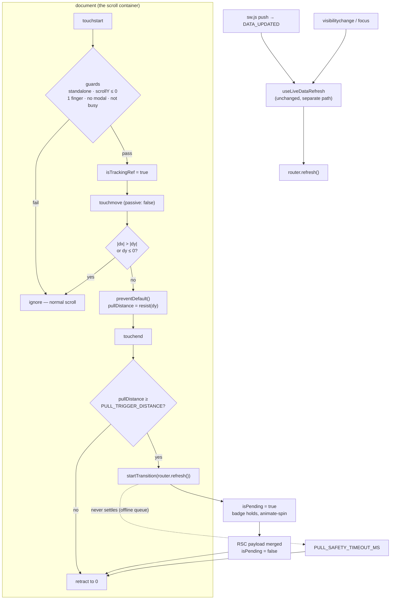

# Requirements

### Overview & Goals

The installed PWA runs in `display: standalone`, which strips the browser chrome and with it
the browser's own pull-to-refresh. `app/globals.css` also sets `overscroll-behavior-y: contain`
on `html`, so even in a browser tab the native gesture is suppressed on purpose — without it
iOS rubber-bands the whole window and Android fires its own refresh over the dashboard.

The result is that a player looking at stale fines has no gesture to reach for. Today the only
automatic refreshes are `useLiveDataRefresh()` — foreground (`visibilitychange` / `focus`) and a
service-worker `DATA_UPDATED` push. Both are passive: a player already staring at the screen,
who suspects the numbers moved, can do nothing but close and reopen the app.

This plan adds the missing deliberate gesture: swipe down at the top of the page, a spinner
badge descends from under the header, release past the threshold refreshes the route.

### Scope

**In scope**

- A `usePullToRefresh()` hook in `lib/hooks/`, following the established hook conventions.
- A `PullToRefresh` client component rendering the spinner badge, mounted once in
  `app/[lang]/layout.tsx` — so every route gets the gesture.
- Gesture enabled **only in the installed standalone PWA**, reusing the standalone detection
  that `lib/hooks/usePwaInstall.ts` already performs.
- Refresh via `router.refresh()` inside a `React.useTransition()`, so `isPending` drives the
  spinner. Same semantics as `useLiveDataRefresh` — refetch the RSC payload for the current
  route, no re-scrape.
- One new `pwa` locale key in all four locale files, for the accessible status label.
- Unit tests for the hook and the component.
- Correcting the two now-stale comments that assert an installed PWA has no pull-to-refresh.

**Out of scope**

- Triggering a data **sync** (`triggerSync()` / re-scrape). That is admin-only and heavy; the
  gesture must stay a cheap read.
- Enabling the gesture in a normal browser tab. Confirmed with the user: standalone only.
- Removing or relaxing `overscroll-behavior-y: contain` — it is load-bearing for iOS.
- Haptics (`navigator.vibrate`), a minimum forced spinner duration, and content that
  translates with the finger. All explicitly declined or deferred.
- Any change to money calculation. This plan touches no file listed under the Testing Rules'
  "when tests are mandatory" list.

### User Stories

1. As a player with the app installed, when I am at the top of any page and swipe down, a
   spinner badge follows my finger out from under the header, so I can see the gesture is
   recognised before I commit to it.
2. As that player, when I pull past the threshold and release, the badge stays put and spins
   while the page refetches, then retracts — so I know the numbers on screen are current.
3. As that player, when I pull only a little and release, the badge retracts with no refresh —
   a half-hearted swipe costs nothing.
4. As a screen-reader user, the refreshing state is announced rather than being a silent
   visual-only spinner.
5. As a player scrolled halfway down the table, swiping down just scrolls up as it always did;
   the gesture never hijacks an ordinary scroll.
6. As a player scrolling a wide results table sideways, the horizontal swipe is never mistaken
   for a pull.

# Technical Design

### Current Implementation

| Concern | Where | Note |
|---|---|---|
| Scroll container | the document itself | No inner `overflow-y-auto` wrapper anywhere. `window.scrollY` is the single source of scroll position. |
| Overscroll | `app/globals.css:180` | `overscroll-behavior-y: contain` on `html`. |
| Layout vars | `app/globals.css:182-184` | `--app-header-height: 4rem`, `--app-safe-top`, `--app-safe-bottom`. |
| Shell | `app/[lang]/layout.tsx:96-110` | `<BackgroundDots/> <ServiceWorkerRegistrar/> <LiveDataRefresher/> <Header/> <OfflineBanner/> <InstallPrompt/> <main>` inside `<ThemeProvider>`. |
| Standalone check | `lib/hooks/usePwaInstall.ts:14-19` | Private `readIsStandalone()`: `matchMedia('(display-mode: standalone)')` OR `navigator.standalone`. |
| Existing refresh | `lib/hooks/useLiveDataRefresh.ts` | Throttled `router.refresh()` on foreground + SW `DATA_UPDATED`. |
| Behaviour-only component | `components/pwa/LiveDataRefresher.tsx` | 9-line `'use client'` render-`null` wrapper. |
| Transition idiom | `app/[lang]/admin/users/ApproveUserButton.tsx:16-25` | `const [isPending, startTransition] = useTransition()`. |
| Spinner idiom | many | inline `lucide-react` icon + `animate-spin`. No shared Spinner component. |
| z-index map | — | BackgroundDots `-z-10`; filter bars `z-30` (backdrop-blur, own stacking context); Header `z-50`; dialogs `z-50`; tooltip positioner `z-[60]`. |

Verified absences that shape the design: **zero** touch/pointer/gesture/`requestAnimationFrame`
code in the repo, and no animation library. The only `overflow-*` scrollers are *horizontal*
(`components/ui/table.tsx:11`, `components/dashboard/SeasonLeagueFilter.tsx:108`,
`app/[lang]/player/[id]/page.tsx:164`, `app/[lang]/rules/page.tsx:10`) — so there is no nested
*vertical* scroller to veto the gesture, and a horizontal-dominance guard is enough.

### Proposed Changes

#### 1. Shared standalone check (`lib/pwa/display-mode.ts`)

`usePwaInstall` keeps `readIsStandalone()` private. Two hooks now need it, so it moves to its
own db-free module rather than being duplicated or imported hook-to-hook.

```ts
/** Safari sets this instead of matching the standalone display mode. */
interface NavigatorWithStandalone extends Navigator {
  standalone?: boolean;
}

export function isStandaloneDisplay() {
  return (
    window.matchMedia('(display-mode: standalone)').matches
    || (navigator as NavigatorWithStandalone).standalone === true
  );
}
```

`lib/hooks/usePwaInstall.ts` drops its local copy and the `NavigatorWithStandalone` interface
and imports `isStandaloneDisplay`. Its existing tests pass unchanged — they stub `matchMedia`
and `navigator.standalone`, not the function.

#### 2. The gesture hook (`lib/hooks/usePullToRefresh.ts`)

Exported tunables, beside the hook as the codebase does:

```ts
/** Badge travel, in px, that arms the refresh — 117px of finger, after resistance. */
export const PULL_TRIGGER_DISTANCE = 72;
/** The badge stops following the finger here, so a long drag cannot fling it down the page. */
export const PULL_MAX_DISTANCE = 110;
/** A pull that never settles must not strand the spinner. */
export const PULL_SAFETY_TIMEOUT_MS = 10_000;
```

Resistance: the badge must feel heavier the further it is pulled, or the gesture reads as a
free-moving sticker. An asymptotic curve on the raw finger delta, which never exceeds
`PULL_MAX_DISTANCE` and is linear (slope 1) near zero:

```ts
function resist(delta: number) {
  return PULL_MAX_DISTANCE * (1 - Math.exp(-delta / PULL_MAX_DISTANCE));
}
```

Calibration, computed against these constants: the badge moves 1:1 with the finger at the
start (`resist(20) ≈ 18`), and arming the refresh at 72px of *badge* travel costs **117px of
finger** travel — close to Android's own ~128px, so the gesture feels neither hair-trigger nor
heavy. The badge is asymptotically capped: an 800px drag still only moves it 110px.

State and refs:

- `React.useState<number>` for `pullDistance` and `React.useState<boolean>` for `isArmed`.
- Refs for the gesture bookkeeping that must not re-render: `startYRef`, `startXRef`,
  `isTrackingRef`, `isEnabledRef`.
- `const [isRefreshing, startTransition] = React.useTransition()`.

**Per-frame updates.** `pullDistance` is React state, written from `touchmove`. Considered and
rejected: a ref plus direct `style.transform` mutation. The badge is a single leaf element and
the only subscriber; the layout tree above it does not re-render because the state lives in the
hook consumed by a leaf component mounted as a sibling of `<main>`, not an ancestor of it.
`touchmove` fires at most once per frame per pointer, so this is at most one leaf re-render per
frame — well inside budget on a mid-range Android phone, and it keeps the component declarative
and testable. Revisit only if profiling on a real device shows dropped frames.

**Listeners.** Attached to `window` in a single `React.useEffect`:

- `touchstart` — passive. Records `startYRef`/`startXRef`; sets `isTrackingRef` only when every
  start guard passes.
- `touchmove` — **`{ passive: false }`**. Non-passive is required: without the ability to call
  `preventDefault()`, iOS standalone still rubber-bands the document behind the badge even with
  `overscroll-behavior-y: contain`, and text selection can start mid-drag. `preventDefault()` is
  called only once the gesture is confirmed vertical and tracking, never on every move.
- `touchend` and `touchcancel` — passive. Release or abort.

**Start guards** (all must hold, or the gesture never begins):

| Guard | Test |
|---|---|
| Installed app | `isEnabledRef.current` — `isStandaloneDisplay()`, read once in the effect |
| At the top | `window.scrollY <= 0` |
| Single finger | `event.touches.length === 1` |
| Nothing modal open | `document.body.style.overflow !== 'hidden'` (the `MobileNav` lock, `components/layout/MobileNav.tsx:79-88`) |
| Not already busy | `!isRefreshing` |

`window.scrollY <= 0` rather than `=== 0` on purpose: iOS reports a *negative* scrollY while
rubber-banding, and `<= 0` keeps the gesture alive there. `scrollbar-gutter: stable` reserves
track width, not height, so it does not affect this. `window.scrollY` is preferred over
`document.documentElement.scrollTop` — same value here, and it is what jsdom exposes cleanly.

**Abort conditions**, checked during `touchmove`:

- `Math.abs(deltaX) > Math.abs(deltaY)` — horizontal-dominant, so the wide tables and the
  filter strip keep their sideways scroll. Once the gesture commits to vertical, this is no
  longer re-checked, so a slightly diagonal pull does not stutter.
- `deltaY <= 0` — the user reversed into a normal upward scroll. Reset to 0 and stop tracking.
- `event.touches.length !== 1` — a second finger landed (pinch-zoom).
- `touchcancel` — the system took the gesture.

**Release.** On `touchend`, if `pullDistance >= PULL_TRIGGER_DISTANCE`, the badge snaps to the
resting offset and `startTransition(() => router.refresh())` runs; otherwise `pullDistance`
goes to 0 and nothing else happens. Either way `isTrackingRef` clears.

**Retraction and the flicker question.** The user declined a forced minimum spinner duration.
`router.refresh()` against a warm cache can settle in well under 100ms, which would flash the
badge. This is handled without a fixed delay by driving the retraction through a CSS
`transition` on the badge (`transition-transform duration-300`) that runs whenever the finger
is not down: the badge is always visibly animated on the way out even when the refresh itself
was instant. If real-device testing shows this still reads as a flicker, the fallback is a
small `MIN_SPINNER_MS` floor — flagged here, not built.

**Safety timeout.** `next.config.ts` enables `experimental.useOffline`, which *keeps a pending
navigation pending* and retries it when the connection returns rather than throwing. A refresh
started while offline can therefore hang indefinitely. A `PULL_SAFETY_TIMEOUT_MS` timer,
started with the transition and cleared when `isRefreshing` goes false, forces the badge back
to 0 so the spinner is never stranded. The refresh itself is left to complete on its own.

Returned shape: `{ pullDistance, isRefreshing, isArmed }` — `isArmed` is
`pullDistance >= PULL_TRIGGER_DISTANCE`, so the component can flip the icon's appearance at the
moment releasing would actually do something.

#### 3. The badge (`components/pwa/PullToRefresh.tsx`)

```tsx
'use client';

import { RefreshCw } from 'lucide-react';
import { usePullToRefresh, PULL_TRIGGER_DISTANCE } from '@/lib/hooks/usePullToRefresh';

export function PullToRefresh({ translations }: { translations: PullToRefreshTranslations }) {
  const { pullDistance, isRefreshing, isArmed } = usePullToRefresh();

  if (pullDistance === 0 && !isRefreshing) return null;
  ...
}
```

Rendering notes, each load-bearing:

- **Positioning**: `fixed` (not `absolute`) at
  `top-[calc(var(--app-header-height)+var(--app-safe-top))]`, `left-1/2`, translated by
  `-50%` on X and `pullDistance - badgeHeight` on Y, so it emerges from *under* the header row
  and respects the notch.
- **z-index `z-40`**: above the `z-30` sticky filter bars — which make their own stacking
  context via `backdrop-blur` and would otherwise paint over the badge — and below the `z-50`
  header, so the badge slides out from beneath the header rather than over it. This is the whole
  point of the native look, and it is why `z-40` and not `z-[60]`.
- **`pointer-events-none`** on the badge: it is pure feedback and must never eat a tap.
- **Tokens only**: `bg-background border rounded-full shadow-lift size-10`, all of which already
  resolve correctly in both themes via `app/globals.css`. No new colour is introduced.
- **Icon**: `<RefreshCw className="size-4 text-muted-foreground" />`, rotated
  `pullDistance / PULL_TRIGGER_DISTANCE * 180` degrees while dragging (inline style — the angle
  is continuous and cannot be a Tailwind class), swapped for `animate-spin` while refreshing.
  Opacity scales with pull so it fades in rather than popping.
- **Accessibility**: the wrapper carries `role="status"` and `aria-live="polite"`, with the
  visually-hidden `translations.refreshing` text rendered only while `isRefreshing` — so the
  drag itself is silent and only the committed refresh is announced. The icon is `aria-hidden`.

#### 4. Layout wiring (`app/[lang]/layout.tsx`)

Mounted as a sibling of `<main>`, immediately after `<LiveDataRefresher />` so the two PWA
refresh paths sit together. It must be **outside** `<main>`: `<main>` is the flex child that
grows, and a `fixed` child of it would still be fine, but keeping it out avoids any future
`transform`/`filter` on `<main>` silently re-parenting the fixed badge.

```tsx
<LiveDataRefresher />
<PullToRefresh translations={{ refreshing: dict.pwa.pullRefreshing }} />
<Header lang={lang} />
```

`dict` is already loaded in this layout for `OfflineBanner` and `InstallPrompt`, so no new
`getDictionary` call is needed.

#### 5. Locale keys (`locales/{sk,cs,hu,sr}.json`)

One key only, in the existing `pwa` namespace — the only string a human ever perceives:

```json
"pullRefreshing": "Obnovujem…"
```

`cs`, `hu`, `sr` need real translations, not copies of the Slovak.
`locales/locales.test.ts` enforces key parity across all four, so a missing one fails `pnpm check`.

Deliberately **not** added: "pull to refresh" / "release to refresh" hint strings. The badge is
iconographic like the platform's own, and unused keys are dead weight.

#### 6. Stale comments

Two comments now assert something this plan makes false and must be corrected in the same commit:

- `lib/hooks/useLiveDataRefresh.ts:9-12` — "standalone display mode has no pull-to-refresh".
- `public/sw.js:84-85` — "An installed PWA has no pull-to-refresh and would otherwise show the
  old amounts."

Both should say the automatic refresh exists so the numbers are current *without* the user having
to reach for the gesture. `public/sw.js` is comment-only here, so `CACHE` needs no bump.

### Architecture Diagram



### Key Decisions

| Question | Options | Chosen | Why |
|---|---|---|---|
| Where the gesture is live | standalone only / all touch / touch + coarse pointer | **standalone only** | User's call. In a browser tab the platform gesture is the user's expectation; duplicating it invites double-refresh. Reuses an existing check. |
| What "refresh" means | `router.refresh()` / full `triggerSync()` | **`router.refresh()` in a transition** | User's call. A sync re-scrapes and recomputes every fine — admin-gated and far too heavy for a gesture any player can make by accident. |
| Knowing when to stop the spinner | `useTransition().isPending` / fixed timer / callback | **`isPending`** | It is the only signal tied to the actual RSC payload landing, and `useTransition` is already the house idiom (`ApproveUserButton.tsx:16`). Backed by a safety timeout because `experimental.useOffline` can hold a request open. |
| Per-frame rendering | React state / ref + direct style / CSS variable | **React state** | The badge is a leaf with one subscriber; one leaf re-render per frame is cheap and keeps the component declarative and unit-testable. Direct DOM mutation is the fallback if a real device drops frames. |
| Listener target | `window` / `document` / a wrapper `<div>` | **`window`** | The document *is* the scroll container; a wrapper would need to wrap `<main>` and would not see touches that begin on the header or the banners. |
| `touchmove` passivity | passive / `{ passive: false }` | **`{ passive: false }`** | `overscroll-behavior-y: contain` stops scroll *chaining*, not iOS's rubber-band of the document itself, and it does not stop text selection. `preventDefault()` is called only after the gesture is confirmed. |
| Badge z-index | `z-30` / `z-40` / `z-[60]` | **`z-40`** | Must clear the `z-30` backdrop-blurred filter bars (own stacking context) but stay under the `z-50` header so it emerges from beneath it — the native look. |
| Nested-scroller veto | walk ancestors for `overflow-y` / skip | **skip** | Audited: every `overflow-*` in the repo is horizontal-only. A `getComputedStyle` ancestor walk per `touchstart` would buy nothing and cost layout reads. Revisit if a vertical scroller is ever added. |
| Minimum spinner duration | none / ~400ms floor | **none, CSS-animated retraction** | User declined the floor. A `duration-300` transform transition guarantees a visible exit even on an instant refresh. Flagged for re-test on a real device. |
| Hint text | "pull to refresh" label / icon only | **icon only** | Matches Android and iOS; one fewer string to translate four ways. |

### Edge Cases / Risks

1. **iOS standalone rubber-band.** `overscroll-behavior-y: contain` was added specifically
   because "iOS rubber-bands the whole window". The gesture must not undo that. Mitigation:
   `preventDefault()` on confirmed vertical tracking, plus the `scrollY <= 0` guard tolerating
   negative scrollY. **Must be verified on a real iPhone** — this is the highest-risk item and
   jsdom cannot cover it.
2. **`isPending` semantics.** The plan assumes `router.refresh()` inside `startTransition` keeps
   `isPending` true until the RSC payload merges. `node_modules/next/dist/docs/.../use-router.md`
   documents the merge behaviour but not the pending contract explicitly. Verify on device
   during Step 6; the safety timeout means a wrong assumption degrades to a 10s spinner, not a
   stuck UI.
3. **Backdrop-blur stacking contexts.** The `z-30` filter bars on the dashboard and player
   pages create their own stacking contexts. `z-40` on a `fixed` badge clears them, but this is
   exactly the class of bug AGENTS.md's UI invariant warns about, so it needs checking on the
   dashboard specifically, not just a plain page.
4. **Double refresh with `useLiveDataRefresh`.** A pull does not fire `visibilitychange` or
   `focus`, so the two paths do not collide in practice. They intentionally share no throttle
   state: an explicit gesture must always refresh, even within
   `REFRESH_THROTTLE_MS` of an automatic one. Worth one deliberate test on device: background the
   app, return, and immediately pull.
5. **MobileNav body lock.** The menu sets `document.body.style.overflow = 'hidden'`. Guarding on
   that string is slightly brittle — it is a private detail of another component. Accepted for
   now (it is the only such lock, and dialogs portal above `z-40` anyway); if a second lock
   appears, this becomes a shared helper.
6. **Desktop / mouse.** Touch-only listeners plus the standalone guard mean a desktop mouse can
   never trigger this. Installed desktop PWAs match `display-mode: standalone` but emit no touch
   events, so they are inert rather than broken.
7. **Reduced motion.** The repo has no `prefers-reduced-motion` handling anywhere today, so this
   introduces none, staying consistent. Noted as a possible follow-up, not part of this change.
8. **Uncommitted work in the tree.** The working tree carries an unrelated, unfinished
   trainer `clean_sweep` fine rule that also edits all four locale files. Delivery Step 0 commits
   it on its own branch first, so the one new `pwa.pullRefreshing` key never collides with it.

# Delivery Steps

### Step 0: Branch off main and commit the existing clean-sweep work

The working tree currently carries unrelated, uncommitted work. It must be landed on its own
branch before any pull-to-refresh code is written, so the two changes stay reviewable.

Audited contents of the working tree:

| Change | Files |
|---|---|
| Trainer `clean_sweep` fine rule | `lib/money-rules.ts` (+`CLEAN_SWEEP_TEAM_POINTS`, `TRAINER_CLEAN_SWEEP_FINE`, `CLEAN_SWEEP_FIRST_SEASON_ID`, `trainerCleanSweepFine()`), `lib/money-rules.test.ts`, `lib/sync.ts`, `lib/db-utils.ts` (`cleanSweeps`), `lib/home-helpers.ts`, `lib/api.ts` (`homeTeamPoints`/`awayTeamPoints`), `lib/db/schema.ts`, `app/[lang]/page.tsx`, `locales/{sk,cs,hu,sr}.json`, `AGENTS.md`, `.claude/skills/manage-match-results-and-payments/SKILL.md`, `.junie/plans/trainer-clean-sweep-fine.md` (already staged) |
| Two player photos | `lib/player-images.ts` (`171890` kozma, `19055` dubrava) |

Steps:

1. `git checkout -b feat/trainer-clean-sweep-fine` from `main`.
2. Run `nvm use && pnpm check` **before** committing — this work touches `lib/sync.ts`,
   `lib/money-rules.ts`, and `lib/db-utils.ts`, all on the Testing Rules' mandatory list, so it
   must be green on its own before anything is stacked on top.
3. Commit the clean-sweep rule as one commit (`feat:`), and the two player photos as a separate
   small commit — they are unrelated to the money rule and should not be buried in it.
4. **Do not stage `.junie/plans/pwa-pull-to-refresh.md`** (this file). It belongs with the
   pull-to-refresh work, not the clean-sweep commit.

Per the user's instruction the pull-to-refresh work then continues **on this same branch**, so
the branch ends up carrying both changes. If they should be separate PRs, branch again from
`main` after this step instead.

*Files*: no new edits — this step only commits what is already on disk.

### Step 1: Extract the standalone check

Create `lib/pwa/display-mode.ts` with `isStandaloneDisplay()` and the
`NavigatorWithStandalone` interface. Update `lib/hooks/usePwaInstall.ts` to import it and delete
its private copy. Run `pnpm test:run` — `lib/hooks/usePwaInstall.test.ts` and
`components/pwa/InstallPrompt.test.tsx` must still pass untouched, proving the extraction was
behaviour-neutral.

*Files*: `lib/pwa/display-mode.ts` (new), `lib/hooks/usePwaInstall.ts`.

### Step 2: Write the gesture hook

Create `lib/hooks/usePullToRefresh.ts` per §2 — exported constants, `resist()`, the single
`React.useEffect` with the four listeners, the guards, the transition, and the safety timeout.
One JSDoc block above the hook explaining *why* the gesture has to be hand-rolled (no gesture
library, standalone has no native pull-to-refresh, `overscroll-behavior-y: contain`). No
`'use client'` in this file — the directive belongs on the component.

*Files*: `lib/hooks/usePullToRefresh.ts` (new).

### Step 3: Write the badge component

Create `components/pwa/PullToRefresh.tsx` per §3: `'use client'`, exported
`PullToRefreshTranslations` interface, returns `null` when idle, `fixed`/`z-40`/
`pointer-events-none`, `role="status"` + `aria-live="polite"`, `RefreshCw` rotating with pull
then `animate-spin`. Mobile-first: this component only ever renders on a phone, so there are no
`sm:`/`md:` variants to write.

*Files*: `components/pwa/PullToRefresh.tsx` (new).

### Step 4: Add the locale key and wire the layout

Add `"pullRefreshing"` to the `pwa` namespace in `locales/sk.json` (`"Obnovujem…"`), then
translate it into `cs`, `hu`, `sr`. Mount `<PullToRefresh translations={{ refreshing:
dict.pwa.pullRefreshing }} />` in `app/[lang]/layout.tsx` right after `<LiveDataRefresher />`.

*Files*: `locales/{sk,cs,hu,sr}.json`, `app/[lang]/layout.tsx`.

### Step 5: Correct the stale comments

Update `lib/hooks/useLiveDataRefresh.ts:9-12` and `public/sw.js:84-85`, both of which currently
state that an installed PWA has no pull-to-refresh. No `CACHE` bump — `public/sw.js` changes
only in a comment.

*Files*: `lib/hooks/useLiveDataRefresh.ts`, `public/sw.js`.

### Step 6: Write the tests

Per the Testing section below.

*Files*: `lib/hooks/usePullToRefresh.test.ts` (new),
`components/pwa/PullToRefresh.test.tsx` (new).

### Step 7: Verify on a real device

Per the Testing section's manual flows. jsdom cannot reach the two highest-risk items (iOS
rubber-band, `isPending` timing), so this step is not optional.

### Step 8: Quality check

Run `nvm use && pnpm check` (lint + type check + full test suite). Zero TypeScript errors, zero
Airbnb violations, no `any`, all tests green.

# Testing

### Validation Approach

**Test mechanics, verified against this repo's jsdom before writing the plan:**

- `window.TouchEvent` **exists** in jsdom 30 and accepts plain objects in its `touches` array —
  confirmed: `new TouchEvent('touchstart', { touches: [{ clientX, clientY }], cancelable: true })`
  yields a working event with `touches[0].clientY`. There is **no `Touch` constructor**, so do
  not reach for one.
- `preventDefault()` on a dispatched non-passive `touchmove` sets `defaultPrevented` correctly,
  so the preventDefault behaviour is directly assertable.
- `window.scrollY` is writable via `Object.defineProperty` for the scroll-position guard.
- `vitest.setup.dom.ts:19-28` stubs `matchMedia` to **always miss**, so every standalone case
  opts in by hand with the `setDisplayMode()` spy from `lib/hooks/usePwaInstall.test.ts:15-17`.
- `next/navigation` is mocked as in `lib/hooks/useLiveDataRefresh.test.ts:10-12`.
- `fireEvent`, never `user-event` (project rule).
- Hook tests live in the `dom` vitest project (`vitest.config.ts` includes `lib/hooks/**/*.test.ts`).

**`lib/hooks/usePullToRefresh.test.ts`** — table-driven where the shape allows:

| Case | Expectation |
|---|---|
| Not standalone | a full pull sequence leaves `pullDistance` at 0 and never calls `refresh` |
| Standalone, scrolled to top, pull past threshold, release | `refresh` called once |
| Pull below threshold, release | `refresh` never called, `pullDistance` returns to 0 |
| Pull exactly to `PULL_TRIGGER_DISTANCE` | refreshes — the threshold is inclusive |
| `window.scrollY = 200` at `touchstart` | gesture never starts |
| `window.scrollY = -5` (iOS rubber-band) | gesture **does** start |
| Two touch points at `touchstart` | gesture never starts |
| `document.body.style.overflow = 'hidden'` | gesture never starts |
| Horizontal-dominant move (`dx` 100, `dy` 10) | `pullDistance` stays 0, no `preventDefault` |
| Upward move (`dy` negative) | `pullDistance` stays 0 |
| `touchcancel` mid-pull | `pullDistance` returns to 0, no refresh |
| Confirmed vertical `touchmove` | `defaultPrevented` is true |
| Second pull while `isRefreshing` | does not start a second refresh |
| `resist()` | monotonic, `resist(0) === 0`, never exceeds `PULL_MAX_DISTANCE`, `resist(30) < 30` |
| Safety timeout | with a refresh that never settles, advancing `PULL_SAFETY_TIMEOUT_MS` (fake timers, as `useLiveDataRefresh.test.ts:32` does) returns `pullDistance` to 0 |
| Unmount | every listener removed — dispatching the full sequence afterwards calls nothing |

**`components/pwa/PullToRefresh.test.tsx`** — the hook is mocked so the component is tested on
its rendered output alone, querying by role and visible text per project rules:

- Idle (`pullDistance` 0, not refreshing) renders nothing.
- Mid-pull renders the badge but **no** status text — the drag is silent to a screen reader.
- Refreshing exposes `role="status"` carrying `sk.pwa.pullRefreshing` (imported from
  `locales/sk.json`, as `InstallPrompt.test.tsx:7` does) and the icon has `animate-spin`.
- The badge carries `pointer-events-none`.

**Manual flows on a real installed PWA** (Step 7) — the two risk items jsdom cannot reach:

1. Android, installed from Chrome: pull at the top of the dashboard → badge emerges from under
   the header, passes *over* the `z-30` sticky season/league filter bar, spins, retracts. Change
   a fine from another device first, so the refresh is observable and not a no-op.
2. Android: scroll halfway down, swipe down → ordinary scroll, no badge.
3. Android: swipe a results table sideways → horizontal scroll, no badge.
4. Android: open the mobile menu, swipe down → nothing.
5. iPhone, added to Home Screen: same pull → **the document must not rubber-band** behind the
   badge. This is the acceptance test for risk #1.
6. iPhone with the notch: the badge clears the status bar (`--app-safe-top`).
7. Both: background the app, return, immediately pull → the pull still refreshes, confirming it
   shares no throttle with `useLiveDataRefresh`.
8. Both, light and dark theme: badge background, border, and shadow all read correctly.
9. Toggle airplane mode, pull → spinner does not strand; it clears by
   `PULL_SAFETY_TIMEOUT_MS` at the latest.

**Money rules**: this change touches none of the files listed under the Testing Rules'
mandatory-test list, and no threshold, formula, or league-scope rule. No money test changes and
no `rules` namespace changes are required.

The mandatory lint / type check / test run is Delivery Step 8: `nvm use && pnpm check`.
