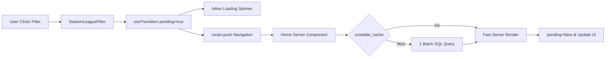

# Requirements

### Overview & Goals
The switching filter on the dashboard (`SeasonLeagueFilter`) is slow to update and lacks a loading feedback indicator during re-rendering. This task aims to eliminate performance bottlenecks in database data fetching and provide immediate, smooth visual loading feedback when users switch filters.

### Scope
- **In Scope**:
  - Optimize server-side data fetching in `lib/home-helpers.ts` and `lib/db-utils.ts` by replacing N+1 SQL queries with batch queries.
  - Implement Next.js caching (`unstable_cache`) for dashboard home data (`fetchHomeData`).
  - Add inline pending/loading state indicators (`useTransition` and `Loader2` spinner) in `components/dashboard/SeasonLeagueFilter.tsx`.
  - Maintain mobile-first layout and responsive UI design.
- **Out of Scope**:
  - Full client-side refactoring of all database queries to REST/GraphQL APIs.
  - Schema modifications in PostgreSQL database.

### User Stories
- **As a user viewing the dashboard**, I want to switch between season and league filters instantly so that I can inspect different competition statistics without annoying delays.
- **As a user clicking a filter**, I want to see an immediate loading indicator on the filter controls so that I know the application is responding and data is re-rendering.

### Functional Requirements
- **Instant Visual Feedback**: Clicking any season dropdown option or league tab button in `SeasonLeagueFilter` must immediately display a loading spinner and transition style (e.g. reduced opacity/disabled interaction).
- **Non-Blocking Navigation**: Existing dashboard data must remain visible during filter switching until new server data is received, preventing screen flickering.
- **Fast Filter Switching**: Cached/batched filter queries must resolve and re-render dashboard data in < 50ms for repeated filter switches.

### Non-Functional Requirements
- **Performance**: Drastically reduce SQL database queries from N+1 (15+ queries) to 1 batch query per filter change.
- **Type Safety**: Strictly avoid `any` types; comply with TypeScript strict mode.
- **Code Quality**: Pass Airbnb style linting (`pnpm lint`) and type checks (`tsc --noEmit`).

# Technical Design

### Current Implementation
- `components/dashboard/SeasonLeagueFilter.tsx` uses `router.push()` directly when a season or league is selected. Router navigation performs a server component re-render without `useTransition` or a pending loading indicator.
- `app/[lang]/page.tsx` calls `fetchHomeData(TEAM_ID, selectedSeasonId, selectedLeagueKey)` on the server.
- `lib/home-helpers.ts` (`fetchHomeData`) calls `getPlayerBalances(seasonId, leagueKey)` and then maps over all players with `Promise.all(playerBalances.map(async b => getScrapedData('player_detail', b.externalPlayerId)))`.
- `lib/db-utils.ts` (`getScrapedData`) issues an individual SQL query `SELECT data FROM scraped_data WHERE type = $1 AND external_id = $2` for every single player. For 15+ players, this incurs 15+ DB round-trips per filter change.
- No Next.js caching (`unstable_cache` or `React.cache`) is configured for `fetchHomeData`.

### Key Decisions
- **Key Decision 1: SQL Batching**: Implement `getScrapedDataBatch<T>(type: string, externalIds: number[])` using PostgreSQL `ANY(${externalIds})` to fetch all player details in a single query.
  - *Rationale*: Eliminates N+1 database queries, reducing query latency from multi-roundtrip overhead to a single fast query.
- **Key Decision 2: Server Caching (`unstable_cache`)**: Wrap `fetchHomeData` with Next.js `unstable_cache` using cache keys `['home-data', seasonId, leagueKey]` and a revalidation period (60 seconds).
  - *Rationale*: Substantially speeds up navigation when switching back and forth between seasons and leagues.
- **Key Decision 3: `useTransition` for Non-Blocking UX**: Use React's `useTransition` hook in `SeasonLeagueFilter.tsx` to handle `router.push`.
  - *Rationale*: Provides instant feedback (spinner + disabled state) without unmounting current dashboard cards or causing layout shifts.

### Proposed Changes
1. **`lib/db-utils.ts`**:
   - Add `getScrapedDataBatch<T>(type: string, externalIds: number[]): Promise<Map<number, T>>`.
   - Query: `SELECT external_id, data FROM scraped_data WHERE type = ${type} AND external_id = ANY(${externalIds})`.

2. **`lib/home-helpers.ts`**:
   - Refactor `fetchHomeData`: collect all `externalPlayerId`s from `playerBalances`, call `getScrapedDataBatch('player_detail', ids)`, and assign player detail objects from the returned Map.
   - Wrap `fetchHomeData` execution with Next.js `unstable_cache`.

3. **`components/dashboard/SeasonLeagueFilter.tsx`**:
   - Import `useTransition` from React and `Loader2` from `lucide-react`.
   - Initialize `const [isPending, startTransition] = useTransition()`.
   - Wrap `router.push(...)` calls inside `startTransition(...)` in `handleSeasonChange` and `handleLeagueChange`.
   - Display a spinning `Loader2` icon and apply `opacity-60 pointer-events-none` styling on the active tab/select when `isPending` is true.

### Data Models / Contracts
```ts
// lib/db-utils.ts
export async function getScrapedDataBatch<T>(
  type: string,
  externalIds: number[]
): Promise<Map<number, T>> {
  if (externalIds.length === 0) return new Map();
  const results = await sql`
    SELECT external_id, data 
    FROM scraped_data 
    WHERE type = ${type} AND external_id = ANY(${externalIds});
  `;
  const map = new Map<number, T>();
  for (const row of results) {
    map.set(Number(row.external_id), row.data as T);
  }
  return map;
}
```

### Components
- `SeasonLeagueFilter` (`components/dashboard/SeasonLeagueFilter.tsx`): Updated to manage non-blocking pending states using `useTransition` and render an inline loading spinner.
- `Home` (`app/[lang]/page.tsx`): Benefits from optimized `fetchHomeData` server component data fetching.

### File Structure
- `lib/db-utils.ts` (Modified: add batch querying helper)
- `lib/home-helpers.ts` (Modified: use batch queries and `unstable_cache`)
- `components/dashboard/SeasonLeagueFilter.tsx` (Modified: add `useTransition` pending state & loader)

### Architecture Diagram


# Testing

### Validation Approach
Verification will be conducted by checking filter switching response times, visual feedback states, and running lint/type checks.

### Key Scenarios
1. **League Switching**:
   - User clicks between "All Leagues", "Interliga", and "Slovak Cup" tabs.
   - Immediately verify inline loading spinner appears on the active filter tab.
   - Verify page content updates smoothly with correct filtered stats.
2. **Season Switching**:
   - User selects a different season from the season `<select>` dropdown.
   - Verify immediate visual pending state (spinner + disabled dropdown).
   - Verify dashboard data updates to match selected season.
3. **Repeated Filter Toggling**:
   - User toggles back and forth between two filters.
   - Verify instant cache-hit response (< 50ms) on repeated switches.

### Edge Cases
- Rapid consecutive filter clicks: Controls are disabled during `isPending` state to prevent race conditions.
- Empty season/league data: Verify "no results" state renders correctly without errors.

# Delivery Steps

### ✓ Step 1: Implement SQL query batching and Next.js server caching for home data
Database queries in `fetchHomeData` execute in a single batch call with server caching enabled.

- Add `getScrapedDataBatch` in `lib/db-utils.ts` using `ANY(${externalIds})` to retrieve all player details in one SQL query instead of N sequential queries.
- Refactor `fetchHomeData` in `lib/home-helpers.ts` to utilize `getScrapedDataBatch` for player detail lookups.
- Wrap `fetchHomeData` execution with Next.js `unstable_cache` keyed by season ID and league key (`['home-data', seasonId, leagueKey]`) with revalidation tags.

### ✓ Step 2: Add inline transition loading indicator to SeasonLeagueFilter
Selecting a new season or league filter immediately shows an inline loading spinner and pending state without freezing the UI.

- Integrate `useTransition` hook in `components/dashboard/SeasonLeagueFilter.tsx`.
- Wrap `router.push` navigation calls in `startTransition` inside `handleSeasonChange` and `handleLeagueChange`.
- Add a visual pending spinner (`Loader2` from `lucide-react`) and active element opacity indicator when `isPending` is true.
- Disable filter controls during pending transitions to prevent duplicate rapid navigations.

### ✓ Step 3: Verify filter performance, type safety, and linting compliance
Dashboard filter transitions execute fast and smoothly without TypeScript or linting errors.

- Validate filter switching speed across all season and league combinations on the dashboard (`app/[lang]/page.tsx`) and player pages (`app/[lang]/player/[id]/page.tsx`).
- Verify that loading feedback renders immediately upon user interaction.
- Run linting and TypeScript checks to ensure strict Airbnb style and TypeScript compliance with zero `any` usage.