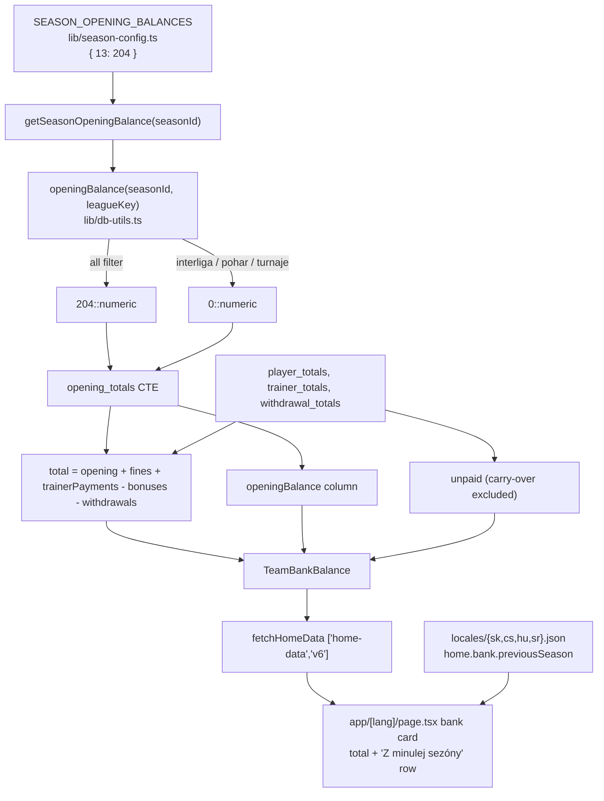

# Context

The team bank in production starts every season from zero. `getTeamBankBalance()`
(`lib/db-utils.ts:759`) computes the balance strictly from rows that belong to one
`season_id` — player fines, trainer payments, bonuses, and withdrawals — so money that was
already in the bank when a season opened is invisible.

Season 12 (2025/2026) ended with **204 €** left over. That money physically sits in the team
bank today, but season 13 (2026/2027, `DEFAULT_SEASON_ID`) reports a balance that is 204 €
too low. This change makes the displayed total match the real bank, and names the money on the
bank card so nobody has to guess where it came from.

The amount is a one-off, hand-known figure, so it is stored as configuration next to the other
season facts rather than as a new table or an admin-entered row.

Note on plan location: the repo's `AGENTS.md` requires plans under `.junie/plans/`. This file
was written to the path the harness pinned; Step 1 copies it to
`.junie/plans/team-bank-opening-balance.md`.

# Requirements

### Overview & Goals

- `TeamBankBalance.total` for season 13 includes a 204 € opening balance.
- The bank card shows it as its own labelled row ("Z minulej sezóny +204.00 €"), localized in
  all four languages, visible only when the amount is greater than 0.
- The mechanism is generic: any future season declares its own opening balance by adding one
  entry to a map.
- It follows the same league rule as `streak_fine` and withdrawals: the carry-over carries no
  league, so it counts **only** under the "all" league filter.

### Scope

**In scope**
- `lib/season-config.ts`: `SEASON_OPENING_BALANCES` map + `getSeasonOpeningBalance()`.
- `lib/db-utils.ts`: new `openingBalance()` SQL fragment, wired into `getTeamBankBalance()`'s
  `total`, plus a new `openingBalance` field on `TeamBankBalance`.
- `app/[lang]/page.tsx`: new row in the bank card.
- `locales/{sk,cs,hu,sr}.json`: new `home.bank.previousSeason` key in all four.
- `lib/home-helpers.ts`: bump the `home-data` cache version — `FetchDataResult` shape changes.
- Tests in `lib/db-utils.test.ts` and `lib/season-config.test.ts`.
- One invariant bullet in `AGENTS.md`.

**Out of scope**
- Any database schema change, migration, or production SQL. Nothing is written to the DB.
- `unpaid`, `bonusesAwarded`, `bonusesPaid`, `withdrawals` — all unchanged.
- `recalculateDerivedFinancials()` in `lib/sync.ts` — untouched; this is not a derived money
  field and no player or trainer owes it.
- Player balances, top donator, trainer stats, push notifications.
- The `rules` locale namespace — the carry-over is not a fine or a bonus, so the player-facing
  fine rules do not change.
- An admin UI for entering future carry-overs.
- Extracting the bank card out of `app/[lang]/page.tsx` into a testable component (see
  Edge Cases / Risks).

### Functional Requirements

1. With season 13 and league filter "all" (or no filter), the home bank total reads 204 €
   higher than the sum of that season's fines + trainer payments − bonuses − withdrawals, and
   a row labelled "from the previous season" shows `+204.00 €`.
2. With season 13 and any league filter (`interliga`, `pohar`, `turnaje`), the total is
   unchanged from today and the row is hidden — the carry-over is excluded, exactly as
   withdrawals are.
3. With season 12, the total is unchanged and the row is hidden (no opening balance
   configured).
4. `unpaid` never includes the carry-over: it answers who still owes the bank, and nobody owes
   leftover money.

# Technical Design

### Current Implementation

`getTeamBankBalance(seasonId, leagueKey)` — `lib/db-utils.ts:759-809` — runs one raw neon query
with three CTEs:

- `player_totals` — `paid_fines` / `all_fines` via `fineAmount(leagueKey)`, `paid_bonuses` /
  `all_bonuses` from `mpr.bonus_received`.
- `trainer_totals` — `paid_payments` / `all_payments` from `trainer_payments`.
- `withdrawal_totals` — `withdrawalTotal(targetSeasonId, leagueKey)` (`lib/db-utils.ts:183`),
  which already encodes the "no league ⇒ only under the all filter" rule:

```ts
export function withdrawalTotal(seasonId: number, leagueKey?: string) {
  return isAllLeagues(leagueKey)
    ? sql`(SELECT COALESCE(SUM(bw.amount), 0) FROM bank_withdrawals bw WHERE bw.season_id = ${seasonId})`
    : sql`0::numeric`;
}
```

Then:

```
total  = all_fines + all_payments - all_bonuses - withdrawn
unpaid = (all_fines + all_payments - all_bonuses)
       - (paid_fines + paid_payments - paid_bonuses)
```

The result is consumed by `fetchHomeDataInternal()` (`lib/home-helpers.ts:182`) and cached by
`unstable_cache(fn, ['home-data', 'v5'], { revalidate: 7 days, tags: ['home-data'] })`
(`lib/home-helpers.ts:270-283`). It is rendered inline on the home page at
`app/[lang]/page.tsx:112-230`, where the withdrawals row (`:164-174`) is the exact pattern the
new row copies.

There is today **no** concept of a carry-over, starting balance, or previous-season link
anywhere in the codebase.

### Proposed Changes

#### 1. Season configuration (`lib/season-config.ts`)

Add next to `TEAM_SCORE_LIMIT` (currently line 86), keeping `season-config.ts` the single
source of truth for per-season facts:

```ts
/**
 * Money already in the bank when a season opened, left over from the one before. Hand-known,
 * never derived from match rows — the previous season's balance is not recomputed.
 */
export const SEASON_OPENING_BALANCES: Record<number, number> = {
  13: 204,
};

export function getSeasonOpeningBalance(seasonId: number): number {
  return SEASON_OPENING_BALANCES[seasonId] ?? 0;
}
```

This file is db-free and already imported by client code, so it stays within the
Client/Server Boundary invariant.

#### 2. SQL fragment (`lib/db-utils.ts`)

Import `getSeasonOpeningBalance` from `./season-config` (existing import block at
`lib/db-utils.ts:6-12`) and add the fragment directly beneath `withdrawalTotal()` (line 187),
mirroring its shape:

```ts
/** The carry-over has no league, same as a withdrawal, so a league-filtered balance leaves it out. */
export function openingBalance(seasonId: number, leagueKey?: string) {
  return isAllLeagues(leagueKey)
    ? sql`${getSeasonOpeningBalance(seasonId)}::numeric`
    : sql`0::numeric`;
}
```

#### 3. `TeamBankBalance` shape (`lib/db-utils.ts:575-582`)

```ts
export interface TeamBankBalance {
  total: number;
  /** Portion of the collected money not yet settled; withdrawals stay out of it. */
  unpaid: number;
  bonusesAwarded: number;
  bonusesPaid: number;
  withdrawals: number;
  /** Left over from the previous season; inside `total`, never inside `unpaid`. */
  openingBalance: number;
}
```

#### 4. Wire into `getTeamBankBalance()` (`lib/db-utils.ts:765-808`)

Add a fourth CTE, put it in `total` only, and return it as its own column:

```sql
    withdrawal_totals AS (
      SELECT ${withdrawalTotal(targetSeasonId, leagueKey)} as withdrawn
    ),
    opening_totals AS (
      SELECT ${openingBalance(targetSeasonId, leagueKey)} as opening
    )
    SELECT
      (COALESCE(o.opening, 0) + COALESCE(p.all_fines, 0) + COALESCE(t.all_payments, 0)
        - COALESCE(p.all_bonuses, 0) - COALESCE(w.withdrawn, 0))::numeric as total,
      -- Unpaid answers who still owes the bank; leftover money is already in hand.
      (COALESCE(p.all_fines, 0) + COALESCE(t.all_payments, 0) - COALESCE(p.all_bonuses, 0)
        - (COALESCE(p.paid_fines, 0) + COALESCE(t.paid_payments, 0)
           - COALESCE(p.paid_bonuses, 0)))::numeric as unpaid,
      COALESCE(p.all_bonuses, 0)::numeric as bonuses_awarded,
      COALESCE(p.paid_bonuses, 0)::numeric as bonuses_paid,
      COALESCE(w.withdrawn, 0)::numeric as withdrawals,
      COALESCE(o.opening, 0)::numeric as opening_balance
    FROM player_totals p, trainer_totals t, withdrawal_totals w, opening_totals o
```

and in the return object: `openingBalance: Number(result[0].opening_balance || 0)`.

#### 5. Bank card row (`app/[lang]/page.tsx`)

Insert directly **above** the withdrawals row (currently `:164`), so the card reads
carry-over → withdrawals → bonuses. It is money the bank has, so it is green and signed `+`,
the mirror of the red, `-`-signed withdrawals row:

```tsx
{bankBalance.openingBalance > 0 && (
  <div className={BANK_ROW}>
    <dt className={BANK_LABEL}>{dict.home.bank.previousSeason}</dt>
    <dd className={`${BANK_VALUE} text-emerald-600 dark:text-emerald-400`}>
      +
      {bankBalance.openingBalance.toFixed(2)}
      {' '}
      €
    </dd>
  </div>
)}
```

The card is a `grid-cols-1 sm:grid-cols-2` `<dl>` (`:127`), so a fifth row wraps on mobile and
fills the two-column grid on `sm` and up with no layout change.

#### 6. Locales (`locales/{sk,cs,hu,sr}.json`)

Add `previousSeason` to the `home.bank` object in all four files — `locales/locales.test.ts`
fails the build if any one is missing. No placeholders, so nothing to keep in sync there.

| file | value |
| --- | --- |
| `sk.json` | `"previousSeason": "Z minulej sezóny"` |
| `cs.json` | `"previousSeason": "Z minulé sezóny"` |
| `hu.json` | `"previousSeason": "Előző szezonból"` |
| `sr.json` | `"previousSeason": "Iz prošle sezone"` |

The dictionary type is inferred from `locales/sk.json` (`lib/i18n/types.ts:1`), so adding the
key there types `dict.home.bank.previousSeason` automatically — no type file to edit.

#### 7. Cache version (`lib/home-helpers.ts:279`)

Change `['home-data', 'v5']` to `['home-data', 'v6']`. `FetchDataResult` now carries an extra
field, which the comment at `:276-277` makes a hard requirement; it also busts the week-old
cached entry that would otherwise keep serving the pre-204 € total after the deploy.

#### 8. Documentation (`AGENTS.md`)

Under **Codebase Invariants → Bank Withdrawals**, add:

> - A season's opening balance (money carried over from the season before) lives in
>   `SEASON_OPENING_BALANCES` in `lib/season-config.ts`, never in the database. It is added to
>   `TeamBankBalance.total` only, never to `unpaid` — nobody owes it — and, having no league,
>   it counts only under the "all" filter, same rule as `streak_fine` and withdrawals.

### Architecture Diagram



### Key Decisions

**Config constant over a new `bank_deposits` table.** A deposits table would need a drizzle
schema change, `pnpm db:push` against production, an admin form, and validation — all for one
number that will not change. `lib/season-config.ts` is already the declared single source of
truth for per-season facts and needs no migration. If money ever starts arriving regularly
(sponsors, membership fees), a table becomes the right answer and this map is trivially
replaced.

**Config constant over a negative `bank_withdrawals` row.** A `-204` row needs no code, but it
violates the `amount > 0` rule enforced by `validateWithdrawal()`
(`lib/validation/withdrawal.ts`) and would surface in the withdrawal history page as a negative
expense with no sensible category or description.

**Own row rather than folded silently into the total.** Money appearing in the bank with no
explanation invites "where did that come from?". The row costs one field, one conditional
block, and four locale strings, and it mirrors the existing withdrawals row exactly.

**Excluded from `unpaid`.** `unpaid` answers "who still owes the bank". Leftover money has
already been collected; treating it as unpaid would invent a debtor.

**Excluded under league filters.** The carry-over has no league, exactly like a withdrawal and
like `streak_fine`. Reusing `isAllLeagues()` keeps the three rules encoded identically, and it
is why the row hides under a league filter instead of showing `+0.00 €`.

### Edge Cases / Risks

- **Season 12 / unknown season** — `getSeasonOpeningBalance()` returns `0`, the fragment
  renders `0::numeric`, past seasons are unchanged and the row is hidden.
- **League-filtered view** — "all" and the sum of the individual filters now differ by a
  further 204 €. Already true today because of `streak_fine` and withdrawals; the row being
  visible only under "all" makes it self-explanatory.
- **Stale cache after deploy** — handled by the `v6` bump. If the total still looks wrong in
  production, `POST /api/revalidate` with the `CRON_SECRET` bearer token clears the
  `home-data` tag.
- **Bank card is not a component** — the Testing Rules ask money-displaying components to be
  render-tested but forbid page-level tests, and this card lives inline in
  `app/[lang]/page.tsx`. Extracting it into `components/dashboard/TeamBankCard.tsx` would mean
  threading ~8 props (debtor and bonus tooltips, top donator, below-limit list, next pickup)
  through a refactor far larger than this change. The card is untested today; this keeps it
  that way and covers the new money at the fragment and config level instead. Worth a separate
  task.
- **Negative total** — `app/[lang]/page.tsx:121` already colours a negative total red; adding a
  positive number cannot break that.
- **Parameterisation** — `sql\`${number}::numeric\`` passes 204 as a bound parameter, not
  inlined text, the same way `withdrawalTotal()` passes `seasonId`. No injection surface, and
  the value is a hardcoded literal anyway.
- **Double counting** — the only guard is that this number is entered once by hand. The
  `AGENTS.md` bullet records that it is never derived, so a future reader does not try to
  recompute it from season 12 rows.

# Delivery Steps

### ✓ Step 1: Mirror this plan into the repo
Copy this file to `.junie/plans/team-bank-opening-balance.md` as required by `AGENTS.md`
Plan Mode Rules. Mark steps `✓` there while executing.

Touches: `.junie/plans/team-bank-opening-balance.md`.

### ✓ Step 2: Add the opening-balance configuration
Add `SEASON_OPENING_BALANCES` and `getSeasonOpeningBalance()` to `lib/season-config.ts` near
`TEAM_SCORE_LIMIT`, exactly as in Proposed Change 1.

Verify: `pnpm type-check`; the module still imports nothing from `lib/db.ts`.

Touches: `lib/season-config.ts`.

### ✓ Step 3: Add the `openingBalance()` SQL fragment
Add the exported fragment below `withdrawalTotal()` in `lib/db-utils.ts` and import
`getSeasonOpeningBalance` into the existing `./season-config` import block.

Touches: `lib/db-utils.ts`.

### ✓ Step 4: Extend `TeamBankBalance` and `getTeamBankBalance()`
Add the `openingBalance` field to the interface, add the `opening_totals` CTE, add
`opening_totals o` to the `FROM` list, add `COALESCE(o.opening, 0) +` to the `total`
expression, select `opening_balance`, and map it in the returned object. Leave `unpaid`,
`bonuses_awarded`, `bonuses_paid`, and `withdrawals` untouched.

Verify: read the query back and confirm `unpaid` is byte-identical to before.

Touches: `lib/db-utils.ts`.

### ✓ Step 5: Add the locale key
Add `home.bank.previousSeason` to all four of `locales/{sk,cs,hu,sr}.json` with the values in
the table above.

Verify: `pnpm vitest run locales` passes (`locales/locales.test.ts` compares key sets).

Touches: `locales/sk.json`, `locales/cs.json`, `locales/hu.json`, `locales/sr.json`.

### ✓ Step 6: Render the row on the bank card
Insert the conditional block from Proposed Change 5 above the withdrawals row in
`app/[lang]/page.tsx`, reusing the existing `BANK_ROW` / `BANK_LABEL` / `BANK_VALUE` constants.

Touches: `app/[lang]/page.tsx`.

### ✓ Step 7: Bump the `home-data` cache version
`['home-data', 'v5']` → `['home-data', 'v6']` at `lib/home-helpers.ts:279`.

Touches: `lib/home-helpers.ts`.

### ✓ Step 8: Write the tests
Mandatory under the Testing Rules — this changes `getTeamBankBalance()` money aggregation and
a `lib/season-config.ts` helper. Details in the Testing section below.

Touches: `lib/db-utils.test.ts`, `lib/season-config.test.ts`.

### ✓ Step 9: Record the invariant
Add the bullet from Proposed Change 8 to `AGENTS.md` under **Bank Withdrawals**.

Touches: `AGENTS.md`.

### ✓ Step 10: Quality check
Run `nvm use && pnpm check` (lint + type-check + full vitest run). No TypeScript errors, no
Airbnb violations, no `any`, all tests green.

# Testing

### Validation Approach

**`lib/db-utils.test.ts`** — extend the existing SQL-fragment suite, which renders neon
fragments through the local `render()` helper (`lib/db-utils.test.ts:6-21`) and asserts on the
resulting text. This is the sanctioned exception to the "no asserting on SQL strings" rule,
because the league-scope rule these fragments encode *is* a money rule — the same reason
`withdrawalTotal()` is tested there today.

New `describe('openingBalance')`, table-driven:

| season | leagueKey | expected rendered fragment |
| --- | --- | --- |
| 13 | `undefined` | `204::numeric` |
| 13 | `'all'` | `204::numeric` |
| 13 | `'interliga'` | `0::numeric` |
| 13 | `'pohar'` | `0::numeric` |
| 13 | `'turnaje'` | `0::numeric` |
| 12 | `'all'` | `0::numeric` |
| 99 | `'all'` | `0::numeric` |

Assert with `toBe()` on the trimmed render, not `toContain()`, so `204` cannot silently become
`2040`.

**`lib/season-config.test.ts`** — boundary cases for the lookup:
- `getSeasonOpeningBalance(13)` → `204`
- `getSeasonOpeningBalance(12)` → `0` (configured season, no carry-over)
- `getSeasonOpeningBalance(999)` → `0` (unknown season, no throw)
- `SEASON_OPENING_BALANCES[13]` → `204`, guarding the production figure against an accidental
  edit.

**`locales/locales.test.ts`** — already enforces that `previousSeason` exists in all four
files with matching placeholders; no new test needed, it just has to pass.

**Manual verification against production** (read-only, not committed to `scripts/`):
1. `nvm use`, then a throwaway `npx tsx` script that loads `.env.local` and calls
   `getTeamBankBalance(13, 'all')` and `getTeamBankBalance(13, 'interliga')`.
2. Confirm the `all` total is exactly 204.00 higher than the value recorded before the change,
   that `openingBalance` is `204`, and that the `interliga` total is unchanged with
   `openingBalance` `0`.
3. Confirm `unpaid`, `bonusesAwarded`, `bonusesPaid`, and `withdrawals` are identical in both
   runs.

**Manual UI check**: `pnpm dev`, open `/sk` on a mobile viewport (375 px):
- bank total is 204 € higher; a row reads "Z minulej sezóny  +204.00 €" above "Výbery";
- switch the league filter to Interliga — the row disappears and the total drops back to the
  old figure;
- switch the season to 2025/2026 — the row is absent;
- repeat on `/cs`, `/hu`, `/sr` to confirm the label is translated and does not overflow;
- check both light and dark theme for the emerald text.

**After deploying to production**: reload the home page. If the total is unchanged, the cached
`home-data` entry survived — `POST /api/revalidate` with the `CRON_SECRET` bearer token, then
reload.

### Final Check

`nvm use && pnpm check` — lint, type check, and the full test suite must pass with no errors.
