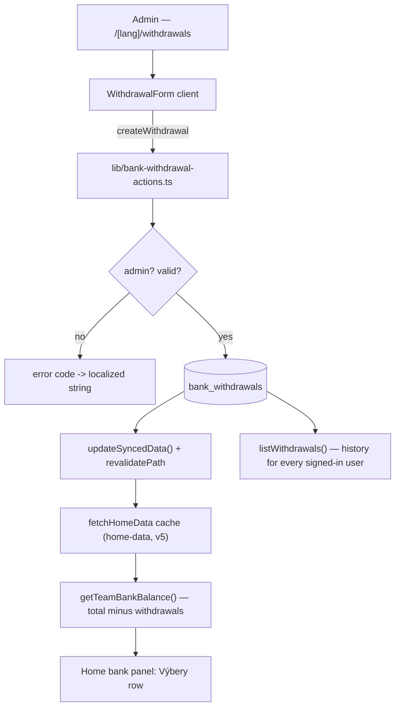

# Context

The team bank total shown on the home page is derived on the fly from `match_player_results` and `trainer_payments` — money that flows *in* (fines, trainer payments) minus bonuses paid out to players. There is no way to record money that leaves the bank for anything else: occasionally the team spends cash from the bank on food, new shoes/bags, travel, and so on.

This change adds admin-recorded **bank withdrawals**: a small form (amount, date, category, description) plus a history list, so the team can see where the money went and the displayed bank balance reflects the real cash.

Decisions confirmed with the user:
- Withdrawals **reduce** `TeamBankBalance.total` and show as their own row in the bank panel.
- History is visible to **all signed-in users**; creating and deleting is admin-only.
- A withdrawal carries a **date**, and its season is derived from that date. It has **no league** — league-filtered views ignore withdrawals entirely (same reasoning as `streak_fine`).
- Form fields: amount, description, **date**, **category**.

> Note: per `AGENTS.md`, this plan must also live at `.junie/plans/team-bank-withdrawals.md`. Plan mode allows editing only this file, so copying it there is the first thing execution does.

# Requirements

### Overview & Goals

Let an admin record an occasional withdrawal from the team bank with a reason, keep a permanent history of those withdrawals, and have the home page bank balance reflect them.

### Scope

**In scope**
- New table `bank_withdrawals` (amount, description, category, date, season, author).
- Read helpers + server actions (create, delete) with the project's error-code pattern.
- New page `/[lang]/withdrawals`: history for everyone, form + delete for admins.
- Link in `UserDropdown` and `MobileNav` (all users, next to "Pravidlá pokút").
- `getTeamBankBalance()` subtracts withdrawals; new "Výbery" row on the home page.
- Translations in `locales/{sk,cs,hu,sr}.json`.
- New `components/ui/textarea.tsx` (does not exist yet).

**Out of scope**
- Editing an existing withdrawal (delete + re-create instead).
- Receipts / file upload, approval workflow, per-player attribution.
- Any change to fine/bonus calculation — `recalculateDerivedFinancials()` is untouched.
- A general money-formatting helper (the codebase formats `€` ad hoc; stay consistent).

### User Stories

1. As an admin I open `/sk/withdrawals`, fill amount `85.50`, date, category "Jedlo", description "Občerstvenie na domáci zápas", and save. The record appears at the top of the history.
2. As an admin I delete a mistyped withdrawal through a confirm dialog; the dialog stays open if the delete fails.
3. As a player I open the same page from the user menu and see every withdrawal, newest first, with date, amount, category and reason.
4. As anyone I see on the home page that the bank total already has the withdrawals subtracted, with a "Výbery" row naming the amount.
5. When I switch the home page league filter away from "všetko", withdrawals are excluded from the total (they belong to no league).

# Technical Design

### Current Implementation

- `getTeamBankBalance(seasonId?, leagueKey?)` — `lib/db-utils.ts:640`. Two CTEs (`player_totals`, `trainer_totals`); `total = all_fines + all_trainer_payments - all_bonuses`, `unpaid = total - settled`. Returns `TeamBankBalance` (`lib/db-utils.ts:546`).
- `fetchHomeDataInternal()` — `lib/home-helpers.ts`, one `Promise.all` of six reads; cached by `fetchHomeData = unstable_cache(..., ['home-data', 'v4'], { revalidate: SYNCED_DATA_REVALIDATE_SECONDS, tags: ['home-data'] })`.
- Bank panel UI — `app/[lang]/page.tsx:111-200`, rows built from `BANK_ROW` / `BANK_LABEL` / `BANK_VALUE`, strings under `home.bank`.
- Admin pages: `app/[lang]/admin/{users,matches}`; `/admin` is gated in `proxy.ts` (`session.user.role !== 'admin'` → redirect), and every server action re-checks the role.
- Server-action pattern: `lib/manual-match-actions.ts` — typed error-code union, hand-rolled `validate()`, `updateSyncedData()` + `revalidatePath('/[lang]/...', 'page')`.
- Form pattern: `app/[lang]/admin/matches/ManualMatchForm.tsx` — `useState` per field + `useTransition`, labels injected as a flat `translations` prop, base-ui components from `components/ui/`.
- Schema is pushed, not migrated: `pnpm db:push` against `lib/db/schema.ts`; no `drizzle/` migration folder exists.

### Proposed Changes

#### 1. Schema (`lib/db/schema.ts`)

```ts
export const bankWithdrawals = pgTable('bank_withdrawals', {
  id: serial('id').primaryKey(),
  amount: numeric('amount').notNull(),
  description: text('description').notNull(),
  category: text('category').notNull(),
  withdrawnAt: timestamp('withdrawn_at', { withTimezone: true }).notNull(),
  seasonId: integer('season_id').notNull(),
  // Deleting an admin must not be blocked by their withdrawal history.
  createdBy: uuid('created_by').references(() => users.id, { onDelete: 'set null' }),
  createdAt: timestamp('created_at', { withTimezone: true }).defaultNow(),
}, (table) => [
  index('idx_bank_withdrawals_season_date').on(table.seasonId, table.withdrawnAt),
]);

export type BankWithdrawal = InferSelectModel<typeof bankWithdrawals>;
export type NewBankWithdrawal = InferInsertModel<typeof bankWithdrawals>;
```

Add `index` to the `drizzle-orm/pg-core` import. `onDelete: 'set null'` is a deliberate exception to the "no cascade" FK style — a withdrawal is a bank record, not a child of the user, and `deleteUser` in `lib/admin-actions.ts` must keep working.

#### 2. Season from date (`lib/season-config.ts`)

`SeasonConfig` gains `startYear: number` (13 → `2026`, 12 → `2025`), next to the existing display `name`:

```ts
/** August, zero-based: the 2026/2027 season opens in the autumn of 2026. */
const SEASON_START_MONTH = 7;

export function getSeasonIdForDate(date: Date): number | null {
  const startYear = date.getUTCMonth() >= SEASON_START_MONTH
    ? date.getUTCFullYear()
    : date.getUTCFullYear() - 1;
  return SEASONS_CONFIG.find((s) => s.startYear === startYear)?.id ?? null;
}
```

Returns `null` for a date outside every configured season, which the action rejects as `invalidDate` rather than silently filing it under the default season.

#### 3. Read layer (`lib/bank-withdrawals.ts`, new — no `'use server'`)

Mirrors `lib/manual-matches.ts`.

```ts
export const WITHDRAWAL_CATEGORIES = ['food', 'equipment', 'travel', 'other'] as const;
export type WithdrawalCategory = (typeof WITHDRAWAL_CATEGORIES)[number];

export interface WithdrawalListItem {
  id: number;
  amount: number;
  description: string;
  category: WithdrawalCategory;
  withdrawnAt: string;      // ISO, formatted in the page with formatDateOnly()
  seasonId: number;
  authorName: string | null;
}

export async function listWithdrawals(): Promise<WithdrawalListItem[]>;
```

Drizzle select joined `leftJoin(users, eq(bankWithdrawals.createdBy, users.id))`, ordered `desc(withdrawnAt), desc(id)`; `amount` mapped through `Number()`. Category is validated on write, so the read casts through a `WITHDRAWAL_CATEGORIES.includes()` guard and falls back to `'other'`.

#### 4. Bank balance (`lib/db-utils.ts`)

`TeamBankBalance` gains `withdrawals: number`. Withdrawals belong to no league, so they only count on the "all" filter — the same rule `fineAmount()` already applies to `streak_fine`:

```ts
/** Withdrawals carry no league, so a league-filtered balance leaves them out. */
function withdrawalTotal(seasonId: number, leagueKey?: string) {
  return isAllLeagues(leagueKey)
    ? sql`(SELECT COALESCE(SUM(bw.amount), 0) FROM bank_withdrawals bw WHERE bw.season_id = ${seasonId})`
    : sql`0::numeric`;
}
```

In `getTeamBankBalance()` the existing two CTEs stay untouched; a third is added and the final SELECT becomes:

```sql
withdrawal_totals AS (
  SELECT ${withdrawalTotal(targetSeasonId, leagueKey)} as withdrawn
)
SELECT
  (COALESCE(p.all_fines, 0) + COALESCE(t.all_payments, 0) - COALESCE(p.all_bonuses, 0)
    - COALESCE(w.withdrawn, 0))::numeric as total,
  -- Unpaid is what people still owe; a withdrawal is money already gone, so it is
  -- deliberately kept out of this figure.
  (COALESCE(p.all_fines, 0) + COALESCE(t.all_payments, 0) - COALESCE(p.all_bonuses, 0)
    - (COALESCE(p.paid_fines, 0) + COALESCE(t.paid_payments, 0)
       - COALESCE(p.paid_bonuses, 0)))::numeric as unpaid,
  COALESCE(p.all_bonuses, 0)::numeric as bonuses_awarded,
  COALESCE(p.paid_bonuses, 0)::numeric as bonuses_paid,
  COALESCE(w.withdrawn, 0)::numeric as withdrawals
FROM player_totals p, trainer_totals t, withdrawal_totals w
```

#### 5. Home data cache (`lib/home-helpers.ts`)

`FetchDataResult` is unchanged in shape except through `TeamBankBalance`, but the cache key hashes arguments only — bump the version string per the comment there: `['home-data', 'v4']` → `['home-data', 'v5']`.

#### 6. Server actions (`lib/bank-withdrawal-actions.ts`, new)

Follows `lib/manual-match-actions.ts` exactly.

```ts
'use server';

const WITHDRAWALS_PATH = '/[lang]/withdrawals';
const HOME_PATH = '/[lang]';
const MAX_WITHDRAWAL = 10_000;
const MAX_DESCRIPTION_LENGTH = 300;

export type WithdrawalError =
  | 'unauthorized' | 'invalidAmount' | 'invalidDescription'
  | 'invalidCategory' | 'invalidDate' | 'notFound' | 'unknown';

export type WithdrawalResult =
  | { success: true; id: number }
  | { success: false; error: WithdrawalError };

export interface WithdrawalInput {
  amount: string;        // raw field value, parsed here
  description: string;
  category: string;
  date: string;          // YYYY-MM-DD from <DatePicker>
}

export async function createWithdrawal(input: WithdrawalInput): Promise<WithdrawalResult>;
export async function deleteWithdrawal(id: number): Promise<WithdrawalResult>;
```

`createWithdrawal`:
1. `getSession()`; non-admin → `{ success: false, error: 'unauthorized' }`.
2. `validate()` (hand-rolled, no zod): amount parses to a finite number, `> 0`, `<= MAX_WITHDRAWAL`, rounded to 2 decimals; description trimmed length 3–`MAX_DESCRIPTION_LENGTH`; category in `WITHDRAWAL_CATEGORIES`; date parses to a valid `Date`, is not in the future (compare with `getStartOfBratislavaToday()` from `lib/home-helpers.ts`), and `getSeasonIdForDate()` returns non-null.
3. Insert with `createdBy: session.user.id`, `amount: amount.toFixed(2)`, `seasonId` from the date.
4. `updateSyncedData()` (from `lib/cache.ts` — the bank total lives in the `home-data` cache), then `revalidatePath(WITHDRAWALS_PATH, 'page')` and `revalidatePath(HOME_PATH, 'page')`.
5. `try/catch` → `console.error` + `error: 'unknown'`.

`deleteWithdrawal`: same guard, `db.delete(...).returning({ id })`, empty result → `notFound`, same invalidation. `recalculateDerivedFinancials()` is **not** called — no derived money field depends on withdrawals.

#### 7. Textarea (`components/ui/textarea.tsx`, new)

Copy of `components/ui/input.tsx` for `<textarea>`: same border/focus/disabled/aria-invalid classes, `min-h-20 py-2 field-sizing-content`, drop the spinner rules.

#### 8. Page (`app/[lang]/withdrawals/page.tsx`, new)

Server component in the style of `app/[lang]/admin/matches/page.tsx` (card list, module-level class constants `SECTION`, `SECTION_TITLE`, `COUNT_PILL`, `EMPTY_STATE`, `META_ROW`, mobile-first `grid grid-cols-1 lg:grid-cols-2 gap-3`).

- `const dict = await getDictionary(lang)`, `const session = await getSession()`, `const isAdmin = session?.user.role === 'admin'`.
- `const withdrawals = await listWithdrawals()`.
- Header: title, description, total pill — `withdrawals.reduce((sum, w) => sum + w.amount, 0).toFixed(2) €`.
- `{isAdmin && <WithdrawalForm lang={lang} translations={{...}} />}` — labels picked field by field from `dict.withdrawals`, including `categories` and `errors` maps.
- History cards: date via `formatDateOnly(w.withdrawnAt, lang)` (`lib/home-helpers.ts`), amount `text-red-600 dark:text-red-400 tabular-nums`, category label from `dict.withdrawals.categories[w.category]`, description, author name, season name from `getSeasonConfig(w.seasonId)?.name`. Admin also gets `<DeleteWithdrawalButton />`.
- Empty state `<p className={EMPTY_STATE}>{t.empty}</p>`.

The route needs no `proxy.ts` change: it is not in `publicRoutes`, so it already requires a session, and it is not under `/admin`, so players reach it.

#### 9. Client components (`app/[lang]/withdrawals/`)

- `WithdrawalForm.tsx` — `'use client'`. `useState` per field (`amount`, `description`, `category`, `date` seeded with today), `useTransition`, `useState<WithdrawalError | null>` for the error. `<Input type="number" inputMode="decimal" step="0.01" min="0" className="tabular-nums">`, `<DatePicker value onValueChange lang>`, `<Select>` over `WITHDRAWAL_CATEGORIES` with `<SelectContent className="w-[var(--anchor-width)]">` and `z-50` on the Positioner, `<Textarea maxLength={300}>`. On success: reset fields + `router.refresh()`. Error rendered as `<p className="mt-4 rounded-lg bg-destructive/15 px-3 py-2 text-sm text-destructive">{translations.errors[error]}</p>`.
- `DeleteWithdrawalButton.tsx` — near-copy of `app/[lang]/admin/matches/DeleteMatchButton.tsx`: controlled `AlertDialog`, `Loader2` spinner while pending, **stays open on failure**, clears the error on close.

#### 10. Navigation

- `components/layout/UserDropdown.tsx` — new `DropdownMenuItem` linking `/${lang}/withdrawals` with a `Wallet` (lucide) icon, in the section visible to **everyone**, next to the rules link.
- `components/layout/MobileNav.tsx` — the same link in the non-admin block.
- `components/layout/Header.tsx` — add `withdrawals: dict.common.withdrawals` to **both** `translations` objects (desktop + mobile).

#### 11. Home page bank row (`app/[lang]/page.tsx`)

New `BANK_ROW` between "Nezaplatené" and "Bonusy celkom", rendered only when `bankBalance.withdrawals > 0`:

```tsx
<div className={BANK_ROW}>
  <dt className={BANK_LABEL}>{dict.home.bank.withdrawals}</dt>
  <dd className={`${BANK_VALUE} text-red-600 dark:text-red-400`}>
    -{bankBalance.withdrawals.toFixed(2)} €
  </dd>
</div>
```

#### 12. Translations (`locales/{sk,cs,hu,sr}.json`)

`sk.json` is the schema for `Dictionary` (`lib/i18n/types.ts`), so all four files get the same keys.

- `common.withdrawals` — sk "Výbery z banky".
- `home.bank.withdrawals` — sk "Výbery".
- New top-level `withdrawals` namespace: `title`, `description`, `empty`, `totalLabel`, `formTitle`, `amount`, `amountPlaceholder`, `date`, `datePlaceholder`, `category`, `descriptionLabel`, `descriptionPlaceholder`, `save`, `saving`, `delete`, `deleteConfirmTitle`, `deleteConfirmDescription`, `addedBy`, `categories: { food, equipment, travel, other }`, `errors: { unauthorized, invalidAmount, invalidDescription, invalidCategory, invalidDate, notFound, unknown }`.

Slovak category wording: Jedlo a občerstvenie / Vybavenie / Cestovné / Iné.

### Architecture Diagram



### Key Decisions

1. **Own table, not a fake `trainer_payments`/negative fine row.** Withdrawals are not derived from match data; `recalculateDerivedFinancials()` is the single writer of every derived money field and rewrites rows freely, so a hand-written row inside those tables would be at risk of being wiped.
2. **One page for everyone, `/[lang]/withdrawals`, instead of `/[lang]/admin/withdrawals`.** The user wants players to see where the money went; `proxy.ts` already forces a session on non-public routes, and the admin-only parts (form, delete) are gated in the page and re-checked in every action. Putting it under `/admin` would need a second read-only page.
3. **Season derived from the date, no league.** Matches the confirmed answer and mirrors the `streak_fine` rule already documented in `AGENTS.md`: a value that belongs to no competition must be excluded from league-filtered sums, otherwise the same money appears or vanishes depending on the filter.
4. **`unpaid` untouched.** `unpaid` answers "who still owes the bank"; a withdrawal is cash already spent. Folding it in would make the debtor tooltip disagree with the number above it.
5. **Delete instead of edit.** These are rare records; a second write path with its own validation is not worth it. Delete is a hard delete — the row is not money owed to anyone, so nothing survives it.
6. **`onDelete: 'set null'` on `created_by`.** Keeps `deleteUser` working; the withdrawal history must outlive the admin who entered it.

### Edge Cases / Risks

- **Date outside configured seasons** (before 2025/2026) → `getSeasonIdForDate()` returns `null` → `invalidDate`. Adding an older season to `SEASONS_CONFIG` fixes it without touching this code.
- **Future dates** rejected — a withdrawal is a record of something that already happened.
- **Negative bank total** — already handled: `app/[lang]/page.tsx` colours `total < 0` red.
- **League filter** — withdrawals disappear from the total on `interliga` / `pohar` / `turnaje`, by design. The "Výbery" row simply does not render there (`withdrawals === 0`).
- **Stale cache** — forgetting the `v4` → `v5` bump would serve payloads without `withdrawals` while the type claims it exists (`undefined.toFixed` crash). The bump is part of Step 3.
- **Decimals** — `numeric` comes back as a string over neon-http; always `Number()` on read and `.toFixed(2)` on write, as the rest of `lib/db-utils.ts` does.
- **`db:push` on production** — there are no migration files in this repo; the new table must be pushed the same way the existing schema was.

# Delivery Steps

### Step 1: Schema + season helper
Touches `lib/db/schema.ts`, `lib/season-config.ts`. Add `bankWithdrawals` + inferred types + index import; add `startYear` to both entries of `SEASONS_CONFIG` and `getSeasonIdForDate()`. Run `pnpm db:push`.
Verify: `pnpm type-check`; table exists in Neon.

### Step 2: Read layer
Touches `lib/bank-withdrawals.ts` (new). `WITHDRAWAL_CATEGORIES`, `WithdrawalListItem`, `listWithdrawals()`.
Verify: type-check; a scratch `tsx` call returns `[]`.

### Step 3: Bank balance + cache
Touches `lib/db-utils.ts` (`TeamBankBalance.withdrawals`, `withdrawalTotal()`, third CTE), `lib/home-helpers.ts` (`v4` → `v5`).
Verify: home page still renders with an empty table; `withdrawals` is `0`.

### Step 4: Server actions
Touches `lib/bank-withdrawal-actions.ts` (new). `createWithdrawal`, `deleteWithdrawal`, `validate()`, invalidation.
Verify: type-check; every error code has a name that will exist in the locale `errors` map.

### Step 5: Translations
Touches `locales/sk.json` first (it types the `Dictionary`), then `cs.json`, `hu.json`, `sr.json`. Adds `common.withdrawals`, `home.bank.withdrawals`, the `withdrawals` namespace.
Verify: `pnpm type-check` — a key missing from `sk.json` breaks the build; diff the key sets of the four files.

### Step 6: UI — textarea, page, form, delete
Touches `components/ui/textarea.tsx`, `app/[lang]/withdrawals/page.tsx`, `.../WithdrawalForm.tsx`, `.../DeleteWithdrawalButton.tsx`. Mobile-first: single column, `sm:`/`lg:` upgrades only.
Verify: manual flows in Step "Testing".

### Step 7: Navigation + home page row
Touches `components/layout/UserDropdown.tsx`, `components/layout/MobileNav.tsx`, `components/layout/Header.tsx`, `app/[lang]/page.tsx`.
Verify: link visible for both roles, desktop and mobile; "Výbery" row appears once a withdrawal exists.

### Step 8: Quality check
`nvm use 22 && pnpm check` (lint + type-check). No Airbnb violations, no `any`, no TypeScript errors.

# Testing

### Validation Approach

Automated: `nvm use 22 && pnpm check` (the shell default is Node 18; Next 16 needs 22).

Manual, `pnpm dev`, mobile viewport first (375px), then desktop:

1. **Admin create** — `/sk/withdrawals`, save `85.50` / today / Jedlo / "Občerstvenie na domáci zápas". Card appears at the top with the correct date and author.
2. **Validation** — empty amount, `0`, `-5`, `999999`, 2-character description, a future date. Each shows its own localized message and writes nothing.
3. **Bank total** — note the home total before, add a withdrawal of `100`, reload `/sk`: total is `100` lower and a "Výbery −100.00 €" row is present. `unpaid` is unchanged.
4. **League filter** — `/sk?league=interliga`: the "Výbery" row is gone and the total is back to the fines-only figure.
5. **Season from date** — a withdrawal dated within 2025/2026 does not move the current-season total; switching the season filter to 2025/2026 shows it.
6. **Delete** — confirm dialog removes the row and restores the total; the dialog stays open if the action fails.
7. **Player view** — sign in as a non-admin: the menu link works, the history renders, no form and no delete buttons. Then call `createWithdrawal` from a non-admin session (e.g. via the React DevTools action) and confirm `unauthorized`.
8. **Locales** — repeat step 1 on `/cs`, `/hu`, `/sr`; no raw keys, no Slovak leaking through.
