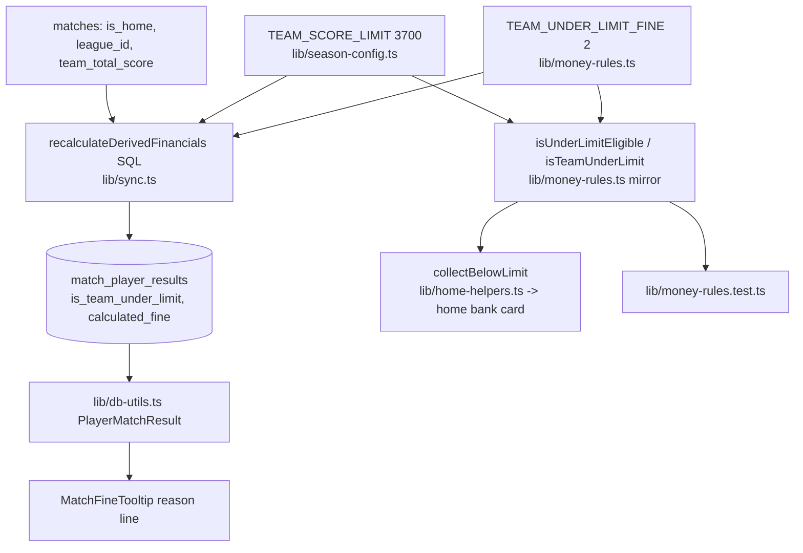

# Requirements

### Overview & Goals

The "team under 3750" player fine changes. Today every player who played pays **10 €** when the
team total is below **3750**, and the rule fires on home Interliga matches **and on tournaments
home and away**. The team agreed on a softer, home-only version:

- threshold drops to **3700** (still strict: exactly 3700 is not penalised),
- fine drops to **2 €** per player who played,
- the rule applies **only when we play at home** — away tournaments are no longer penalised.

Outcome: the SQL in `recalculateDerivedFinancials()`, its pure mirror, the tests, the DB column
name, the UI labels, all four locale files and the rule documents all describe the same rule
again, and the whole match history is recalculated so unpaid rows carry the new amount.

### Scope

**In Scope**
- `TEAM_SCORE_LIMIT` 3750 → 3700, `TEAM_UNDER_LIMIT_FINE` 10 → 2.
- League scope: `is_home AND (Interliga OR tournament)`. Slovak Cup stays exempt, away stays exempt.
- Rename the derived flag everywhere: DB column `is_team_under_3750` → `is_team_under_limit`,
  TS field `isTeamUnder3750` → `isTeamUnderLimit`, locale key
  `playerDetail.fineReasons.teamUnder3750` → `teamUnderLimit`.
- Remove the hardcoded `10` from the SQL: import `TEAM_UNDER_LIMIT_FINE` into `lib/sync.ts` so the
  amount lives in one place, like `TEAM_SCORE_LIMIT` already does.
- Tests: `lib/money-rules.test.ts`, `lib/home-helpers.test.ts`, `components/MatchFineTooltip.test.tsx`.
- Copy: `locales/{sk,cs,hu,sr}.json` (`rules.player.fines[4]`, `playerDetail.fineReasons.*`,
  `home.bank.belowLimit`), `AGENTS.md`, `README.md:15`,
  `.claude/skills/manage-match-results-and-payments/SKILL.md` +
  `.junie/skills/manage-match-results-and-payments/SKILL.md`.
- Backfill: run the sync (which ends in `recalculateDerivedFinancials()`) over the whole history.

**Out of Scope**
- Every other money rule (under-600, worst-in-team, faults, special faults, success gathering,
  trainer payments, bonuses) — untouched.
- Bank withdrawals, payday, scraping, auth.
- Any change to `is_paid` handling: already-paid rows survive a recalculation by the existing
  invariant and must keep doing so.

### Functional Requirements

1. A player with `total > 0` in a **home** Interliga match or a **home** tournament whose
   `matches.team_total_score < 3700` pays **2 €**, folded into `calculated_fine`, and carries
   `is_team_under_limit = true`.
2. Team total exactly 3700 or above: no fine, flag false.
3. Away matches (Interliga, tournaments, cup) and Slovak Cup home: no fine, flag false.
4. A player with `total = 0` never pays it, even in a penalised match.
5. The player-detail tooltip lists the reason; the home "below limit" card reads 3700.
6. All four locales describe 3700 / 2 € / home only.

# Technical Design

### Current Implementation

- `lib/season-config.ts:85-86` — `TEAM_SCORE_LIMIT = 3750` with a doc comment naming Interliga
  home matches. Imported by `lib/sync.ts:19`, `lib/money-rules.ts:3`, `lib/home-helpers.ts:20`.
- `lib/sync.ts:124-139` — the `team_under_3750` expression in the `ordered` CTE; `:161` writes
  `is_team_under_3750`; `:168` adds a hardcoded `10` to `calculated_fine`.
- `lib/money-rules.ts:19,73-93,147,158` — `TEAM_UNDER_LIMIT_FINE`, `isInterliga`, `isTournament`,
  `isUnderLimitEligible`, `isTeamUnderLimit`, and the `derivePlayers` composition.
- `lib/db/schema.ts:60` — `isTeamUnder3750: boolean('is_team_under_3750').default(false)`.
  There is **no migrations folder**; the schema is applied with `drizzle-kit push` (`pnpm db:push`).
- `lib/db-utils.ts:265,456,491` — the only read of the column, into `PlayerMatchResult`.
- `components/MatchFineTooltip.tsx:15,30,45,87-89` — prop + label; wired from
  `app/[lang]/player/[id]/page.tsx:63,231-238`.
- `lib/home-helpers.ts:107-130` — `collectBelowLimit()` recomputes the rule from the match list
  through `isUnderLimitEligible` (it does **not** read the column), so it follows the mirror.
- `locales/{sk,cs,hu,sr}.json:41,193,281-285`.

### Proposed Changes

#### 1. Constants (`lib/season-config.ts`, `lib/money-rules.ts`)

`lib/season-config.ts:85-86`:

```ts
/** Home matches under this team total fine every player who played. */
export const TEAM_SCORE_LIMIT = 3700;
```

`lib/money-rules.ts:19`: `export const TEAM_UNDER_LIMIT_FINE = 2;`

#### 2. League scope in the mirror (`lib/money-rules.ts`)

`isInterliga` and `isTournament` stay as they are; only the combination changes — the home flag
now gates both branches instead of only the Interliga one:

```ts
/** The `team_under_limit` league scope in sync.ts: home Interliga or a home tournament. */
export function isUnderLimitEligible(match: MatchContext): boolean {
  return Boolean(match.isHome) && (isInterliga(match) || isTournament(match));
}
```

`isTeamUnderLimit()` is unchanged (`< TEAM_SCORE_LIMIT`, strict). In `PlayerDerived` (`:49`) and
`derivePlayers` (`:147,153,158`) rename `isTeamUnder3750` → `isTeamUnderLimit`.

#### 3. SQL (`lib/sync.ts`)

Import the fine: `import { TEAM_UNDER_LIMIT_FINE } from '@/lib/money-rules';` (money-rules is
db-free, so this direction of the import is safe). Rewrite the CTE expression (`:124-139`):

```sql
             COALESCE(
               m.team_total_score < ${TEAM_SCORE_LIMIT}
               AND mpr.total > 0
               AND m.is_home
               AND (
                 m.league_id IN (${idList(INTERLIGA_LEAGUE_IDS)})
                 OR m.league_name ILIKE '%interliga%'
                 OR m.league_id IN (${idList(TOURNAMENT_LEAGUE_IDS)})
               ),
               false
             ) AS team_under_limit,
```

and the UPDATE (`:161,168`):

```sql
        is_team_under_limit = s.team_under_limit,
        ...
                            + CASE WHEN s.team_under_limit THEN ${TEAM_UNDER_LIMIT_FINE} ELSE 0 END,
```

The old `-- Tournaments are penalised home and away alike.` comment goes away with the branch.

#### 4. Schema + column rename (`lib/db/schema.ts`, database)

```ts
isTeamUnderLimit: boolean('is_team_under_limit').default(false),
```

Applied with `pnpm db:push`. **drizzle-kit will ask whether the column was renamed or
created/dropped — answer "rename"**, so the row history is preserved (the values are rewritten by
the recalculation anyway, but a drop/create loses them until it runs).

#### 5. Reads and UI (`lib/db-utils.ts`, `components/MatchFineTooltip.tsx`, `app/[lang]/player/[id]/page.tsx`)

Mechanical rename along the one path that carries the flag: `lib/db-utils.ts:265` (type),
`:456` (SELECT `is_team_under_limit`), `:491` (mapping) → `isTeamUnderLimit`;
`MatchFineTooltip` prop, `FineLabels.reasons.teamUnderLimit`, and the label/prop wiring on the
player page. No logic change — the tooltip still pushes one reason line.

#### 6. Locales (`locales/{sk,cs,hu,sr}.json`)

- `playerDetail.fineReasons.teamUnder3750` → key `teamUnderLimit`, text "tím pod 3700" (cs "tým
  pod 3700", hu "csapat 3700 alatt", sr "tim ispod 3700").
- `home.bank.belowLimit`: "Pod limit (3750)" → "Pod limit (3700)" and the three translations.
- `rules.player.fines[4]`: title "Tím pod 3700", amount "2 €", note rewritten — for sk:
  "Pre každého hráča, ktorý v zápase hral. Platí len pre domáce zápasy (Interliga aj turnaje).
  Presne 3700 je v pohode, trestá sa až menej." — and the matching cs/hu/sr wording.

`locales/locales.test.ts` already guards that all four files carry the same keys, so the rename
must land in all four.

### Architecture Diagram



### Key Decisions

- **Home gates everything** (chosen) over "keep tournaments away penalised": the rule is now a
  single `is_home AND (interliga OR tournament)`; Slovak Cup stays out, so the league list is
  still needed and cannot be reduced to `is_home` alone.
- **Rename the flag** rather than keep `is_team_under_3750`: the name would otherwise lie about
  the limit, and it has exactly one writer and one reader, so the diff is small and mechanical.
- **Move the `10` literal into `TEAM_UNDER_LIMIT_FINE`**: it is the one number the SQL and the
  mirror duplicated, which is exactly the drift the Testing Rules forbid.
- **Backfill by re-running the sync**, not by a one-off SQL update: `syncAll` ends in
  `recalculateDerivedFinancials()` (`lib/sync.ts:277`), which is the single writer, and the CLI
  path also invalidates the cache through `requestSyncedDataRevalidation()`.

### Edge Cases / Risks

- `matches.is_home` is **nullable**; `NULL AND …` is NULL, and the surrounding `COALESCE(…, false)`
  turns that into `false` — a match with an unknown side is not penalised. Same as today for
  Interliga; new (and intended) for tournaments.
- Manual tournament matches carry a user-set `isHome` checkbox
  (`lib/validation/manual-match.ts:35`), so away tournaments already entered simply stop being
  penalised after the recalculation.
- Rows with `is_paid = true` keep their old 10 € amount by design; the recalculation must not be
  changed to touch them, and the totals will therefore mix old and new amounts for past seasons.
- `drizzle-kit push` offering drop/create instead of rename is the one destructive step — see 4.
- `lib/home-helpers.ts` `LIMIT_FILTER_KEYS` still contains `interliga` and the tournament filter
  key, so the "below limit" card keeps showing at zero for those tabs; only its contents shrink.

# Delivery Steps

### ✓ Step 1: Constants and the pure mirror

`lib/season-config.ts` (limit 3700 + doc comment), `lib/money-rules.ts`
(`TEAM_UNDER_LIMIT_FINE = 2`, `isUnderLimitEligible` home gate, `PlayerDerived.isTeamUnderLimit`,
`derivePlayers`).

### ✓ Step 2: SQL in `lib/sync.ts`

Import `TEAM_UNDER_LIMIT_FINE`, rewrite the `team_under_limit` expression, the `SET` column and
the `calculated_fine` term.

### ✓ Step 3: Schema and column rename

`lib/db/schema.ts` field + column name. Do not run `db:push` yet — it runs in Step 7.

### ✓ Step 4: Reads, UI and locales

`lib/db-utils.ts` (type, SELECT, mapping), `components/MatchFineTooltip.tsx`,
`app/[lang]/player/[id]/page.tsx`, `locales/{sk,cs,hu,sr}.json`.

### ✓ Step 5: Tests

See the Testing section for the exact cases. Files: `lib/money-rules.test.ts`,
`lib/home-helpers.test.ts`, `components/MatchFineTooltip.test.tsx`.

### ✓ Step 6: Documents

`AGENTS.md` (Money Calculation Rules — Player section, the Codebase Invariants
`TEAM_SCORE_LIMIT` line, and the Testing Rules boundary list), `README.md:15`, and both
`manage-match-results-and-payments/SKILL.md` copies.

### Step 7: Migrate and backfill

`pnpm db:push` (answer **rename** for the column), then run the sync so
`recalculateDerivedFinancials()` rewrites every unpaid row: `pnpm tsx scripts/run-sync.ts`, or the
admin **Sync** button in the app. Spot-check a few historical matches afterwards.

### ✓ Step 8: Quality check

`nvm use && pnpm check` (lint + type check + tests). No TypeScript errors, no Airbnb violations,
green suite.

# Testing

### Validation Approach

`lib/money-rules.test.ts` — update the existing table-driven blocks:

- team total boundary triple **3699 / 3700 / 3701** → flagged `true / false / false`, fine
  **2 / 0 / 0** (replaces 3749/3750/3751 and the 10 €).
- `total = 0` in a penalised match: flag false, no fine (kept).
- league scope rows, now: home Interliga by id ✔, home Interliga by name ✔, **away Interliga ✘**,
  **tournament at home ✔**, **tournament away ✘ (changed)**, Slovak Cup home ✘, retired id 366 ✘,
  and add **`isHome: null` home-unknown ✘** to pin the nullable flag.
- the `calculated_fine` composition test that currently adds 10 € → 2 €.
- `isTeamUnderLimit` with `teamTotalScore: null` stays false.

`lib/home-helpers.test.ts:50-87` — `collectBelowLimit`: an away tournament under the limit is no
longer listed; a home tournament and a home Interliga match under 3700 still are; a match on
exactly 3700 is not.

`components/MatchFineTooltip.test.tsx` — rename the prop/label and assert the reason line appears
for a 2 € fine and that the rendered total is still `calculated_fine + streak_fine`.

`locales/locales.test.ts` — must stay green, proving the renamed key exists in all four files.

Manual check after Step 7: open a home Interliga match under 3700 on the player detail page and
confirm the tooltip lists the reason with 2 €; open an away tournament under 3700 and confirm it
does not; confirm the home page "Pod limit (3700)" card lists only home matches.

### Final check

`nvm use && pnpm check` — lint, type check and the full Vitest suite must pass.
