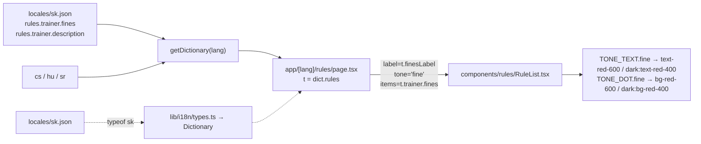

# Requirements

### Overview & Goals

On the rules page (`/[lang]/rules`) the trainer section currently renders its list under the green "Bonusy" heading. That is wrong from the trainer's point of view: those amounts are money the trainer **pays out**, not money received. The section must read as fines — the red "Pokuty" heading — and its description must stop claiming the trainer pays no fines.

This is a presentation-only change. No money calculation, no database field, no server action is touched.

### Scope

**In Scope**
- Trainer section heading label + tone on `app/[lang]/rules/page.tsx`.
- Rename the locale key `rules.trainer.bonuses` to `rules.trainer.fines` in all four locale files.
- Rewrite `rules.trainer.description` in all four locale files so it no longer says the trainer pays no fines.

**Out of Scope**
- `lib/sync.ts` `recalculateDerivedFinancials()`, `lib/money-rules.ts`, `lib/trainer-payments.ts` — no calculation change, so no money test change.
- The Money Calculation Rules section of `AGENTS.md` — the rules themselves are unchanged; only the player-facing framing of the trainer's payments changes.
- The player section (fines red / bonuses green stays as is).
- The `rules.notes.*` items, `rules.pageTitle`, `rules.subtitle`.
- The `trainer_payments.condition_type` values (`score_bonus`, `zero_faults`, `elite_player`) and every other identifier in code or database.

### User Stories

- As a trainer opening the rules page, I see my four amounts under a red **Pokuty** heading, matching the fact that I pay them.
- As a trainer, the section description tells me these are amounts I pay out, and does not contradict the heading.
- As a player, the player section is unchanged: red **Pokuty**, green **Bonusy**.

# Technical Design

### Current Implementation

`app/[lang]/rules/page.tsx` is a server component with no client JS. All strings come from the `rules` namespace of the locale dictionary (`const t = dict.rules`). The trainer section is lines 66–76:

```tsx
<RuleList label={t.bonusesLabel} tone="bonus" items={t.trainer.bonuses} />
```

`components/rules/RuleList.tsx` owns all tone styling: `tone: 'fine' | 'bonus'` picks `TONE_TEXT` (`text-red-600 dark:text-red-400` vs `text-emerald-600 dark:text-emerald-400`) and `TONE_DOT` for the leading dot. The amount pill is tone-neutral. `RuleList` needs no change.

`rules.finesLabel` / `rules.bonusesLabel` (locale line 255/256 in every file) are the only two labels; `finesLabel` is already used by the player section at `page.tsx:50`, so the red label text already exists in all four locales (sk/cs `Pokuty`, hu `Büntetések`, sr `Kazne`).

`lib/i18n/types.ts` derives `Dictionary = typeof sk`, so `locales/sk.json` is the type source of truth: renaming the key there makes the rename type-checked, and `locales/locales.test.ts` (lines 30–34) then requires cs/hu/sr to carry the identical flattened key set, including array indices.

`grep -rn "trainer.bonuses" app components lib locales` returns exactly one hit — `page.tsx:75` — so the rename has a single call site.

### Proposed Changes

#### 1. Trainer section heading (`app/[lang]/rules/page.tsx`)

Line 75 becomes:

```tsx
<RuleList label={t.finesLabel} tone="fine" items={t.trainer.fines} />
```

Nothing else in the file changes.

#### 2. Locale key rename (`locales/{sk,cs,hu,sr}.json`)

In each file, inside the `rules.trainer` object, rename the key `"bonuses"` to `"fines"`. The array contents (4 items, `{title, amount, note}` each) stay byte-for-byte identical — the amounts and the rules they describe are unchanged.

#### 3. Trainer description (`locales/{sk,cs,hu,sr}.json`, `rules.trainer.description`)

Replace the current text, which reads "Tréner neplatí žiadne pokuty. Tieto sumy vypláca tímu a hráčom." and directly contradicts the new heading.

| locale | new value |
|---|---|
| sk | `Tieto sumy tréner vypláca tímu a hráčom. Sám žiadny bonus nedostáva.` |
| cs | `Tyto částky trenér vyplácí týmu a hráčům. Sám žádný bonus nedostává.` |
| hu | `Ezeket az összegeket az edző fizeti a csapatnak és a játékosoknak. Ő maga bónuszt nem kap.` |
| sr | `Ove sume trener isplaćuje timu i igračima. Sam ne dobija nikakav bonus.` |

Non-empty in all four, so the `rules`-namespace test (locales.test.ts:47–57) stays green. No `{placeholder}` is introduced, so the placeholder-parity test is unaffected.

### Architecture Diagram



### Key Decisions

- **Reuse `finesLabel` rather than add a `trainer.finesLabel`.** The player section already renders it, the four translations exist, and the trainer's list means the same thing to the reader: money owed. A second key would only duplicate the string.
- **Reuse `RuleList`'s existing `fine` tone** instead of adding a tone variant. Red/dark-red is already the fine colour on the same page, so the two sections stay visually consistent and `RuleList.tsx` is untouched.
- **Rename `trainer.bonuses` → `trainer.fines`** (user's choice) so the key name matches what is rendered; the single call site and the sk-derived `Dictionary` type make this cheap and type-checked.
- **Keep the array items verbatim.** They describe unchanged money rules; touching titles or amounts would drag in the money-test and AGENTS.md sync requirements for no reason.
- **Do not rename `condition_type` values or anything in `lib/trainer-payments.ts`.** `score_bonus` and friends are data identifiers, and renaming them would be a logic/data migration, explicitly out of scope.

### Edge Cases / Risks

- **Locale test parity**: renaming the key in only some of the four files fails `locales.test.ts`. All four move in the same edit.
- **Type drift**: `Dictionary = typeof sk`, so if sk.json is renamed and `page.tsx` is not, `pnpm check` fails on `t.trainer.bonuses` — this is the intended safety net, not a risk.
- **Stale key elsewhere**: verified there is exactly one reference to `trainer.bonuses`; re-grep after the edit to confirm zero remain.
- **hu/sr wording**: `bonusesLabel` in hu (`Bónuszok`) and sr (`Bonusi`) is no longer used by the trainer section but is still used by the player bonus list, so both keys must stay.
- No money rule changed, therefore the Money Calculation Rules section of AGENTS.md and `lib/money-rules.test.ts` need no update. If review disagrees, the trigger would be a threshold or formula change — none is present here.

# Delivery Steps

### Step 1: Mirror this plan into the repo

Per the project's Plan Mode Rules, copy this plan to `.junie/plans/trainer-fines-appearance.md` (reuse the file if it already exists) so the repo carries the approved plan.

Touches: `.junie/plans/trainer-fines-appearance.md`.

### Step 2: Rename the locale key and rewrite the trainer description

In each of `locales/sk.json`, `locales/cs.json`, `locales/hu.json`, `locales/sr.json`:
- `rules.trainer.bonuses` → `rules.trainer.fines` (array contents unchanged).
- `rules.trainer.description` → the new per-locale value from the table above.

Verify: `grep -rn "trainer.bonuses" app components lib locales` returns nothing; `git diff --stat locales` shows four files with the same shape of change.

Touches: `locales/sk.json`, `locales/cs.json`, `locales/hu.json`, `locales/sr.json`.

### Step 3: Switch the trainer section to the fine label and tone

`app/[lang]/rules/page.tsx:75` → `label={t.finesLabel} tone="fine" items={t.trainer.fines}`.

Touches: `app/[lang]/rules/page.tsx`.

### Step 4: Lint, type check, tests

```
nvm use && pnpm check
```

Must pass with zero TypeScript errors and zero lint violations. `locales/locales.test.ts` is the relevant suite: it guards key parity across the four locales and that every `rules.*` key is non-empty.

Touches: nothing (verification only).

# Testing

### Validation Approach

- `nvm use && pnpm check` — lint (Airbnb), type check, and the Vitest suites. No new test is required: no function in `lib/money-rules.ts`, `lib/sync.ts`, or `lib/db-utils.ts` changes, so the Testing Rules' mandatory-test list is not triggered. `locales/locales.test.ts` already covers exactly what this change can break (key parity across sk/cs/hu/sr, non-empty `rules.*` values), and it runs as part of `pnpm check`.
- Manual check in the running app, mobile viewport first (`pnpm dev`), for each locale `/sk/rules`, `/cs/rules`, `/hu/rules`, `/sr/rules`:
  - trainer section heading reads the fine label (sk/cs `Pokuty`, hu `Büntetések`, sr `Kazne`) in red with a red dot;
  - the four trainer rows and their amounts (10 €, 15 €, 10 €, 10 €) are unchanged;
  - the trainer description no longer says the trainer pays no fines;
  - the player section still shows red **Pokuty** above its six rows and green **Bonusy** above its one row;
  - the same in dark mode, where the heading must use `text-red-400`.
