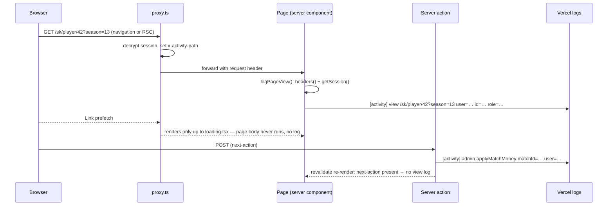

# Requirements

### Overview & Goals

The admin wants to see, in Vercel's runtime logs, what each signed-in user does: which pages
they open, which admin actions they run, and when they sign in or out. Each event becomes one
readable `console.log` line with a fixed `[activity]` prefix, so the Vercel log search
`[activity]` (plus a name or id) shows one user's trail.

```
[activity] view /sk/player/42?season=13 user=Ján Novák id=17 role=player
[activity] admin approveUser userId=5 user=Peter Admin id=1 role=admin
[activity] sign-in password user=Ján Novák id=17 role=player
[activity] sign-in-failed password reason=invalidCredentials email=jan@example.com
[activity] sign-out user=Ján Novák id=17 role=player
```

### Scope

**In scope**
- Page views of every signed-in page, logged from the page's server component (not from the
  proxy, so `<Link>` prefetches do not show up as visits).
- Successful admin server actions, with the ids they acted on.
- Sign-in (password and passkey), failed sign-in, sign-out.

**Out of scope**
- Storing activity in the database or building an in-app activity screen.
- Log drains / external log tools, JSON output.
- Views of public pages (sign-in, sign-up, password reset, offline, OG image).
- Non-admin server actions (push subscription, passkey register/rename/delete).
- Client-cached back/forward navigations — the router serves them without a server render,
  so they cannot be logged server-side.

### Functional Requirements

1. Opening any signed-in page (full load or client navigation) logs one `view` line with the
   locale-prefixed path, query string, user name, id and role.
2. A prefetch does not log. A server action that revalidates the page it was called from does
   not log a second `view`.
3. Each successful admin action logs one `admin <actionName>` line with its target ids.
   Failures (unauthorized, validation, DB error) do not log an activity line — DB errors
   already log via `console.error`.
4. Successful sign-in logs `sign-in password|passkey`; a failed password sign-in logs
   `sign-in-failed password reason=<code> email=<email>`; a failed passkey sign-in logs
   `sign-in-failed passkey reason=<code>`; sign-out logs `sign-out` with the user who left.

# Technical Design

### Current Implementation

- `proxy.ts` authenticates every non-public request by decrypting the session cookie, but
  Next strips `next-router-prefetch` and the other Flight headers from `request.headers`
  inside proxy (`node_modules/next/dist/server/web/adapter.js`), so proxy cannot tell a
  prefetch from a real navigation.
- `app/[lang]/loading.tsx` is the boundary `<Link>` prefetches, so a prefetch of a dynamic
  page never runs the page component — the page body only runs on a real visit.
- Server components have no access to the current URL. `getSession()` in `lib/session.ts`
  returns `{ user: { id, role, name } }`.
- The only logging today is ad-hoc `console.*` with a per-file `/* eslint-disable no-console */`.
- Admin actions (`lib/admin-actions.ts`, `lib/match-money-actions.ts`,
  `lib/manual-match-actions.ts`, `lib/bank-withdrawal-actions.ts`, `lib/actions.ts`) each call
  `getSession()` and return `{ success, error }`.
- Sign-in: `signIn()` / `signOut()` in `lib/auth-actions.ts`,
  `finishPasskeyAuthentication()` in `lib/webauthn-actions.ts`.

### Proposed Changes

#### 1. Activity logger (`lib/activity-log.ts`, new)

```ts
import 'server-only';
import { headers } from 'next/headers';
import type { UserPayload } from './auth';
import { getSession } from './session';

export const ACTIVITY_PATH_HEADER = 'x-activity-path';

type ActivityFields = Record<string, string | number | null | undefined>;

export function formatActivity(
  event: string,
  detail: string | null,
  fields: ActivityFields = {},
  user?: Pick<UserPayload, 'id' | 'name' | 'role'> | null,
): string {
  const parts = ['[activity]', event];
  if (detail) parts.push(detail);
  Object.entries(fields).forEach(([key, value]) => {
    if (value !== null && value !== undefined && value !== '') parts.push(`${key}=${value}`);
  });
  if (user) parts.push(`user=${user.name} id=${user.id} role=${user.role}`);
  return parts.join(' ');
}

export function logActivity(...args: Parameters<typeof formatActivity>): void {
  // eslint-disable-next-line no-console
  console.log(formatActivity(...args));
}

export async function logPageView(): Promise<void> {
  const requestHeaders = await headers();
  // A server action that revalidates re-renders the page inside the POST; that is not a visit.
  if (requestHeaders.has('next-action')) return;
  const path = requestHeaders.get(ACTIVITY_PATH_HEADER);
  const session = await getSession();
  if (!path || !session) return;
  logActivity('view', path, {}, session.user);
}
```

- User fields go last because the name may contain spaces; everything before it is
  `key=value` with no spaces (ids, codes, e-mails).
- `ACTIVITY_PATH_HEADER` lives in its own file, `lib/activity-header.ts`, so `proxy.ts` can
  import it without pulling `server-only` / `next/headers` in.

#### 2. Proxy passes the URL to the page (`proxy.ts`)

In the authenticated branch only (after the admin check), forward the path and query as a
request header — Next's documented way to hand data from proxy to server components:

```ts
const requestHeaders = new Headers(req.headers);
requestHeaders.set(ACTIVITY_PATH_HEADER, `${pathname}${req.nextUrl.search}`);
const response = NextResponse.next({ request: { headers: requestHeaders } });
await refreshSessionCookie(response, session);
return response;
```

Always `set` (never append), so a client-sent `x-activity-path` is overwritten.
`req.nextUrl` is already normalized (`_rsc` stripped), so RSC navigations log the clean URL.

#### 3. Pages call `logPageView()`

Add `await logPageView();` as the first statement of each signed-in page's default export:

- `app/[lang]/page.tsx`, `app/[lang]/player/[id]/page.tsx`, `app/[lang]/rules/page.tsx`,
  `app/[lang]/settings/page.tsx`, `app/[lang]/withdrawals/page.tsx`,
  `app/[lang]/admin/users/page.tsx`, `app/[lang]/admin/matches/page.tsx`,
  `app/[lang]/admin/money/page.tsx`, `app/[lang]/admin/money/[matchId]/page.tsx`.

Every `[lang]` route was already dynamic (`ƒ` in `next build`), so `headers()` changes no
page's rendering mode.

#### 4. Admin actions (`lib/admin-actions.ts`, `lib/match-money-actions.ts`, `lib/manual-match-actions.ts`, `lib/bank-withdrawal-actions.ts`, `lib/actions.ts`)

Just before each `return { success: true … }`, call `logActivity('admin', '<fnName>', { … }, session.user)`:

| Action | Fields |
|---|---|
| `approveUser` | `userId`, `role` |
| `deleteUser` | `userId` |
| `linkScrapedPlayer` | `accountId`, `scrapedId`, `externalPlayerId` |
| `applyMatchMoney` | `matchId`, `changes` (count) |
| `saveManualMatch` | `matchId` (the returned one), `mode=create\|edit` |
| `deleteManualMatch` | `matchId` |
| `createWithdrawal` | `id`, `amount`, `category` |
| `deleteWithdrawal` | `id` |
| `triggerSync` | `newResults` (count) |

#### 5. Sign-in / sign-out (`lib/auth-actions.ts`, `lib/webauthn-actions.ts`)

- `signIn()`: before `redirect`, `logActivity('sign-in', 'password', {}, user)`. On each
  `invalidCredentials` / `notApproved` return, `logActivity('sign-in-failed', 'password',
  { reason, email })`. `missingFields` and `dbError` are not logged as activity.
- `finishPasskeyAuthentication()`: after `setSession`, `logActivity('sign-in', 'passkey', {},
  { id: credential.userId, name: credential.userName, role: credential.userRole })`; on the
  `verificationFailed` / `notApproved` returns, `logActivity('sign-in-failed', 'passkey',
  { reason })`.
- `signOut()`: read `getSession()` before `clearSession()`, then
  `logActivity('sign-out', null, {}, session?.user)`.

### Architecture Diagram



### Key Decisions

- **Page-level logging over proxy logging** (chosen by the user): proxy cannot see the
  prefetch flag, so the home page's player cards would each log a fake visit.
- **Proxy forwards the URL via a request header** instead of each page rebuilding it from
  `params`/`searchParams`: one uniform `await logPageView()` call, exact URL including query,
  and pages that don't take `searchParams` need no signature change.
- **Readable text over JSON** (chosen by the user): easiest to scan in the Vercel log view.
- **`console.log` only**, no new dependency — Vercel captures stdout per invocation.

### Edge Cases / Risks

- Personal data in logs: names and failed-sign-in e-mails land in Vercel logs (retention per
  plan). No passwords, tokens, or cookie values are ever logged.
- Repeated renders of one page — `useLiveDataRefresh` calls `router.refresh()` on every focus
  and visibility change, plus pull-to-refresh and `router.refresh()` after saves — look
  exactly like visits on the server and flooded the log. `logPageView()` therefore keeps the
  last path per user id in a module-level `Map` and skips a render of the same path (query
  included) within a sliding 10-minute window (`REPEAT_VIEW_WINDOW_MS`). Every render extends
  the window. The map lives per server instance, so two Vercel instances can each log the same
  visit once. Tested in `lib/activity-log.test.ts` with fake timers.
- A page that errors before `logPageView()` would not log; hence it is the first statement.
- Unauthenticated requests never reach the header branch, and `logPageView()` also bails
  without a session.

# Delivery Steps

### ✓ Step 0: Rename this plan
Rename this file to `docs/plans/per-user-activity-logs.md`.

### ✓ Step 1: Write failing tests for the logger and proxy header
Files: `lib/activity-log.test.ts` (new), `proxy.test.ts`.
- `formatActivity`: event only; with detail; fields skip null/undefined/''; user appended
  last with a name containing a space and a diacritic.
- `logPageView` (mock `next/headers` and `./session`): logs with path + user; nothing without
  a session; nothing without the header; nothing when `next-action` is present.
- `proxy.test.ts`: an authenticated request sets the forwarded header
  (`x-middleware-request-x-activity-path` on the response) to path + query; a client-supplied
  `x-activity-path` is overwritten; public routes and redirects do not set it.

### ✓ Step 2: Implement `lib/activity-log.ts` and the proxy header
Files: `lib/activity-log.ts`, `proxy.ts`. Step 1 tests pass.

### ✓ Step 3: Call `logPageView()` from the signed-in pages
Files: the nine pages listed in Proposed Changes §3.

### ✓ Step 4: Log admin actions, with tests
Files: `lib/admin-actions.ts`, `lib/match-money-actions.ts`, `lib/manual-match-actions.ts`,
`lib/bank-withdrawal-actions.ts`, `lib/actions.ts`; tests in `lib/admin-actions.test.ts`,
`lib/match-money-actions.test.ts`, plus new `lib/bank-withdrawal-actions.test.ts` and
`lib/manual-match-actions.test.ts` following the `vi.mock('./session' | './db' | './cache')`
pattern of `admin-actions.test.ts`, with `vi.mock('./activity-log', () => ({ logActivity: vi.fn() }))`.
Each covers: success → exactly one `logActivity('admin', '<fn>', {ids}, user)` call;
unauthorized → none; validation failure → none.

### ✓ Step 5: Log sign-in and sign-out
Files: `lib/auth-actions.ts`, `lib/webauthn-actions.ts`.

### ✓ Step 6: Quality check
Run `pnpm check` (lint + type check + tests), all green.

# Testing

### Validation Approach

- **Unit tests**: `lib/activity-log.test.ts`, `proxy.test.ts`, `lib/admin-actions.test.ts`,
  `lib/match-money-actions.test.ts`, `lib/bank-withdrawal-actions.test.ts`,
  `lib/manual-match-actions.test.ts` as listed in Steps 1 and 4. No money calculation changes,
  so no money-rule tests are affected.
- **Manual, production build** (prefetching only happens in production):
  `pnpm build && pnpm start`, sign in, open home → player → rules → admin money sheet, apply
  a change, sign out. The terminal must show exactly one `view` per page actually opened
  (none for the player cards merely visible on home), one `admin applyMatchMoney` with no
  extra `view` from the revalidation, and `sign-in` / `sign-out` lines. Try a wrong password
  and check the `sign-in-failed` line.
- **On Vercel** after deploy: Logs tab → search `[activity]`, then `id=<userId>` to follow one
  user.
- **Final**: `pnpm check` passes.
