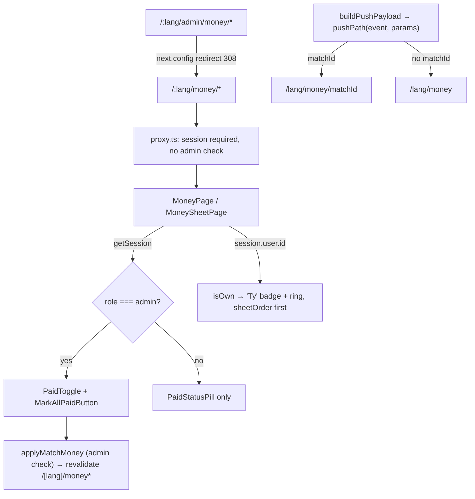

# Requirements

### Overview & Goals

The match payment overview (`/[lang]/admin/money` + `/[lang]/admin/money/[matchId]`) is admin-only
today: `proxy.ts` redirects every non-admin away from `/admin/*`. Players and trainers should be
able to see, for every played match, who owes what and whether it was paid — without being able to
change anything. The page moves out of `/admin`, the write controls render for admins only, the
viewer's own rows are marked and pinned to the top, and money push notifications deep-link to it.

### Scope

**In Scope**
- Move the two routes to `/[lang]/money` and `/[lang]/money/[matchId]`; redirect `/[lang]/admin/money/*`.
- Every signed-in user sees all rows (player fines, bonuses, trainer payments) and the three total chips.
- Non-admins: paid/unpaid status pill stays, `PaidToggle` button and every `MarkAllPaidButton` are hidden.
- Viewer's own cards: localized "Ty" badge + primary ring, sorted first in every section.
- Nav link moves out of the admin block into the general section, next to "Withdrawals", for all roles.
- Locale namespace `admin.money` → top-level `money`; admin keeps the current description, everyone else gets a read-only one.
- Push deep links: `finePaid` / `bonusPaid` / `trainerPaid` / `unsettledMatch` → `/money/[matchId]`;
  `moneyUpdated` / `fineAdded` / `bonusEarned` / `streakWarning` / `debtReminder` → `/money`.

**Out of Scope**
- Any per-viewer hint on the match list (`/money` list is identical for everyone).
- Changes to money calculation, `recalculateDerivedFinancials()`, or `applyMatchMoney()` authorization (stays admin-only).
- Other push events (`matchResult(s)`, `bankWithdrawal`, `userAwaitingApproval`, `scrape*`).

### User Stories

1. As a player/trainer, I open "Pokuty a platby" from the menu and see the list of played matches with unpaid totals, filtered by season/league.
2. As a player/trainer, I open a match and see every player's fine and bonus and every trainer payment with a Zaplatené/Nezaplatené pill, but no buttons.
3. As a player/trainer, my own card(s) are marked "Ty" and appear at the top of each section.
4. As an admin, the page works exactly as today (all buttons), at the new URL; my old bookmark still works.
5. As a player, tapping "your fine was paid" opens that match's page; tapping "fine added" / "debt reminder" / "money updated" opens the overview.
6. As an admin, tapping "unsettled match" opens that match's page, ready to settle.

# Technical Design

### Current Implementation

- `app/[lang]/admin/money/page.tsx` — list via `getPlayedMatchMoneySummaries()`, links to `/admin/money/{id}`.
- `app/[lang]/admin/money/[matchId]/page.tsx` — `getMatchSheet()`, renders `PlayerMoneyCard`,
  `TrainerPaymentCard` (both embed `PaidToggle`) and `MarkAllPaidButton` (header + per section).
  Sorting via local `openFirst()`.
- `proxy.ts:123` — `/admin*` → non-admin redirected to `/${locale}`.
- `lib/match-money-actions.ts` — `applyMatchMoney()` checks `role === 'admin'`; revalidates
  `MONEY_LIST_PATH = '/[lang]/admin/money'` and `MONEY_SHEET_PATH = '/[lang]/admin/money/[matchId]'`.
- `components/layout/UserDropdown.tsx:148-157`, `components/layout/MobileNav.tsx:182-189` — money link inside the admin block.
- `dict.admin.money` used by both pages, `app/[lang]/trainer/[id]/page.tsx:84` (`conditions`), `components/money/TrainerMatchPayment.test.tsx`.
- `lib/push-payload.ts` — static `EVENT_PATHS`; every money event → `''` (home).
- `lib/push-digest.ts` `deriveSettlementPushes()` — builds `finePaid`/`bonusPaid`/`trainerPaid` with `{ amount, opponent }`; `SettlementSheet.match` is `{ opponent }`.
- `app/api/cron/notifications/route.ts` `reportUnsettledMatches()` — `notifyAdmins('unsettledMatch', { opponent, amount }, …)`; `match.externalId` is in scope.
- `/[lang]/withdrawals/page.tsx` is the precedent: public route, `session.user.role === 'admin'` gates the form.

### Proposed Changes

#### 1. Routes (`app/[lang]/money/page.tsx`, `app/[lang]/money/[matchId]/page.tsx`)

`git mv` both files from `app/[lang]/admin/money/`. Then:
- List page: `href={`/${lang}/money/${match.externalId}`}`; `t = dict.money`; fetch `getSession()`
  alongside, `description = isAdmin ? t.description : t.descriptionReadOnly`.
- Sheet page: back link → `/${lang}/money`; `t = dict.money`; `const session = await getSession()`
  (in the existing `Promise.all`), `isAdmin = session?.user.role === 'admin'`, `viewerId = session?.user.id`.
  - Header `MarkAllPaidButton` rendered only when `isAdmin`.
  - `Section` `action` becomes optional (`action?: ReactNode`); pass `isAdmin ? bulkButton(...) : null`.
  - Cards get `canEdit={isAdmin}` and `isOwn={p.user_id === viewerId}` / `isOwn={payment.userId === viewerId}`.
  - Sorting uses `sheetOrder()` from §5 instead of the local `openFirst()`.
  - Rename components `AdminMoneyPage` → `MoneyPage`, `AdminMoneySheetPage` → `MoneySheetPage`.

#### 2. Redirect (`next.config.ts`)

`next.config` redirects run **before** the proxy (Next 16 proxy docs, "Execution order"), so a
non-admin hitting an old bookmark never meets the admin guard:

```ts
async redirects() {
  return [
    { source: '/:lang/admin/money/:path*', destination: '/:lang/money/:path*', permanent: true },
  ];
},
```

Query string (`?season=&league=`) passes through by default. `proxy.ts` is unchanged — the new
route is a normal authenticated route.

#### 3. Server action revalidation (`lib/match-money-actions.ts`)

`MONEY_LIST_PATH = '/[lang]/money'`, `MONEY_SHEET_PATH = '/[lang]/money/[matchId]'`. Auth check unchanged.

#### 4. Read-only cards (`components/money/PaidToggle.tsx`, `PlayerMoneyCard.tsx`, `TrainerPaymentCard.tsx`)

- Extract the pill from `PaidToggle` into exported `PaidStatusPill({ isPaid, labels: { paid, unpaid } })`
  (same file, same `PILL` / `PILL_TONE`); `PaidToggle` renders it.
- `PlayerMoneyCard`: new props `canEdit?: boolean` (default `true`, so `/player` and other callers stay
  unchanged) and `isOwn?: boolean` (default `false`). The `toggle` slot renders
  `canEdit ? <PaidToggle …/> : <PaidStatusPill …/>` (still only when amount > 0).
- `TrainerPaymentCard`: same two props; `canEdit ? <PaidToggle/> : <PaidStatusPill/>`.
- Own marker (both cards): `CARD` gets `relative ring-2 ring-primary` when `isOwn`; the "Ty" label
  (`OwnBadge`, `components/money/OwnBadge.tsx`) sits on the ring line in the top-left corner and
  interrupts it, like a fieldset legend (follow-up design change).
- Summary chips (follow-up design change): list and sheet share `SettlementChip`
  (`components/money/SettlementChip.tsx`) — nothing paid: total in red; partly paid: missing part in
  red / paid part in green; fully paid: total in green; nothing raised: muted "0 €". The list query
  now also returns the totals, and the `money.unpaidOf` locale key is gone. `labels` gains `you: string`
  (`PlayerMoneyCardLabels`, and `TrainerPaymentCard` labels type extended the same way — optional
  there is not needed since the only caller is the sheet page).
- `canEdit` is a server-rendered prop: the action stays guarded server-side regardless.

#### 5. Sort helper (`lib/money-sheet-order.ts`, new, db-free)

```ts
export function sheetOrder<T>(
  isOwn: (row: T) => boolean,
  isOpen: (row: T) => boolean,
  name: (row: T) => string,
  locale: string,
): (a: T, b: T) => number {
  return (a, b) => Number(isOwn(b)) - Number(isOwn(a))
    || Number(isOpen(b)) - Number(isOpen(a))
    || name(a).localeCompare(name(b), locale);
}
```

Replaces `openFirst()` in the sheet page for all three sections. Applies to admins too (no-op when
they have no rows).

#### 6. Navigation (`components/layout/UserDropdown.tsx`, `components/layout/MobileNav.tsx`)

Move the `/${lang}/admin/money` item out of the `isAdmin` block, place it right after the
Withdrawals item, href `/${lang}/money`. Label stays `translations.matchMoney` (`common.matchMoney`).

#### 7. Locales (`locales/{sk,cs,hu,sr}.json`)

- Move the whole `admin.money` object to top-level `money` (scripted move, identical in all four files).
- Add `money.descriptionReadOnly`:
  - sk: "Prehľad pokút, bonusov a platieb trénerov za každý odohraný zápas."
  - cs: "Přehled pokut, bonusů a plateb trenérů za každý odehraný zápas."
  - hu: "A büntetések, bónuszok és edzői kifizetések áttekintése minden lejátszott mérkőzésre."
  - sr: "Pregled kazni, bonusa i uplata trenera za svaku odigranu utakmicu."
- Add `money.you`: sk "Ty", cs "Ty", hu "Te", sr "Ti".
- Update consumers: both pages, `app/[lang]/trainer/[id]/page.tsx` (`dict.money.conditions`),
  `components/money/TrainerMatchPayment.test.tsx` (`sk.money.conditions`). Follow the `translations` skill.

#### 8. Push deep links (`lib/push-payload.ts`, `lib/push-digest.ts`, `app/api/cron/notifications/route.ts`)

- `EVENT_PATHS`: `moneyUpdated`, `fineAdded`, `bonusEarned`, `streakWarning`, `debtReminder`,
  `finePaid`, `bonusPaid`, `trainerPaid`, `unsettledMatch` → `'money'`.
- Match-bound events read a `matchId` param; `buildPushPayload()` uses a new exported pure helper:

```ts
const MATCH_EVENTS: ReadonlySet<PushEvent> = new Set(['finePaid', 'bonusPaid', 'trainerPaid', 'unsettledMatch']);

export function pushPath(event: PushEvent, params: PushParams): string {
  const matchId = Number(params.matchId);
  if (MATCH_EVENTS.has(event) && Number.isInteger(matchId) && matchId > 0) return `money/${matchId}`;
  return EVENT_PATHS[event];
}
```
  (validated because personal pushes also arrive over HTTP from the CLI via `parsePersonalPushes()`,
  which already passes numeric params through untouched — no change needed there.)
- `SettlementSheet.match` becomes `{ external_id: number; opponent: string | null }` (`MatchSheet`
  already satisfies it); `deriveSettlementPushes()` adds `matchId: after.match.external_id` to every param set.
- `reportUnsettledMatches()`: params add `matchId: match.externalId`.
- `sendPushToUsers` / `notifyAdmins` / `sendPersonalMoneyPushes` / `public/sw.js` need no change —
  params already flow per recipient and the SW opens `payload.url`.

### Architecture Diagram



### Key Decisions

- **Move route vs. proxy exception** — moved to `/money` (user choice): `/admin/*` stays a clean
  admin-only rule, same shape as `/withdrawals`.
- **Redirect in `next.config` vs. proxy** — `next.config` runs before the proxy, is declarative, and
  keeps the query string; the proxy stays untouched.
- **All rows visible** — user choice; matches the existing public debtor list on home.
- **`canEdit` defaulting to `true`** — `PlayerMoneyCard` is also used elsewhere; defaulting keeps those
  callers byte-identical.
- **Match id carried as a push param** instead of a new field on `PersonalPush` — params already flow
  per recipient through every path (in-app, cron, CLI over HTTP), so no plumbing changes.
- **`fineAdded`/`bonusEarned`/`streakWarning` → list, not a match** — they are before/after diffs of a
  player's global totals and a sync can touch several matches.

### Edge Cases / Risks

- A non-admin could still POST the server action — `applyMatchMoney()` rejects with `unauthorized` (unchanged).
- Trainer with several condition rows: all their rows float to the top, open-first within them.
- Viewer with no rows (admin, unlinked user): ordering identical to today.
- Old admin push notifications already delivered point at `/` — unaffected.
- `matchId` param also reaches `interpolate()`; no locale string uses `{matchId}`, so it is inert.
- Cache: pages are dynamic (read session); `getMatchSheet` / summaries are not user-keyed, so no cache change.
- Client/server boundary: `PaidStatusPill` lives in the `'use client'` `PaidToggle.tsx`, which imports
  only `match-money-actions` (a server action, allowed) and `match-money-payload` — unchanged graph.

# Delivery Steps

### ✓ Step 1: Move locale namespace and add new keys
Files: `locales/{sk,cs,hu,sr}.json`, `app/[lang]/admin/money/page.tsx`, `app/[lang]/admin/money/[matchId]/page.tsx`,
`app/[lang]/trainer/[id]/page.tsx`, `components/money/TrainerMatchPayment.test.tsx`.
Verify: `locales/locales.test.ts` and type check pass.

### ✓ Step 2: Move routes and add redirect
Files: `app/[lang]/money/**` (git mv), `next.config.ts`, `lib/match-money-actions.ts`.
Update internal links/back link and revalidation paths. Verify: `/sk/admin/money?season=13` → `/sk/money?season=13`.

### ✓ Step 3: Read-only and own-row card variants
Files: `components/money/PaidToggle.tsx`, `PlayerMoneyCard.tsx`, `TrainerPaymentCard.tsx`, `lib/money-sheet-order.ts`.

### ✓ Step 4: Wire role and viewer into the pages
Files: `app/[lang]/money/page.tsx`, `app/[lang]/money/[matchId]/page.tsx` — description switch,
`canEdit`, `isOwn`, `sheetOrder`, conditional bulk buttons, `labels.you`.

### ✓ Step 5: Move nav link
Files: `components/layout/UserDropdown.tsx`, `components/layout/MobileNav.tsx`.

### ✓ Step 6: Push deep links
Files: `lib/push-payload.ts`, `lib/push-digest.ts`, `app/api/cron/notifications/route.ts`.

### ✓ Step 7: Write/extend tests
Files: `components/money/PaidToggle.test.tsx`, `PlayerMoneyCard.test.tsx`, `TrainerPaymentCard.test.tsx`,
`lib/money-sheet-order.test.ts` (new), `lib/push-payload.test.ts`, `lib/push-digest.test.ts`. See Testing.

### ✓ Step 8: Quality check
`pnpm check` (lint + type check + tests) must pass with no errors.

# Testing

### Validation Approach

**Unit / component tests (Vitest)**
- `components/money/PaidToggle.test.tsx`: `PaidStatusPill` renders "Zaplatené" / "Nezaplatené" with no button.
- `components/money/PlayerMoneyCard.test.tsx`:
  - `canEdit={false}`: fine amount `calculated_fine + streak_fine` (e.g. 6 + 10 → "16 €") and bonus
    "40 €" rendered, status pill present, `queryByRole('button')` is null.
  - `canEdit` omitted: Zaplatiť button present (unchanged behaviour).
  - `isOwn`: "Ty" badge rendered; absent by default.
- `components/money/TrainerPaymentCard.test.tsx`: same three cases (amount, pill, no button; "Ty" badge).
- `lib/money-sheet-order.test.ts`: own row first even when paid; then open before paid; then name
  (Slovak collation, e.g. "Čech" after "Cibula"); multiple own rows keep open-first among themselves.
- `lib/push-payload.test.ts`:
  - `finePaid`/`bonusPaid`/`trainerPaid`/`unsettledMatch` with `matchId: 123` → url `/sk/money/123` (all four locales).
  - same events without `matchId`, or with `matchId: 'abc'` / `0` / `-1` / `1.5` → `/sk/money`.
  - `moneyUpdated`, `fineAdded`, `bonusEarned`, `streakWarning`, `debtReminder` → `/sk/money`.
  - `bankWithdrawal` still `/sk/withdrawals`, `matchResult` still `/sk/`.
- `lib/push-digest.test.ts`: `deriveSettlementPushes` params include `matchId` = sheet's `external_id`
  for fine, bonus and trainer pushes; `parsePersonalPushes` keeps a numeric `matchId`.
- `locales/locales.test.ts`: key/placeholder parity across four locales (existing guard).

**Manual flows (`pnpm dev`, both light and dark, mobile width first)**
1. As a player: menu → "Pokuty a platby" next to "Výbery" → list with season/league filter → open a match →
   no buttons anywhere, pills visible, own card on top with "Ty" + ring, read-only description.
2. As a trainer: own trainer-payment rows on top with "Ty".
3. As admin: link not duplicated; all buttons work; after marking paid, list and sheet refresh.
4. Old URL `/sk/admin/money/<id>` redirects for admin and non-admin alike.
5. `/sk/admin/users` still redirects non-admins home.

**Final check:** `pnpm check` — lint (Airbnb), `tsc`, full test suite.
