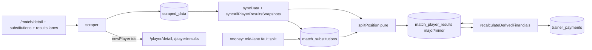

# Requirements

### Overview & Goals

On 2026-10-03 (Interliga, away at KK Jihlava, match `44990`, 8:0) Šimon Dubrava replaced
Bystrík Vadovič at throw 91. Today the app ignores substitutions: Vadovič gets credit for all
120 throws, and Dubrava has no row for the match. The goal is to read substitutions from the
results API and split the money between the two players according to the rules below.

### Findings (verified against the API and the database)

1. **`/match/detail` returns substitutions when asked for them.** The official site's
   request uses `fields: ['league','details','teams','teams.club','results','results.lanes',
   'referee','substitutions','sprint','hall','hall.parent','cards','cards.player']`. Our
   `getMatchDetail()` (`lib/api.ts`) asks for neither `substitutions` nor `results.lanes`.
   For `44990` the response contains:
   ```json
   { "id": 8585, "matchId": 44990, "teamState": "away", "throwNumber": 91,
     "player":    { "id": 20299, "firstName": "Bystrík", "lastName": "Vadovič" },
     "newPlayer": { "id": 19055, "firstName": "Šimon",   "lastName": "Dubrava" } }
   ```
   `player` is the starter and `newPlayer` the substitute; both carry the external player id
   we key users by. `teamState` says the side (`home` / `away`), and `throwNumber` is the
   first throw the substitute bowled. It equals `lineUp[].changeThrow` on the starter's row.
2. **`results.lanes` puts the lanes on every lineUp row**, so no extra request is needed.
   Each row gets 4 lanes × 30 throws with `full / clean / total / faults`. The first lane
   comes back with `lane: ''`, so the array order is what counts. There is no throw-by-throw
   data (`throwsCount` is null; the website's throw grid is placeholder data).
3. **The lineUp row is the combined position** under the starter's id (Vadovič 641 = 486 on
   lanes 1–3 + 155 on lane 4). The substitute appears nowhere else: not in the lineUp, not in
   `/player/results`, and `otherPlayer` is always null.
4. **Splitting faults by lane.** Lanes cover throws 1–30, 31–60, 61–90 and 91–120.
   - A switch on a lane boundary (31 / 61 / 91) splits exactly.
   - A switch mid-lane splits exactly too **when the lane it falls in has 0 faults** (e.g.
     43389 Prkna at 63, lane 3 has 0 faults).
   - Only a mid-lane switch in a lane with faults can't be split. Example: 44995 Hejhal at
     103, where lane 4 has 5 faults. That case needs the admin.
5. **`throwNumber: 1` happens** (44990, Jihlava's Pleskal → Braun). The substitute bowled all
   120 throws and the starter none, so the whole row belongs to the substitute.
6. **Two writers in the code upsert the starter's full row**: `syncData()` from
   `match_detail` (`lib/sync.ts` ~726–794) and `syncAllPlayerResultsSnapshots()` from
   `player_results` (`lib/sync.ts` ~470–495). Both must apply the split, or the second one
   overwrites it.
7. **Our substitutions so far:**
   - `44990` (season 13): Vadovič → Dubrava at 91. Vadovič bowled lanes 1–3 (486, 0
     faults); Dubrava bowled lane 4 (155, 0 faults).
   - `44568` (Slovak Cup, season 12): Gorecký → Bína at 61. Untouched, because the rules
     start in season 13.
8. **Impact on `44990`:** no money changes. Both segments have 0 faults, it's an away win,
   and nobody is under 600 or at 700+. Kozma (626) is still the worst. Vadovič keeps
   `faultless_streak` 1 (his segment was clean). Dubrava gets a row: lane 4, 0 faults, no
   fines. His clean segment makes his streak 1, and the 4 faults on 2026-10-04 (match 45003)
   reset it again, so no streak fine.

### Decided rules (from the user)

| Rule | Shared position |
|---|---|
| Who holds the position | The player with **more throws** (starter = `throwNumber − 1`, substitute = `121 − throwNumber`; a tie at throw 61 goes to the starter for stats). This is the **majority** player. |
| Under 600 / worst in team / 700 bonus | Judged on the **position total**. Charged or credited to the majority player only, except at an **exact half** (throw 61, 60/60), where both players get half: 0.50 € / 0.50 € per fine, 20 € / 20 € bonus. |
| Faults `n(n+1)/2` | Each player pays **their own** faults, split by lane. If the switch lane has faults and the switch is mid-lane, the **admin enters** how many belong to the substitute. Until then they stay with the starter, and the sheet flags it. |
| Special faults | Entered per person by the admin, as today. |
| Team loss 5 € / team under limit 5 € | **Both** players pay. |
| Faultless streak | **Each player's own segment counts as a game**: a clean segment extends that player's streak, a fault in it resets that player's streak only. The streak fine applies normally. |
| Stats (avg, max, games) | The majority player keeps the position result. The minority row is excluded from avg, max and games count; its faults still count in the misses total. |
| Player detail table | The minority row shows only its **misses**: full, clean and total stay `-`. It carries a **"Substitution"** badge (cs "Střídal", sk "Striedal") where "Nehral" would otherwise appear, next to its fine. |
| Trainer payments | Per position: `active` and `elite` ignore the minority row. `team_faults` is unchanged, since the split preserves the sum. |
| From when | Season 13 onward (`SUBSTITUTION_FIRST_SEASON_ID = 13`). Earlier seasons stay untouched. |

### Scope

**In scope:** requesting `substitutions` and `results.lanes`, a substitutions table, split
rows in both sync writers, recalculation SQL, the pure mirror and tests, the admin
mid-lane fault split in `/money`, an admin push notification for every mid-lane switch,
the `manage-match-results-and-payments` skill and its CLI, stats filtering, the "Střídal"
row on the player page, the `rules` and `push` text in 4 locales, and AGENTS.md.

**Out of scope:** the manual-match form (it keeps "add an extra player"; it's a follow-up,
because its rules now diverge), opponent substitutions, seasons before 13, and a player
substituted twice on one position. The API allows it as two records, but it isn't modelled
here; it's logged and left whole.

# Technical Design

### Proposed Changes

#### 1. API (`lib/api.ts`)
- `getMatchDetail()` fields: add `'results.lanes'` and `'substitutions'`. Keep the rest.
- Types:
  ```ts
  export interface LaneResult { full: number; clean: number; total: number; faults: number }
  export interface MatchSubstitution {
    id: number; matchId: number; teamState: 'home' | 'away'; throwNumber: number;
    player: { id: number; firstName?: string; lastName?: string };
    newPlayer: { id: number; firstName?: string; lastName?: string };
  }
  // MatchDetail.lineUp rows gain: id, changeThrow, lanes?: LaneResult[]
  // MatchDetail gains: substitutions?: MatchSubstitution[]
  ```
- `lib/scraper.ts` also adds every **our-side** `substitutions[].newPlayer.id` to `playerIds`,
  so the substitute's details and results are scraped even if they never started a match.
  `syncData()` provisions their user the same way (`playerMapByExtId`).

#### 2. Pure split logic (`lib/substitutions.ts`, db-free, + `lib/substitutions.test.ts`)
```ts
export const THROWS_PER_LANE = 30;
export function splitPosition(input: {
  throwNumber: number;                      // 1..120
  lanes: LaneResult[];                      // in API array order
  position: { full: number; clean: number; total: number; faults: number };
  splitLaneSubstituteFaults: number | null; // admin; only when needsFaultSplit
}): {
  majority: 'starter' | 'substitute';
  needsFaultSplit: boolean;                 // mid-lane, that lane has faults, not entered
  starter: SegmentRow | null;               // null when throwNumber = 1 (0 throws)
  substitute: SegmentRow;
  // SegmentRow = { role: 'major' | 'minor'; throws; full; clean; total; faults;
  //                positionTotal: number; positionShare: 1 | 0.5 | 0 }
}
```
- The majority row carries the **position** full/clean/total, plus its own faults.
- The minority row carries the pins of the lanes it bowled completely (stored, but never
  shown or counted), plus its own faults.
- `positionShare` is 1 for the majority and 0 for the minority. At an exact half (throw 61)
  it is 0.5 for both, and the starter is `'major'` for stats.
- `throwNumber = 1`: the substitute takes the whole row, and the starter gets no row.

#### 3. Schema (`lib/db/schema.ts`, `db:push`)
- New table `match_substitutions`:
  - `id bigint PK` (the API substitution id, e.g. 8585);
  - `match_id` FK, `starter_user_id` FK, `substitute_user_id` FK, `throw_number int`;
  - `lane_faults int`: faults of the lane the switch falls in, written by sync, so the
    sheet, the CLI and the push never re-parse the payload;
  - `split_lane_substitute_faults int NULL`: the only admin-owned column, which sync never
    overwrites;
  - `updated_at`.
- `match_player_results` gets three columns, all NULL on a normal row:
  - `substitution_role text`: `'major' | 'minor'`;
  - `position_total int`: the combined total of the shared position;
  - `position_share numeric`: 1 / 0.5 / 0, the share of the total-based fines and bonus.

#### 4. Sync (`lib/sync.ts`, `lib/match-substitutions.ts`)
- *As built:* both raw writers stay untouched. `syncData()` collects one
  `SubstitutionMatchInput` per our season ≥ 13 match via `substitutionInputFor()` (pure
  extraction, `extractSubstitutionCandidates()` in `lib/substitutions.ts`). Then
  `syncSubstitutions()` runs **after both writers and before the recalculation**, so neither
  writer can leave a combined row behind. It:
  - upserts `match_substitutions`, refreshing only the API-owned columns;
  - rewrites the starter's row into the `splitPosition` pair and inserts the substitute's row;
  - for a switch at throw 1, drops the starter's row unless it is paid;
  - undoes a split the API no longer reports (resets a lineUp player's row, deletes a paid-free
    substitute row), but never acts on a payload without a `substitutions` field;
  - returns the mid-lane `SubstitutionReview`s.
- `resplitMatchSubstitutions(matchId)` reruns it for one match from its stored payload; the
  admin split uses it.
- Substitutes are provisioned as users from the substitution list, because they have no
  lineUp row.

#### 5. Recalculation (`recalculateDerivedFinancials()` in `lib/sync.ts`)
- In `ordered`:
  - `eff_total = COALESCE(mpr.position_total, mpr.total)`;
  - `share = COALESCE(mpr.position_share, 1)`.
- `worst`: `MIN(eff_total) FILTER (WHERE eff_total > 0 AND share > 0)`. Both rows of a
  half-split position carry the same `eff_total`, so both are flagged worst.
- Total-based rules (fines become fractional; `calculated_fine` and `bonus_received` are
  already `numeric`):
  ```sql
  is_worst_player = (eff_total = min_total AND eff_total > 0 AND share > 0),
  is_under_600    = (eff_total < 600 AND eff_total > 0 AND share > 0),
  bonus_received  = CASE WHEN eff_total >= 700 THEN 40 * share ELSE 0 END,
  calculated_fine = faults*(faults+1)/2
                  + CASE WHEN <worst>    THEN 1 * share ELSE 0 END
                  + CASE WHEN <under600> THEN 1 * share ELSE 0 END
                  + sfc*5 + <team under limit> + <team loss>
  ```
- A player counts as having played (team-under-limit and team-loss) when
  `(mpr.total > 0 OR mpr.substitution_role IS NOT NULL)`. A minority segment with no
  complete lane has a total of 0.
- **Streak: unchanged.** Each row already holds that player's own faults, so a clean
  segment extends their run and a fault resets it.
- Trainer `agg` (in both the INSERT and the DELETE): `active` and `elite` add
  `AND substitution_role IS DISTINCT FROM 'minor'`. The majority row's `total` is the
  position total.
- Mirror every change in `lib/money-rules.ts` (`derivePlayers` and `deriveTrainerPayments`
  take `substitutionRole`, `positionTotal` and `positionShare`), each with a one-line comment
  naming its SQL block.

#### 6. Admin mid-lane fault split (`lib/match-money.ts`, `lib/match-money-payload.ts`, `lib/validation/substitution.ts`, the `/money` sheet)
- `getMatchSheet()` lists the match's substitutions: who → who, the throw, and
  `needsFaultSplit`.
- When `needsFaultSplit` is true, the sheet shows a number input from 0 to that lane's
  faults. Otherwise it shows the substitution read-only.
- `applyMatchMoneyUpdates()` validates the input with error codes (`invalidFaultSplit`,
  `paidLocked`), writes `split_lane_substitute_faults`, re-splits the two rows and
  recalculates. Invalidation stays in the callers, as today.

#### 6b. Admin notification for a mid-lane switch (`lib/sync.ts`, `lib/scraper.ts`, `lib/push.ts`, `lib/push-payload.ts`, `app/api/cron/scrape/route.ts`, `lib/actions.ts`)
- Pure helper in `lib/substitutions.ts`:
  ```ts
  export const isLaneStart = (throwNumber: number) => (throwNumber - 1) % THROWS_PER_LANE === 0;
  ```
  A switch on throw 1, 31, 61 or 91 needs no review; any other throw does.
- `syncData()` collects every **our-side**, season ≥ 13 substitution where
  `!isLaneStart(throwNumber)` into `SyncOutcome.substitutionsToReview: SubstitutionReview[]`:
  `{ substitutionId, matchId, opponent, starterName, substituteName, throwNumber, lane,
  laneFaults }`. It's passed through `ScrapeOutcome`.
- New push event `substitutionReview` in `PUSH_EVENTS`. Its path is `money`, and it joins
  `MATCH_EVENTS`, so the tap opens that match's sheet.
- Both scrape callers (the cron route and the manual Sync action in `lib/actions.ts`) call
  `notifyAdmins('substitutionReview', params, String(substitutionId))` once per review item,
  next to `sendMatchResultsPush`. The dedupe key is the API substitution id, so a re-scrape
  never notifies twice.
- Sent for **every** mid-lane switch, as requested. *As built:* one message for all cases,
  naming the lane and its miss count, e.g. "Zápas s KK Jihlava: Vadovič → Dubrava od 103.
  hodu, uprostred 4. dráhy (chyby na dráhe: 5). Skontroluj striedanie a rozdeľ chyby." With
  0 misses on that lane, the sheet says there is nothing to split.
- `push.substitutionReview.{title,body}` in all 4 locales.

#### 6c. Skill `manage-match-results-and-payments` (`.claude/skills/manage-match-results-and-payments/SKILL.md`, `scripts/match-money.ts`, `lib/match-money-payload.ts`)
- `sheet` output gains `substitutions: [{ id, starter, substitute, throwNumber, lane,
  laneFaults, midLane, needsFaultSplit, substituteLaneFaults }]`, and each player row
  gains `substitution_role`.
- `list` output gains a `pendingSubstitutions` count per match (unresolved
  `needsFaultSplit`).
- `apply` payload accepts `"substitutions": [{ "id": 8585, "substituteLaneFaults": 2 }]`.
  The same validation codes as the in-app path apply (0 to `laneFaults`).
- SKILL.md changes:
  - **Workflow step 2:** the roster table marks shared positions (starter → substitute,
    throw, lane). Below it, a warning lists every `needsFaultSplit` substitution: "switch at
    throw 103, lane 4 has 5 misses; how many belong to <substitute>?".
  - **Workflow step 3:** ask for those lane-miss splits **in the same single message** as
    the special misses.
  - **Workflow step 4:** include `substitutions` in the one `apply` call.
  - **Workflow step 1:** in `list`, flag matches with `pendingSubstitutions > 0`.
  - **Money rules section:** a short paragraph on substitutions. Who holds the position,
    the half split, both pay team fines, the streak per segment, and that only the mid-lane
    miss split is a human input.
  - **Gotchas:** a mid-lane switch whose lane has 0 misses needs no input. Until the split
    is entered, the lane's misses stay with the starter. Special misses for the substitute
    go on the substitute's own row.

#### 7. Stats and display
- `getPlayerBalances()` (`lib/db-utils.ts` ~410–437): `matches_count`, `max_score` and
  `avg_score` skip `'minor'` rows; `total_faults` and the money include them.
- Audit every other `match_player_results` reader (`lib/player-matches.ts`,
  `lib/trainer-matches.ts`, `lib/home-helpers.ts`, push digest) for totals and counts.
- Player detail table (`app/[lang]/player/[id]/page.tsx`, rows from `lib/player-matches.ts`):
  - a `'minor'` row becomes `{ kind: 'substitution', match }` in `buildPlayerMatchRows()`;
  - it shows date, league and match, `-` for full / clean / total, the row's **faults**, and
    in the fine column a badge `playerDetail.substitution` (sk "Striedal", cs "Střídal",
    hu "Csere", sr "Zamena") together with the fine (`MatchFineTooltip`) when one is due;
  - the `'major'` row renders as a normal result.
- `MatchFineTooltip` and the money formatting display half-euro amounts (0.50 €) correctly;
  verify `formatMoney`/`€` rendering.

#### 8. Docs
- AGENTS.md: a substitution subsection in the Money Calculation Rules, plus invariants (two
  writers, the admin-owned split column, the season gate, the fields that must stay in
  `getMatchDetail()`).
- A `rules` paragraph in `locales/{sk,cs,hu,sr}.json`, plus the new `/money` strings and
  error codes.

### Architecture Diagram


### Key Decisions
- **Use the API's `substitutions`, not admin naming**: it identifies both players by
  external id and the exact throw. The admin only decides the one thing the data can't: a
  mid-lane switch in a lane with faults.
- **Lanes come from `results.lanes` on the same request**, so there are no per-player
  `/match/playerDetail` calls.
- **The majority row carries the position total**: stats and the total-based rules then
  work with no extra joins, and only the minority row has to be filtered out.
- **A table for substitutions** holds the admin split column, which sync must never
  overwrite, and gives the UI the throw range for the badge.
- **`position_total` and `position_share` are stored on the row**, so the exact-half
  split is plain arithmetic in the existing UPDATE, with no extra join to the
  substitutions table.
- **The streak needs no SQL change**: own faults per row already give "a clean segment
  extends, a fault resets that player only".

### Edge Cases / Risks
- `throwNumber = 1`: a full swap, where the starter has no row and pays nothing.
- Two substitution records on one position: not modelled. The position is left whole and
  a warning is logged.
- The substitute is also in the lineUp on another position: the `(match_id, user_id)` PK
  would collide, so the position is left whole and a warning is logged.
- Paid rows must survive (existing invariant). A re-split touching a paid row is refused
  with `paidLocked`.
- If the API drops `substitutions` for a match, the existing split stays until the API
  reports something different. Sync never un-splits on missing data.

# Delivery Steps

### ✓ Step 1: Add the pure split logic
`lib/substitutions.ts`, `lib/substitutions.test.ts`, and the `SUBSTITUTION_FIRST_SEASON_ID`
constant.

### ✓ Step 2: Add the schema
Pushed with `db:push` (additive only). The data split was verified as a dry run (live API +
mirror in memory, `EXPLAIN` of the recalculation SQL); the real split happens on the first
sync after deploy, so the old production code never sees a partial row.
`lib/db/schema.ts` (`match_substitutions`, plus `substitution_role`, `position_total` and
`position_share`); run `db:push`.

### ✓ Step 3: Capture from the API
`lib/api.ts` (fields and types) and `lib/scraper.ts` (substitute player ids).

### ✓ Step 4: Split rows in both sync writers
`lib/sync.ts`: `applySubstitutions`, both upserts, the `match_substitutions` upsert, and user
provisioning for substitutes.

### ✓ Step 5: Update the recalculation SQL and its mirror
`lib/sync.ts` `recalculateDerivedFinancials()` and `lib/money-rules.ts`.

### ✓ Step 6: Add the mid-lane fault split to the money sheet
`lib/validation/substitution.ts`, `lib/match-money.ts`, `lib/match-money-payload.ts`, and the
`/money` sheet component.

### ✓ Step 6b: Add the admin notification for mid-lane switches
`lib/substitutions.ts` (`isLaneStart`), `lib/sync.ts` (`substitutionsToReview`),
`lib/scraper.ts`, `lib/push-payload.ts`, `lib/push.ts`, `app/api/cron/scrape/route.ts`,
`lib/actions.ts`, and the `push.substitutionReview` strings in 4 locales.

### ✓ Step 6c: Update the skill and its CLI
`scripts/match-money.ts` (`list` / `sheet` / `apply`), `lib/match-money-payload.ts`, and
`.claude/skills/manage-match-results-and-payments/SKILL.md`.

### ✓ Step 7: Update stats and display
`lib/db-utils.ts` `getPlayerBalances()`, the reader audit, `lib/player-matches.ts` (the
`substitution` row kind), `app/[lang]/player/[id]/page.tsx` (the "Střídal" row with misses
only), and half-euro rendering in `MatchFineTooltip`.

### ✓ Step 8: Update the docs
AGENTS.md and `locales/{sk,cs,hu,sr}.json`.

### ✓ Step 9: Write the tests
`lib/money-rules.test.ts`, `lib/validation/substitution.test.ts`, `lib/match-money.test.ts`,
`lib/db-utils.test.ts`, `lib/api.test.ts` (fields), `lib/player-matches.test.ts`, and the
`MatchFineTooltip` test with a 0.50 € amount (cases below).

### ✓ Step 10: Run the quality check
`pnpm check` (lint + type check + tests).

# Testing

### Validation Approach
- `lib/substitutions.test.ts`:
  - switch at 31 / 61 / 91 (exact lane split);
  - switch at 63 with 0 faults in lane 3 (exact, no admin needed);
  - switch at 103 with 5 faults in lane 4, both before the admin split (faults stay with
    the starter, `needsFaultSplit`) and after it;
  - a throws tie at 61 gives both players `positionShare` 0.5 with the starter `'major'`;
    a switch at 31 makes the substitute the majority (share 1 / 0); a switch at 91 makes
    the starter the majority;
  - `throwNumber = 1` is a full swap;
  - faults always sum to the position's faults.
- `lib/money-rules.test.ts`:
  - worst in team ignores a minority 155 and is judged on the position total;
  - under 600 at position 599 / 600 / 601 and the 700 bonus at 699 / 700 / 701 land on the
    majority player only;
  - at an exact half (throw 61): under 600 gives 0.50 € / 0.50 €, worst in team (including
    a tie with another player) gives 0.50 € / 0.50 €, and the 700 bonus gives 20 € / 20 €;
  - team-loss and under-limit fines charge both, including a minority row with total 0;
  - streak per segment: 4 clean games + a clean shared segment gives a streak of 5 and pays
    10 € for that player; a fault in the substitute's segment resets only the substitute's
    streak, and the starter's run continues;
  - trainer `active` / `elite` ignore the minority row;
  - a season-12 substitution is unchanged.
- `lib/player-matches.test.ts`: a `'minor'` row yields the `substitution` kind, never
  `didNotPlay`.
- `lib/substitutions.test.ts` `isLaneStart`: 1 / 31 / 61 / 91 are lane starts (no review);
  2 / 30 / 32 / 63 / 103 / 120 need review.
- Push tests (`lib/push-payload.test.ts`): `substitutionReview` builds the match URL, and
  `locales/locales.test.ts` keeps the 4 locales in sync. In the sync outcome, only our side,
  season ≥ 13 and mid-lane switches are reported, and an opponent's mid-lane switch is not.
- `lib/match-money-payload.test.ts` / `lib/match-money.test.ts`: the `substitutions` payload
  is validated (0 to `laneFaults`, unknown id rejected), and the sheet exposes
  `needsFaultSplit`.
- Manual: run `sheet --match-id 44990` and check the substitution block (throw 91, lane
  start, no review needed).
- Read-only check against real rows after a sync:
  - `44990`: Vadovič 641 `major` (streak 1, 0 €) and Dubrava `minor` (0 faults, streak 1,
    0 €), with Dubrava's 2026-10-04 row resetting to 0;
  - `44568` unchanged;
  - no other season-13 match changes money.
- Then run `pnpm check`.
