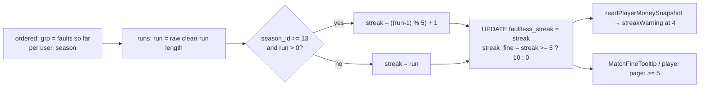

# Requirements

### Overview & Goals

Right now the success gathering (the faultless-streak fine) charges 10 € for the 5th clean game
in a row and **for every clean game after it**, so the 6th, 7th, 8th … each cost another 10 €.

From **season 13 (2026/2027)** the counter resets instead: the 5th clean game in a row costs
10 €, and the next clean game counts as the 1st of a new streak. A player therefore pays on the
5th, 10th, 15th … consecutive clean game. A fault still resets the counter to 0, and the counter
still restarts at every season boundary.

Decisions confirmed with the user:
- **Seasons**: the reset applies from season 13 on. Seasons ≤ 12 keep the old rule (every game
  from the 5th on), so past fines, including paid ones, do not change.
- **Counter**: `faultless_streak` stores the cycling counter (1–5, then 1 again) from season 13,
  not the raw length of the run. Seasons ≤ 12 keep storing the raw length.

### Scope

**In Scope**
- The SQL in `recalculateDerivedFinancials()` (`lib/sync.ts`): the cycling counter from season 13.
- The pure mirror `faultlessStreaks()` (`lib/money-rules.ts`) and a new constant
  `STREAK_RESET_FIRST_SEASON_ID = 13`.
- Tests: `lib/money-rules.test.ts`, `lib/push-digest.test.ts`, `components/MatchFineTooltip.test.tsx`.
- Locale wording in `locales/{sk,cs,hu,sr}.json`: the rule note on the rules page and the
  streak-warning push body.
- The Money Calculation Rules, Codebase Invariants, and Testing Rules sections of `AGENTS.md`.
- Comments that describe the old rule (`lib/push-digest.ts` `STREAK_WARNING_AT`, the
  `faultlessStreaks()` doc comment, and the SQL comment in `lib/sync.ts`).
- Backfill: one recalculation after the deploy.

**Out of Scope**
- Recomputing seasons ≤ 12 under the new rule.
- The streak amount (10 €) and length (5).
- Schema changes. No new column is needed.
- UI layout changes. The tooltip and the player page already read `faultless_streak >= 5`, which
  still holds on exactly the fined game.

### Functional Requirements

1. Season ≥ 13, clean games in a row 1…12 → stored `faultless_streak` = `1,2,3,4,5,1,2,3,4,5,1,2`,
   `streak_fine` = 10 € on the 5th and 10th game only.
2. A fault anywhere resets the counter to 0. The next clean game is 1.
3. Season ≤ 12 and rows with no `season_id`: unchanged. The raw run length is stored and every
   game from the 5th on pays 10 €.
4. The "one game away" push (`streakWarning` at 4) fires again on the 9th, 14th … clean game,
   because the stored counter is back to 4. Its text must not promise that every further game
   costs money.
5. The tooltip reason "séria 5+ … ({count}. zápas)" shows on the fined game only. From season 13,
   `{count}` is always 5 there.

# Technical Design

### Current Implementation

- `lib/sync.ts:162-179`: `ordered.grp` counts faults so far per `(user_id, season_id)`. `streaks.streak`
  is `ROW_NUMBER()` inside the `(user_id, season_id, grp)` group, minus 1 when the group starts with
  the faulted row. That is the raw run length.
- `lib/sync.ts:186`: `faultless_streak = s.streak`. `lib/sync.ts:198`:
  `streak_fine = CASE WHEN s.streak >= STREAK_LENGTH THEN STREAK_FINE ELSE 0 END`.
- `lib/money-rules.ts:151` `faultlessStreaks()` mirrors the raw length. `streakFineFor()`
  (`:132`) mirrors the `>= 5` rule.
- Consumers of `faultless_streak`: `readPlayerMoneySnapshot()` (`lib/sync.ts:283`) feeds
  `derivePersonalPushes()` (`lib/push-digest.ts:130`, warning at `STREAK_WARNING_AT = 4`).
  `MatchFineTooltip` (`components/MatchFineTooltip.tsx:96`) and the player page
  (`app/[lang]/player/[id]/page.tsx:224`) both check `>= 5`.

### Proposed Changes

#### 1. Constant and mirror (`lib/money-rules.ts`)

```ts
export const STREAK_LENGTH = 5;
export const STREAK_FINE = 10;
/** From 2026/2027 the streak resets once its 5th game is fined; earlier seasons fine every game from the 5th on. */
export const STREAK_RESET_FIRST_SEASON_ID = 13;
```

Add a pure helper and use it in `faultlessStreaks()`:

```ts
/** The `streak` CASE over `run` in the `streaks` CTE of sync.ts. */
export function storedStreak(run: number, seasonId: number | null): number {
  if (run === 0 || seasonId === null || seasonId < STREAK_RESET_FIRST_SEASON_ID) return run;
  return ((run - 1) % STREAK_LENGTH) + 1;
}
```

In `faultlessStreaks()`, keep the existing group/rowNumber state machine and wrap the returned
clean-game value with `storedStreak(value, row.seasonId)`. Update its doc comment so it says the
function returns the stored `faultless_streak` (cycling from season 13).

`streakFineFor()` stays `streak >= STREAK_LENGTH`. A cycled counter never passes 5, so it pays
on exactly the 5th, 10th … game, and legacy raw counters keep paying on every game from the 5th on.

#### 2. SQL (`lib/sync.ts`)

Rename the existing column in the `streaks` CTE to `run` and add a CTE that computes the stored
counter. The `UPDATE … FROM` then reads the new CTE. `streak_fine` does not change.

```sql
    runs AS (
      SELECT *,
        CASE WHEN COALESCE(faults, 0) = 0 THEN
          ROW_NUMBER() OVER (
            PARTITION BY user_id, season_id, grp
            ORDER BY COALESCE(date, '1970-01-01'), match_id
          ) - CASE WHEN grp = 0 THEN 0 ELSE 1 END
        ELSE 0 END AS run
      FROM ordered
    ),
    streaks AS (
      SELECT *,
        CASE WHEN run > 0 AND season_id >= ${STREAK_RESET_FIRST_SEASON_ID}::int
             THEN ((run - 1) % ${STREAK_LENGTH}::int) + 1
             ELSE run END AS streak
      FROM runs
    )
```

The `::int` casts follow the existing pattern: parameters are bound untyped. `season_id IS NULL`
makes the comparison NULL, so the CASE falls to `ELSE run`, which matches the mirror. Import
`STREAK_RESET_FIRST_SEASON_ID` from `./money-rules` next to `STREAK_LENGTH`. Extend the comment
above the query with one clause: from season 13 the stored streak cycles 1–5, so only every 5th
clean game is fined.

#### 3. Push warning (`lib/push-digest.ts`)

No logic change. The stored counter reaching 4 again on the 9th game re-arms the existing
`current === 4 && past !== 4` check. Rewrite the `STREAK_WARNING_AT` doc comment: the next clean
game is the 5th of the streak and costs `STREAK_FINE`. From season 13 the counter then resets.

#### 4. Locales (`locales/{sk,cs,hu,sr}.json`) — via the `translations` skill

- `rules…["Zápasy bez chyby"].note`. sk draft:
  "Za každý 5. zápas v rade bez chyby. Po zaplatení sa séria vynuluje, ďalšia pokuta príde až po
  ďalších piatich čistých zápasoch (10., 15., …). Séria sa počíta naprieč všetkými súťažami, ale len
  v rámci jednej sezóny — v novej sezóne začína od nuly."
- `…streakWarning.body`. sk draft:
  "Máš {streak} zápasy v rade bez chyby. Ďalší čistý zápas ťa bude stáť {amount} € do banky."
- cs, hu, sr: translate the same meaning. Keep the `{streak}` / `{amount}` placeholders
  (`locales/locales.test.ts` enforces them).
- `playerDetail.fineReasons.streak` and `streakFinesHint` stay as they are. "5+" is still true of
  legacy rows, and from season 13 `{count}` reads "5. zápas".

#### 5. Documentation (`AGENTS.md`)

- Money Calculation Rules → Success Gathering: "10€ for the 5th consecutive game without a fault;
  from season 13 (`STREAK_RESET_FIRST_SEASON_ID`) the streak then resets, so the next fine is on
  the 10th, 15th …; earlier seasons fine the 5th and every subsequent game." Keep the per-season
  and cross-competition sentences.
- Codebase Invariants → Derived Money Fields: note that `faultless_streak` stores the cycling
  counter (1–5) from season 13 and the raw run length before it.
- Testing Rules → Required cases: replace "Faultless streak `4 / 5 / 6`" with the season-13
  cycle `4 / 5 / 6` and `9 / 10 / 11`, plus a legacy-season `5 / 6` case that still pays on 6.
- `.claude/skills/manage-match-results-and-payments/SKILL.md:66` says "the 5-game faultless
  streak". It stays accurate, so no edit.

### Architecture Diagram



### Key Decisions

- **Cycle the stored counter rather than fine on `run % 5 = 0`.** This was the user's choice: the
  counter visibly resets. It also means `streak_fine`, the tooltip, the player page, and the push
  warning need no logic change, because they all key on `>= 5` or `=== 4`.
- **Season-gated from 13.** This was the user's choice. It matches team loss and clean sweep, and
  it avoids rewriting paid legacy rows. The player-row `UPDATE` has no `is_paid` guard, so a
  retroactive change would alter settled amounts.
- **A separate `runs` CTE rather than nesting the modulo around `ROW_NUMBER()`.** The query stays
  readable, and `storedStreak()` mirrors a single named expression.

### Edge Cases / Risks

- **Season-13 rows already on a run of 6 or more.** The season opened in September 2026, so a few
  may exist. Recalculation drops their `streak_fine` from 10 € to 0 €, even on rows marked paid,
  because there is no `is_paid` guard on player rows. Step 5 queries these rows before the
  recalculation, and if any exist, the user decides what to do.
- **Rows without `season_id`** keep the raw behaviour, in both the SQL (`NULL >= 13` is NULL →
  ELSE) and the mirror.
- **A player at stored 5 who plays another clean game** goes to 1. No new fine, no push. That is
  correct.
- **The streak warning repeats** on the 4th, 9th, 14th … game. This is intended, because each of
  those is one game away from a fine.
- **Local dev cache**: after a script-run recalculation, delete `.next/dev/cache/fetch-cache` (see
  the memory note), or local pages show stale streak numbers.

# Delivery Steps

### ✓ Step 1: Write failing tests for the new streak cycle
Files: `lib/money-rules.test.ts`, `lib/push-digest.test.ts`, `components/MatchFineTooltip.test.tsx`.
- `money-rules.test.ts`, `success gathering` block:
  - `storedStreak` table: season 13, run `4/5/6/9/10/11` → `4/5/1/4/5/1`. Season 12, run `5/6` →
    `5/6`. `null` season, run `6` → `6`. Run `0` → `0`.
  - Update "reaches the fine on the fifth…": 11 clean games in season 13 give
    `[1,2,3,4,5,1,2,3,4,5,1]` and fines `[0,0,0,0,10,0,0,0,0,10,0]`.
  - New: a fault at game 7 in season 13 gives `[1..5, 1, 0, 1]`, and a fault resets mid-cycle.
  - New legacy case: 6 clean games in season 12 give `[1..6]` and fines `[0,0,0,0,10,10]`.
  - Fix the existing "counts a season with no id…" expectation only if it changes (it shouldn't).
  - `streakFineFor` table `[4,0],[5,10],[6,10]` stays. It documents the legacy `>= 5` rule.
  - `derivePlayers` "keeps the success gathering out of calculatedFine" uses `{ a: 7 }`. Change it
    to `{ a: 5 }` so it reads as a realistic season-13 value.
- `push-digest.test.ts`: add a case where the counter goes 3 → 4 after a paid cycle (e.g. before
  `faultlessStreak: 3`, after `4`) and the warning fires. The existing "past it" case at
  `STREAK_LENGTH` stays false.
- `MatchFineTooltip.test.tsx`: add "hides the success gathering on the first game after a paid
  streak" (`faultlessStreak: 1`, `streakFine: 0`).
- Run `pnpm test:run lib/money-rules.test.ts` and confirm the new cases fail (`storedStreak` is
  missing).

### ✓ Step 2: Implement the mirror
Files: `lib/money-rules.ts`. Add `STREAK_RESET_FIRST_SEASON_ID` and `storedStreak()`, wire it
into `faultlessStreaks()`, and update the doc comment. The Step 1 tests now pass.

### ✓ Step 3: Implement the SQL
Files: `lib/sync.ts`. Add the `runs` / `streaks` CTE split and the import, and extend the comment.
`streak_fine` stays unchanged.

### ✓ Step 4: Update comments, locales, and docs
Files: `lib/push-digest.ts` (comment), `locales/{sk,cs,hu,sr}.json` (two keys each, via the
`translations` skill), `AGENTS.md` (three sections).

### ✓ Step 5: Verify against real rows (read-only)
Using a scratchpad script or the WebStorm DB tool, never committed:
1. Pre-check before any recalculation: season-13 rows with `faultless_streak >= 6`, with
   `streak_fine` and `is_paid`. Report them to the user.
2. Read every season-13 row (ordered by user, date, match_id). Compute `faultlessStreaks()` +
   `streakFineFor()` locally and show the expected diff against the stored values. Only rows
   with run ≥ 6 should differ.
3. Read a sample of season-12 rows and confirm the mirror matches the stored values exactly.
   Legacy is unchanged.

### Step 6: Backfill (with the user's go-ahead)
After deploy, run a recalculation through the admin Sync button, or through `scripts/run-sync.ts`
followed by `requestSyncedDataRevalidation()`. Re-run the Step 5 comparison to confirm the stored
values now match the mirror.

### ✓ Step 7: Run the quality check
`pnpm check` (lint + type check + tests). All must pass with no `any` types.

# Testing

### Validation Approach

- **Unit tests**:
  - `lib/money-rules.test.ts`: season-13 cycle boundaries `4/5/6` and `9/10/11`, a fault
    mid-cycle, the season boundary (four clean games in season 12 plus a clean opener = 1), the
    legacy season `5/6` both paying, a `null` season, run `0`, and `streak_fine` never landing in
    `calculatedFine`.
  - `lib/push-digest.test.ts`: the warning re-fires when the counter reaches 4 in a second cycle,
    once and not on every recalculation.
  - `components/MatchFineTooltip.test.tsx`: the reason shows at 5 and is hidden at 1 after a
    reset. The total is still `calculated_fine + streak_fine`.
  - `locales/locales.test.ts`: all four locales keep the same keys and placeholders.
- **Real-data check**: Step 5 compares the mirror with the database before and after the backfill.
- **Manual**: open a player detail page for a season-13 player with ≥ 5 clean games. Only the 5th
  game is red, with a 10 € tooltip. The 6th game has no streak fine. The rules page in all four
  languages describes the reset.
- **Final gate**: `pnpm check` passes.
