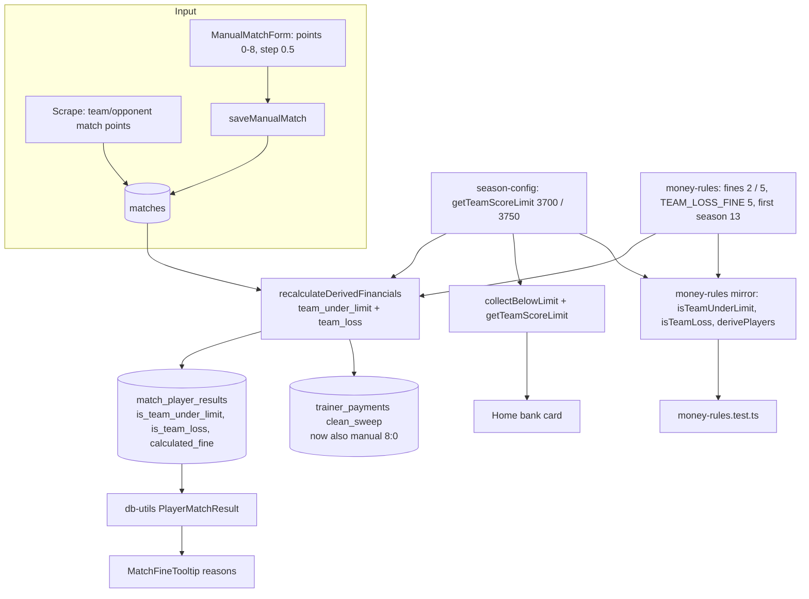

# Requirements

### Overview & Goals

Two player-fine changes, both starting in **season 13 (2026/2027)**:

1. **Team under the limit** — the home-match limit goes up from **3700 to 3750**, and the fine
   rises from **2 € to 5 €** per player who played. The scope does not change: only home
   Interliga matches and home tournaments, and the limit stays strict (exactly 3750 is not fined).
2. **Team loss (new)** — when Podbrezová loses a match on match points, **every player who
   played** (`total > 0`) pays **5 €**. It doesn't matter how that player did individually. It
   applies to every match: home and away, in Interliga, the Slovak Cup and tournaments. A draw is
   not a loss. The fine stacks with every other fine, so a home loss under 3750 costs
   5 € + 5 € = 10 € per player.

Seasons ≤ 12 keep 3700 / 2 € and have no loss fine. Tournament matches are entered by hand and
store no match points today, so the manual match form gets two optional match-point inputs. A
side effect the team accepted: a manual 8:0 tournament win now also charges the trainers' clean
sweep.

When this is done, the SQL, its pure mirror, the tests, the UI, the four locale files and
AGENTS.md all describe the same rules.

### Scope

**In Scope**
- A season-dependent limit and fine: 3700 / 2 € up to season 12, 3750 / 5 € from season 13.
- New `is_team_loss` flag column plus a 5 € term in `calculated_fine`, from season 13 on.
- Match-point inputs on the manual match form (0–8, step 0.5, both fields or neither), saved to
  `matches.team_match_points` / `opponent_match_points`.
- Manual 8:0 wins count toward `clean_sweep`. The SQL needs no change for this, only the docs.
- UI: the tooltip shows a loss reason, the limit is interpolated into the "team under" reason and
  the home "below limit" card, and the admin match list shows the match points.
- Tests, locales (sk, cs, hu, sr), AGENTS.md, README.md, the match-results skill doc.
- Backfill: `db:push` followed by a recalculation.

**Out of Scope**
- Every other money rule (under-600, worst-in-team, faults, special faults, streak, the trainer
  score/zero-faults/elite rules, the player bonus).
- Recomputing seasons ≤ 12 under the new amounts.
- Scraping changes: scraped matches already carry match points.
- The rules page stays a description of the current rules only, with no history of old amounts.

### Functional Requirements

1. Season ≥ 13, home Interliga or home tournament, `team_total_score < 3750`, player `total > 0`
   → `is_team_under_limit = true`, +5 € in `calculated_fine`. At exactly 3750 or more there is
   no fine.
2. Season ≤ 12 (or `season_id` NULL): the same rule at `< 3700` and 2 €, unchanged.
3. Season ≥ 13, `team_match_points < opponent_match_points`, player `total > 0` →
   `is_team_loss = true`, +5 € in `calculated_fine`. Any league and any side.
4. Draw (`=`), win, or either point column NULL → no loss fine.
5. The player tooltip lists "team loss" as its own reason. The "team under" reason and the home
   card show the limit that applies to the selected season (3700 or 3750).
6. An admin can enter "our points" and "opponent points" on a manual match. Each value is 0–8 in
   half-point steps. Filling only one field is rejected with `invalidMatchPoints`.
7. Paid rows: see Edge Cases. The current UPDATE does not skip paid player rows.

# Technical Design

### Current Implementation

- `lib/season-config.ts:85-86` — `TEAM_SCORE_LIMIT = 3700`.
- `lib/money-rules.ts:19` — `TEAM_UNDER_LIMIT_FINE = 2`. At `:93-102`, `isUnderLimitEligible` and
  `isTeamUnderLimit`. At `:150-180`, `derivePlayers`. At `:208-217`, `trainerCleanSweepFine`,
  already gated on season 13 and match points.
- `lib/sync.ts:122-181` — the first statement of `recalculateDerivedFinancials()`. The `ordered`
  CTE computes `team_under_limit` at `:136-146`, and the UPDATE writes the flag and the fine at
  `:169,176`.
- `lib/db/schema.ts:63` — `isTeamUnderLimit`. Schema changes are applied with `pnpm db:push`;
  this repo has no migration files.
- `lib/db-utils.ts:295,486,521` — the `PlayerMatchResult` read path for the tooltip.
- `components/MatchFineTooltip.tsx` — the reason list, wired from
  `app/[lang]/player/[id]/page.tsx:75,270`.
- `lib/home-helpers.ts:108-130` — `collectBelowLimit()` recomputes the rule from the match list
  using the mirror and `TEAM_SCORE_LIMIT`. It is called at `:234` from
  `fetchHomeDataInternal(teamId, seasonId, leagueKey)`.
- `app/[lang]/page.tsx:245` — `dict.home.bank.belowLimit` is `"Pod limit (3700)"` with the number
  hardcoded in the locale.
- Manual matches: `lib/validation/manual-match.ts` (input and validation),
  `lib/manual-match-actions.ts:45-160` (`saveManualMatch`, which upserts `matches` without the
  point columns), `lib/manual-matches.ts` (list and detail reads),
  `app/[lang]/admin/matches/ManualMatchForm.tsx` and `app/[lang]/admin/matches/page.tsx`.

### Proposed Changes

#### 1. Season-aware limit (`lib/season-config.ts`)

```ts
/** The limit that applied until season 12. */
export const LEGACY_TEAM_SCORE_LIMIT = 3700;
/** Home matches under this team total fine every player who played. */
export const TEAM_SCORE_LIMIT = 3750;
/** 2026/2027 raised the limit; earlier seasons keep theirs. */
export const TEAM_SCORE_LIMIT_FIRST_SEASON_ID = 13;

export function getTeamScoreLimit(seasonId: number | null | undefined): number {
  return typeof seasonId === 'number' && seasonId >= TEAM_SCORE_LIMIT_FIRST_SEASON_ID
    ? TEAM_SCORE_LIMIT
    : LEGACY_TEAM_SCORE_LIMIT;
}
```

A NULL season falls back to the legacy value, the same as the SQL `CASE … ELSE` below.

#### 2. Pure mirror (`lib/money-rules.ts`)

```ts
export const LEGACY_TEAM_UNDER_LIMIT_FINE = 2;
export const TEAM_UNDER_LIMIT_FINE = 5;
export const TEAM_LOSS_FINE = 5;
/** The loss fine opens in 2026/2027; the losses of earlier seasons are not charged. */
export const TEAM_LOSS_FIRST_SEASON_ID = 13;
```

- `isTeamUnderLimit(match)` compares against `getTeamScoreLimit(match.seasonId)`.
- New `teamUnderLimitFineFor(seasonId)` returns 5 from `TEAM_SCORE_LIMIT_FIRST_SEASON_ID` on and
  2 before it. Its one-line comment names the SQL `CASE` it mirrors.
- New `isTeamLoss(match: MatchContext): boolean`:
  ```ts
  /** `team_loss` in the `ordered` CTE: lost on match points, any league, from season 13. */
  export function isTeamLoss(match: MatchContext): boolean {
    return typeof match.seasonId === 'number'
      && match.seasonId >= TEAM_LOSS_FIRST_SEASON_ID
      && typeof match.teamMatchPoints === 'number'
      && typeof match.opponentMatchPoints === 'number'
      && match.teamMatchPoints < match.opponentMatchPoints;
  }
  ```
- `PlayerDerived` gets `isTeamLoss: boolean`. In `derivePlayers`, `lost = played && isTeamLoss(match)`,
  and `calculatedFine` adds `(underLimit ? teamUnderLimitFineFor(match.seasonId) : 0) + (lost ? TEAM_LOSS_FINE : 0)`.
- `trainerCleanSweepFine` stays as it is. Its "manual never" wording goes away only in the docs.

#### 3. SQL (`lib/sync.ts`, `recalculateDerivedFinancials()`, first statement)

Import `LEGACY_TEAM_SCORE_LIMIT`, `TEAM_SCORE_LIMIT_FIRST_SEASON_ID`,
`LEGACY_TEAM_UNDER_LIMIT_FINE`, `TEAM_LOSS_FINE` and `TEAM_LOSS_FIRST_SEASON_ID`. In the
`ordered` CTE:

```sql
             COALESCE(
               m.team_total_score < CASE WHEN m.season_id >= ${TEAM_SCORE_LIMIT_FIRST_SEASON_ID}
                                         THEN ${TEAM_SCORE_LIMIT}::int
                                         ELSE ${LEGACY_TEAM_SCORE_LIMIT}::int END
               AND mpr.total > 0
               AND m.is_home
               AND ( …league list unchanged… ),
               false
             ) AS team_under_limit,
             COALESCE(
               m.season_id >= ${TEAM_LOSS_FIRST_SEASON_ID}
               AND mpr.total > 0
               AND m.team_match_points < m.opponent_match_points,
               false
             ) AS team_loss,
```

In the UPDATE:

```sql
        is_team_loss        = s.team_loss,
        calculated_fine     = …existing terms…
                            + CASE WHEN s.team_under_limit
                                   THEN CASE WHEN s.season_id >= ${TEAM_SCORE_LIMIT_FIRST_SEASON_ID}
                                             THEN ${TEAM_UNDER_LIMIT_FINE}::int
                                             ELSE ${LEGACY_TEAM_UNDER_LIMIT_FINE}::int END
                                   ELSE 0 END
                            + CASE WHEN s.team_loss THEN ${TEAM_LOSS_FINE}::int ELSE 0 END,
```

The `::int` casts are required. Neon binds parameters untyped, and a `CASE` whose branches are
all untyped parameters resolves to `text`, so `integer < text` fails. This is the same trap the
existing clean-sweep comment at `:213-215` describes. Put one short comment on the first `CASE`
pointing that out. NULL points make `team_loss` NULL, and `COALESCE` turns that into false.

#### 4. Schema (`lib/db/schema.ts`)

```ts
  isTeamUnderLimit: boolean('is_team_under_limit').default(false),
  isTeamLoss: boolean('is_team_loss').default(false),
```

The column is purely additive, so `pnpm db:push` asks no rename question.

#### 5. Read path and tooltip (`lib/db-utils.ts`, `components/MatchFineTooltip.tsx`, `app/[lang]/player/[id]/page.tsx`)

- `PlayerMatchResult.isTeamLoss`, `mpr.is_team_loss` in the SELECT, and `Boolean(r.is_team_loss)`
  in the mapping.
- `MatchFineTooltip`: add an `isTeamLoss` prop and a `labels.reasons.teamLoss` label. The reason
  is pushed right after `teamUnderLimit`.
- Player page: `teamUnderLimit: interpolate(dict.playerDetail.fineReasons.teamUnderLimit,
  { limit: getTeamScoreLimit(seasonId) })`, plus `teamLoss: dict.playerDetail.fineReasons.teamLoss`,
  and pass `isTeamLoss={result.isTeamLoss}`. The page is already scoped to one season, so a
  single limit per page is correct.

#### 6. Home "below limit" card (`lib/home-helpers.ts`, `app/[lang]/page.tsx`)

- `collectBelowLimit(matches, leagueKey, seasonId)` compares against `getTeamScoreLimit(seasonId)`.
  The call at `:234` passes `seasonId`.
- `app/[lang]/page.tsx:245`: `interpolate(dict.home.bank.belowLimit, { limit: getTeamScoreLimit(selectedSeasonId) })`.
  The page already holds `selectedSeasonId`, so `FetchDataResult` (and its cache key) stays unchanged.

#### 7. Manual match points (`lib/validation/manual-match.ts`, `lib/manual-match-actions.ts`, `lib/manual-matches.ts`, admin matches UI)

- Validation:
  ```ts
  export const MAX_MATCH_POINTS = 8;
  /** Half points exist: a drawn duel splits its point. */
  export function isMatchPoints(value: number): boolean {
    return Number.isFinite(value) && value >= 0 && value <= MAX_MATCH_POINTS
      && Number.isInteger(value * 2);
  }
  ```
  `ManualMatchInput` gets `teamMatchPoints: number | null` and `opponentMatchPoints: number | null`.
  `ManualMatchError` gets `'invalidMatchPoints'`. `validateManualMatch` rejects the input when
  exactly one of the two is null, or when a non-null value fails `isMatchPoints`.
- `saveManualMatch`: add `teamMatchPoints` / `opponentMatchPoints` to `matchRow`, and
  `EXCLUDED.team_match_points` / `EXCLUDED.opponent_match_points` to the conflict `set`. No
  COALESCE, so an edit can clear them. The existing `recalculateAndDiffPlayerMoney()` call then
  fines the loss and notifies the players.
- `lib/manual-matches.ts`: add both fields to `ManualMatchListItem` and `ManualMatchDetail`, in
  the select and the mapping.
- `ManualMatchForm.tsx`: two inputs side by side in one row under the opponent total, labelled
  `teamMatchPoints` / `opponentMatchPoints` with "(optional)". Use `type="number"`,
  `inputMode="decimal"`, `step={0.5}`, `min={0}`, `max={8}`. They are held as strings in state.
  A new `toPoints(value): number | null` returns null for `''` and `Number(value)` otherwise;
  `toCount` floors, so it can't be reused. Also add them to the `translations` interface.
- `app/[lang]/admin/matches/page.tsx`: pass the new translations. The list card becomes
  `grid-cols-3`, with a third tile `matchPoints` showing `8 : 0`, or `—` when unset.

#### 8. Locales (`locales/{sk,cs,hu,sr}.json`) — identical key sets and placeholders in all four

| Key | sk |
|---|---|
| `home.bank.belowLimit` | `"Pod limit ({limit})"` |
| `playerDetail.fineReasons.teamUnderLimit` | `"tím pod {limit}"` |
| `playerDetail.fineReasons.teamLoss` (new) | `"prehra tímu"` |
| `rules.player.fines[4]` | title `"Tím pod 3750"`, amount `"5 €"`, note: "Pre každého hráča, ktorý v zápase hral. Platí len pre domáce zápasy Interligy a domáce turnaje. Presne 3750 je v pohode, trestá sa až menej." |
| `rules.player.fines[5]` (new, before the streak) | title `"Prehra tímu"`, amount `"5 €"`, note: "Pre každého hráča, ktorý v zápase hral, keď tím prehrá na body — bez ohľadu na vlastný výsledok. Doma aj vonku, vo všetkých súťažiach. Remíza sa nepočíta." |
| `admin.matches.teamMatchPoints` / `opponentMatchPoints` / `matchPoints` (new) | `"Naše body"` / `"Body súpera"` / `"Body"` |
| `admin.matches.errors.invalidMatchPoints` (new) | `"Body musia byť od 0 do 8 (po pol bode) a vyplnené obe."` |

Write cs, hu and sr through the `translations` skill. Rule titles must stay unique within the
array, because `RuleList` uses them as keys.

#### 9. Docs

- `AGENTS.md`, Money Calculation Rules → Player:
  - Rewrite **Team under 3700** as **Team under the limit**: 3750 / 5 € from season 13, and
    3700 / 2 € for earlier seasons (`getTeamScoreLimit`).
  - Add a **Team Loss** bullet: 5 € per player who played when
    `team_match_points < opponent_match_points`, in any league and on either side, from season 13
    (`TEAM_LOSS_FIRST_SEASON_ID`); a draw and NULL points don't count.
  - Update the opening threshold sentence, and change "The first five land in `calculated_fine`"
    to six.
  - Clean Sweep: replace "a manually entered tournament match … never can" with "a manual match
    counts once its match points are entered".
- Testing Rules → required cases: add `3749 / 3750 / 3751` for season 13 next to the legacy
  `3699 / 3700 / 3701`, and add the loss cases (loss, draw, win, NULL points, season 12, `total = 0`).
- Codebase Invariants: the `TEAM_SCORE_LIMIT` line (season-aware, via `getTeamScoreLimit`), and
  the Match Points bullet (manual matches may now carry points entered by hand).
- `README.md:15` gets the limit line plus a new loss line. The
  `.claude/skills/manage-match-results-and-payments/SKILL.md:66` fine list adds "team loss" and
  changes "under-3700" to "under-limit".

### Architecture Diagram



### Key Decisions

- **Gate by season, not retroactive** (user's choice). This matches the `clean_sweep` precedent.
  The limit and the fine both switch on `season_id >= 13`, so every unpaid row from seasons ≤ 12
  keeps its current amount after the recalculation.
- **Loss by match points** (`team < opponent`), rather than by pin totals. It is the official
  result, it works in the cup (6 points, halves allowed), and tournaments get the same definition
  through the new inputs.
- **Manual inputs for points, rather than a pin-total fallback for tournaments** (user's choice).
  One rule applies everywhere. A consequence the user accepted: a manual 8:0 also triggers
  `clean_sweep`, and that needs no SQL change because the rule already keys on the columns.
- **A separate `is_team_loss` flag, not reusing `is_team_under_limit`.** The tooltip must name
  the reason, and both fines can apply to the same row.
- **Both point fields or neither**, rather than accepting a lone value. A single value can't
  decide a loss, so rejecting it catches a half-filled form early.
- **Keep the limit in `season-config.ts` and the amounts in `money-rules.ts`.** That follows the
  current split, and `home-helpers` (which may reach the client) needs only the db-free config.

### Edge Cases / Risks

- **Paid player rows are recalculated.** The UPDATE at `lib/sync.ts:166-180` has no
  `NOT is_paid` filter; only `trainer_payments` spares paid rows. A season-13 row already marked
  paid under 3700 / 2 € would get the new amount and still read as paid. Before Step 9, run the
  read-only check below. If it returns rows, stop and ask how to settle them; this plan does not
  change the paid-row behaviour.
  ```sql
  SELECT mpr.match_id, mpr.user_id, mpr.calculated_fine
  FROM match_player_results mpr JOIN matches m ON m.external_id = mpr.match_id
  WHERE m.season_id >= 13 AND mpr.is_paid;
  ```
- Untyped parameters inside `CASE`: without the `::int` casts the statement fails at runtime
  and the unit tests won't catch it. The manual recalculation in Step 9 is the proof.
- `is_home` NULL: no under-limit fine (same as today). The loss fine ignores `is_home`, so it
  still applies.
- Cup draws such as 3:3, and duels split into halves like 2.5:3.5, are compared numerically. The
  columns are `numeric` with `mode: 'number'`, and the raw SQL compares numerics, so a half point
  decides it.
- A player with `total = 0` (a substitute who didn't throw) pays neither fine.
- Existing manual tournament matches in season 13 have NULL points. They carry no loss fine until
  an admin edits them and enters the points.
- The home card label and the tooltip reason now contain `{limit}`, and `locales.test.ts`
  enforces the same placeholder in all four files.

# Delivery Steps

### ✓ Step 0: Rename this plan file

`docs/plans/i-have-to-update-glimmering-neumann.md` → `docs/plans/team-loss-fine-and-limit-3750.md`.

### ✓ Step 1: Season-aware limit and mirror

`lib/season-config.ts` (§1), `lib/money-rules.ts` (§2). Verify: `pnpm type-check`.

### ✓ Step 2: SQL and schema

`lib/sync.ts` (§3), `lib/db/schema.ts` (§4). Verify: `pnpm type-check`.

### ✓ Step 3: Tooltip read path

`lib/db-utils.ts`, `components/MatchFineTooltip.tsx`, `app/[lang]/player/[id]/page.tsx` (§5).

### ✓ Step 4: Home below-limit card

`lib/home-helpers.ts`, `app/[lang]/page.tsx` (§6).

### ✓ Step 5: Manual match points

`lib/validation/manual-match.ts`, `lib/manual-match-actions.ts`, `lib/manual-matches.ts`,
`app/[lang]/admin/matches/ManualMatchForm.tsx`, `app/[lang]/admin/matches/page.tsx` (§7).

### ✓ Step 6: Locales

`locales/{sk,cs,hu,sr}.json` (§8), via the `translations` skill. Verify:
`pnpm vitest run locales/locales.test.ts`.

### ✓ Step 7: Tests

The files and cases are listed under Testing. This step comes before the final check.

### ✓ Step 8: Documents

`AGENTS.md`, `README.md`, `.claude/skills/manage-match-results-and-payments/SKILL.md` (§9).

### Step 9: Migrate, backfill, verify against real rows

Done so far (read-only, 2026-09-29): season 13 has 4 played matches, all wins with team totals of
3809–3945, so the new rules change no amount yet. There are 2 paid season-13 rows (one away win),
and their amount is unchanged. The mirror matches the stored `calculated_fine` for every
season-13 row, and for all 168 rows of seasons ≤ 12 (0 mismatches; the one season-12 loss stays
uncharged). `pnpm db:push` ran on 2026-09-29: `is_team_loss` was added (all 192 rows are false),
and drizzle-kit also re-created the `match_player_results` primary key under the same name and
columns. Still to do: deploy, then run a Sync to recalculate.

1. Run the paid-row check from Edge Cases (read-only) and report the result.
2. `pnpm db:push`, which adds `is_team_loss`.
3. Recalculate: `pnpm tsx scripts/run-sync.ts`, or the admin **Sync** button. Then clear
   `.next/dev/cache/fetch-cache` locally, because scripts only revalidate production.
4. Read-only comparison: for a sample of season-13 matches (a home loss, an away loss, a home
   under-3750 win, a draw) and a sample from season 12, compare `derivePlayers()` against the
   stored `calculated_fine`, `is_team_under_limit` and `is_team_loss`. Season-12 rows must be
   unchanged from before the recalculation. Nothing is committed to `scripts/`.

### ✓ Step 10: Quality check

`nvm use && pnpm check` (lint, type check, full Vitest suite).

# Testing

### Validation Approach

**`lib/money-rules.test.ts`** (table-driven, below / at / above every boundary):
- Under-limit, season 13: team total `3749 / 3750 / 3751` → flagged `true / false / false`, fine
  `5 / 0 / 0`.
- Under-limit, season 12: `3699 / 3700 / 3701` → `2 / 0 / 0`. A season-12 total of `3720` is not
  flagged, while season 13 at `3720` is. `seasonId: null` behaves like the legacy rule.
- League scope table: unchanged cases (home Interliga ✔, away ✘, home tournament ✔, away
  tournament ✘, cup ✘, `is_home` NULL ✘), run once per season.
- `isTeamLoss`, season 13: `3:5` ✔, `4:4` ✘ (draw), `5:3` ✘, cup `2.5:3.5` ✔, cup `0:6` ✔,
  tournament `2:6` ✔, away Interliga loss ✔, `null:5` ✘, `3:null` ✘. Season 12 `3:5` ✘, and
  `seasonId: null` ✘.
- `derivePlayers` loss: a player with `total = 0` has `isTeamLoss = false` and a fine of 0. Every
  player who played pays 5 € whatever their own score (including one on 700+ who also gets the
  bonus).
- Stacking: season 13, home Interliga, 3700 total, `3:5` → each player who played gets
  `underLimit 5 + loss 5` on top of their faults, worst and under-600 terms. Update the existing
  `calculated fine composition` test.
- `trainerCleanSweepFine` for a tournament-league match with `8:0` in season 13 → 10.
- `lib/season-config.test.ts`: `getTeamScoreLimit(12) = 3700`, `(13) = 3750`, `(14) = 3750`,
  `(null) = 3700`.

**`lib/validation/manual-match.test.ts`**: points `0`, `8`, `4.5` are valid; `-0.5`, `8.5`, `4.25`
and `NaN` → `invalidMatchPoints`; one field null and the other set → `invalidMatchPoints`; both
null is valid.

**`lib/home-helpers.test.ts`**: `collectBelowLimit` with season 13 lists 3749 and not 3750; with
season 12 it lists 3699 and not 3700; the cup still returns null.

**`components/MatchFineTooltip.test.tsx`**: `isTeamLoss` renders the `teamLoss` reason; the
interpolated `teamUnderLimit` label shows `3750`; the header amount still reads
`calculated_fine + streak_fine`.

**`app/[lang]/admin/matches/ManualMatchForm.test.tsx`**: submitting `4.5` / `3.5` sends the
numbers, empty inputs send `null`, and a returned `invalidMatchPoints` renders its localized
message while the form stays open.

**`locales/locales.test.ts`**: stays green, which proves the new keys and `{limit}` exist in all
four files.

**Manual click-through (mobile width, light and dark mode):**
- Admin → Matches: enter a tournament with points `2 : 6` and save. The player detail tooltip
  shows "prehra tímu" and the amount goes up by 5 €.
- Edit it to `8 : 0`. The loss fine disappears and the trainer card counts one 8:0.
- Filling only one point field shows the error, and the form keeps the input.
- Home page, season 2026/2027: the card reads "Pod limit (3750)". Switch to 2025/2026 and it
  reads "Pod limit (3700)" with the same list as before.
- Rules page in all four languages shows 3750 / 5 € and the new "team loss" entry.

**Final check:** `nvm use && pnpm check` — lint, type check and tests must all pass.
